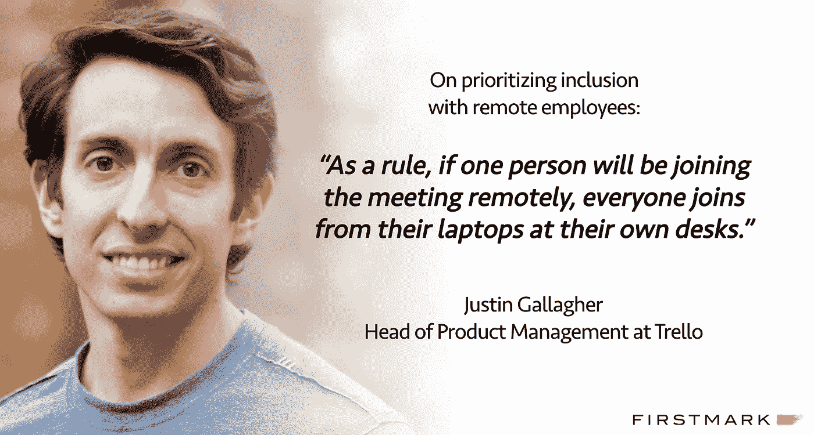

# 特雷罗的贾斯汀·加拉格尔谈远程管理的规模+更多

> 原文：<https://medium.com/hackernoon/trellos-justin-gallagher-on-remote-management-at-scale-more-d1e0bfb6f2bf>

## 有效领导系列

贾斯汀·加拉格尔是特雷罗公司的产品管理主管。他帮助设计和制造了 Trello 的第一个版本，并于 2011 年在 TechCrunch Disrupt 上推出了该产品。

*贾斯汀在去年的* [*设计驱动活动*](https://www.youtube.com/watch?v=6bmWABcd_8k) *上发表演讲时，我们认识了他，并分享了 Trello 实现远程产品和设计的方法。Justin 不仅在将 Trello 从头构建成今天这样的高性能、易于使用的应用程序方面发挥了重要作用，而且他还管理着一个由产品经理、设计师等组成的大型团队。我们采访了他，了解他的管理历程、领导策略等更多信息。*

**你的第一个管理职位是什么，你从中学到了什么？**

在我开始在科技和创业公司工作之前，我的第一个管理职位是咨询。这是一个人和项目经理的角色。我学到了很多与人共事的经验——既包括我管理的人，也包括我们为之工作的客户。从第一个角色开始，我学会了如何管理期望，如何将我们正在做的工作与团队中个人的优势结合起来，如何建立信任，以及如何保持谦逊。

**在你职业生涯的早期，在担任领导职务之前，你欣赏伟大经理的哪一个品质，你从前任经理那里学到的最令人难忘的框架是什么？**

我非常幸运，总有一些经理非常关心为他们工作的人。我有一些朋友没有同样的经历。通过与他们交谈，我真的开始欣赏那些总是把员工放在第一位的经理。

Justin speaking at Design Driven in June, 2017

我过去共事过的一位经理曾经说过，“人们的优点就是他们的缺点。”我不知道这算不算一种技术或框架，但我试图思考每个人的个人优势，并理解这些优势如何也可能表现为弱点。然后，我试图确保人们以利用这些优势的方式做出贡献，避免同样的劣势。

举个简单的例子，一个真正擅长沟通和项目管理的人可能会在复杂的跨团队项目中表现出色。同时，他们的结构化风格可能会让一个试图从零开始创造新产品的小型创意团队陷入困境。

作为领导者，你养成的最重要的日常或每周习惯是什么？

我有一个 Trello 板(不奇怪！)我用它来记录我需要做的所有事情。我用它来确保自己掌握每周需要处理的许多项目、会议、电子邮件和其他事情。没有它我一天都过不下去。我其实写了一篇[博文](https://blog.trello.com/work-life-focus-trello-insider-guide-personal-productivity)(下图)关于这件事。

 [## 寻找工作-生活焦点:特雷罗内部人员个人生产力指南

### 2011 年，贾斯汀·加拉格尔和鲍比·格雷斯合作编写了一个 web 应用程序原型，提供了一个可视化的视角…

blog.trello.com](https://blog.trello.com/work-life-focus-trello-insider-guide-personal-productivity) 

为了确保我为即将到来的一天做好准备，我每天早上在火车上花几分钟检查我的“今天”清单上的项目，以确保它们都有可行的下一步。这有助于我保持动力，这样我就不会被巨大的、势不可挡的项目所拖累。对于会议和 1 对 1，这个练习确保我在每一次谈话中都至少有一些预先的考虑和准备，这样我就可以充分利用这段时间。

**还有什么工具是你生活中不可或缺的，为什么？**

我在哪里读到过，手写笔记有助于保留和处理信息。所以，最近我一直在我的 iPad 上(用铅笔)使用[显见](https://itunes.apple.com/us/app/notability/id360593530?mt=8)。我真的很喜欢它。它还可以无缝地同步到我的手机和笔记本电脑上，所以我不用担心丢失或忘记我的笔记本，就像我在纸上记笔记一样。更改线条粗细和突出显示颜色的功能使创建看起来很酷的笔记变得很容易，这让我在记下事情时感到愉快。

我现在做的很多事情是检查书面工作、规格和设计。我从我的电脑上创建 pdf 或截图的东西，粘贴到一个笔记中，然后在 iPad 上批注。这是一个很好的组合。此外，Notability 具有强大的手写识别和搜索功能，所以我仍然可以使用搜索功能在旧笔记中查找内容，就像我过去在输入所有内容时所做的那样。例如，我在我想回头做的事情旁边写下“要做的事情”。当我想弄清楚我需要继续做什么的时候，我只需要搜索这个短语。我不得不稍微调整一下我的笔迹来让它正常工作，但这可能是一件好事。

**您使用什么框架进行一对一会谈？我保持我的 1:1 非常随意和健谈。我们的团队大部分是远程的，所以对我来说，这些会议不仅是为了检查项目、绩效和职业抱负，也是为了建立关系。**

总的来说，我努力做一个好的倾听者，让对方说得比我多。如果有什么重要的事情我想了解一下，或者有什么问题需要解决，我会在会前提前通知他们，这样我就不会让他们措手不及，如果需要的话，他们也有时间准备。

> 1:1 不仅是为了检查项目、绩效和职业抱负，也是为了建立关系。

**双击“远程管理”,你想对其他拥有远程员工的经理提出的最重要的建议是什么？**

经常有人问我如何确保远程人员确实在工作。根据我的经验，这从来都不是问题。我们雇佣的人聪明、有才华、有奉献精神。他们错过的主要东西是同事间的友情和信息，这些信息是通过在办公室见面或喝咖啡聊天获得的。因此，我集中精力确保远程人员感觉他们是团队的一部分，并确保他们有合适的环境来操作和决策。

为了让每个人都能平等地做出贡献，我们本质上是一个完全远程的团队。例如，我们避免让人们挤进会议室开会，除非每个与会者都在办公室。通常，如果有一个人远程加入会议，每个人都可以在自己的办公桌前通过笔记本电脑加入。即使有几个人从我们的办公室连接，我们也会这样做。这让远程人员能够平等地做出贡献，而不是让他们沦为墙上电视的观察者。我们还在团队每周会议的最后 10 分钟抽出时间进行社交，因为我们并不是每天都见面。

> 通常，如果有一个人远程加入会议，每个人都可以在自己的办公桌前通过笔记本电脑加入。

*有没有你真正钦佩的领导者(不是在你现在的公司),你认为他会喜欢接受采访？*

请将他们的姓名和简短描述发送到 jack@firstmarkcap.com，让我们知道。