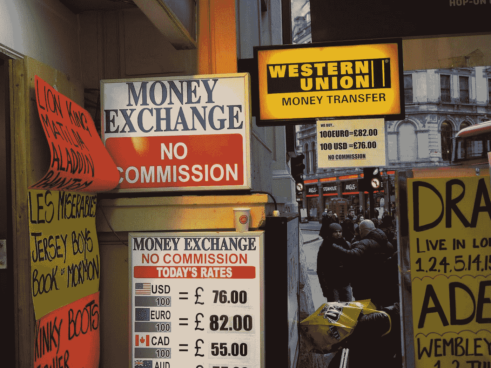

# 趋势和问题:加密货币和区块链将如何修复全球汇款行业

> 原文：<https://medium.com/hackernoon/trends-and-problems-how-cryptocurrencies-and-blockchain-will-fix-the-global-remittance-industry-41150c760b2a>

*Image credit:* [*Monito*](https://www.flickr.com/photos/money-transfers/32493213090) *|* [*CC BY 2.0*](https://creativecommons.org/licenses/by/2.0/)

全球汇款市场是传统金融行业的一个很好的例子，它在很大程度上充当了无银行账户者的收费员。然而，加密货币和区块链有可能提供从一个国家到另一个国家的几乎即时的资金转移。通过真正象征性的收费，希望汇款回家的移民将不再需要支付平均 7%的佣金和费用。

# **有趣的事实**

为了更好地了解全球资金转移行业的现状和状态，让我们来看看事实:

*   外汇市场上每天有 4.8 万亿美元的交易
*   根据世界银行的统计，2018 年全球汇款将增长到 6160 亿美元(2016 年为 6010 亿美元)
*   预计 2018 年向中低收入国家的汇款将增长至 4660 亿美元(2016 年为 4410 亿美元)
*   发送 200 美元的全球平均成本占总成本的 7.2%
*   跨境支付成本降低 5% [将导致每年节省 160 亿美元](https://remittanceprices.worldbank.org/en)

# **货币转让市场问题**

现在全球汇款市场的三大紧迫问题是:中介数量多、佣金高、监管压力大。

## **汇款的价格**

据世界银行估计，2017 年移民汇回发展中国家的资金总额为 4500 亿美元。然而，分析家认为，320 亿美元的汇款没有到达收款人手中，因为跨境汇款的交易成本很高。

参与全球资金转移业务的多个中介都充当收费员，每个中介都增加了消费者被迫支付的高昂费用，但却没有获得任何真正的价值。目前，有两种主要的资金转移方式；从银行账户到银行账户，以及通过私人汇款渠道，如西联汇款、速汇金等。这两个选项都没有为最终用户提供快速、廉价的转账方式。

## **主要问题:中介**

在第一种情况下，当一个人需要从北美或欧洲的某个国家向非洲等发展中国家汇款时，这笔钱将通过一系列不同的银行和服务机构进行。从有当地美国银行账户的人那里，钱将从当地银行的账户转到国家银行的账户，然后转到与美国市场合作的相应银行。此后，电汇将到达 SWIFT 网络，然后到达为非洲目标国家市场服务的相应银行。最后，钱到达当地银行账户。

整个过程至少需要几天时间，而且每一步都要收费。货币兑换成本也要考虑。通常一个国家的当地货币在兑换成最终目的地货币之前需要兑换成美元，这增加了额外的费用。

像西联这样的公司必须开发一个全球范围的物理接入点网络，用于发送和接收资金，以及来自世界各地的必要银行账户。支持如此大量的基础设施成本高昂，像西联这样的公司肯定会将这些成本转嫁给客户。

## **监管增加成本**

监管压力是汇款市场的一个重大问题。不同国家和全球监管组织的官员都有责任打击洗钱(据估计全球约 2.2-3.7 万亿美元)和恐怖主义融资。

对于金融和汇款公司，这意味着他们需要执行额外的审计、信用认证、身份验证等。因此，许多公司更喜欢“去风险化”，这意味着如果他们被视为高风险，或者无法提供所有必要的文件，他们可以退出与某些客户的关系并关闭他们的账户。

在目前的情况下，全世界有数百万难民很少或没有身份证件，与传统银行业务隔绝，这可能会将汇款转移到所谓的“非正式”渠道。这就是使用未记录和未受监管的资金转移渠道的地方(例如[哈瓦拉](https://en.wikipedia.org/wiki/Hawala))。这里用户的风险要高得多。

# **加密货币和区块链出手相救**

如上所述，2017 年第四季度传统汇款汇款人的平均成本为 [7.09%](https://remittanceprices.worldbank.org/sites/default/files/rpw_report_december2017.pdf) 。由于更激烈的市场竞争以及来自 20 国集团和联合国的压力，目前的趋势是汇款成本略有下降。这些组织的目标是消费者的平均成本分别为 [5%](https://www.gpfi.org/sites/default/files/documents/CORRECT%20VERSION%20Final%202017%20Progress%20Reporting%20-%20National%20Remittance%20Plans%20endorsed%281%29.pdf) 和 [3%](http://www.un.org/esa/ffd/wp-content/uploads/2016/01/Remittances_WBG_IATF-Issue-Brief.pdf) 。然而，对许多人来说，这个数字仍然太高，而且似乎没有任何进一步降低这个数字的建议。

加密货币=承诺为消费者在当今汇款市场面临的当前问题提供创新的解决方案。例如, [BitPesa](https://www.bitpesa.co/) 服务——目前在尼日利亚、肯尼亚、乌干达、坦桑尼亚、塞内加尔和刚果民主共和国运营——开发了一个总部位于区块链的全球支付网络，可以实现快速(一天而不是一周)和更便宜(1-3%的成本)的交易。另一个例子是基于以太坊的 [Monetha](https://www.monetha.io/) 支付系统，它能够以比传统支付系统低 5 倍的价格和快 1 万倍的速度进行交易。

另一个有趣的项目是 [TenX](https://www.tenx.tech/) ，它允许通过使用一个将加密货币转换为法定货币的移动应用程序来购买普通商品的加密货币支出。 [SpectroCoin](https://spectrocoin.com/en/) 发行比特币借记卡，可以在全球数百万家商店和自动取款机上使用。

根据世界银行的数据，全球估计有 11 亿人无法正式证明自己的身份。这意味着它们被完全排除在全球金融体系之外，也不能进行任何汇款转账。像[世界身份网络](https://www.win.systems/the-solution)和[人性化互联网](https://www.thehumanizedinternet.org/)这样的项目通过创建在区块链数据库中存储出生证明或驾驶执照等标识符的工具来解决这个问题。

效率低下的不仅仅是银行。股票市场也充斥着侵蚀现金流的中介机构。与此同时，他们收取高额佣金，同时尽可能不让最终用户知道这些成本。这也损害了国际汇款，因为对于投资者和交易者来说，同时在不同国家的交易所操作是非常昂贵和复杂的。加密货币和区块链也可以帮助解决这个问题。

例如，[摄氏度](https://celsius.network/)项目允许在比法定证券交易所更优惠的条件下投资加密货币。这个基于以太坊的 P2P 借贷平台可能会取代芝加哥商业交易所和 CBOT 等大银行和期货交易所，推出加密货币钱包，通过其创新的借贷平台赚取回报。

反过来， [Spectre](https://spectre.ai/) 项目正计划从链条中排除这一中间环节，以获得更好的投资。它是一个没有经纪人的在线交易系统，其流动性池完全由 ICO token 投资者所有。

# **视角**

根据[最近的统计](http://www.worldbank.org/en/programs/globalfindex)，几乎 40%的人无法进入全球金融体系。其低效率和成本是导致这种情况的一些最重要的因素。高昂的费用、中介机构的敌意和监管压力都是全球汇款行业面临的巨大问题，这些问题可以通过加密货币和区块链技术得到解决。

通过区块链的汇款费用比当前市场上的汇款费用便宜数千倍，甚至数百万倍。另一方面，与传统银行的数亿用户相比，现在大约有 2000 万加密货币用户。

这个巨大的机会将导致数百万人加入加密货币社区，以进入全球市场，同时避免不提供任何实际价值的服务的费用和佣金。