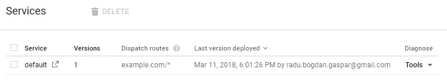

# 谷歌云托管的考验和磨难——教程

> 原文：<https://medium.com/hackernoon/trials-and-tribulations-of-google-cloud-hosting-a-tutorial-26395eb25636>


如果你想知道部署一个网站的所有步骤，从购买域名，到托管域名，再到运行多个子域，那么你来对地方了。我们将讨论以下内容:

1.  [Google](https://hackernoon.com/tagged/google) 域名验证(购买域名后)
2.  安装 Google Cloud SDK
3.  构建一个准系统服务器(使用 NodeJS)
4.  将 NodeJS 服务器部署到 Google Cloud(应用程序引擎)
5.  将购买的域与您的 NodeJS 服务器链接
6.  关于谷歌云[部署](https://hackernoon.com/tagged/deployment)版本控制的快速说明
7.  在子域上创建和部署应用程序
8.  谷歌托管费用和建议

每当我想到直观的托管和写得很好的最新文档时， **gcloud** 并不在列表的首位…因此有了这个教程。

首先，你需要购买/拥有一个域名。你可以随意选择你想要的域名注册商，只要它允许 **DNS 管理** …我已经为我的域名选择了 [**GoDaddy**](https://www.godaddy.com) 。

如今，你可以以每年 9€的价格购买一个域名；从现在开始，让我们假设我们拥有**example.com。**你还需要一个谷歌云账户，在这里 随意创建一个 [**。**](https://console.cloud.google.com)

从仪表板创建一个新的 Google Cloud 项目。我们以后会用到它，因为我们的部署需要在项目环境中进行:


一旦创建，项目将被自动选择。下一步是通过谷歌的域名验证过程。这是需要证明我们的域名所有权。

转到您的`Google Cloud / App Engine / Settings`部分`Custom Domains`小节。点击*添加自定义域名*，您应该会看到如下页面:


gcloud: adding custom domains

选择*验证新域名*选项，输入你的域名，点击*验证*。你会发现网站管理员中心是谷歌的自动域名验证工具:


你应该选择你的域名提供商(在我的例子中是 GoDaddy.com)，然后点击*验证*；Google 会尝试在你的域名提供商 DNS 记录中自动添加一条 TXT 记录。

如果您的域名提供商没有出现在这里，请不要担心，这只是意味着 Google 将无法自动创建所需的 DNS 记录。

如果是这种情况，只需从域名提供商下拉列表中选择*其他*，您将获得一个 TXT 记录，您需要将该记录复制到您的域名 DNS 管理器，如下所示:


登录您的域名提供商，选择允许您管理您的域名的 DNS 记录的选项，然后添加 Google 提供的 TXT 记录(如上所示)。您的 DNS 管理器应该类似于以下内容:


这一步完成后，谷歌域名验证将失败。是，**失败**。这是你会习惯的，因为 DNS 的变化需要一段时间来传播。这可能需要几分钟到 24 小时(也许更长)。对我来说，大约需要 8 分钟。每隔 2-3 分钟持续点击*验证*按钮一次，直到显示验证成功。

如果你已经走了这么远，那么恭喜你！谷歌现在承认你是你的域名所有者。如果没有自动添加，您还应该在您的 DNS 管理器中添加一个`www` CNAME 记录，如下所示(通过 www.example.com 访问您的域名时需要):


继续安装 [Google Cloud SDK](https://cloud.google.com/sdk/downloads) ，我们稍后会用到它。一旦完成，在终端中运行`gcloud init`来设置默认配置。

我们需要一个应用程序，我们可以部署到应用程序引擎；一个超级基本节点`Hello World`似乎是合适的。这是我们的服务器:

server.js

还需要一个带有`start`脚本的`package.json`文件；大致是这样的:

```
{
  "name": "hello",
  "version": "0.0.1",
  "scripts": {
    "start": "node server.js"
  },
  "engines": {
    "node": "8.x",
    "npm": "4.x"
  },
  "license": "ISC"
}
```

最后，我们需要一个处理应用引擎设置的`app.yaml`文件。我们将再次选择最基本的一个:

```
**env:** flex
**runtime:** nodejs
**service:** default
**skip_files:** - ^(.*/)?.*/(node_modules|anotherFolderHere)/.*$
**automatic_scaling:
  min_num_instances:** 1
  **max_num_instances:** 1
```

确保你阅读了关于 app.yaml 文件的 Google Cloud [文档。我们的基本上指示 App Engine 将自动伸缩保持在 1 个实例，拥有一个具有灵活环境的 NodeJS 运行时，并且它将该服务(我们的应用程序)作为`default`服务。我还添加了一个关于如何跳过多个不应该部署的文件夹的例子。](https://cloud.google.com/appengine/docs/flexible/nodejs/configuring-your-app-with-app-yaml)

服务部分是至关重要的，因为您必须先部署`default`服务。将服务作为独立的应用程序或作为大型应用程序的一部分的微服务。

为了更好地形象化，假设您有 2 个应用程序:第一个是您的前端，第二个是您的后端 API。在这个场景中，您可以将您的前端应用程序部署为`service: default`，将您的后端应用程序部署为`service: api`。

请记住，你拥有的服务越多，你支付的费用就越多。拥有多个服务可能最适合大型应用程序。您实际上可以创建一个服务，并将您的所有域和子域指向它。我们稍后将讨论子域。

这是我们的基本应用程序，它只有 3 个文件:`server.js`、`package.json`和`app.yaml`。在这个项目文件夹中打开一个终端，运行:`gcloud app deploy`

几分钟后，您的部署将在如下 URL 可用:[https://project-000000 . appspot .](https://project-000000.appspot.)祝贺您，您已经上线了！

下一步是将其与您购买的域名链接。要做到这一点，首先创建一个`dispatch.yaml`文件并添加以下几行:

```
dispatch:
  - url: "example.com/*"
    service: default
```

非常简单，您可以指定链接到项目的域以及它所指向的服务。现在我们需要把它上传到 Google cloud，这是通过运行这个命令来完成的:`gcloud app deploy dispatch.yaml`

完成后，如果您访问您的`App Engine > Services`页面，您会看到如下内容:



linking dispatch routes

每次部署默认服务时，都会创建另一个版本，所有流量都将被传输到该版本。您可以在您的`App Engine > Versions`部分或者通过运行命令`gcloud app versions list`来查看所有已部署的版本。如果您想要更多地控制有多少用户访问您应用程序的特定版本，您也可以选择在两个或更多部署版本之间划分流量。

现在，你真的活了，你的 SSL 证书被谷歌自动重新生成(默认)，但还有更多可以做的；例如，限制你的流量只到 HTTPS。通常在 Apache 或 Nginx 中通过`301`重定向来实现，但也可以通过 NodeJS 中间件来实现(本例中使用了 express):

express HTTPS redirect middleware

假设您还想运行一个子域，这也很简单。首先，我们在我们的`App Engine > Settings > Custom Domain > Add Custom Domain`中添加子域，方法是选择我们想要使用的域(**example.com**)，然后指定我们想要创建的子域(**awesome.example.com**)。

然后，Google 指示我们在域名注册商 DNS 管理器中为我们的子域创建一个 CNAME……这与我们必须为`www`做的事情相同:


我们需要做的最后一件事是将我们新创建的子域指向一个服务。我们已经知道如何做了…输入`dispatch.yaml`:

```
**dispatch:**- **url:** "example.com/*"
    **service:** default- **url:** "awesome.example.com/*"
    **service:** awesome
```

然后，我们必须通过运行:`gcloud app deploy dispatch.yaml`再次部署这个`dispatch.yaml`。

此处小注；如果您跳过这一步，您的所有子域都将指向**默认服务**。为了避免成本，您可能希望这样做，并在您的主应用程序中管理子域映射逻辑。ExpressJS 有`express-subdomain` npm 包可以帮助你。

这是相当多的信息，但它应该让你很快启动和运行…只有一个问题仍然存在…这一切的成本是多少？

不可否认……如果你想要灵活性，**那就要付出**的代价。谷歌的应用引擎可能会变得相当昂贵，即使我们的样板文件什么也不做。这里有一个[价格计算器](https://cloud.google.com/products/calculator/)，它可以给你一个你可能最终为你的主机支付多少的概览，以及应用引擎[定价列表](https://cloud.google.com/appengine/pricing)。

但是，您可以通过将允许的最大实例数降低到 1 并坚持使用单个服务(默认服务)来显著降低成本。

在我运行我的域名的 10 天里，一个域名的一项服务的总托管费用大约是 13 美元。这并不是您在构建应用程序原型时真正想要看到的。然而，目前谷歌正在提供一年免费试用+300 美元的消费信贷，所以你可以感受一下它是如何工作的，以及你将支付多少。

如果你希望进一步降低成本，总有谷歌的计算引擎，它可以配置为低至 6~8 美元/月…但不要指望你会运行一个完全成熟的应用程序，其中有硬核流量。可能是小企业、个人网站和作品集的最佳选择。

一句小小的“逮到你了！”我应该指出的是，一旦创建了默认服务，就不能删除它。您只能停止在其中运行的版本。就算你把所有版本都停掉，删除了，还是会有一个留下来，那个上面有 100%流量分配的。如果你真的想退出…删除整个项目。

然而，如果您仍然想要可伸缩性、版本控制、简单快速的部署，同时保持合理的成本，我会推荐 [Zeit](https://zeit.co/) 。吉列尔莫和他的团队在那里做得很好。

编码快乐！