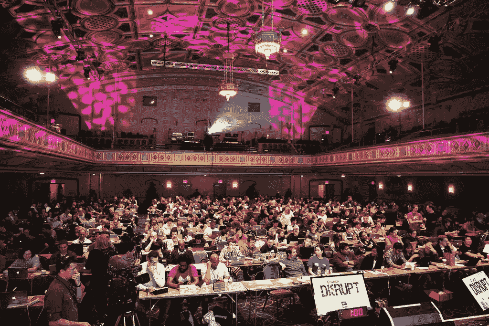

# 行程报告:HackCU 4

> 原文：<https://medium.com/hackernoon/trip-report-hackcu-4-69dba8bd31e4>

今年，我的朋友 Tanner Barrett 邀请我和他一起参加在 CU Boulder 举办的名为 HackCU 4 的黑客马拉松。他是一名刚刚完成计算机科学学位最后一年的程序员，而我是一名承包商的全栈开发人员。我们都只是在寻找一些新的曝光，尽管我们都工作并追求教育，但我们决定燃烧我们的周末，整夜花在编码上，然后努力度过接下来的工作/学校周(一开始，*听起来总是*像个好主意)。

我们遇到了一位高中校友，组成了我们的团队。[丹尼尔·莱蒙德](https://medium.com/u/db842131fd3b?source=post_page-----69dba8bd31e4--------------------------------)是一名机器学习专业的学生，正在攻读计算机科学的第二学位，主要使用 python。我们接受了 OppenheimerFunds 公司的挑战，以任何形式进行情绪分析，并将其与财务数据进行比较，以获得洞察力。在那之前我甚至不知道什么是情绪分析——除了它是一个花哨的词，如果你对某人说它，他们会认为你是一个天才(所以我只是不经意地开始在任何对话中使用它)。如果你不知道什么是情绪分析，也不想让别人知道你不知道，那就谨慎点击[这个链接](https://en.wikipedia.org/wiki/Sentiment_analysis)阅读起来

replace “DISRUPT” with “HACKCU” and add 7,000 cans of redbull, and that was pretty much the hackathon

# 我们的黑客

我们的目标是对我们在 Twitter 帖子上挖掘的标签进行情绪分析，获得正面和负面的百分比，然后从 API 中获得股票代码在最后一天的财务数据，并绘制图表，以查看推文的情绪如何影响股票。超赞的，对吧？

我处理 web 方面的东西，Tanner 编写对财务 API 的请求，并用 Java 将数据提供给我，Dan 编写了一个带有自定义训练模型的算法，经过一夜的训练，并在早上准备好了情绪算法(至少我被震惊了，但公平地说，我通过玫瑰色的耳洞听到了“机器学习”这个短语)。

# 拿走

让我们从坦纳开始。在黑客马拉松的第一天，他花了大约 7 个小时用 java 完成了那个该死的 HTTP 请求(显然，这在 Java 中有点复杂，他正在努力解决一些与 Sun 相关的安全问题——也许他会在评论中留下注释)。他仍然不熟悉实际执行应用程序的代码，比如在 web 上运行、发送 JSON 等。但是我钦佩他的努力，他像一个真正的程序员一样投入了大量的时间来解决他的错误。由于第二天时间不多了，我们最终让 Dan 用 python 来做。但是，就在我们准备提交我们的项目时，Tanner 让他的代码运行起来了！

我们最终没有使用它，但坦纳仍然非常兴奋，因为他已经克服了他的问题。他一直是一个伟大的运动员，尽管写了一小段未使用的代码，他还是很高兴学习并接触到了黑客马拉松。任何有经验的程序员读到这里都应该意识到，Tanner 的这种态度让他在这两天里成为了一名更好的程序员，并将继续成为他职业生涯中的基石。

我用 Angular 编写了前端，并使用 Chart.js 得到一个图表，其中包含一些虚假数据和下面的情绪百分比，还有一个可爱的小 UI，供用户搜索标签和股票符号。丹输入了他的数据。txt 文件，所以我用 Python Shell 创建了一个节点服务器来执行他的代码，并解析创建的。txt 文件发送到前端(非常非常规，但它的工作，嘿，我们有几个小时之前，我们必须提交)。我真的很惊讶，我不知道 Node 可以执行 python 代码，这很酷，因为我刚开始用 python 编程，并用它编写了一些应用程序。

我从网站的情感分析中获得了百分比数据，但是在我解析来自。txt 文件。但这并不重要，因为我的收获是，你可以在一个奇怪的团队中做不可思议的事情。坦纳和我都接触到了我们从未见过的机器学习，成为其中的一员令人难以置信。我从来没有在这么短的时间内建立过这么快、这么干净的网站，也没有运行过服务器。这真的挑战了我的极限，迫使我在大背景下关注每一个场景。

## 所以我们输了…

但那完全没关系！这是我们所有人的第一次黑客马拉松，我们有一次难以置信的经历。我们在挑战中以微弱优势获得第二名，这对一些新来者来说相当不错。我们对我们的应用程序有一些警告 Twitter API 免费版本不允许我们查询足够多的有意义的数据，我们没有/无法获得情绪对股票有多大影响的确切数字。

## 去参加黑客马拉松

在你的区域找一个，然后去。如果你是新来的，找一些比你懂得多的朋友或人，和他们一起去。拥有像坦纳一样的心态——去学习，尽可能地努力，但仍能享受乐趣——从环境中收集尽可能多的知识。

黑客马拉松的焦点将真正推动你的技能。

如果你想查看获奖项目和我们的项目，请访问 [devpost](https://hackcu4.devpost.com/submissions/) 。获奖的项目是惊人的，给他们一个阅读。

感谢阅读，留言，告诉每个人你讨厌黑客马拉松，因为糟糕的三明治体验，给我一些掌声，或者不要。