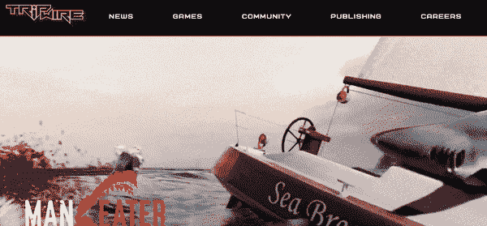

# Tripwire Interactive 建立了一个 React 公司网站

> 原文：<https://medium.com/hackernoon/tripwire-interactive-builds-a-react-corporate-website-b75a995bec7>

Tripwire Interactive 是一家娱乐软件开发商和发行商，成立于 2005 年，由屡获殊荣的 mod 团队和 2004 年“$1，000，000 Make Something Unreal”竞赛的获胜者创建。

游戏玩家希望游戏能吸引他们的注意力，并让他们继续回来。自 2004 年第一款 Red Orchestra mod 赢得“让一些东西变得不真实”竞赛以来，Tripwire Interactive 就一直在生产这类游戏。从那以后，Tripwire 赢得了许多顶级编辑网站颁发的年度多人游戏和 FPS 游戏大奖，数百万人玩过红色管弦乐队或杀戮地板游戏，平均每位玩家每场游戏的游戏时间超过 40 小时！

过去，Tripwire Interactive 团队使用的是 Umbraco 系统，他们需要一种简单的方式让营销人员维护游戏母品牌的营销网站内容。每个新游戏都需要一个包含营销内容的专用登录页面。博客、职业和新闻供稿需要由营销团队管理，而不会给开发人员带来瓶颈。Tripwire Interactive 团队选择了 [Cosmic JS](https://cosmicjs.com) 作为他们的动态内容管理解决方案，因为他们在现代 React 堆栈上构建了他们的新公司网站。

> *"*[*Cosmic JS*](https://cosmicjs.com)*允许我们轻松地将一个安全快速的后端 API 集成到我们的 React 应用程序中。Cosmic 通过其简单的基于 web 的仪表板来满足我们的需求，因此我们营销团队的成员可以随时创建、编辑和删除新内容。我们的团队一直在享受新系统的易用性。”*
> 
> *— Owen Liversidge，首席开发人员*

查看更多来自管理内容 API 优先的跨职能团队的[案例研究](https://cosmicjs.com/case-studies)。如果您有任何问题或意见，[加入我们的 Slack 社区](https://cosmicjs.com/community)并[在 Twitter 上联系我们](https://twitter.com/cosmic_js)。