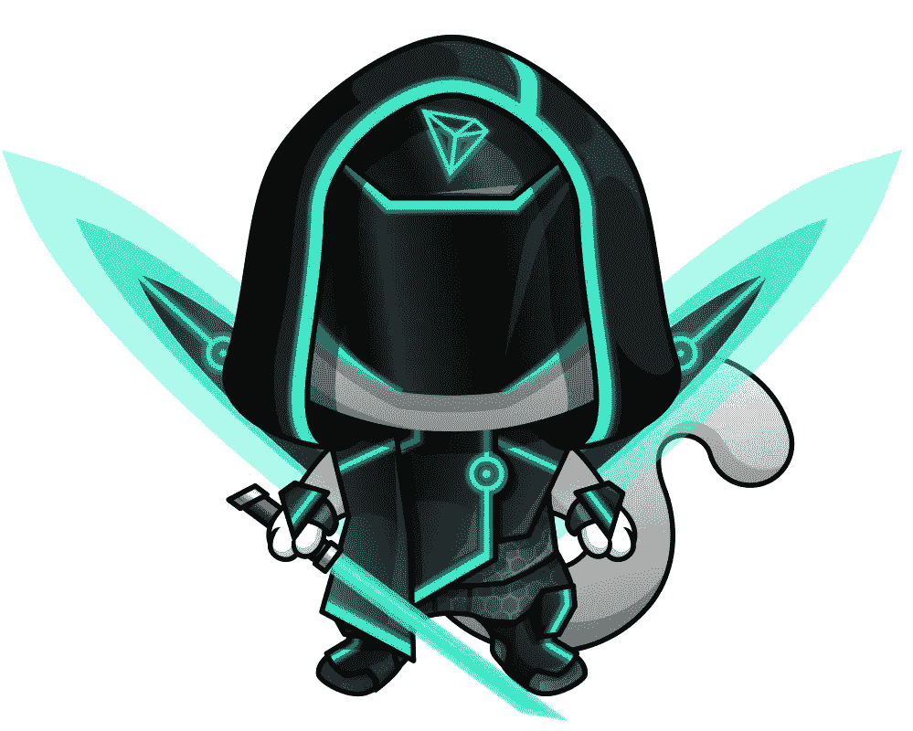
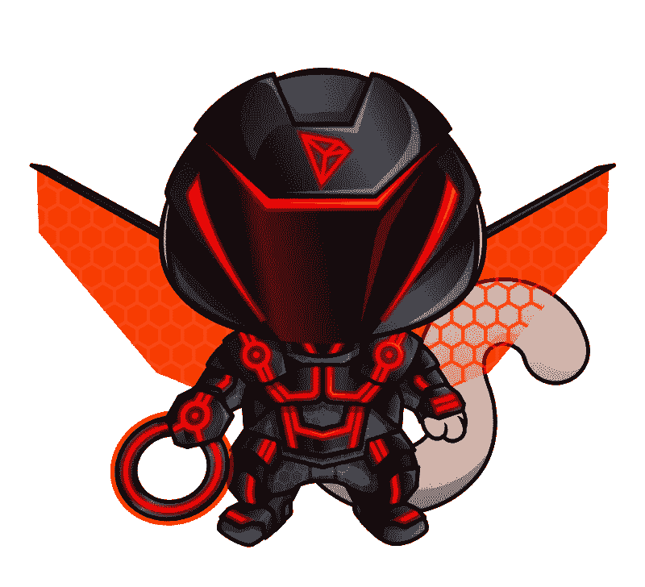

# 创区块链宣布在创街机加密游戏的 3 个基本规则。

> 原文：<https://medium.com/hackernoon/tron-blockchain-announced-3-basic-rules-of-crypto-gaming-within-tron-arcade-9bd2e26c8be7>

2018 年 11 月 29 日，TRON 发布了一份关于建立区块链游戏基金 TRON Arcade 的公开声明。据该基金称，将有 1 亿美元投资于加密游戏市场的开发。1 亿美元的资助将在未来 3 年内发放。TRON Arcade 是 TRON 通过区块链技术和革命性应用加速互联网去中心化的长期承诺的一部分。TRON 的创始人兼首席执行官 Justin Sun 评论道:“TRON Arcade 将在鼓励开发者加入我们的使命并为全球用户提供最佳区块链游戏体验方面发挥至关重要的作用”。

TRON 是加密游戏不可或缺的区块链，尤其是加密收藏品，因为它使用 NTFs(不可替换的令牌)。不可替代的代币是一种独特的资产，人们可以在将来出售或交换时使用并改进它。公平地说，由于每个 NTF 的特殊地位，大多数玩家决定保留他们独特的资产。每一个加密收藏品，也就是不可替代的代币，都是不可复制的数字艺术品。

# 出现在创街机上的游戏数量有限

现在市场上充斥着加密游戏，但我们的目标是选择最有潜力的游戏。不幸的是，加密游戏的质量普遍很差。这可能是由于疯狂的需求，这使得所有技能范围的游戏开发人员都跃跃欲试，而没有创造良好游戏体验的必要能力。TRON 将过滤掉图形蹩脚的游戏和缺乏良好背景故事的游戏，以确保用户获得良好的质量。

# TRON 和区块链 Cuties 一起构成了未来所有去中心化游戏的原型

TRON Arcade 上区块链 Cuties 游戏的正式发布将于 2018 年 12 月底举行。区块链 Cuties 将是首款在 TRON 上推出的加密收藏游戏。

区块链 Cuties 是一个具有重要战略元素的加密收藏游戏。作为一款加密收藏游戏，它基于 NFT 技术。不可替换的令牌，在游戏中恰当地命名为 Cuties，被塑造成小狗、蜥蜴、小熊、猫、刺猬和其他真实和幻想的生物。每个小可爱都有一个独特的基因组，它基本上是人类 DNA 的类似物。从流量、丰富的游戏玩法机制和交易量来看，这是一款顶级的 Dapp 游戏。目前，区块链 Cuties 是唯一利用 NFTs 并具有跨区块链功能的游戏。因此，各种资产可以映射到区块链上，这使得创建多硬币智能合约成为可能，因此来自不同区块链的用户可以在可验证的基础上相互交互。

将区块链 Cuties 放在 TRON 上意味着更高的交易速度，从而带来更多的游戏选择。TRON 玩家会注意到各种专属的小可爱，并且在繁殖时有机会得到更稀有的小可爱。这种标志性的合作不仅创造了更好的分散式用户体验，还促进了区块链游戏中加密技术的应用。

# 根据 TRON，加密游戏的 3 个基本规则

1.  高薪。用户投资购买小可爱是为了有机会赚大钱。玩家可以以他们想要的任何方式出售他们的收藏品，不管别人愿意出多少钱。所有收藏品都有代币地位。你得到了一个秘密宠物，这就是你投资之旅的开始。如果你想收回你所有的资产，你可以在游戏中直接提供的市场上出售你的区块链宝贝，或者你可以使用像 OpenSea 这样的第三方市场。
2.  快速增长。TRON 正在推动加密技术的应用，带来用户的爆炸性增长。TRON 的用户还会得到拥有全新属性的专属小可爱，这让游戏体验更加刺激。
3.  内容无效。只有高功能的游戏。小可爱们进行不同的冒险，集体对抗强大的 Raid Boss，庆祝万圣节、圣诞节，挑选稀有物品作为奖励。

到 2018 年 12 月底，《区块链 Cuties》将成为首款在 TRON Arcade 上市的加密收藏游戏。