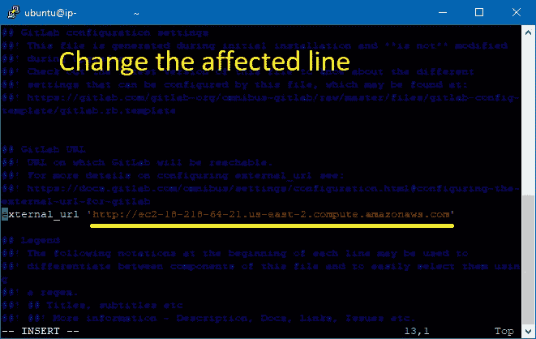
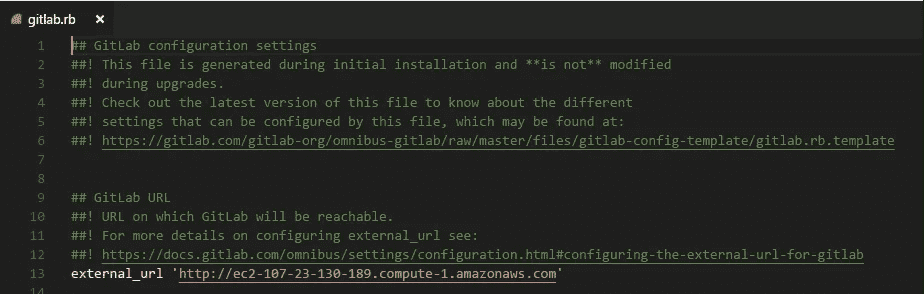
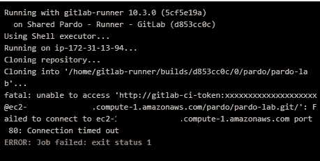

# GitLab 和 GitLab CI 故障排除

> 原文：<https://medium.com/hackernoon/troubleshooting-gitlab-and-gitlab-ci-79d3b71ad79f>

这是最后一篇帖子，以防你的 [GitLab](https://hackernoon.com/tagged/gitlab) 安装出现问题:

**岗位:**

1.  [【教程—指南】从零开始在 AWS EC2 上安装 GitLab，GitLab CI。](/@josjaviasilis/tutorial-guide-installing-gitlab-gitlab-ci-on-aws-ec2-from-zero-751927e5ae5)
2.  [使用 Docker](/@josjaviasilis/configuring-gitlab-ci-on-aws-ec2-using-docker-7c359d513a46) 在 AWS EC2 上配置 GitLab CI
3.  [正在配置。gitlab-ci.yml](/@josjaviasilis/configuring-gitlab-ci-yml-150a98e9765d)
4.  [排除 GitLab 和 GitLab CI 的故障](/@josjaviasilis/troubleshooting-gitlab-and-gitlab-ci-79d3b71ad79f)(本文)

# # 1-git lab Repo 上的 IP 已更改-显示错误的 URL

你忘了设置一个弹性 IP，IP 变了现在你的项目变了，现在 GitLab 不知道怎么算出来。

我们需要从`/etc/gitlab/gitlab.rb`文件中[改变外部 URL](https://gitlab.com/gitlab-org/omnibus-gitlab/blob/master/doc/settings/configuration.md#configuring-the-external-url-for-gitlab) :

**#备选方案 1 —使用 Vim 进行更改**

(转到 PuTTY 终端，运行:

```
sudo vim /etc/gitlab/gitlab.rb
```

按字母“I”开始编辑。



*Check line 13\. That’s our culprit*.

完成编辑后，按下`esc`并键入`:wq`这将编写并退出程序。

**#备选方案 2—下载文件并更改其内容。**

或者，你可以通过 [Filezilla](https://filezilla-project.org/) 或 [WinSCP](https://winscp.net/eng/download.php) 直接通过 FTP 访问文件。但是您必须暂时启用对文件的访问:

```
sudo chmod 777 /etc/gitlab/gitlab.rb
```

出自<[https://forum.filezilla-project.org/viewtopic.php?t=22618](https://forum.filezilla-project.org/viewtopic.php?t=22618)

之后，我们可以下载并编辑该文件:



Change Line 13\. Reupload the file to save the changes.

别忘了跑步:

```
sudo chmod 600 /etc/gitlab/gitlab.rb
```

**对于所有备选方案，运行:**

```
**sudo gitlab-ctl reconfigure**
```

以使更改生效。

记得在 AWS 中设置一个弹性 IP，这样这种情况就不会再发生了！

# #2-如果项目构建或任何其他阶段失败，该怎么办:

1.  如果您收到没有任务运行器正在运行。那么，这可能意味着:

*   任务运行程序没有运行。使用 sudo gitlab-runner start 或 sudo gitlab-runner run 使其工作。
*   任务运行器被配置为使用标签运行，而您的作业没有标签！标签不是在项目级别设置的，而是在。gitlab-ci.yml 文件！

2.如果您收到连接超时问题



在这个具体的例子中，问题在于缺乏弹性 IP，并且服务器地址发生了变化。通过不使用弹性 IP，您的服务器地址被释放，并完全改变。