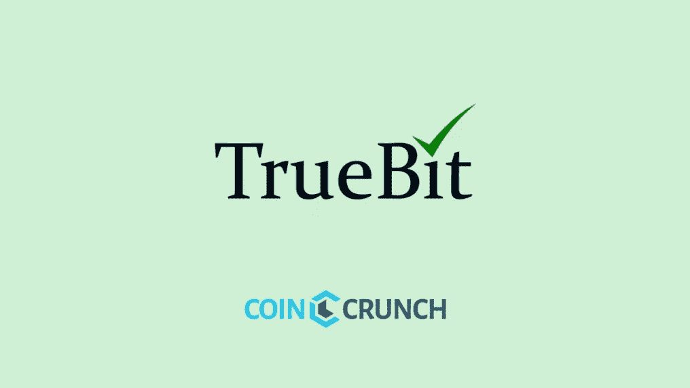
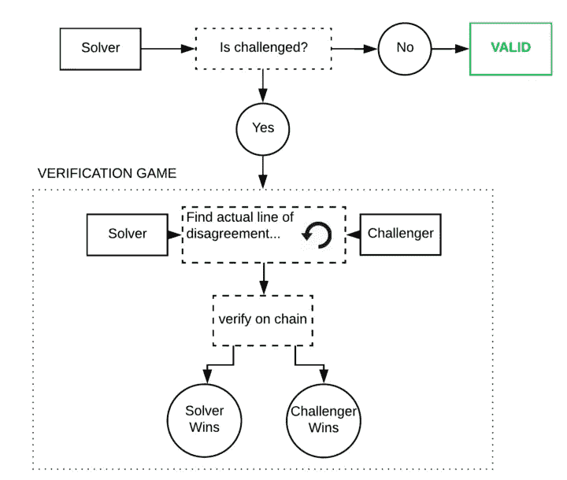
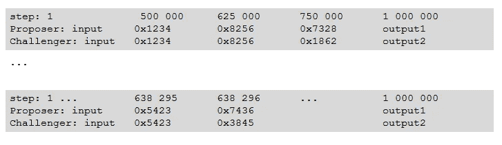
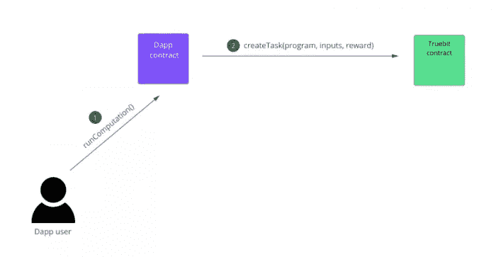

# TrueBit Review —区块链的安全、可扩展、分散计算

> 原文：<https://medium.com/hackernoon/truebit-review-secure-scalable-decentralized-computation-for-blockchain-1f9598412985>

TrueBit 协议是一项加密货币计划，为区块链带来了可扩展的计算能力。它们使用 TrueBit 协议为以太坊提供可扩展的链外计算。

# 问题

目前，以太坊网络上的计算能力受到几个因素的限制。gas 和 gas limits 的概念是防止大而复杂的计算和代码在链上被允许的概念。

*   以太坊使用 **gas** 计量智能合约存储和计算资源。
*   设置天然气限额(每个区块允许的天然气量)是为了限制区块内可能发生的交易的规模和数量。

**限气的目的是什么？**

*   气体限制防止拒绝服务攻击
*   所有的挖掘者必须复制每一次以太坊计算，所以在大规模计算的情况下，需要每一个挖掘者复制大规模计算。
*   气体限制有助于激励交易验证
*   气体限制防止了“验证者的困境”

***本督的困境:***

**情况:**新航提出了一笔巨额交易，并通过附加一笔非常大的交易费来吸引矿商。

*矿工 A* ，他刚刚开采了该区块，看到交易后说:“哇，这是一个巨大的激励，我会把它包括在我的区块中！”

*挖掘者 B、挖掘者 C、挖掘者 D* 和*挖掘者 E* 查看交易，并进入一种被称为“验证者困境”的两难状态

*矿工 B、C、D 和 E* 面临两种选择:

选项 1:验证导致这 4 名矿工在采矿竞赛中落后的大规模交易。

选项 2:跳过验证，但最终在错误的链上采矿，没有矿工会跟随。

**总之:**以太网上的计算受到阻塞气体限制的限制。如果没有合适的解决方案，这可能会使许多未来的应用程序运行成本过高或不可行。随着 DApps 和智能合约的最终发展，网络将需要一种解决方案来支持这些大型智能合约，并以更低的成本和更高的效率计算它们。

**true bit 创始人杰森·托奇的视频采访:**

# 解决办法

TrueBit 通过利用非区块链计算机的能力来验证计算来解决这个问题，这就是所谓的 Truebit 协议——利用他们在 TrueBit 智能合约上名为' *create* Task '的 API。

TrueBit 完全是外包繁重的计算工作。一个例子可能是，一个复杂的代码将需要数百个小时的计算，而不是让每个节点处理这些小时的计算，一个协议将确保结果与算法输出相匹配。计算在区块链之外完成，只有经过验证的最终结果才会被发送到区块链。

TrueBit 解决大型计算的方案是创建一个链外协议，让一个解算器处理大量代码。

*一群验证者将自愿提供验证服务和处理，然后批准求解者的工作。*

**当前情况的例子:**一个代码在链上发送，所有 100，000 个节点必须在链上处理和解决该代码。

**建议情况示例:**代码被发送到链外，只有一个人处理并解决该代码。少数人会去核实。

结果是更便宜的交易费用，处理更大计算的能力，以及更低的链上处理能力的使用。

# 主要功能—技术概述

**TrueBit 的验证游戏:**

协议工作的逐步过程如下:

**步骤 1** :开发者 Dan 上传大代码，在链外市场悬赏求解者。

*   *在链外市场上建立它并支付给求解器的成本比在以太坊上实际运行代码的成本要低。*

**步骤 2** :求解者提交押金(押金是在发生争议的情况下)，然后运行计算并将结果发布回链外市场。

**步骤 3** :任意数量的验证者也可以运行计算来验证答案和结果是正确的。

**第四步**:经过一段设定的时间后，如果没有争议或挑战，那么答案是“接受”，求解者收到他的付款并获得他的押金。

有挑战时会发生什么？

当验证者质疑求解者的结果时，裁决系统开始，链上的挖掘者成为法官。

二分搜索法缩小了问题的范围。

从上图中我们可以看到，争议是关于一个 100 万步的计算程序。双方在步骤 1、步骤 500，000、步骤 750，000、步骤 625，000 等等计算并提交全状态(存储器)的 Merkle 树。在 20 轮之后，同意在一个步骤中变成不同意(步骤 638，295 到步骤 638，296)。提交 Merkle 证明和 smart contract 验证(重新计算只需一步)都不费吹灰之力，就能找到骗子。它需要 20 轮，与 1，000，000 轮相比非常小，因此在链上比实际进行所有计算要快。

链上挖掘器只需在几轮内确定求解器或验证器是否正确，而不是 100 万步。

**如果求解者是正确的:**求解者将获得奖励，验证者将因提出“假警报”而失去他们的保证金

**如果验证者是正确的:**验证者将获得奖励，求解者将因公布错误结果而失去他们的保证金。

这使得 TrueBit 成为一个**一致同意的协议。**

*   如果一个诚实的验证者不同意(在检查计算后)，那么他们可以把它发布在区块链上，如果立场正确，他们可以超过任何人。它有助于防止 99.9%的攻击。一个诚实的验证者就足够了，没有人可以欺骗。
*   诚实的演员将永远赢得这场比赛。经济激励机制保证了诚实验证者的存在。

求解器被迫总是产生正确的结果并且诚实，由此产生的一个问题是，随着时间的推移，这可能会挫伤验证者提供验证服务和处理能力的积极性，因为他们知道求解器没有不诚实的动机。

为了激励验证者，TrueBit 引入了**强制错误的概念。**

强制错误的概念是，在随机的时间间隔内，TrueBit 服务器会提交一个不正确的解决方案。发现这些错误答案的验证者将赢得大奖。

这为协议中的求解者和验证者创造了相互激励。

**总之:**在 TrueBit 协议中，一个交互式“验证游戏”将决定一个有争议的计算任务是否被正确执行。

验证游戏将经历一系列回合，每一回合递归地检查越来越小的计算子集。授权网络上的任何人验证、计算或生成任务，以换取报酬。

# 路标

*截至 2018 年 4 月 12 日无任何公布。*

# 令牌机制

TrueBit 的 TRU 令牌将成为协议中用于支付验证者、裁决者和解决者的支付形式。TRU 的主要功能是奖励正确执行计算任务的验证者。代币也将用于所有验证者和解决者必须进行的初始存款，以防止不良行为者。

**头奖储存库**

鉴于激励核查人员的自我维持系统必须存在，TrueBit 协议征收核查税。

*任何调用 TrueBit 契约的任务给予者不仅必须支付求解者完成的计算工作的成本，还必须支付验证者完成的工作的成本，以及裁判和裁判完成的工作的成本。*

**焚烧造币系统**

尽管 TrueBit 的最初化身将居住在以太坊的区块链，但人们也可以将其用于其他生态系统。

用户可以在一台区块链上焚烧 TRU 代币，同时在另一台上铸造

*   这实现了通用的可伸缩性
*   这提供了本地自治的好处和跨链对称。

# 团队+顾问

**Jason Teutsch** — *Founder*

*   数学博士学位
*   曾在新加坡国立大学、宾夕法尼亚州立大学和海德堡大学担任博士后
*   曾在智库 RAND 和 IDA 担任研究职位，并多次获得富布莱特奖学金。
*   他的工作预测了智能池项目以及比特币的网络故障。

[**Christian Reitwiessner**](https://www.linkedin.com/in/dr-christian-reitwiessner-594b0982/) **—** *Whitepaper Co-Author*

*   以太坊团队领导
*   领导以太坊项目的 Solidity 团队开发智能合同语言。
*   领导了 cpp-ethereum 的开发，这是运行网络所需的客户端应用程序。

[**Robbie Bent**](https://ca.linkedin.com/in/robbiebent) *— Chief Operating Officer*

*   在建立技术团队方面有丰富的经验
*   痴迷于构建提高智能合约平台可伸缩性的产品，以及发展可伸缩的开源社区。
*   因维能源联合创始人兼首席运营官。
*   Roamly 的首席运营官。

**其他资源:**

*   Github — [TrueBit](https://github.com/TrueBitFoundation)
*   [Coindesk 文章](https://www.coindesk.com/inside-truebit-ethereum-scalability-effort/)
*   [IBTimes 英国文章](https://www.ibtimes.co.uk/ethereums-vitalik-buterin-proposes-fairer-interactive-coin-offering-protocol-1641029)
*   [Etherworld.co 文章](https://etherworld.co/2017/03/18/truebit-a-scalable-verification-solution-for-blockchains/)

## 这篇文章最初刊登在我们的网站上！你可以在这里找到[。](https://coincrunch.io)

# 想要了解区块链和加密货币的最佳新闻、评论和信息，请访问 [coincrunch.io](https://coincrunch.io) 或查看我们的网站:[Youtube](https://www.youtube.com/channel/UCXyrBCWaRJzHfOtnWaR47Qw)|[Twitter](https://twitter.com/coincrunchio)|[脸书](https://www.facebook.com/realcoincrunch/) | [Reddit](https://www.reddit.com/user/coincrunchio)