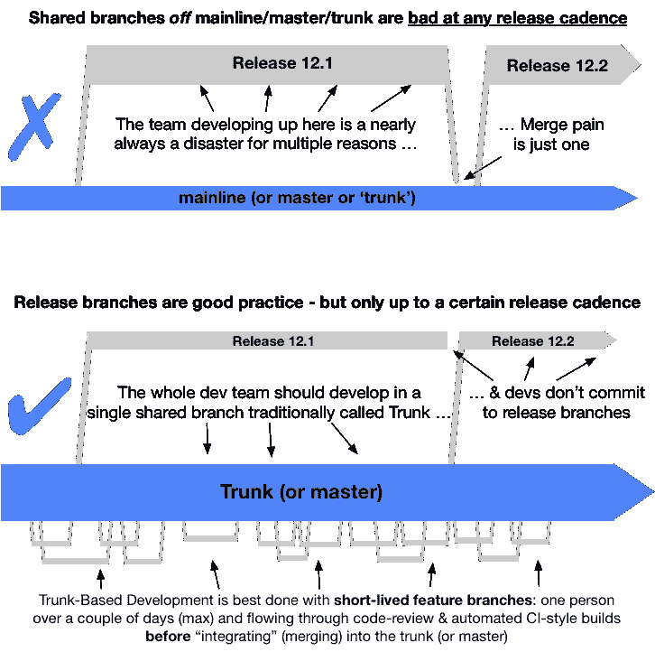
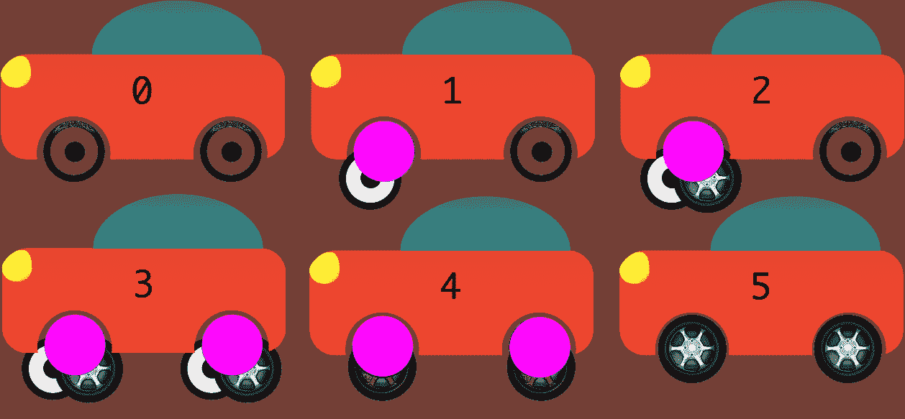

# 基于主干的应用程序开发(TBD)

> 原文：<https://medium.com/hackernoon/trunk-based-development-tbd-for-apps-9b654b6b198c>

通过阅读一些与 TBD⚡️相关的文章和推文，我无法避免将这个话题带到我自己的领域(📱 **app 开发**，伸伸胳膊伸伸手指，发表一篇关于这个的笔记。

# 那么，TBD 是什么？

[干线基础发展](https://trunkbaseddevelopment.com/)是:

> 在源代码控制分支模型中，开发人员在一个名为“主干”的分支中就代码进行协作，通过采用文档化的技术来抵制创建其他长期开发分支的压力。因此，他们避免合并地狱，不破坏建设，并幸福地生活在一起。

通过阅读它，你可以察觉到邪恶👹过度结构化的分支模型(如 [git flow](https://www.atlassian.com/git/tutorials/comparing-workflows/gitflow-workflow) )的一面，你可能会开始考虑抽象🧙‍♂️的**分支** **等概念，特性标志🚩**以及如何使您的 CI/CD 流程♻️适应使用**待定** ⚡️ **工作流程。**

让我们一起回顾一些关键的事情。

# 功能标志🚩

功能标志概念[是新的](https://featureflags.io/)或特别附加到 TBD⚡️ **但是如果你想搬到 TBD⚡️.，你需要开始使用功能标志**

当每个人都在一个分支中合作时，你需要一种机制来隐藏或淡出那些正在开发的部分。

> 由于很难让你的用户获得新代码，应用程序的发布过程有着特殊的意义。

iOS 商店需要长达 3 天的审查过程，这并不新鲜⏳(Android 没有)，但在两者中，一旦你“发布”可以持续长达 1 周，以获得新版本中 90%以上的用户。

> 采用[特征标志](https://martinfowler.com/bliki/FeatureToggle.html)🚩将帮助您尝试新的代码，并在出现问题时立即将它改回来

此外，您还会喜欢它，因为它通过强制解耦提高了您的代码质量，并支持您的产品 A/B 测试功能。

# 抽象分支🧙‍♂️

[抽象分支](https://www.branchbyabstraction.com/)是**增量执行变更的一种方式**，TBD⚡️需要它，因为它有助于合并“进行中的工作”变更🚧放在后备箱里并保持稳定。

> 基本思想是抽象当前的实现，在每个阶段的一系列可发布的变更中用新的实现替换它。

这个简单的概念很容易应用，并且会帮助你得到一个耦合度更低的代码**🏚**并在“工作进行中”变更中获得反馈🚧越来越频繁。

所有这些好处都是像[干净的架构](http://blog.cleancoder.com/uncle-bob/2012/08/13/the-clean-architecture.html)或[坚实的](https://en.wikipedia.org/wiki/SOLID)设计原则这样的概念所固有的，但是即使抽象分支在任何想要鼓励卓越和改进协作的团队中都是必须做的，尽管他们渴望采用 TBD⚡️

# 结论

鉴于上述好处和应用程序发布的疯狂⏳你会注意到 TBD⚡️的大部分改进都与此相关或直接相关，比如:

*   **少耦合代码🏚**
*   **更好的代码审查流程👀**
*   **忌邪邪分支👹**
*   **更精简的 CI/CD 流程♻️**
*   **更安全、更快捷、更快发布**🚀

> 而在其他技术中，发布到主干可能意味着在生产中发布。
> 
> 在应用程序开发中，情况并非如此，有必要陈述一个清晰的发布政策🚀。

当你发布你的应用程序时，你不仅仅是逐步淘汰了一周 90%以上的用户获得新的变化，你还迫使他们在每次更新时下载几十甚至几百 MB，你不能简单地发布合并到 trunk 中的每个变化。

如果你要收养 TBD⚡️，你需要让你的释放过程定期进行⏲(可能与您的 sprint 计划一致)这样无论什么在 trunk 中都会及时被释放🚀，这将帮助您保持一个稳定的发布进度，这将导致一个更加投入的团队，通过更频繁地看到他们工作的影响并迫使您更快地进行测试来增加团队的成就感。

然而，主干分支变得越来越重要，您需要高度重视该分支中的自动化检查，以确保其稳定性。

> 在任何情况下，您都需要就何时自动释放以及如何阻止它，如何在需要时手动释放达成一致，但更重要的是在主干中创建一组自动检查以确保它的稳定性。如果可能，在合并任何 PR 到它之前。

# TL；博士——LOL😂

有几个有效的点在待定⚡️and 周围的一切，像**特征标志**🚩，**分支被抽象化** 🧙‍♂️，**增加协作**📣，更简洁的代码和更简单的 CI/CD 流程♻️

> 我的结论是，现在没有什么能阻止你在应用程序开发过程中采用这种方法，只是对主干稳定性和对未知的恐惧设置了更严格的检查。

## 相关文章:

*   [trunkbaseddevelopment.com](https://trunkbaseddevelopment.com)
*   [的特色从](https://martinfowler.com/bliki/FeatureToggle.html)[的](http://martinfowler.com/)中借鉴了马丁·福勒的
*   [通过抽象分支](https://continuousdelivery.com/2011/05/make-large-scale-changes-incrementally-with-branch-by-abstraction/)从[ContinuousDelivery.com](https://continuousdelivery.com/)
*   [基于主干的开发](https://www.thoughtworks.com/insights/blog/enabling-trunk-based-development-deployment-pipelines)来自 [ThoughtWorks](https://medium.com/u/8075bdd73dd9?source=post_page-----9b654b6b198c--------------------------------)
*   [为什么特征分支是邪恶的](https://twitter.com/buraitopengin/status/993415389525790720)来自[吉列姆管](https://medium.com/u/179bce3232e6?source=post_page-----9b654b6b198c--------------------------------)