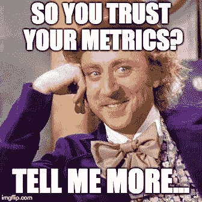
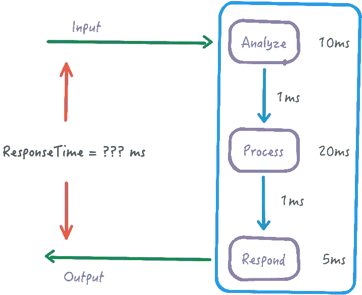

# “信任但核实”您的指标

> 原文：<https://medium.com/hackernoon/trust-but-verify-your-metrics-96565cd6d9b0>

让我们理所当然地认为您做了正确的事情——您已经慷慨地装备了您的系统，并且实际上正在关注您生成的指标()。摆在桌面上的问题是—“*您真的信任您正在生成的指标吗？*(提示:你不应该)

让我们看一些相当简单的东西，请求/响应路径如下所示

您可能认为响应时间是每个处理阶段的总和，对吗？即`ResponseTime = 10 + 1 + 20 + 1 + 5 = 37ms`？

但是，由于您不应该相信您的度量标准，您
1)也直接测量了`ResponseTime`，并且
2)将其与它应该达到的值进行了比较，并且
3)对偏差
进行了绘图/警告，您发现实际的响应时间是，比方说，**52 毫秒**。

那是相当不同的，不是吗？至于 ***为什么*** 是 52 毫秒，让我们来看一堆可能的问题

1.  *测量错误的东西*:你实际上测量了完全不同的东西。我知道，这听起来很傻，但这种情况一直都在发生，例如，你测量的是`validate_user`间隔，而不是`validate_users`([API 的拼写问题。耶。)](https://dieswaytoofast.blogspot.com/2018/08/preventing-your-api-from-failing.html)
2.  *不完整的仪器*:简单来说，你遗漏了一些东西。例如，在`Analyze`组件前面有一个队列，您还没有插装，并且您没有测量那里的延迟。
3.  *系统问题*:哎呀。垃圾收集暂停。或者故障转移。或者重新开始。或者别的什么。
4.  *意外的代码路径*:你的代码中有一堆路径来处理边缘情况(例如"*从输入中去掉分号*")，其中一些会触发你已经忘记的额外步骤
5.  *时间问题*:你只是做了一个关于时间的无限多的[假设，比如它单调增加，或者一切都是 GMT，或者其他什么](/@dieswaytoofast/we-dont-need-vector-clocks-we-ve-got-ntp-cowboydeveloper-3dc3883dfb55)。

这只是在测量时间的时候。这里的要点是，您应该通过多种方式来验证您的指标，*验证您所有的指标*。事实上，如果你已经这样做了，并且所有的数字都对齐了，你应该非常非常担心——你可能错过了什么！

所以，是的，相信你的指标，*在*你验证了它们之后…

()你可能会惊讶，我经常发现这种情况。你测试过你的代码吗？“T2，”——“当然，当然！”
*格拉夫纳？“老兄，得了吧，你以为我是什么人？”
*你最后一次看它是什么时候？*”——“嗯嗯”*

*(* [*这篇文章也出现在我的博客上*](https://dieswaytoofast.blogspot.com/2018/09/trust-but-verify-your-metrics.html) *)*