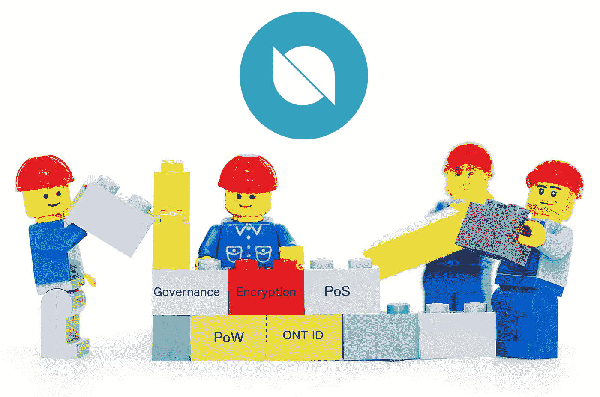
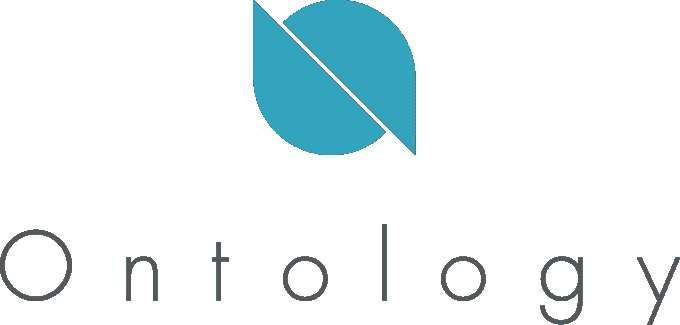
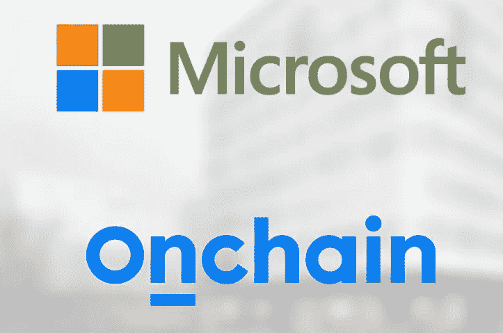

# 信任一个不信任的系统？本体如何给区块链带来大生意

> 原文：<https://medium.com/hackernoon/trust-in-a-trustless-system-how-ontology-could-bring-big-business-to-blockchain-fd73260ffee9>

## 希望采用区块链的企业面临巨大的挑战——本体提供了一个解决方案

**我有幸为这篇文章向本体论的创始人李峻提问。非常感谢他和朱丽亚·于给我们带来的联系。**

## 快速小结

Onchain 的一个长期开发项目，Ontology 支持一系列高级应用程序，以便企业和机构可以过渡到 T2 区块链 T3。它们允许实体创建私有链，保持对其信息的控制，与其他私有链和更大的本体网络互连，并连接到像 NEO 这样的公共链。像具有可选功能的可定制私有链、数字身份(ONT ID)和高级信任发布系统(实体可以向其他实体发布信任，并且所有信任都可以追溯到最初的发布者)这样的服务使得本体成为一个非常雄心勃勃的项目。

# 本体深入

无信任系统中的信任。好像很矛盾。区块链被认为天生就不需要信任。*全心全意地相信法典。*区块链建立的前提是，透明代码消除了对信任机构的需求，以及我们赋予它们的权力。智能合同可以减少我们对律师、司法系统、企业和银行的依赖。

有了这样的理解，为什么我们需要本体论，一个承诺成为“分散信任生态系统”的解决方案这就像卖柴油给 Telsa 司机…

但事实是，公开、开源的区块链只启用了区块链用例的一小部分。虽然有些人梦想一个真正去中心化的世界，一个所有公司都以 DAOs(去中心化自治组织)的形式存在的世界，但我们还没有实现这个现实。公司和组织仍然需要信任:**他们需要了解他们的用户群，验证身份，管理数字资产，并控制其生态系统内的信任发放**。想象一下，一所大学在区块链或其他分布式账本技术(DLT——一个包含所有形式的去中心化协议的术语，不仅仅是区块链)上运行。他们所有的记录、抄本、发票和数据都将通过 DLT 以某种方式储存起来。他们将向学生发放数字文凭，通过他们的数字身份维护学生的记录，并管理和委托信息访问。然而，像大学、医院和公司这样的机构参与者可能不会把他们机构的成功托付给一个真正匿名的、分散的账本。将你的未来托付给博弈论是一个巨大的信仰飞跃，即使许多区块链爱好者已经这么做了。

解决方法是什么？一个支持数字身份、可发行信任并支持私有、公共和联盟区块链网络的生态系统。该解决方案允许私营企业定制其区块链解决方案——治理和协议——并保持对其用户的控制。**本体论正寻求提供这种解决方案。**

> “对于企业、金融机构和政府来说，使用 NEO(或比特币、以太坊)存储敏感的身份信息是一个太大的信仰飞跃，更不用说遵守为前区块链世界设计的法律法规了。”—本体团队

# **本体概述**

本体的目的是在现实世界和分布式数据系统之间建立一座桥梁。本体团队明白，对于进入 DLT 世界的企业和公司来说，**他们需要一个支持选择的生态系统**。不同的业务需要不同的共识模型、不同的治理协议和不同的支持应用程序。本体论实现了所有这些。

本体是为商业而生的。把本体论想象成这个多层网络。在最底层，Ontology 的区块链连接了其他大型区块链平台(他们已经支持 NEO 虚拟机)，如 [**EOS**](https://eos.io/) 、 [**以太坊**](https://www.ethereum.org/) 和 [**QTUM**](https://qtum.org/en/) 。这使得公司能够在 NEO 上交易和存储数字资产，与以太坊 dApps 进行交互，并连接到其他区块链网络。本体论的下一个层次是一系列预制的 API 和协议。这些是砖块。没有区块链知识的公司和应用程序开发者可以用 Ontology 的协议包构建私有的、可定制的区块链。最后一层是需要区块链解决方案的公司、企业、机构和组织，但是是以许可和可控的方式。

我认为本体论类似于咨询公司。就像公司雇佣顾问来彻底检查他们的官僚机构一样，本体论提供了连接、手段、发展和知识来将公司带入 DLT 的世界。

## OnChain

本体论虽然与 NEO 有联系，但不是 NEO 项目。Ontology 是由一家叫做 [Onchain](http://www.onchain.com/en-us/) 的公司开发的。我引用我之前的[文章](https://hackernoon.com/neo-versus-ethereum-why-neo-might-be-2018s-strongest-cryptocurrency-79956138bea3):

NEO 的创始人大和 Erik Zhang 在 Onchain **创办了一家名为 [**的公司。**了解 Onchain 对于了解 NEO 至关重要。他们不是同一家公司，但他们的利益是一致的。Onchain 的系统被称为 DNA(去中心化网络架构),旨在与中国企业和政府合作。 **NEO 充当 DNA 的基础。如果 Onchain 能够与中国企业和政府整合，这将极大地刺激 NEO 的采用。**](http://www.onchain.com/en-us/)**

归根结底，本体是 DNA 的一种实现——为企业开发公共和私有区块链。**这些区块链然后链接到 NEO，加入分散经济。** 企业于是拥有了私有和公有区块链的所有好处。重要的是要认识到本体论不是一个新的发展；Onchain 在向公众发布细节之前，一直在秘密开发本体。**尽管本体还处于前期融资阶段，但它已经是一个成熟的项目。**

关于 Onchain 的关系和声誉的总结:

1.  这家成立于 2014 年的公司并不新鲜
2.  第一家加入 Hyperledger 的中国区块链公司，这是一个旨在将区块链与现有企业整合的合作项目。
3.  ***法律链*** —与*微软中国*合作，通过区块链技术数字化和保护签名。
4.  *微软中国*多个项目的战略合作伙伴
5.  与日本经济产业省合作
6.  [被毕马威评为中国 50 强金融科技公司之一](https://assets.kpmg.com/content/dam/kpmg/cn/pdf/en/2016/09/2016-china-leading-fintech-50.pdf)
7.  [与阿里巴巴合作，为阿里云提供电子邮件认证服务](https://siliconangle.com/blog/2016/10/20/onchain-partners-with-alibaba-for-blockchain-powered-email-evidence-repository/)
8.  [中国最大的民营企业集团——复星集团](https://in.reuters.com/article/us-fosun-blockchain/chinas-fosun-invests-in-local-version-of-bitcoin-tech-blockchain-idINKCN1B30KM?il=0)的投资，旨在整合他们所有业务的线上业务。
9.  [与中国地方政府合作](http://finance.sina.com.cn/roll/2017-04-13/doc-ifyeifqx5554606.shtml) —使用 Onchain 开发公共服务和数字身份
10.  [被微软](/ontologynetwork/microsoft-selects-onchain-to-be-part-of-microsoft-accelerator-a9680537ca0)选为他们为期 6 个月的创业加速器计划的一部分。

## 新的

NEO 与本体论没有直接联系。然而，为了让 NEO 真正支撑数字资产智能经济，他们需要信任协议来促进企业向区块链的过渡。许多人质疑为什么本体论需要他们自己的区块链，而不能简单地成为建立在 NEO 基础上的 dApp。我认为答案与其说是关于 NEO 的局限性，不如说是关于本体通过保持自主性所具有的优势。

本体不仅通过连接多个区块链来支持更多的应用，而且不是每个区块链企业应用都会是智能合约。有些人可能只是想利用本体的业务 IT 协议和 API。因此，本体需要自己的区块链来为客户提供更大的灵活性。

**TLDR:本体论是区块链和商业的纽带。他们的母公司 Onchain 已经与中国企业和政府建立了良好的关系。本体创建了一系列高级应用程序，以便企业可以创建私有链，保持对其信息的控制，与其他私有链和更大的本体网络互连，并连接到像 NEO 这样的公共链。**

# 是什么让本体论独一无二？

不要仅仅列出本体支持什么特性，而没有任何更大的、整体的观点，让我们关注一家公司将如何在区块链上运营，然后讨论本体如何支持这一点。

Blockchain’s first hospital?

我经营一家医院。我想要一个可配置的、许可的区块链，它支持从健康记录**和处方**到病人身份 T10 和研究数据分析 T13 的一切。我需要为我的员工和患者提供数字身份服务。我需要能够保持对文档和安全信息的控制，只允许医生和患者访问某些文件。我需要与其他区块链的连接，这样我就可以与其他私人医疗机构协调，与研究机构合作，并向保险公司开账单。我需要能够处理发票和帐单，付款和工资，所有在区块链。

其中一些要求是跨行业的标准。大多数公司需要发票能力和信任协议。然而，还必须有特定于医疗保健的可定制性级别。

Ontology 的天才之处在于他们构建了一个系统，该系统为各种行业提供了易于实施和开发的 DLT 解决方案。他们提供了构建模块。这其中，*本体常见的*和*本体定制的*，都在他们最近发布的 [**生态系统白皮书**](https://ont.io/static/wp/Ontology-Ecosystem-White-Paper-EN.pdf) **中有所描述。** *本体公共*是指跨应用无处不在的可部署区块链套件。每个公司都需要数字身份支持；因此，本体论提供了一个预制的数字身份工具包。他们将这些套件称为**模块。**相比之下，*本体定制*指的是仍然可以轻松部署的区块链特性，但是允许更多的定制。这些特性包括治理、共识模型和加密规范。根据业务类型的不同，这些会有所不同。这些模块就像一套乐高积木。你可以用一个装满乐高积木的盒子建造任何你想要的东西。用它们建造很容易，实际上生产塑料砖很难。因此，乐高——或本体论——生产积木；你可以建造…然后在半夜踩在上面。

A “Block-Chain”

# **乐高积木**

本体的块或模块有几种形式。

## ONT 身份证:

ONT ID 是一项针对个人、企业、公司和其他法律实体以及物联网设备和手机等物理对象的验证服务。在任何时候，实体都保持对其 ID 的控制，并负责签署其私钥以允许其使用。用户还可以将管理权限授予其他人。在我们的医院里，每个医生、病人和服务提供者都有一个 ID，以及医院内的设备。都经过区块链的验证和保护。

## **信任树:**

如果你在经营一家医院，你需要能够在你的生态系统内建立信任。您需要验证您的员工和与您合作的其他实体。这证明了行业内的参与者就是他们所说的那个人。本体提供了两种解决方案:

**集中式信任树:**一个实体可以申请证书成为信任锚。当实体在区块链上注册并验证其个人信息时，就会创建该证书。一旦他们成为主持人，他们就可以信任他人。接收者也可以向其他人发布信任，但这都可以追溯到最初的锚。这创建了一个树状结构，其中从锚点开始是委托他人的实体的分支。这种模式很适合医院这样的实体。

**分散式信任树:**与上述集中式实体发布信任并为整个树提供可信度不同，该模型允许信任和信誉基于您在网络中的相关程度。你从别人那里得到的认证越多，你的可信度就越高。

The Tree of Trust

这些实体——个人或组织——可以发布**可证实的声明。**可验证的声明只是关于其他实体的属性。想象一个学校发成绩单。可验证的声明可以定制，因此学校可以定义成绩单的有效期，设置自动过期日期，并确定谁可以看到所说的声明。

使用 ZK-Snarks——零知识证明(证明你有信息而不泄露所述信息),声明也可以在不公开的情况下得到验证。也许你想证明你实际上已经超过 18 岁，而不公开其他私人信息，如你的地址或生日。今天，你每次出示身份证时都这样做。有了本体的零知识证明，网络可以确认你是 18 岁，而无需你透露额外的细节。

通过将声明连接到实体并集成外部身份信息，本体确保了企业具有很大的灵活性。**本体上的身份不仅仅是一个静态的数字 ID，而是全面的、不断发展的。**

**其他模块:** 本体支持多种其他可定制模块。其中包括安全、数字版权、加密和分散计算模块。本体支持发布和管理可验证声明的模块，以及支持扩展解决方案(如分片和链外解决方案)的模块。

**TLDR:通过数字身份、信任发布模型和匿名信息功能，本体实现了一系列企业应用。**

# 事实真相

如果技术和协议不支持愿景，项目就什么都不是。如果你*走*走*走*你需要*说话*说话*说话*。

## 共识；一致

网络如何达成共识非常重要。它影响安全性、可靠性、效率和速度等因素。本体使用类似于 NEO 的委托拜占庭容错(dBFT)；他们将自己的特定版本**命名为 Ontorand 共识引擎(OCE)。**

dBFT 是**利害关系证明(PoS)的修改版。**你可以[在这里阅读更多](https://hackernoon.com/neo-versus-ethereum-why-neo-might-be-2018s-strongest-cryptocurrency-79956138bea3)NEO 和最近的区块链协议使用的 PoS 和[比特币](https://hackernoon.com/tagged/bitcoin)和以太坊使用的工作证明(PoW)之间的区别。

Byzantine Fault Tolerance attempts to solve the Byzantine General’s Problem

dBFT (委派拜占庭容错)听起来像是你在 AP 历史测试中看到的术语。对拜占庭容错最简单的解释是如何让网络上的每个人诚实并一起工作的问题，因为一个坏苹果可能会毁掉一切。

我想象 dBFT 的工作方式类似于美国参议院的工作方式(如果这种类比让你想完全放弃 DLT，我理解，但请坚持下去……继续阅读)。如果美国的每一个人——全部 3.231 亿人——都被允许直接参与政府决策过程，那将是灾难性的。这将是残酷的缓慢，因为数百万人争夺麦克风，所有人都喊着他们的意见，并相互争论。做决定也会极其缓慢。所以相反，这个国家的每个人都有投票权。有了这一票，他们可以选出他们的代表，代表他们说话的人。这个系统直接反映了 dBFT 治理。持有 ONT 代币的人可以投票选举代表，而不是每个人都参与验证过程——这在交易速度方面会有难以置信的限制。这些代表为每个人维护网络。

本体还将提供可定制的共识机制，从而为用户提供更大的灵活性，如 PoW 和传统的 PoS 模型。

> 本体将首先基于 NEO-like dBFT 模型，然而，本体将提供不同的一致性算法，例如 POW、POS、dBFT、OCE 等等。此外，组织可以选择他们首选的共识节点来运行他们自己的 ONTX 网络，并使用链互操作性来与整个本体网络进行交互”——李峻

## 智能合同

智能合约，或者说 Smaht 合约(就像波士顿爸爸说的那样)，是任何区块链的基础。本体运行 NEO 虚拟机。**虚拟机(VM)就是将代码转化为动作的编程机器。**当在 *Solidity* 中的以太坊上写入命令时，以太坊虚拟机将该代码翻译成动作:智能合约。虚拟机跨平台不兼容。为了使两个链相互通信，它们必须运行各自的虚拟机。只有这样，才能在两个区块链上读取外国代码。

因为本体运行 NEO 虚拟机，所以本体的链将能够交互和理解 NEO 的数据和智能合约。这使得互操作性成为本体网络的基础。我期待 Ontology 在未来继续实现其他 VM。

## **其他相关细节**

*   **HydraDAO—****本体模块，作为开发分散自治组织的基础。该模块为智能合同、新的治理模式和大数据管理提供支持。**
*   ****分布式数据交换协议—** 本体为各方之间的数据交换提供了一个框架。通过利用身份和对数据法律法规的支持，公司可以轻松、安全地处理数据。**

# **本体论表征经济学**

****本体令牌:ONT****

****总供应量:10 亿****

****Marketcap: Pre ICO —因此未知****

****令牌分发:**本体没有托管 ICO。李峻引用 ICO 法规作为首要原因；“代币销售法规(以及一般加密和区块链法规)在全球范围内仍处于早期阶段。我们不希望象征性的销售影响任何地方未来可能的合作机会。”**

**目前，只有对本体有广泛贡献的社区成员才能获得分配。此外，每个在 Ontology 网站上提前注册的人都将免费获得 1000 个空投代币。**

**除了对 ICO 的监管问题，我认为本体论确实希望促进社区参与。生态系统白皮书真正强调了他们鼓励集体协作的奉献精神，我认为这种筹款模式支持这一愿景。**

# **路线图和未来发展**

**本体最近发布了他们的[生态系统白皮书](https://ont.io/static/wp/Ontology-Ecosystem-White-Paper-EN.pdf)。目前，本体也有他们的[技术](https://ont.io/static/wp/Ontology-technology-white-paper-EN.pdf)和[入门白皮书](https://ont.io/static/wp/Ontology%20Introductory%20White%20Paper.pdf)。在 2018 年 Q1 剩余的时间里，Ontology 还将发布他们的路线图、治理白皮书，并将在 GitHub 上介绍他们的 TestNet。**

****

**Jun Li is the quarterback**

# **团队**

**就数量而言，本体可能会派出一支完整的足球队。该团队由创始人**资深区块链技术专家**、**丛**、**胡宁、**资深协议架构师领衔。**

**李峻:他拥有计算机科学和工程的背景，在技术开发和金融科技领域拥有丰富的经验。**

****洪磊·丛:**丛拥有分布式系统和分散式一致性算法设计的经验。他有在思科和 EMC 工作的经验，并为大型企业集团设计过区块链架构设计。他领导的团队在 Hyperledger 的亚洲黑客马拉松中获得了第二名。**

****:**胡参与了保罗·艾伦的项目《光环计划》。拥有语义网开发背景的胡曾参与过政府事务数字化、游戏平台和流媒体等项目。**

**Ontology 还拥有一支由 20 多名工程师组成的开发团队。**

# **关注和考虑**

**我最大的危险信号围绕着实现本体论愿景的困难。这是一项规模巨大的工程，肯定会遇到技术上的困难和障碍。然而，有了 NEO 和 Onchain 的支持，我认为 Ontology 经验丰富的开发团队在交付方面处于有利地位。**

**此外，观察本体论如何成功地与新兴的 DLT 项目如 EOS 和 Hashgraph 竞争也很重要。**

****

**For me, it’s a question of when, not if, Google enters the blockchain space**

**另一个担忧是，谷歌等公司是否会开始为企业提供区块链即服务(BaaS)。凭借他们的基础设施和资金，这些公司将很难在这个领域竞争。本体有可能与谷歌合作，为 BaaS 提供模块，但我认为这不太可能。**

# **摘要**

**罗马不是一天建成的，我们未来的分散经济也不会。区块链爱好者宣传区块链的好处——去中心化、不变性、安全性——而不考虑抑制企业和机构采用的复杂障碍。但是对于这些机构中的许多，区块链不会取代，它会整合。本体是一个*集成服务商*。**

**通过可发布的信任、可验证的身份和可定制的模块，本体上的企业可以构建符合其当前框架的区块链解决方案。本体为分散的生态系统提供信任，没有信任，就不会有采用。尽管我的自由主义理想主义渴望匿名和大规模权力下放，但我们必须一步一步来。第一步是支持在当前框架内工作的项目。**

**如果 Ontology 实现了其智能生态系统的愿景，NEO 实现了其创建智能经济的目标，我们可能最终会看到一个由企业、机构、学校和医院组成的网络，所有这些都由分布式账本技术支持。那是我能得到的未来。**

**在 Twitter 上关注我:@ noamlevenson**

*****免责声明:这不是投资建议，仅仅是我对该项目的看法。自己做研究。我们没有收到本体团队的付款，这绝不是赞助内容。我没有 ONT 代币。*****

***如果你喜欢内容，请按住鼓掌按钮！它帮助我获得曝光率。***

*****鼓掌 50 次！*****

***我喜欢获得问题或建议，所以请发表评论吧！***