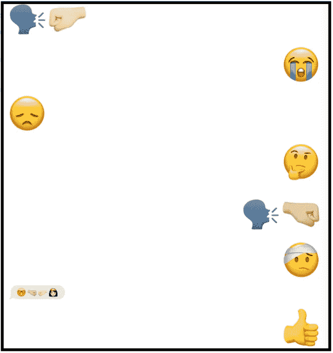
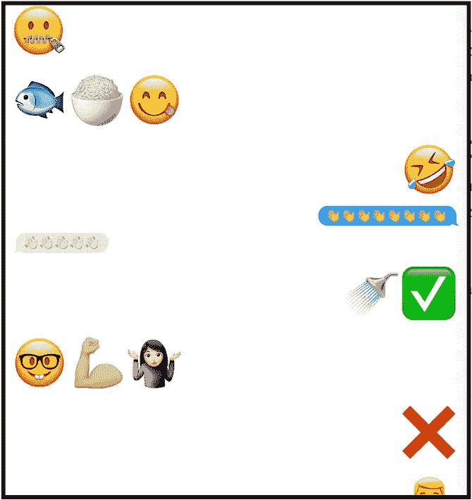
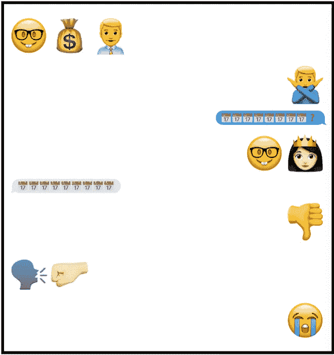
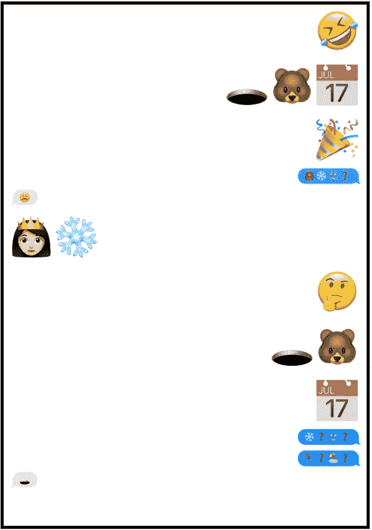
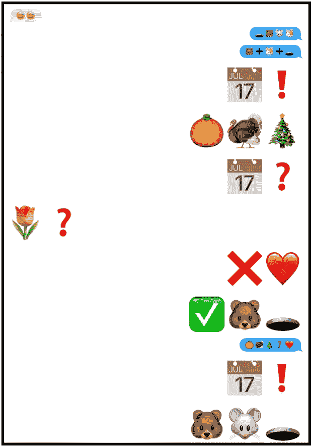
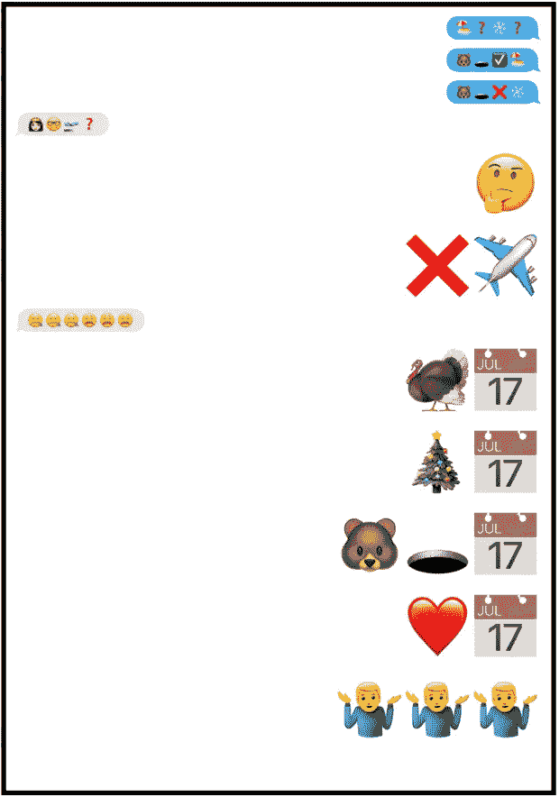

# 试试这个:只有表情符号的文本💬😃😞💬🤐

> 原文：<https://medium.com/hackernoon/try-this-text-only-in-emojis-1af2bfcfec78>

## 一个愚蠢的实验揭示了关于语言的迷人见解

如果你在过去的二十年里一直在睡觉，表情符号的使用会一直持续下去📈📈📈。到 2015 年年中，**insta gram 上一半的评论**包含表情符号。好莱坞发布了一部名为《T2》的全长电影，即表情电影《T3》。甚至[谷歌首席执行官桑德尔·皮帅也在发布关于汉堡表情符号](https://twitter.com/sundarpichai/status/924487551372615680?ref_src=twsrc%5Etfw&ref_url=http%3A%2F%2Fwww.newswhip.com%2F2017%2F12%2Femoji-on-social%2F&tfw_creator=gabrieleboland&tfw_site=NewsWhip)的紧急修复。

对一些人来说，表情符号给用户造成了困扰(你到底应该怎么使用🙃表情符号？).然而，对许多其他人来说，表情符号开启了一种迷人的新交流方式。甚至还有表情符号哑谜式的“游戏”，用户可以根据一系列表情符号猜测电影名称。(试试这些:💉💎或者👦🏻👓⚡).但是当你把表情符号推进一步会发生什么呢？

# 实验:只用表情符号发短信

当表情符号是你唯一可以使用的语言时会发生什么？在象形的媒介中，交流是如何变化的？作为一项实验，我和我的朋友花了一个周末只用表情符号发短信。

唯一的规则:没有字母或单词。下面是我们的消息对话的一些截图。

# 模式出现了

虽然这看起来完全是一团乱麻，但我和我的朋友们注意到在我们的对话中出现了一些语言。以下是我们的一些重要见解。

## 我们创造了自己的单词和句子

我们从一些基础知识开始了我们的表情符号日:

*   首先，我们建立了**科目**。我曾是🤓我可以用它在句子中代表“我”。举个例子，🤓🏃‍🏢可能意味着“我要去上班了。”

> 我想知道这种模式是否会出现在非英语国家。虽然英语是主题突出的，但像朝鲜语这样的语言是主题突出的，对主题的强调较少。

*   接下来是否定。❌🗣️的意思是“不许说话”
*   接下来，我们建立了**问题**。我们 used❓liberally 指出问题，和🤔表示“我不明白”我认为问题占了我们交流的 30-40 %,所以这是一个重要的表情符号发现。
*   然后，我们添加了更多**有趣的复杂关系。**🔜暗示着，经过一段时间后，一件事会导致另一件事。🤓🔜🗣️的意思是“我很快就能说话了”我们设计了一个询问“你感觉如何”的量表：😄😀🙂😕☹️😴❓
*   随着我们交流的深入，我们采用了彼此的语言。我的朋友曾经🔺来表示“和”在我理解之后，我开始采用相同的表情符号含义。由于交流是如此具有挑战性和时间密集性，就彼此的表情符号意义进行合作至关重要。
*   表情符号中的**时间**很有表现力。🕐🕑🕒🕓🕔🕕🕖🕗🕘🕙🕚🕛🕜🕝🕞🕟🕠🕡🕢🕣🕤🕥🕦🕧让我们可以很容易地交流时间。

## 微妙之处消失了

想象一下用英语交流，但是你能使用的情感词汇只有“好”、“坏”、“悲伤”和“愤怒”你也许能理解这一点，但是你的句子的微妙和细微差别就失去了。我们的对话感觉受到了限制——需要大量的交流才能让“雄心”这样的概念被理解。

这对于英语来说意味着什么——当感情被转化为语言时，更复杂的微妙之处在哪些方面被丢失了？

## 打字错误代价高昂

我一不小心输入了一个关于意外的表情符号，就有几条短信把我们拉回了正轨。我敢肯定，最终我们会开发出一套表情符号，翻译成“没关系”，但在我们有限的对话中，我们努力理解对方的错别字。

## 交流是非常困难的

我想传达一个简单的短语:“今天是土拨鼠日！”看看我看似简单的沟通有多难。

I’m trying to show “bear” + “hole” + “day” = “Groundhog day.” When that doesn’t work, I try to indicate other holidays (Thanksgiving, Christmas, Valentine’s Day) and also show that the “bear”+”hole” is choosing between spring or winter. Unfortunately, the message just doesn’t get across.

## 但是，这很有趣！

尽管有沟通方面的挑战，但在解决沟通的文字难题和设计表达思想的创造性方法时，还是有很多乐趣的。

# 试试看！

我玩表情符号玩了一天，很开心，在交流中也学到了一些有趣的模式。我鼓励你自己尝试一下，并在下面贴出对你有效的方法或者你学到了什么！至少，我对这些叫做**单词**的惊人发明更加欣赏。

如果你觉得这篇文章很有趣，请鼓掌表示你的欣赏👏下面。看看下面我的三篇点击率最高的文章:

*   [我黑了 HQ 琐事，但这里是他们如何能阻止我](https://hackernoon.com/i-hacked-hq-trivia-but-heres-how-they-can-stop-me-68750ed16365)
*   [我拥有 115 件物品](https://hackernoon.com/how-i-live-my-115-things-53558259575b)
*   [我的整个财务系统，图解](https://hackernoon.com/how-i-live-organizing-my-finances-2a277b6c296c)