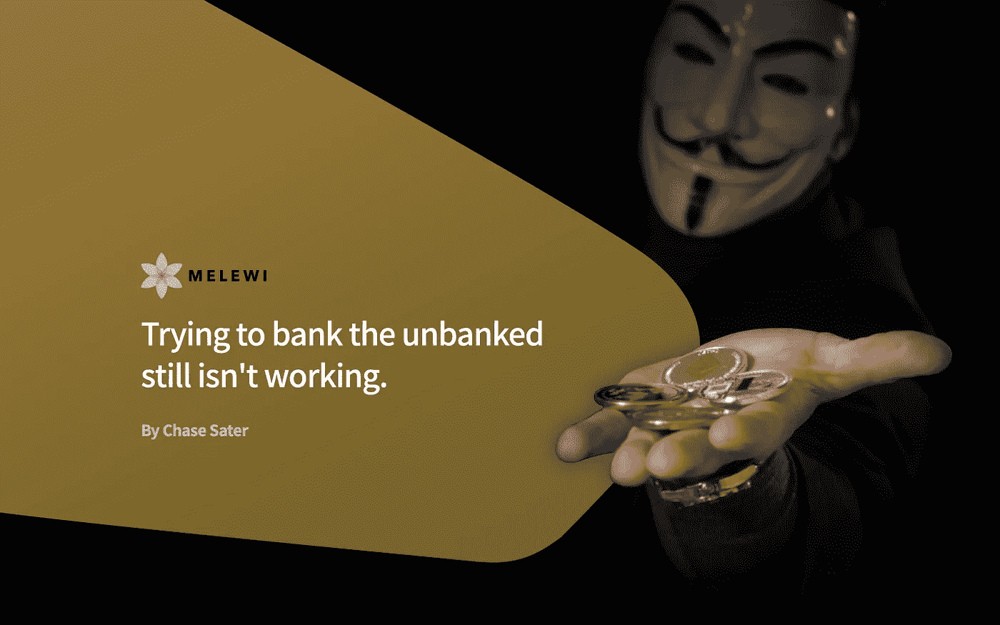
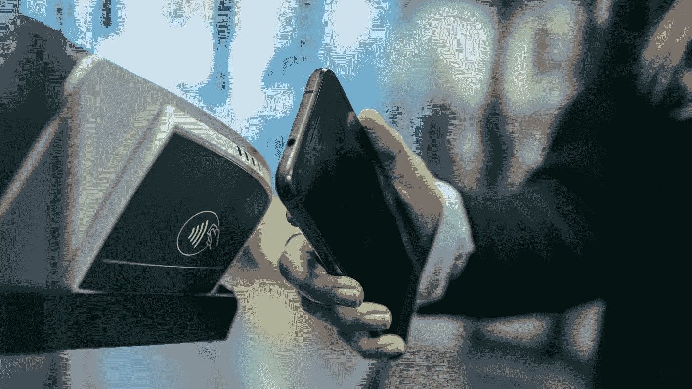

# 试图为没有银行账户的人提供银行服务仍然行不通。

> 原文：<https://medium.com/hackernoon/trying-to-bank-the-unbanked-still-isnt-working-45efda7b1b93>

## 一次一笔交易改变世界。

当有人提到“加密货币”时，你首先会想到哪里

硅谷？韩国？日本？也许是澳大利亚？

这就是采用加密货币的最大问题。大多数新的加密货币创业公司来自已经拥有世界级基础设施和低费用、快速数字支付系统的地区。

例如，在美国，只有 7%的家庭没有银行账户。然而，在 T2，这个数字飙升至 78%。

尼日利亚[的人口中，60%多一点没有银行账户。尽管在过去的几年里，印度没有银行账户的人数已经从 47%下降到 20%多一点，但仍有近 2 亿印度人没有支票或储蓄账户。](https://timesofindia.indiatimes.com/business/india-has-second-largest-unbanked-population-in-the-world/articleshow/64570254.cms)

# 如果它没坏，你就修不好它

在美国等地，几乎每个人都已经拥有信用卡/借记卡或通过手机访问数字支付系统，加密货币目前并没有那么有用。

使用[比特币](https://hackernoon.com/tagged/bitcoin)和[以太坊](https://hackernoon.com/tagged/ethereum)可能更安全，但目前它们的网络只能处理 Visa 和 MasterCard 每秒 5000+交易的一小部分。

**简单地说:在高度发达的国家，用加密货币支付仍然不如用菲亚特支付方便快捷。**

在大多数人已经拥有银行账户和简化的数字支付方式的地方，普通消费者不会看到将加密货币融入日常生活有任何好处。

## 但是让我们记住，发展中国家不一定有同样水平的基础设施。许多国家仍然充斥着没有银行账户的公民。对于那些有银行账户的人来说，汇款/收款要支付很高的费用和很长的等待时间。

> 这是加密货币为世界提供即时价值的绝佳机会。

2016 年，国际移民向仍生活在自己国家的家人寄回了 601，000，000，000 美元。其中，仅发展中国家就获得了 4410 亿美元。

对于边境市场的家庭和企业来说，汇款是其经济不可或缺的一部分。

[问题](https://www.moneyandbanking.com/commentary/2018/2/18/the-stubbornly-high-cost-of-remittances)在于促成这些国际交易所需的中介服务——西联汇款、Money Gram 和其他受欢迎的公司对每笔交易收取高达 10%的费用。

好消息是什么？使用加密货币使得这一过程更加便宜、简单和快捷。

**同样，采用加密货币的问题不在于正在开发什么，而在于******正在部署什么。****

****尽管前沿市场是快速采用加密货币的主要候选市场，但世界上只有一小部分加密初创公司在为发展中市场创建解决方案。相反，他们中的大多数人仍在试图在世界上已经拥有近乎完美的金融体系的地区部署解决方案。****

****

# **加密货币可以大幅提高金融包容性**

**移动设备无处不在。银行账户仍然不是。**

**就这么简单。**

**让人们从智能手机上注册一个数字钱包，比要求他们提交身份证明文件并等待多日进行验证要容易得多。**

**即使你有银行账户，在尼日利亚和印度等地获得小额商业贷款几乎是不可能的。**

**除了让没有银行账户的人获得银行服务和金融工具，BitPesa、M-Pesa 和 Nebeus 等公司利用加密贷款让发展中国家的企业主获得平等的贷款机会。**

## **在每个人都跟上速度之前，我们不能指望全世界都使用加密货币。对于创业公司的创始人来说，降低发展中国家的汇款成本可能不像追踪钻石从矿场到商店那样诱人，但这是世界需要的，以展示加密货币的主流潜力。**

# **TLDR**

*   **用传统基础设施为没有银行账户的人提供银行服务比看起来要困难得多**
*   **在发达国家，加密货币还没有真正的使用案例，因为大多数现有的支付系统仍然有利于日常使用**
*   **欠发达国家就不一样了——在某些地区，银行账户很难得到验证，汇款费用高得离谱，国际商业交易也贵得不必要**
*   **一些解决方案已经开始使用加密货币作为中间步骤，以减少发展中国家的国际交易，但仍有很长的路要走**
*   **发展中国家正在快速获取新技术，但金融包容性仍然非常低，因为大多数银行依赖陈旧的验证流程**
*   **有了基于现代加密货币的金融机构，你只需要一部电话和一个互联网连接**

> **原写给[Melewi.net/blog](http://melewi.net/blog/2018/08/20/trying-to-bank-the-unbanked-still-isnt-working/)**