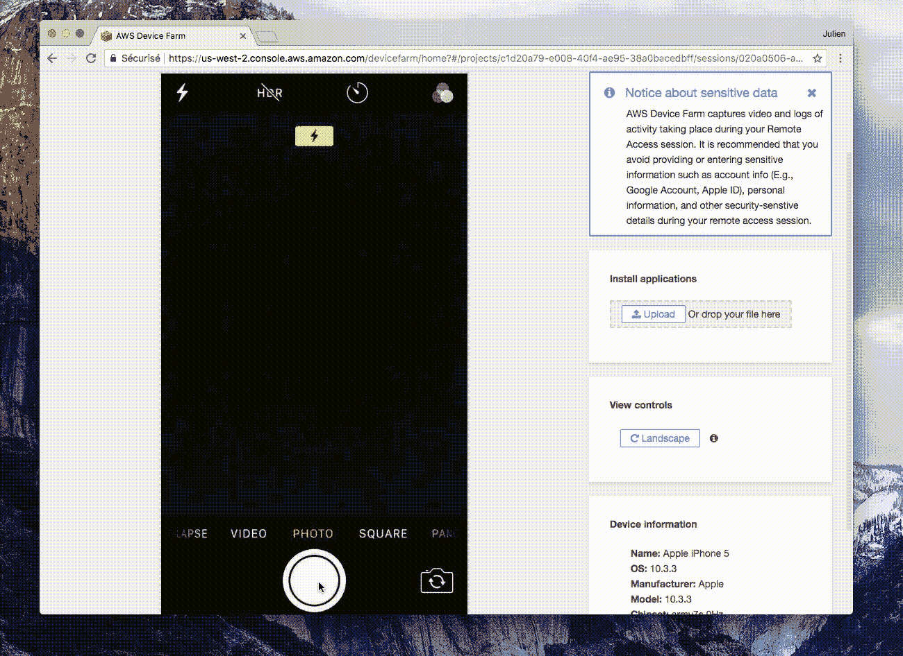
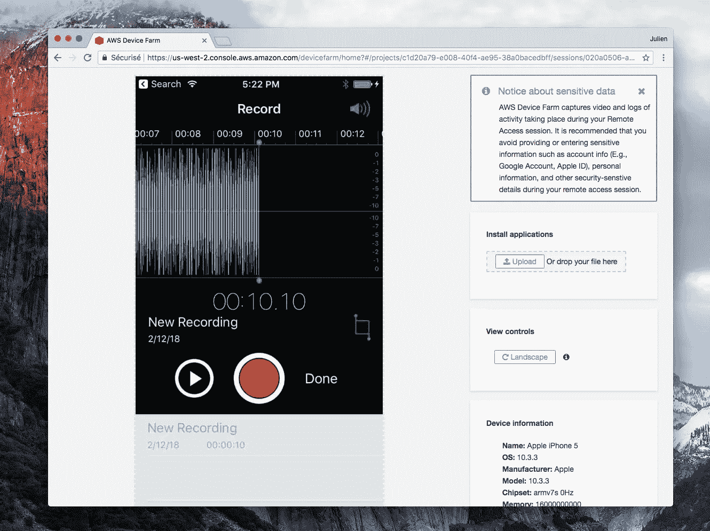

# 尝试使用 AWS 设备群查看 AWS 数据中心的内部

> 原文：<https://medium.com/hackernoon/trying-to-see-the-inside-of-aws-data-centers-using-aws-device-farm-3fe57df5de77>

AWS 提供一项服务，让你在实际的物理设备上测试你的应用程序(在 iOS、iPhone 5 和 iPad 上，在 [Android](https://hackernoon.com/tagged/android) 上，主要是三星设备)。

如果我们触发硬件闪光，我们能一窥野兽的腹部吗？

Probbing AWS Device Farm

这里没什么事情。现在，麦克风呢？

也没什么，除了好像声音超级大！！

我还应该尝试什么？