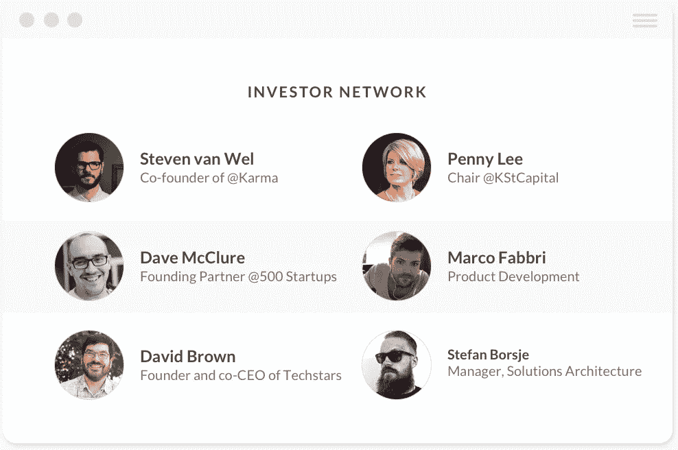
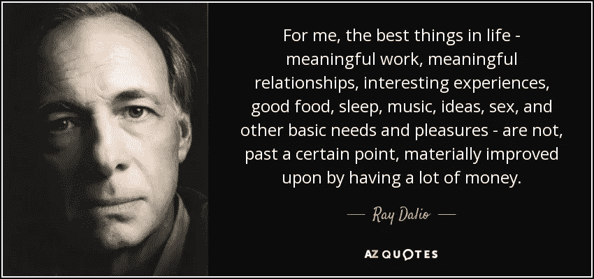
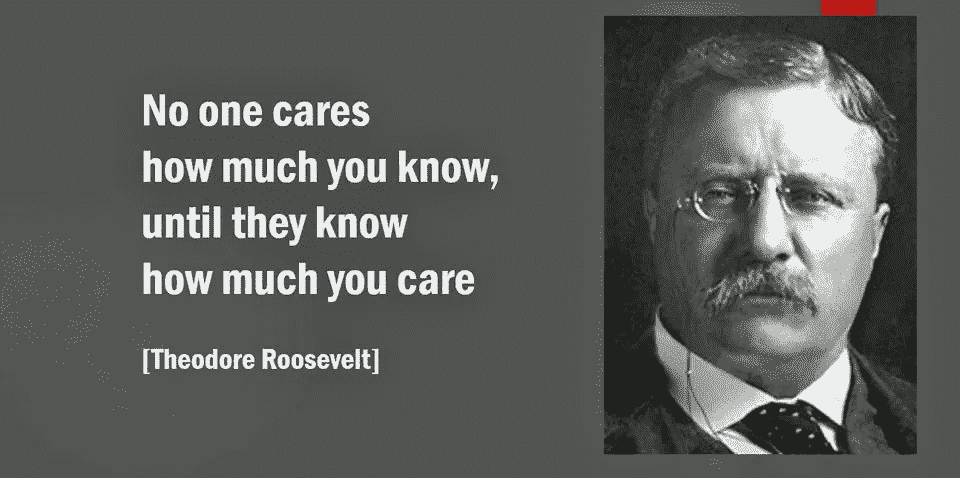

# 把你的人际关系变成财富。以下是方法。

> 原文：<https://medium.com/hackernoon/turn-your-relationships-into-wealth-heres-how-4e7ef29526d9>

> 由 [AngelLoop](https://goo.gl/G7ZSp6) 为您带来。

> *“赚钱是拥有强大关系的附带结果。”*

想一想。它会帮助你克服一些障碍，这些障碍可能是你在延迟建立新的[关系或者改善现有关系时设置的。](https://hackernoon.com/tagged/relationships)

作为企业家，我们倾向于关注产品、市场和利润。所有这些租户都很重要，但是它们都是我们一路建立和培养的关系的衍生物。

首先让我们给雷一些爱:

我所说的雷不是别人，正是世界上最大的对冲基金 Bridgewater Associates 的首席执行官雷伊·达里奥。他在他的新书《原则:生活和工作》中帮助我重新发现了这个概念。

雷认为，我们应该为我们想要的东西(包括金钱、工作和关系)赋予相对价值，并对它们进行适当的权衡。他认为**工作和有意义的关系**比金钱更有价值，因为“金钱”的意义更小，因为它是两者的衍生物，也就是说，你建立的关系将帮助你完成有意义的工作，与他们一起工作将帮助你积累财富。

**从投资人那里融资的创业公司，我来解释一下。**

在她/他给你开支票之前的短短几个星期里，你已经认识了你的投资者，你必须明白你是在签署一份至少十年的承诺或者类似于婚姻的东西。

你的投资者除了给你提供资金之外，还有大量的价值可以增加，更重要的是，他们对你的成功有既得利益。

You’ve know an investor for a few weeks before they wrote you out a check, you will be married to them for ten years.

**投资者带来的价值。**

[1]建议和反馈——跳过一些挑战，问问你的投资者他们在自己的职业生涯中是如何克服这些挑战的。他们要么经历过你之前经历过的事情，要么见过他们的其他投资组合公司已经克服的类似挑战，并会作为一种常见的礼节与你分享。你所要做的就是寻求帮助。

[2]网络效应——你的投资者在他们漫长的职业生涯中建立了一个庞大的网络，可以把你介绍给客户、关键员工、他们支持的其他 CEO，以及你准备好迎接新投资者的时候。

[3]他们是你的传道者——人们谈论和吹嘘，你的投资者也不例外。他们是你事业中伟大的领军人物，希望与他们的关系网分享你的艰难困苦。

Strong relationships help you create more wealth

你如何与投资者建立牢固的关系，并提高公司的估值？

[1]让他们了解[循环](https://goo.gl/G7ZSp6)(链接到投资者模板)——换句话说，让他们了解你的创业进展。对于早期公司来说，每月一次就够了，对于稍老的公司来说，每季度一次的更新和几个电话就能让一切变得不同。

[2]向他们寻求帮助——这可以是向他们关系网中的人介绍自己，介绍你正在经历的挑战，以及回顾你将要发表的一些材料。他们喜欢订婚，告诉他们一切都很好并不会引起他们的兴趣。

[3]最后，你想要奖励他们。你要做的就是在你的投资者更新中加入一个荣誉部分。他们喜欢让其他投资者在你的资金表上看到他们对你的帮助，因为他们也在试图从你的资金表上的其他投资者那里获得信贷。

为了给你留下一些真正激励我继续写这些帖子的东西，这里是老泰迪和一些真相炸弹。

过去 15 年来，我一直在创业游戏中，我知道投资者如何消化信息，以及创始人如何在提供信息方面滞后。我们在 [AngelLoop](http://www.angelloop.com) 为创始人和他们的利益相关者搭建了一座桥梁，因为在你的企业中取得成功意味着能够与那些对你的成功有既得利益的人建立有意义的关系。不要成为{在此输入贬义词}，而是积极主动地与利益相关方打交道，因为他们会回报你的。这是一种对你的思维进行压力测试的方式，可以增加你做出最佳决策的可能性。

我现在就说这么多，看看我们的其他帖子或关注我们的社交活动。

我爱你，

伊戈尔@ [安杰洛普](https://goo.gl/G7ZSp6)

P.S. [为什么 2018 年是你公司融资的最佳年份？](https://hackernoon.com/fundraising-for-your-startup-has-never-been-this-easy-dce7624690d3)

> 喜欢这篇文章吗？在您的收件箱中接收 [AngelLoop](http://www.angelloop.com) 的最新帖子—在此订阅[！](https://blog.angelloop.com/subscribe/)
> 
> [AngelLoop](https://goo.gl/G7ZSp6) ，我们的每周赞助商，是创始人的沟通和协作工具，用于提高与利益相关者的透明度，并节省投资者更新的时间。[今天跟踪、分享和利用。](https://goo.gl/G7ZSp6)