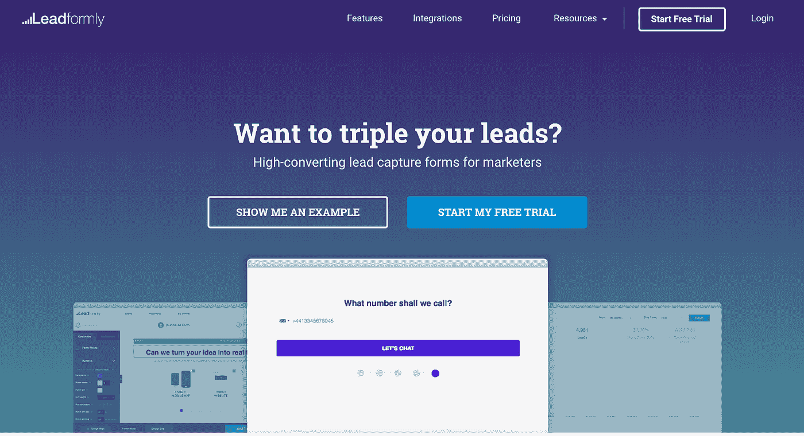
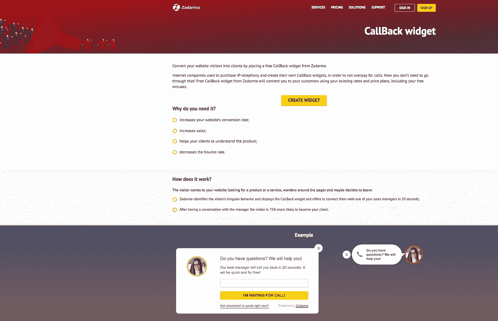
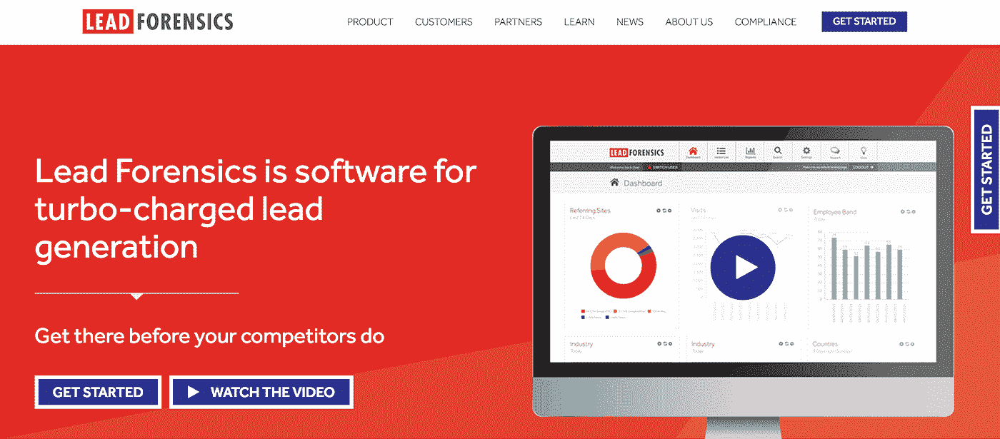
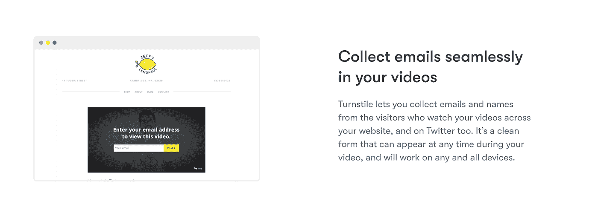

# 将访问者转化为客户:五个有用的线索生成工具

> 原文：<https://medium.com/hackernoon/turning-visitors-into-customers-five-useful-lead-generation-tools-bd7e08b8dbec>

*Image credit:* [*Unsplash*](https://unsplash.com/photos/8lX8jl0y3CI)

甚至推出你的网站，让人们访问它，并不意味着你就此结束。吸引访问者并收集他们的信息以制作个性化的产品是建立销售流程的关键。正确的潜在客户挖掘工具可能会帮助您增加收入并获得更多客户。今天我们来看看五项服务，它们将帮助你解决这个问题。

# [**领先**](https://leadformly.com)

线索捕捉形式是每个企业的线索转化漏斗中最重要的元素之一。该表格有助于区分潜在客户和非潜在客户。因此，不仅要在你的网站上安装一个表单，还要对其进行优化，这一点至关重要。

Leadformly 是一款帮助企业构建高转化率潜在客户表单的工具。它允许超越 CRM 和营销软件提供的标准功能，而无需编码。用户可以在拖放构建器中创建交互式表单，包括问题(超过 10 种样式)、多个步骤和进度条、线索分割的条件逻辑等。

该工具还与大约 600 个客户关系管理系统、登录页面生成器和营销平台相集成，这使得进一步处理已捕获的潜在客户变得更加容易。

# [**漂移**](https://www.drift.com)

在网站上有一个好的销售线索生成表是至关重要的，但是，人们通常不喜欢在这样的事情上花费时间。这就是为什么给你的访问者提供一种不同的交流方式也很重要。这里最受欢迎的功能之一是实时聊天。

有很多这样的工具，其中之一就是漂移。这是一个“对话式营销和销售”的工具，正如项目网站上所说的那样。它允许与潜在客户实时交流，既可以面对面交流，也可以设置聊天机器人，询问问题并记录收集的数据。因此，您将能够涵盖那些对您的报价感兴趣但不想填写表格的访问者。

# [**扎达尔马**](https://zadarma.com/en/services/callback/)

从表格和实时聊天的例子中可以看出，有一种替代的交流方式是好的。然而，仍然有人喜欢通过电话与真人交谈。一个简单的电话可以比电子邮件更快、比聊天更容易地与潜在客户建立个人关系。

Zadarma 服务允许在网站上安装手机通讯工具。有两种类型:回调部件和“点击呼叫”部件。

第一个可以用来捕捉即将离开你的网站的访问者，并向他们显示一个弹出的电话报价。有时，潜在客户会感到困惑，或者只是找不到网站所需的信息，所以他们决定离开。然而，如果一家公司的代表伸出手来，为他们的问题提供答案，他们很可能会改变主意。根据统计，在与经理交谈后，访客有 75%的可能成为你的客户。

第二个小部件允许潜在客户安排公司的电话。用户选择他或她希望被联系的时间，然后这个信息被发送到销售部门。通话是通过互联网进行的，用户不需要安装任何额外的软件就可以通话。因此，Zadarma 系统允许接触“热门”线索，并防止潜在客户的流失。

# [**带头取证**](https://www.leadforensics.com/)

即使人们来到你的网站，浏览了一下就离开了，没有填写表格，也没有通过聊天或电话联系你，这并不意味着把他们变成客户很重要。你只是需要更多的信息来了解如何更好地迎合他们的需求。

线索取证是帮助解决这个问题的工具。它使用访问者的 IP 地址来识别信息，如某个人工作的公司，人口统计和财务数据。

如果你知道谁在浏览你的网站，就更容易理解这些客户的真正需求，并与他们交谈。例如，你可以联系公司的决策者，他们的员工访问过你的网站，向他们推销个性化的产品。

# [**转门**](https://wistia.com/video-marketing/turnstile)

如今，视频是互联网上最流行的内容类型之一。据统计，87%的营销人员使用视频来推广他们的品牌，但它也可以变成一个可怕的线索生成渠道。

例如，Wistia 的 Turnstile 允许在您的视频中无缝收集电子邮件。该系统在视频中集成了行动号召和选择加入表单。例如，您可以将其设置为在访问视频内容之前要求用户发送电子邮件，或者继续观看视频内容。

Turnstile 可以在网站和 Twitter 上使用，这很好，因为 82%的 Twitter 用户在这个社交网络上观看视频内容。此外，该服务可以与 CRM 和电子邮件营销服务相集成，这使得与收集的线索进行互动更加容易。

# **最终想法**

互联网上的销售过程围绕着从网站到沟通工具的不断研究、测试和优化。您的表格越好，您对请求的响应越快，与您的销售代表联系的方式就越多，将他们转化为客户的机会就越大。使用专门的工具对实现这一目标至关重要。