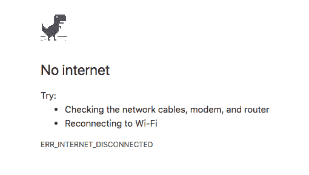
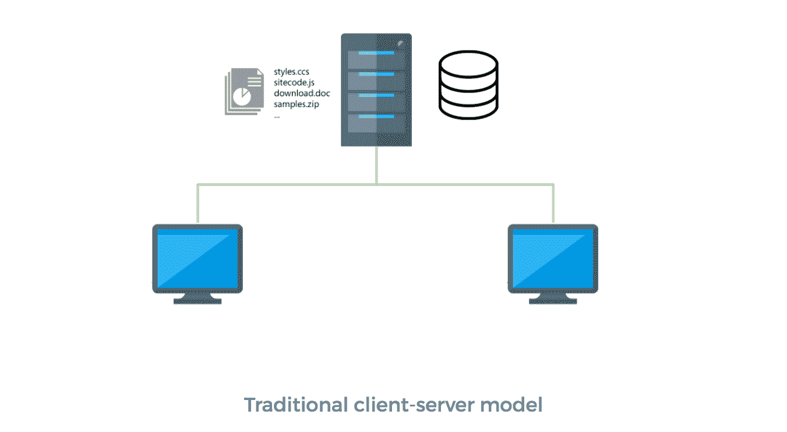
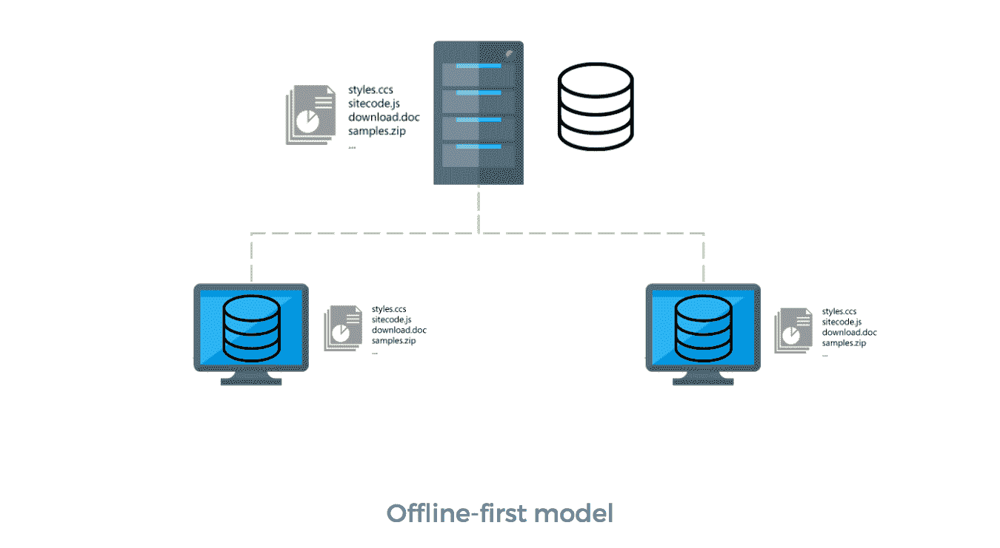
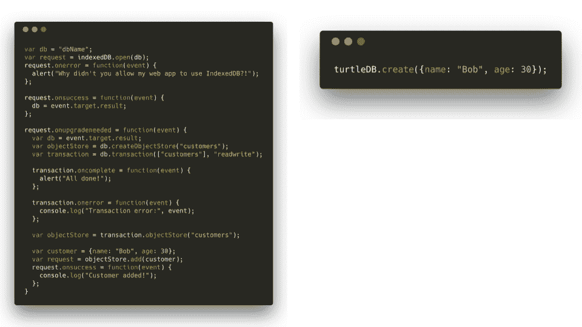
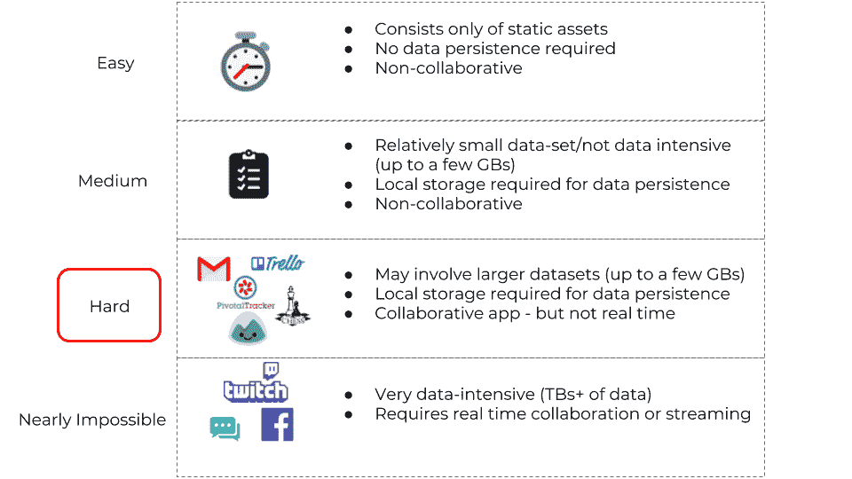
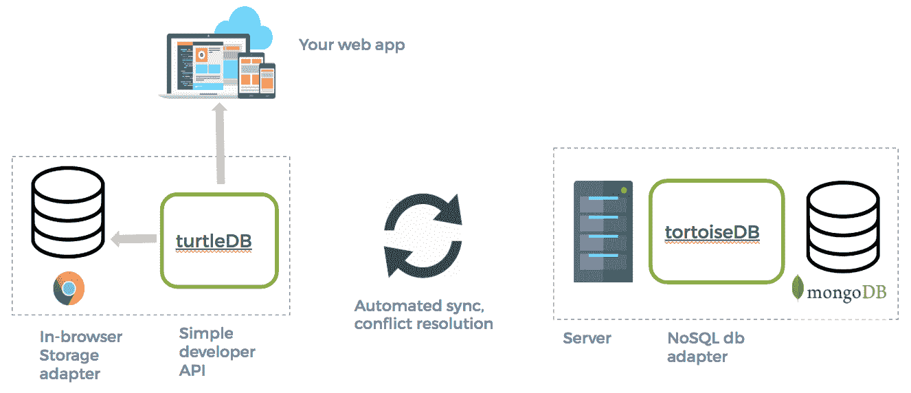
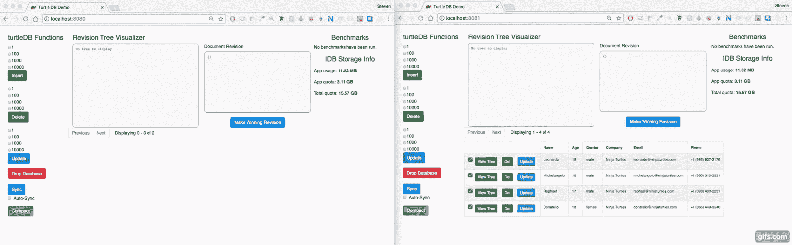
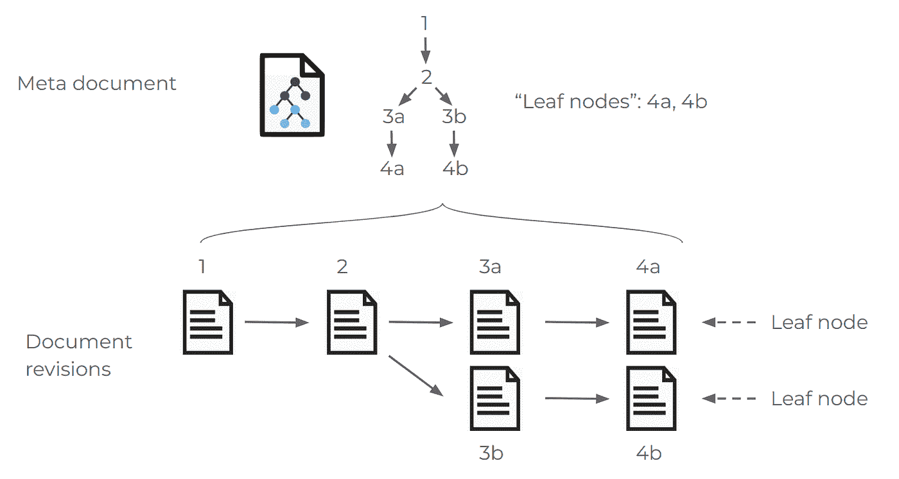
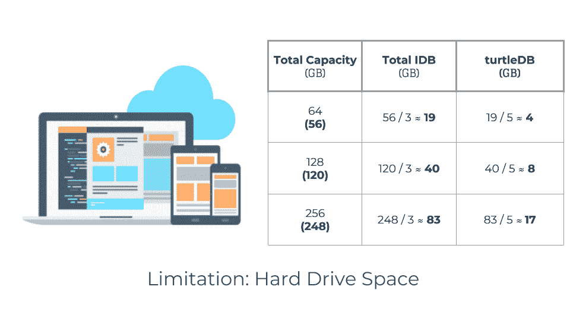
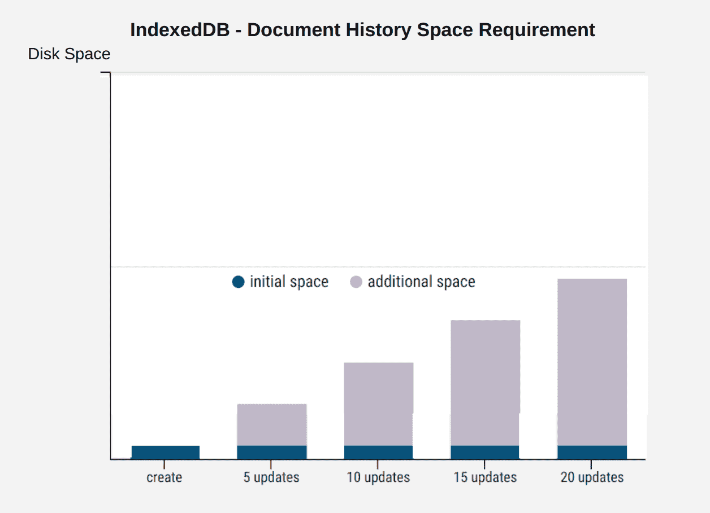

# turtleDB:用于构建离线优先的协作式 web 应用的 JavaScript 框架

> 原文：<https://medium.com/hackernoon/turtledb-a-javascript-framework-for-building-offline-first-collaborative-web-apps-7183cd787163>

构建离线优先的协作式 web 应用程序可以通过两个简单的步骤完成:

1.  `npm install turtleDB`
2.  `npm install tortoiseDB`

搞定了。

在我们进入什么是 turtleDB 和 tortoiseDB 之前…

线下先行和协同？这到底是什么意思？

在这个时代，我们这些生活在现代人口密集的城市，如旧金山，纽约，多伦多等。想当然地认为，无论我们走到哪里，互联网都唾手可得。

然而，如果你仔细想想，仍然有*和*的时候，你可能会失去连接，你对此无能为力。你住的酒店套房网络不好？登上一架 10 小时飞行的飞机？你明白了。我们甚至没有进入第三世界国家。

眼熟吗？它是每个人最喜欢的恐龙！好吧，这个游戏很有趣，但是我敢打赌，你更愿意让你的网站加载。

## **欢迎来到线下世界——首先**

当你浏览网站或使用应用程序时，必须向某处的服务器发送请求，以便检索你想要的内容。这是传统客户机-服务器模型的基本原理。

尽管这是大多数用户所习惯的，但这种模式有一些缺陷，最主要的是:一个使用客户端-服务器模式的应用程序如何在没有互联网连接的情况下运行？它不能！这是离线优先方法试图解决的问题。

离线优先的 web 应用程序不是首先查询服务器，而是请求存储在本地机器上的数据，在您的浏览器中。这也意味着来自服务器的通常会改变应用程序数据的响应会首先修改你的本地数据。然后，你的硬盘会将这些更改上传到应用程序中。

你如何判断一个 web 应用程序是否离线？简而言之:不能。一个设计良好的离线优先应用程序**和传统应用程序没有任何区别**。所有的魔法都发生在幕后。与我们都习惯的传统客户端-服务器模式不同，离线优先应用利用了内置于本地浏览器的技术，因此用户可以体验无缝的在线到离线过渡。

因为我们在这里专门讨论 web 应用程序，所以我们需要一种在浏览器中本地存储数据的方法。您有三个主要选项:

1.  本地存储—大约 5MB 的限制，只能存储字符串
2.  WebSQL —已弃用
3.  IndexedDB (IDB) —几乎是文档存储的唯一选择

如果我们听起来对 IDB 不是特别热情，那是因为没多少人热情。

> " IndexedDB API 功能强大，但是对于简单的情况来说似乎太复杂了."— MDN

没错。这段引文直接取自 MDN 网站。他们顺便承认，IDB 是一个痛苦的工作，男孩是真的。异步 JavaScript 已经让人们头疼了，再加上 IDB 是事件驱动的，仅仅插入第一条数据就需要大约 30 行冗长的代码。

## **介绍 turtleDB**

左边显示了将“Bob”插入数据库的典型本地 IDB 代码。turtleDB 只用 1 行就能做到这一点(右图)。

我们真的认为，IDB 的复杂性对线下优先的世界是一个巨大的损害。这是我们建造 turtleDB 背后的驱动因素之一。我们希望开发人员有能力创建离线优先的应用程序，而不需要学习 IDB 的所有怪癖。正因为如此，我们决定将 IDB 包装在一个基于承诺的 API 中(【turtle-db.github.io/api】)，这让我们感觉与**和**一起工作更自然，开发者只需一行代码就可以调用 CRUD 操作。

既然我们可以在浏览器中执行 CRUD 查询，谁还会使用它们呢？

## **我们的目标**

我们举了一些常见的 web 应用程序的例子，并根据将它们转换为离线优先模式的难易程度，将它们放在类别中。在“简单”类别中，我们处理的应用程序不需要任何类型的数据存储。他们离线工作所需要的只是一些基本的静态资产缓存..接下来是需要某种数据持久性，但不以任何方式协作的应用程序。我们将这些归类为“中等”难度，因为您仍然需要使用某种浏览器内存储解决方案。

“难”是事情变得真正有趣的地方。我们不仅需要缓存静态资产并利用本地数据存储，我们还需要考虑当其他用户重新上线时，这些应用程序如何与他们发送和接收数据。没有超大附件的电子邮件、国际象棋等回合制游戏以及 Trello、Pivotal Tracker 和 Basecamp 等项目管理应用都可以转换为离线优先的架构。这些是我们试图让开发者以离线优先的方式构建的更简单的应用。

在继续之前，我们只想简单提一下图表中的最后一类应用。这些几乎不可能转换成离线优先的架构。Twitch 和脸书等应用无法在保留一些核心功能的同时采用离线优先的方法。例如，流媒体需要持久可靠的互联网连接。加上非常大的数据集，我们甚至没有足够的硬盘空间来存储这些信息。我们把聊天应用也放在这一类，因为即使它们有离线的可能，首先，一个离线的聊天应用也可能是电子邮件。

## **turtleDB 架构**

因为 turtleDB 试图成为“硬”类应用的解决方案，所以我们记住了三个主要特性。首先，它需要非常用户友好。如果一个 API 很笨重，没人会用它(看看 IDB 就知道了！).其次，我们的目标是协作应用。这意味着多人可以在同一个数据集上一起工作；想想国际象棋，两个玩家共用一块棋盘。最后，协作处理数据集会带来冲突。我们稍后会深入讨论这个问题，但是当客户对数据集应该是什么“不一致”时，就会发生冲突。已经介绍了 turtleDB 的易用性，现在让我们进入第二和第三点。

## **实现一致性**

为了使应用程序具有协作性，应用程序的状态必须在用户网络中共享。如果多人看到不同的东西，他们如何处理同一个文档？那是行不通的。这意味着协作应用程序必须有一种方法来实现其用户群的一致性。

我们希望 turtleDB 不仅仅是一个用户友好的 indexed db API。为了让开发人员能够构建能够离线运行的**协作**应用，我们需要做些什么？如上所述，为了使应用程序具有协作性，它必须能够跨所有用户维护一致的数据视图。

双向同步是 turtleDB 解决这个问题的方式。用户能够将他们的数据推送给其他用户，反之亦然。我们写了一篇很长的论文，讲述我们是如何构建这个功能的，因为这是我们在 turtle db([turtle-db.github.io/about#synchronization](http://turtle-db.github.io/about#synchronization))上工作时面临的最大的工程挑战之一。无需深入细节，这里有一个 turtleDB 和 MongoDB 之间同步的快速演示:

Example: Synchronization

同步到位后，用户现在可以使用我们的框架并互相推送更改。我可以创建一个文档，你也可以创建一个文档，在我们都同步之后，我们将不仅拥有各自的原始文档，还拥有对方的文档。这太棒了！但是，如果我们都独立地更新同一个文档，会发生什么呢？我们最终看到了谁的变化？

## **冲突**

异步和协作工作引入了**冲突。**当处理同一文档的两个或更多的人对同一文档进行独立的、不同的更改时，就会产生冲突。

你有没有和朋友一起做谷歌文档时“不小心”删除了对方的作品？你可以覆盖彼此的字母、单词，甚至段落。这很好，因为实时协作应用程序可以提供实时更新，这些更改很容易撤销。

在异步、离线优先的设置中，能够覆盖其他人的工作可能是灾难性的。我的意思是。

想象一下，如果您是一名项目经理，正在为您的团队在 turtleDB 驱动的 Trello 上组装电路板，并且您正在另一名 PM 的帮助下完成这项工作。

如果你不知道 Trello 是什么，想象一下你正在和其他人合作开发一个数据库；进行插入、更新、删除。

在你的区域有一场巨大的闪电风暴，你的网络中断了 15 分钟。没问题！多亏了 turtleDB，Trello 可以无缝转换到离线模式，你可以继续工作，甚至不会注意到你失去了互联网。

但是一旦你重新上线并同步，你会发现你做的所有工作都被删除了。所有的钱都去哪了？特雷罗有问题吗？你不知道如何或为什么。几分钟后，您收到另一个项目经理发来的消息，说他删除了您创建的板，因为不再需要它们了。你被激怒了。你付出的一切都白费了，最糟糕的是，你甚至没有发言权。

换句话说，如果处理不好，异步变更会导致大量工作丢失。谢天谢地，这是一个虚构的场景，因为 turtleDB 不允许这种情况发生。

相反，turtleDB 确保如果多个客户端与一个公共远程服务器同步，冲突不仅会出现，而且很容易解决。它通过存储所有客户端曾经做过的所有更改(文档历史)并在树状数据结构中跟踪所有这些版本来实现这一点。所有冲突的版本仍然可用。

相互竞争的变化在树上产生分支。如果一个人删除了一个版本，另一个人可以继续工作。

与同步类似，冲突解决是一个详细而复杂的过程，我们会在我们的网站(【turtle-db.github.io/about#conflicts】T2)上详细描述。

简而言之，因为 turtleDB 保存所有文档历史，所以您的工作永远不会丢失。例如，如果有人删除了您正在处理的文档，您可以继续处理它，除非您也选择删除它！

如果你在想“等等..如果存储所有的文档历史记录，难道不会空间不足吗？”

## **可扩展性**

最后一个问题的答案是响亮的“是”。避免“最后写入获胜”的情况并能够解决冲突是一种奢侈，但也有代价:磁盘空间。但这可能不是问题，除非你的应用程序正在处理海量数据。

Typical storage capacities of modern mobile devices

此表显示了考虑操作系统后移动设备和笔记本电脑的常见存储容量。我们进行了一些粗略的计算，以确定使用 turtleDB(或任何 IDB 包装器)的人可以获得多少空间。尽管右侧栏中的数字可能看起来很大，但是一个写得很重的应用程序会很快消耗掉它。我们在这里引用我们是如何得出这些计算结果的:[https://turtle-db.github.io/about#idb-limits](https://turtle-db.github.io/about#idb-limits)

这是写入密集型应用程序的磁盘使用情况。请记住，我们只是展示了**一个**独特的文档可能如何扩展。

对于有多个协作者的大型数据集，磁盘空间很容易成为一个限制因素。但是，我们愿意做出这种折衷，因为:

1.  有人覆盖你的工作比失去一些存储空间更令人讨厌
2.  我们提出了一个名为**压缩**的部分解决方案

压缩是用户释放磁盘空间的可选工具。如果你有一个很长的文档历史，并且你知道这些文档不会再被使用，这些都可以通过我们的压缩功能删除。这相当于删除你的浏览器历史，或者用编程术语来说，垃圾收集。

## **最终想法**

很明显，如果你已经做到这一步，你会对离线优先的应用程序感兴趣。我们相信这个领域有着巨大的潜力，但经常被区块链和去中心化应用等趋势话题所掩盖。

我们花了很多时间编写我们构建 turtleDB 的整个过程以及我们遇到的陷阱。如果你想使用、贡献或者只是阅读我们的项目，请查看 [turtle-db.github.io](https://turtle-db.github.io/)

# **turtle db 背后的团队**

我们分散在北美各地，所以 turtleDB 完全是在遥远的地方建造的。如果有机会或者只是想聊聊天，不要犹豫，赶紧联系吧！

1.  史蒂文·沈— [领英](https://www.linkedin.com/in/steeveshen/)
2.  马克斯·阿普尔顿— [领英](https://www.linkedin.com/in/max-appleton/)
3.  安德鲁·休斯顿-弗洛伊德— [领英](https://www.linkedin.com/in/andrew-houston-floyd/)

**灵感**

最后，我们只想对激励我们踏上这一旅程的项目大声疾呼。如果你只是想在浏览器中存储数据，看看这些令人敬畏的索引数据库库:

*   [德歇](http://dexie.org/)
*   [本地饲料](https://github.com/localForage/localForage)
*   [杰克·阿奇博尔德的承诺包装纸](https://github.com/jakearchibald/idb)

然而，如果你需要更强大的东西，也能让你的应用程序具有协作能力，

*   [PouchDB](https://pouchdb.com/) (使用 CouchDB 后端)
*   Firebase(谷歌专有的存储选项)
*   当然还有我们自己的 [turtleDB](https://turtle-db.github.io/) ！