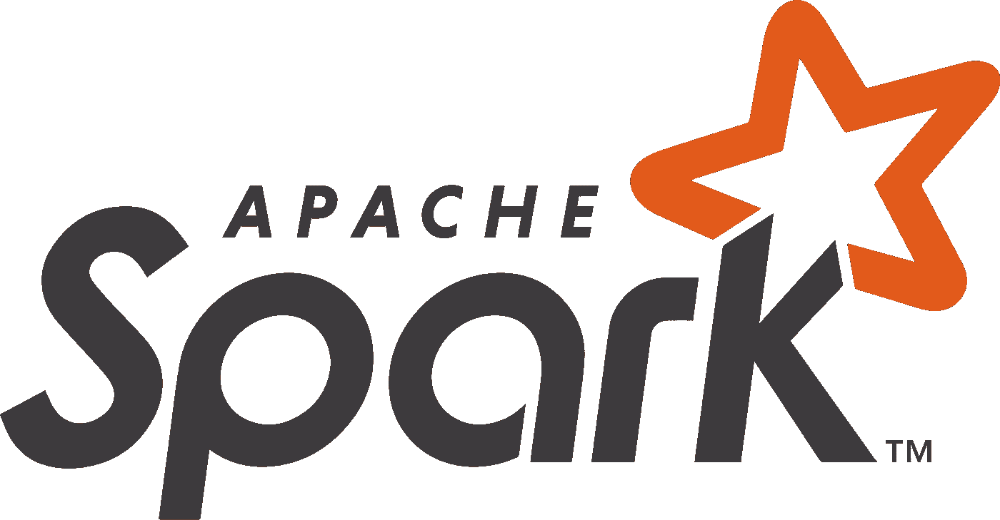
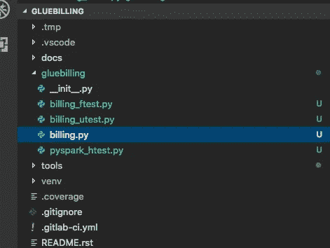
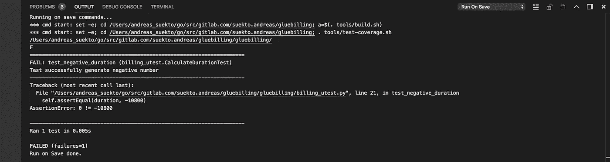
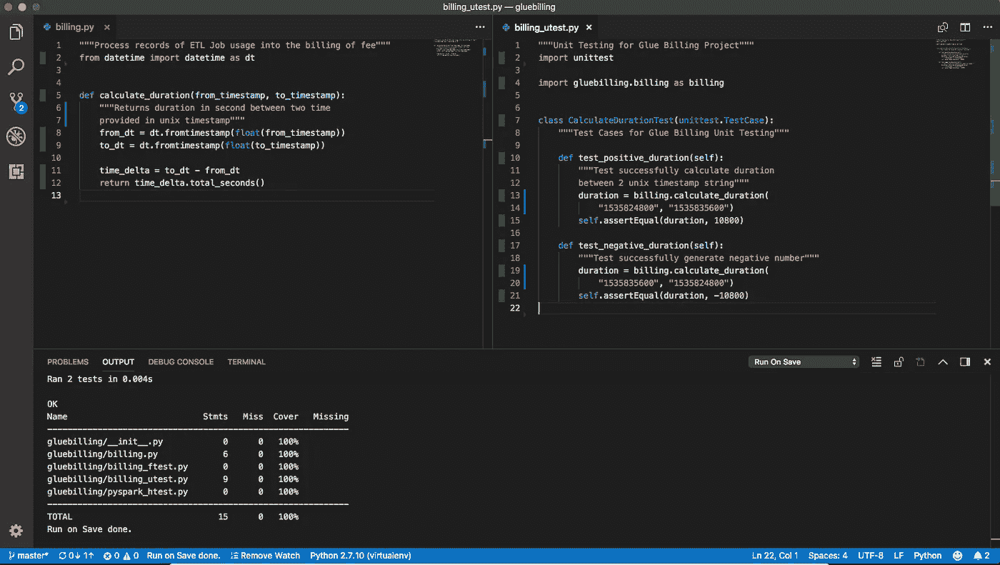
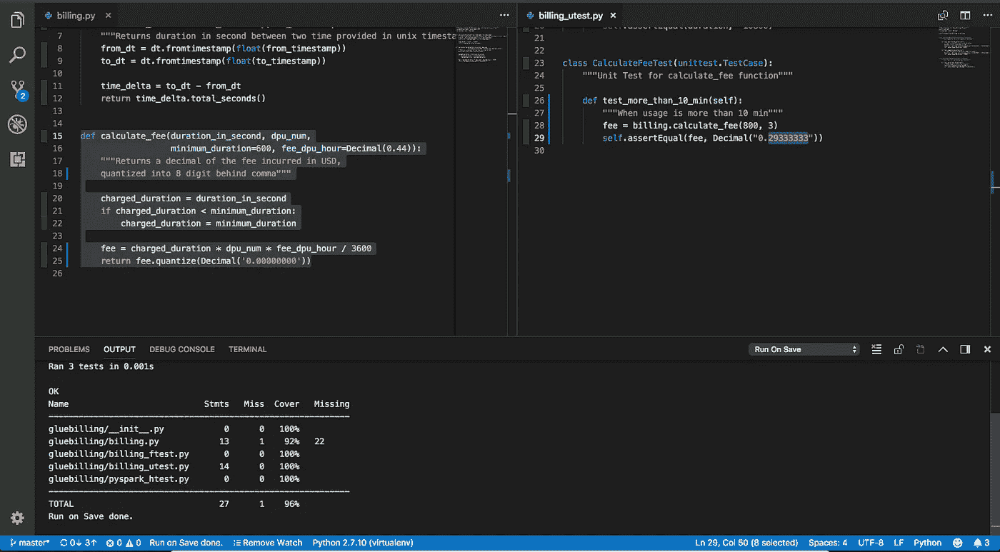

# 教程:AWS 用 PySpark 和 Unittest 粘合计费报表

> 原文：<https://medium.com/hackernoon/tutorial-aws-glue-billing-report-with-pyspark-with-unittest-fbda9042b470>



本教程展示了如何为 AWS Glue ETL 作业使用生成账单(简化和假设的问题细节)，目的是学习:

1.  PySpark 中的单元测试
2.  编写基本函数定义并转换到 UDF

知识库:[https://gitlab.com/suekto.andreas/gluebilling](https://gitlab.com/suekto.andreas/gluebilling)

# 商业问题

本教程将构建一个为 AWS Glue ETL 作业的使用生成计费报告的简化问题。(免责声明:此处的所有细节仅是假设性的，并与作者的假设相混合)

假设输入数据是正在运行的作业 id 的日志记录、RFC3339 中的开始时间、RFC3339 中的结束时间以及它使用的 DPU。

使用价格为每 DPU 小时 0.44 美元，每秒计费，每个 ETL 作业最少 10 分钟，而 crawler 的成本为每 DPU 小时 0.20 美元，每秒计费，每次运行最少 200 秒(同样，这些数字是出于学习目的而编造的。)

现在，我们将计算 AWS Glue ETL 使用的每日账单汇总。

# 先决条件

1.  安装 JDK 1.8，并将 JAVA_HOME 设置到相应的位置(我个人使用的是 Mac，按照这个[链接](https://docs.oracle.com/javase/8/docs/technotes/guides/install/mac_jdk.html)和[下载链接](http://www.oracle.com/technetwork/java/javase/downloads/jdk8-downloads-2133151.html)，JAVA_HOME 会是/Library/JAVA/JAVA virtual machines/JDK 1 . 8 . 0 _ 181 . JDK/Contents/HOME/)
2.  Python 2.7.x
3.  Python 覆盖率、unittest 和 PySpark 包(最好安装在 virtualenv 下)

实际上，对于这个项目，我正在使用 bash-script builder 来建立项目的基础，它仍然处于 beta 状态，本教程用于查看我对这个自动脚本构建器有多熟悉。通过手动遵循以下文章可以获得类似的结果:

*   [https://hacker noon . com/setting-up-python-dev-in-vs-code-e 84 f 01 C1 f 64 b](https://hackernoon.com/setting-up-python-dev-in-vs-code-e84f01c1f64b)
*   [https://medium . com/@ suekto . Andreas/automate-documentation-in-python-925 c 38 aee 69 f](/@suekto.andreas/automate-documentation-in-python-925c38eae69f)

# 活动

为了做到这一点，我们将使用下面的伪代码:

1.  载入 PySpark 数据帧
2.  计算从 unix 时间戳到 UNIX 时间戳的持续时间(秒)
3.  计算每条记录的费用

## 001 —计算持续时间(+单元测试)

首先让我们构建计算持续时间函数。下面是我们将要使用的模块目录结构:



module gluebilling — billing.py

所有文件*。py 从空文件 __init__ 开始。py 表示我们将 gluebilling 定义为一个 python 模块。

先从编写 billing.py 中的函数骨架开始。

```
"""Process records of ETL Job usage into the billing of fee"""
from datetime import datetime as dtdef calculate_duration(from_timestamp, to_timestamp):
    """Returns duration in second between two time
    return 0
```

基于这个框架，我们已经对如何调用它以及它将返回什么样的值有了更清晰的认识，现在让我们为这个函数创建单元测试，以更详细地定义它的行为。这是写在 billing_utest.py 中的

```
"""Unit Testing for Glue Billing Project"""
import unittestimport gluebilling.billing as billingclass CalculateDurationTest(unittest.TestCase):
    """Test Cases for Glue Billing Unit Testing""" def test_positive_duration(self):
        """Test successfully calculate duration
        between 2 unix timestamp string"""
        duration = billing.calculate_duration(
            "1535824800", "1535835600")
        self.assertEqual(duration, 10800) def test_negative_duration(self):
        """Test successfully generate negative number"""
        duration = billing.calculate_duration(
            "1535835600", "1535824800")
        self.assertEqual(duration, -10800)
```

在编写一个单元测试时，我们导入 unittest 模块，以及我们想要测试的模块(gluebilling.billing)模块。

接下来，我们定义类来托管扩展基类(unittest)的测试用例(CalculateDurationTest)。测试案例)

随后，在 CalculateDurationTest 中，我们在带有“test_”前缀的对象方法格式中定义了测试用例列表。我们输入输入参数，执行我们想要测试的函数，最后使用来自 unittest.TestCase 的 assertEqual 函数检查结果。

如果我们现在运行单元测试，它应该会失败

```
$ coverage run --source=gluebilling -m unittest discover -p "*utest*.py" -f -s gluebilling/
```



coverage with unittest result

现在有了红色状态之后，让我们开始实现这个函数

```
"""Process records of ETL Job usage into the billing of fee"""
from datetime import datetime as dtdef calculate_duration(from_timestamp, to_timestamp):
    """Returns duration in second between two time
    provided in unix timestamp"""
    from_dt = dt.fromtimestamp(float(from_timestamp))
    to_dt = dt.fromtimestamp(float(to_timestamp)) time_delta = to_dt - from_dt
    return time_delta.total_seconds()
```

现在我们将拥有所有绿色状态的测试用例



calculate_duration implementation completed !

注意，上面的截图是一个开发环境设置，基于[https://medium . com/hacker noon/setting-up-python-dev-in-vs-code-e 84 f 01 C1 f 64 b](/hackernoon/setting-up-python-dev-in-vs-code-e84f01c1f64b)

## 002 —计算费用(+单元测试)

遵循上面的相同技术，我们添加如下计算费用功能:

in billing.py

```
"""Process records of ETL Job usage into the billing of fee"""
from datetime import datetime as dt
from decimal import Decimal...def calculate_fee(duration_in_second, dpu_num,
                  minimum_duration, fee_dpu_hour):
    """Returns a decimal of the fee incurred in USD,
    quantized into 8 digit behind comma""" charged_duration = duration_in_second
    if charged_duration < minimum_duration:
        charged_duration = minimum_duration fee = charged_duration * dpu_num * Decimal(fee_dpu_hour) / 3600
    return fee.quantize(Decimal('0.00000000'))
```

在 billing_utest.py 中，我们将添加另一个类来托管 calculate_fee 的测试用例。

```
"""Unit Testing for Glue Billing Project"""
import unittest
from decimal import Decimalimport gluebilling.billing as billing...class CalculateFeeTest(unittest.TestCase):
    """Unit Test for calculate_fee function"""def test_more_than_10_min(self):
        """When usage is more than 10 min"""
        fee = billing.calculate_fee(800, 3, 600, "0.44")
        self.assertEqual(fee, Decimal("0.29333333"))
```

> 注意，dpu_hour 值被设置为**字符串“0.44”**而不是 float，因为如果我们进一步将其转换为十进制类型，这是更准确的计算结果。

我之所以将这两个函数的测试用例分成不同的类，是因为 [pylint C0103](http://pylint-messages.wikidot.com/messages:c0103) snake 用例要求函数的长度不超过 30 个字符，所以为了保持可读性，我们将每个函数分成不同的类进行测试。



The coverage test result after implementing calculate_fee, notice that the coverage can be done better, it is left for the reader to exercise (see the red colour bar)

## 003 — PySpark 计费计算(+功能测试)

本文使用了 David Illes 的[教程中类似的基本概念，不同之处在于我们将设置完全独立的细节(这将反映在我们如何初始化 Spark 会话，以及我们如何准备测试数据)](https://blog.cambridgespark.com/unit-testing-with-pyspark-fb31671b1ad8)

这是我们将要使用的版本，我们将其存储为 pyspark_htest.py

```
"""PySparkTest is base class to do functional testing on PySpark"""
import unittest
import logging
import os
from pyspark.sql import SparkSession
from pandas.testing import assert_frame_equal class PySparkTest(unittest.TestCase):
    """BaseClass which setup local PySpark""" @classmethod
    def suppress_py4j_logging(cls):
        """Supress the logging level into WARN and above"""
        logger = logging.getLogger('py4j')
        logger.setLevel(logging.WARN) @classmethod
    def create_testing_pyspark_session(cls):
        """Returns SparkSession connecting to local context
        the extrajava session is to generate 
        the metastore_db and derby.log into .tmp/ directory"""
        tmp_dir = os.path.abspath(".tmp/")
        return (SparkSession.builder
                .master('local[1]')
                .appName('local-testing-pyspark-context')
                .config("spark.driver.extraJavaOptions",
                        "-Dderby.system.home="+tmp_dir)
                .config("spark.sql.warehouse.dir", tmp_dir)
                .getOrCreate()) @classmethod
    def setUpClass(cls):
        """Setup the Spark"""
        cls.suppress_py4j_logging()
        cls.spark = cls.create_testing_pyspark_session() @classmethod
    def tearDownClass(cls):
        """Clean up the Class"""
        cls.spark.stop() @classmethod
    def assert_dataframe_equal(cls, actual, expected, keycolumns):
        """Helper function to compare small dataframe"""
        exp_pd = expected.toPandas().sort_values(
            by=keycolumns
        ).reset_index(drop=True)

        act_pd = actual.toPandas().sort_values(
            by=keycolumns
        ).reset_index(drop=True)
        return assert_frame_equal(act_pd, exp_pd)
```

注意，这个基类提供了许多有用的类方法，目的是:

*   仅禁止将任何日志记录到 WARN(PySpark 使用 py4j 进行日志记录)
*   用 1 个内核在 localhost 中构建 Spark 会话，并设置要整理的临时 metastore_db 存储在。tmp/ directory，以及 derby.log(这样我们的工作区就整洁干净了)—create _ testing _ py spark _ session
*   setUpClass 和 tearDownClass 被自动调用一次。
*   assert_dataframe_equal —接收 PySpark 数据帧，然后将它们全部转换成 Pandas，按键排序(因为 PySpark 结果不保持顺序)，然后我们使用 Pandas 测试来比较这两个数据帧。

让我们创建函数的框架(billing.py)以及输入记录和目标输出(计费记录)的预期模式定义。

```
def get_usage_record_schema():
    """Retruns StructType containing the Input Usage
    Data Expected Schema"""
    return StructType([
        StructField("job_id", StringType(), False),
        StructField("type", StringType(), False),
        StructField("dpu", IntegerType(), False),
        StructField("from_unix_timestamp", StringType(), False),
        StructField("to_unix_timestamp", StringType(), False)
    ])def get_pricing_schema():
    """Retruns StructType containing the Input
     Pricing Data Expected Schema"""
    return StructType([
        StructField("type", StringType(), False),
        StructField("dpu_hour", StringType(), False),
        StructField("minimum_duration", IntegerType(), False)
    ])def get_billing_schema():
    """Retruns StructType containing the Billing Schema"""
    return StructType([
        StructField("job_id", StringType(), False),
        StructField("type", StringType(), False),
        StructField("dpu", IntegerType(), False),
        StructField("from_unix_timestamp", StringType(), False),
        StructField("to_unix_timestamp", StringType(), False),
        StructField("dpu_hour", StringType(), False),
        StructField("minimum_duration", IntegerType(), False),
        StructField("duration", IntegerType(), False),
        StructField("fee", DecimalType(20, 8), False),
    ])def generate_billing(usage_df, pricing_df):
    """Returns DataFrame of Fee from a DataFrame of Usage Records"""
    return None
```

接下来，我们进入 billing_ftest.py，为我们的功能测试做准备。

```
"""Functional Testing for Glue Billing Project"""
from decimal import Decimal
from pyspark.sql import Row, SQLContextimport gluebilling.billing as billing
import gluebilling.pyspark_htest as pysparktestclass GenerateBillingTest(pysparktest.PySparkTest):
    """Test Cases for Generate Billing""" def generate_usage_data_001(self):
        """Generate usage data for testing it is a record of
        AWS Glue ETL usage"""
        rdd = self.spark.sparkContext.parallelize([
            Row("JOB001", "etl", 3, "1535824800", "1535835600"),
            Row("JOB002", "crawler", 3, "1535824800", "1535824850"),
            Row("JOB003", "crawler", 3, "1535824800", "1535835600")
        ])
        schema = billing.get_usage_record_schema() sqlctx = SQLContext(self.spark.sparkContext)
        return sqlctx.createDataFrame(rdd, schema) def generate_pricing_data_001(self):
        """Generate pricing data for testing it is a record of
        AWS Glue ETL usage"""
        rdd = self.spark.sparkContext.parallelize([
            Row("etl", "0.44", 600),
            Row("crawler", "0.20", 200)
        ])
        schema = billing.get_pricing_schema() sqlctx = SQLContext(self.spark.sparkContext)
        return sqlctx.createDataFrame(rdd, schema) def generate_expected_billing_001(self):
        """Generate expected billing"""
        rdd = self.spark.sparkContext.parallelize([
            Row("JOB001", "etl", 3, "1535824800", "1535835600",    
                "0.44", 600, 10800, Decimal("3.96")),
            Row("JOB002", "crawler", 3, "1535824800", "1535824850", 
                "0.20", 200, 50, Decimal("0.03333333")),
            Row("JOB003", "crawler", 3, "1535824800", "1535835600", 
                "0.20", 200, 10800, Decimal("1.80"))
        ])
        schema = billing.get_billing_schema() sqlctx = SQLContext(self.spark.sparkContext)
        return sqlctx.createDataFrame(rdd, schema) def test_with_set_001(self):
        """Using all 001 test data set"""
        usage_df = self.generate_usage_data_001()
        pricing_df = self.generate_pricing_data_001()
        expected = self.generate_expected_billing_001() actual = billing.generate_billing(usage_df, pricing_df) self.assert_dataframe_equal(actual, expected, ["job_id"])
```

我们在两个函数中准备输入数据。生成 _ 使用 _ 数据 _001
2。generate_pricing_data_001
这里使用的技术是通过使用 SparkContext 的 Row 和 paralellize 方法创建 rdd，然后与主脚本中定义的模式相结合。

我们还在函数 generate_expected_billing_001 中的 billing_ftest.py 中准备了预期的输出数据，使用了与准备输入数据类似的技术。

billing_ftest.py 的最后一个组件是 test_with_set_001，在这里通过组合输入和预期数据帧的生成函数来执行测试，然后我们执行主脚本函数 generate_billing，最后我们通过利用我们在 pyspark_htest.py 中定义的 helper assert 方法来执行 assert。

最后让我们在 billing.py 中完成功能实现。

```
def generate_billing(usage_df, pricing_df):
    """Returns DataFrame of Fee from a DataFrame of Usage Records""" duration_udf = udf(calculate_duration, IntegerType()) join_data_df = usage_df.join(
        pricing_df,
        usage_df.type == pricing_df.type
    ).select(
        usage_df.job_id, usage_df.type,
        usage_df.dpu, usage_df.from_unix_timestamp,
        usage_df.to_unix_timestamp,
        pricing_df.dpu_hour, pricing_df.minimum_duration,
        duration_udf(
            usage_df.from_unix_timestamp,
            usage_df.to_unix_timestamp).alias("duration")
    ) fee_udf = udf(calculate_fee, DecimalType(20, 8)) billing_df = join_data_df.select(
        "job_id", "type", "dpu", "from_unix_timestamp",
        "to_unix_timestamp", "dpu_hour", "minimum_duration",    
        "duration",
        fee_udf(
            join_data_df.duration, join_data_df.dpu,
            join_data_df.minimum_duration, join_data_df.dpu_hour
        ).alias("fee")
    ) return billing_df
```

我们将 calculate_fee 和 calculate_duration 函数封装到 udf 中，因为这是可以传递给 pyspark 的类型。第一个参数是要包装的函数，而第二个参数是预期的返回类型。

然后，我们在 PySpark SQL 数据帧的 SELECT 部分使用它来生成两个新列 duration 和 fee。

# 结论

就这样，现在我们已经实现了功能测试，我用 calculate_fee 和 calculate_duration 来区分它，因为这个测试的执行速度，它需要几秒钟来启动 pyspark，因此它值得进行不同的分组。

这为我们提供了过滤掉我们想要在保存时运行哪种测试的选项(如果我们正在自动化开发体验的话)