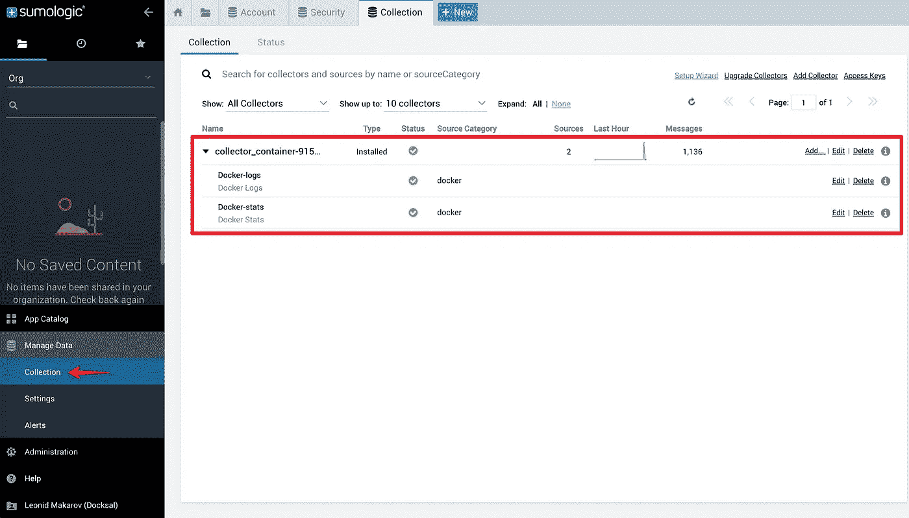

# 教程:用 Sumo 逻辑收集和分析 Docker 容器日志(免费)

> 原文：<https://medium.com/hackernoon/tutorial-collecting-and-analyzing-docker-container-logs-with-sumo-logic-for-free-19dae730a8d5>

当谈到 Docker 的强大日志分析选项时，有许多商业选项，但它们可能相当昂贵。我将分享一个提供免费层而不牺牲功能的版本。


Docker 内置了一个名为`[json-file](https://docs.docker.com/config/containers/logging/json-file/)`的日志驱动。容器日志被格式化为 JSON，并被写入每个容器的文本文件中。您可以使用`[docker logs](https://docs.docker.com/engine/reference/commandline/logs/)`命令以纯文本的形式查看日志。唯一可用的过滤选项是`since`和`until`。您可以将输出通过管道传输到`grep`来进行关键字搜索，与纯文本文件日志一样。

当您想要查看单个容器的日志并即时调试问题时，这已经足够好了。对于任何更复杂的事情(例如解析、过滤和排序)，您将需要一个真正的日志收集和分析工具。

有多种选择。有些是有偿的。有些是免费开源的，但是 DIY。不过，有一款软件结合了商业 SaaS 平台的强大和便利，以及面向小型项目和业余爱好者的免费入门级计划— [Sumo Logic](https://www.sumologic.com/) 。

Sumo Logic 提供 0.5 GB/天(15GB/月)日志数据接收的免费计划。如果你对容器日志的内容和频率有所了解，你将能够扩展数据限额并免费获得专业 SaaS 日志收集和分析平台**的能力**。

让我们开始吧！

# 设置

使用 [Sumo Logic](https://www.sumologic.com/) 注册免费试用。你必须使用你的“工作”电子邮件地址。Gmail 之类的消费者邮箱就不行了。

在**管理>安全>访问密钥**下，点击右上角的 **+** 图标添加新密钥:


Sumo Logic Access Keys screen

勾选**访问密钥标签**并点击生成密钥。复制并把你的钥匙存放在安全的地方。您将在启动 Sumo Logic Docker 收集器容器时使用这些。


Sumo Logic Access ID and Access Key screen

在 Docker 主机上启动收集器容器

```
$ docker run -d -v /var/run/docker.sock:/var/run/docker.sock --name=sumo-logic-collector --restart=always sumologic/collector:latest <AccessID> <AccessKey>
```

用之前记录的值替换`<AccessID>`和`<AccessKey>`。

给收集器一分钟时间进行初始化，然后转到管理**数据>收集**以确认它显示在您的帐户和日志数据中。



收集器容器将传输两个数据源:

*   **Docker-stats**—CPU/内存/网络/等。容器统计
*   **码头日志** —实际集装箱日志

如果收集器没有出现在 Sumo 逻辑中，则检查收集器容器日志以寻找线索:

```
$ docker logs sumologic-collectorRunning SumoLogic Collector...wrapper  | --> Wrapper Started as Console
wrapper  | Java Service Wrapper Standard Edition 64-bit 3.5.13
wrapper  |   Copyright (C) 1999-2011 Tanuki Software, Ltd. All Rights Reserved.
wrapper  |     [http://wrapper.tanukisoftware.com](http://wrapper.tanukisoftware.com)
wrapper  |   Licensed to Sumo Logic Inc. for Collector
wrapper  |
wrapper  | Launching a JVM...
jvm 1    | WrapperManager: Initializing...
jvm 1    |    . .       . .       . .    .       . .
jvm 1    | .+'|=|`+. .+'| |`+. .+'|=|`+.=|`+. .+'|=|`+.
jvm 1    | |  | `+.| |  | |  | |  | `+ | `+ | |  | |  |
jvm 1    | |  | .    |  | |  | |  |  | |  | | |  | |  |
jvm 1    | `+.|=|`+. |  | |  | |  |  | |  | | |  | |  |
jvm 1    | .    |  | |  | |  | |  |  | |  | | |  | |  |
jvm 1    | |`+. |  | |  | |  | |  |  | |  | | |  | |  |
jvm 1    | `+.|=|.+' `+.|=|.+' `+.|  |.|  |+' `+.|=|.+'
jvm 1    | Sumo Logic Collector Version 19.209-26
jvm 1    | Sumo Logic Build Hash fa2afe3
jvm 1    | current folder:/opt/SumoCollector
jvm 1    |   * See /opt/SumoCollector/./logs for more details.
jvm 1    |   * Connecting to [https://collectors.sumologic.com.](https://collectors.sumologic.com.)
**jvm 1    |  * ERROR: Registration failed: Your Sumo Logic credentials could not be verified. Make sure the token or accessKey/ID is valid and your user account has permissions to manage Collectors. (error key: collectors.unauthorized)** jvm 1    | Collector exiting...
wrapper  | <-- Wrapper Stopped
```

默认情况下，日志时间戳使用 UTC 时区。必要时，您可以在设置(**编辑**链接)中进行调整。


Switching collector timezone

参见官方[sumologic-collector-docker](https://github.com/SumoLogic/sumologic-collector-docker)repo，了解更多配置选项和文档。

# Sumo Logic 中的 Docker stats 仪表板

让我们从一些现成的漂亮的仪表板和图表开始。

Sumo Logic 在**应用程序目录**中有一个“Docker 应用程序”。继续将它添加到您的库中。


将日志的**来源类别**设置为 **docker**


Set the **Source Category** for logs to **docker**

一旦安装了应用程序并收集了一些数据，您将看到一些很好的容器统计图表。


Docker Overview dashboard


Docker CPU Performance dashboard

# 搜索和分析容器日志

现在让我们看看如何在 Sumo 逻辑中获得实际的容器日志。

使用右上角的“ **+新建**”按钮创建一个新的**日志搜索**(您也可以使用 **alt+s** 键盘快捷键来完成此操作)


Create a new Log Search

要仅查看容器日志，请使用`_source=Docker-logs`过滤器。您还可以按收集器名称、源主机等缩小搜索范围。Sumo 逻辑将自动建议过滤器选项和可用值。


Search container logs

要查看特定容器的日志—添加`_sourcename`过滤器，例如

```
_source=Docker-logs
AND _sourcename = "plex-server"
```

要搜索特定的日志消息或关键字，要么手动将其添加到搜索查询中作为`AND <keyword>`过滤器，要么突出显示它并使用下拉列表中的选项。


Filter logs by keyword

轻松点。现在我们只查看我们感兴趣的特定消息。


Filter logs by keyword: results

一旦我们深入到我们感兴趣的消息实例，我们可能想看看当时日志中还捕获了什么。相扑逻辑也让这变得非常容易。点击消息下的任何过滤器，选择围绕消息的**和时间范围**:


Finding surrounding messages for a particular log event


Surrounding log messages within a specific timeframe

相扑逻辑还可以做更多的事情。查看[文档](https://help.sumologic.com/)和视频教程，可在 [YouTube](https://www.youtube.com/user/sumologic/playlists) 和应用程序中找到。


Learning materials in Sumo Logic

免责声明:我与 Sumo Logic 没有任何关系，也没有从他们或任何撰写这篇文章的人那里获得任何形式的报酬。我在寻找一个适合自己需求的解决方案，发现相扑非常适合它。

**我希望你喜欢阅读，并发现本教程有用。
如果是这样全部鼓掌 50 次！这有助于其他人发现媒体上的内容。**