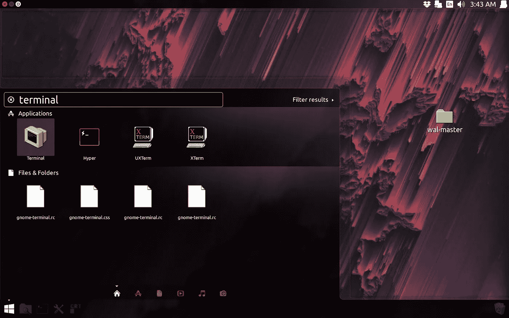
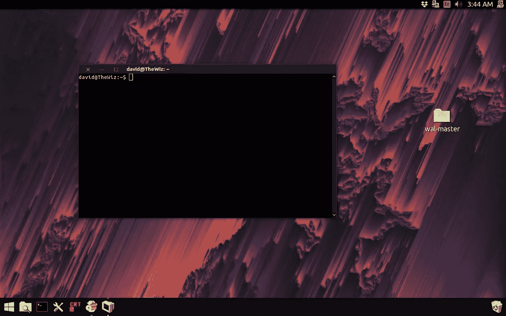
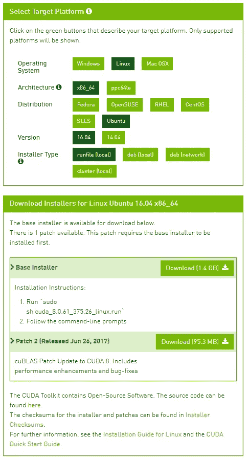

# 艺术家如何使用神经网络教程-第二部分

> 原文：<https://medium.com/hackernoon/tutorial-for-artists-on-how-to-use-a-neural-network-part-2-4e94e1d2cbe9>


*原载于 2018 年 4 月 30 日*[*www . jackalope . tech*](https://www.jackalope.tech/how-artists-can-set-up-their-own-neural-network-part-2-neural-network-install/)*。*

好了，我们已经在上周[安装了 Ubuntu 分区](https://www.jackalope.tech/how-artists-can-set-up-their-own-neural-network-part-1-installation/)，现在我们要安装神经网络深度风格。这可能是最困难的地方。我将为你提供解决这些问题的工具。

# 什么是 CLI？

当你使用互联网浏览器或 Photoshop 等程序时，你使用的是图形用户界面。 **GUI** 。在 GUI 之前有 CLI。命令行界面。GUI 允许你使用按钮来控制程序。命令行界面允许您使用书面命令来控制它。当你让 Siri 带你去朋友家时，你就在使用现代版的 CLI。不过 Siri 要复杂得多。它可以听你的声音并把它翻译成文字。它可以要求澄清，或者智能地对你实际想要的做出假设。CLI 要简单得多。在你如何给它下命令时，它是非常字面上的和严格的。在某种程度上，使用 CLI 很像使用编程语言。不要害怕！这也很像让 Siri 为你做一些事情。其实也没那么难。

CLI 的一大优势是您可以创建“批处理脚本”。批处理脚本是使用编程模式自动完成一系列乏味工作的地方。我将在第 3 部分中更多地讨论批处理脚本，但是现在您需要知道的是，您在 Linux 中编写脚本的语言的名称叫做 Bash。

有些人花了一生的时间来掌握 Bash。不过，使用神经网络 deepstyle 并不需要了解太多。您需要做的是使用 Bash 来安装神经网络。我会为你解释这个过程中的每一步。

如果你觉得可以，我强烈推荐 Codecademy 上的这个互动教程。其实挺好玩的！您可以使用 Bash 来编辑或写诗。但是这不是必须的。



要访问 CLI 程序，您需要打开终端。你可以通过点击开始/程序按钮，然后输入“终端”来完成。它将搜索默认的终端应用程序。然后只需按回车键就可以了！



有时在这些教程中，你会看到我使用一个奇怪的终端，看起来像一个旧的电脑屏幕。它被称为 CRT: [酷复古终端](https://github.com/Swordfish90/cool-retro-term)我决定使用它，因为我想在教程中寻找一些酷的东西，但如上图所示的默认终端是你真正需要的，它们的功能基本相同。

# 大局

这是我们将要做的事情的大概情况。

1.  安装深层神经网络的依赖项。
2.  安装深度型神经网络
3.  安装 CUDA 启用 GPU 处理。

# 这意味着什么:

依赖项是程序员用来帮助构建他们自己的代码的代码片段。好的代码就像乐高积木。你可以把它们扣进扣出。
你可以把依赖想象成标准化的汽车零件。如果我想制造一辆汽车，我不会自己制造轮胎或螺栓，甚至从零开始制造发动机。编程就是站在巨人的背上。

我们将下载的主要依赖项是 Torch7 和 loadcaffe。他们也有自己的依赖。火炬 7 需要 LuaJIT 和 LuaRocks。Loadcaffe 将需要 Google 协议缓冲区。你真的不需要知道这些东西是什么，就像你不需要知道火花塞如何安装它一样。从广义上讲，Torch7 是一个框架，人们可以在这个框架上建立自己的神经网络。Loadcaffe 是 Torch7 中 caffe 框架的实现。Caffe 是 UC Berkley 做的一个神经网络框架，用来做图像分类和分割。

最后，CUDA 是 Nvidia 的一个框架，允许程序员使用 GPU 来做 CPU 类型的工作。当 GPU 必须同时处理大量数据时，它们非常适合进行计算。没有 CUDA，你的计算机将只能使用 CPU 来处理神经网络。这将限制你所能制作的图像的大小，并且需要更长的时间来处理。

这里重要的一点是，有很多人在一起工作，使这一切成为可能！

# 如何获得帮助

没有人能单独做这件事。编程中最重要的技能之一是能够寻求帮助。事情正在变得越来越技术性，所以你需要工具来解决问题。

# 您可以获得帮助的方式:

1.  你可以在我的 facebook 页面上给我发信息或者给我发电子邮件。
2.  你可以[发布一个问题到深度风格的 Github 页面](https://github.com/jcjohnson/neural-style/issues/new)。Github 是一个人们分享和协作代码的网站。[贾斯廷·约翰逊](https://cs.stanford.edu/people/jcjohns/)构建了我们将使用的深度风格的实现。
3.  最后，如果你需要帮助，你可以检查堆栈交换。Stack Exchange 是一个供人们提问的网站。有两个栈交换你会特别想检查一下: [AskUbuntu](https://askubuntu.com/) 如果问题与 Ubuntu 有关，或者 [StackOverflow](https://stackoverflow.com/) 是针对一般编程问题的。

**重要信息:**
我不想只告诉你在哪里可以得到帮助。我想帮助你知道如何最好地要求它。编程是一种技术，但也是一种文化建构。这些不是你在互联网上向其发送问题的机器人。他们是一群人，这意味着你要尊重他们。编程社区有他们自己的文化规范和期望。如果你做好准备，你会得到更多的帮助。

你不必太担心给我发信息，我会让人们这样做，这样我就可以看看我可以用什么方法来改进这些教程。我要说的是，我仍处于开发之旅的早期，我当然不是机器学习开发人员，但我会尽我所能提供帮助。🙂

当你在 StackExchange 上发布问题时，重要的是你的问题要简明扼要。需要是一个具体的问题。一个好问题是“我需要多大的六角扳手来更换我的自行车轮子？”。一个糟糕的问题应该是“救命！？？？我该怎么办？这是不是坏了？”[这里有一个很好的指南](https://stackoverflow.com/help/how-to-ask)，它会更详细。

您可以在 Github 页面上发布更多自由形式的问题，但是您也想尝试提供尽可能多的信息。准备好提供一个详细的对话，关于你已经尝试了什么，你是如何尝试的等等。发布你的终端结果截图真的很有帮助。

我还认为，一般来说，在你请求帮助的一开始就让人们知道你的背景是一个好主意，比如你是一名艺术家等等。这很重要，因为这会让人们知道你对他们可能需要用到的术语的熟悉程度，但这也意味着你是一个想要学习的人。程序员热爱编程。这让他们兴奋！他们想与他人分享这份爱。然而编程并不容易。程序员知道这一点，所以他们喜欢有人愿意尝试和学习新事物。不要羞愧！我们都是从同一个地方开始的，我们之所以能有今天，都是因为那些走在我们前面的人。

# 安装时间

# 安装火炬 7

打开终端，准确键入以下内容:

```
cd ~/
```

CD 代表“更改目录”。~/代表“根文件夹”。那是你的计算机的记忆系统的最高等级的文件夹。

下一种类型:

```
curl -s https://raw.githubusercontent.com/torch/ezinstall/master/install-deps | bash
```

然后，CLI 将尝试使用“curl”命令来获取安装文件。Curl 是一个从 url 获取文件的程序。是“查看网址”的简称。卷曲。:/你的电脑可能默认不会有 curl。CLI 将提示您是否要安装它。说是，然后让它做它的事情。

如果您必须安装 curl，请尝试再次运行该命令，然后实际运行 curl 进程等。

完成后，键入以下内容:

```
git clone https://github.com/torch/distro.git ~/torch --recursive
```

您可能还需要安装 git。就像之前的 curl 一样，安装 git，然后当它完成后，从上面重新运行命令。Git 是程序员在项目上合作的一个好方法。使用这种深度风格的神经网络，你并不需要真正了解它，但如果你很好奇，我强烈推荐 Codecademy 上的这个简短的互动课程。类似于前面提到的 [CLI 教程](https://www.codecademy.com/learn/learn-the-command-line)，它真的很酷，实际上是教你 git 的概念，使用自然语言的东西，比如诗歌和散文编辑，而不是代码。

这将从互联网上下载最新的火炬发行版。完成后，键入以下内容:

```
cd ~/torch; ./install.sh
```

这会将您的目录更改为 torch 目录，然后打开一个有人制作的 Bash 脚本文件来帮助安装这些文件，现在它们已经在您的计算机上了。

希望目前没有问题。

# 安装 loadcaffe

好的，首先是安装 loadcaffe 依赖项

```
sudo apt-get install libprotobuf-dev protobuf-compiler
```

现在你只需要安装 loadcaffe

```
luarocks install loadcaffe
```

转眼间。现在是 DeepStyle 的时间了。

# 安装 DeepStyle

好了，现在是时候做真正的交易了！

首先:

```
cd ~/
```

第二:

```
git clone [https://github.com/jcjohnson/neural-style.git](https://github.com/jcjohnson/neural-style.git)
```

第三:

```
cd neural-style
```

第四:

```
sh models/download_models.sh
```

这将下载学习模型。它使用 Bash 脚本来完成这项工作。

现在测试！

```
th neural_style.lua -gpu -1 -print_iter 1
```

如果它工作正常，您将会看到如下输出:

```
[libprotobuf WARNING google/protobuf/io/coded_stream.cc:505] Reading dangerously large protocol message.  If the message turns out to be larger than 1073741824 bytes, parsing will be halted for security reasons.  To increase the limit (or to disable these warnings), see CodedInputStream::SetTotalBytesLimit() in google/protobuf/io/coded_stream.h.
[libprotobuf WARNING google/protobuf/io/coded_stream.cc:78] The total number of bytes read was 574671192
Successfully loaded models/VGG_ILSVRC_19_layers.caffemodel
conv1_1: 64 3 3 3
conv1_2: 64 64 3 3
conv2_1: 128 64 3 3
conv2_2: 128 128 3 3
conv3_1: 256 128 3 3
conv3_2: 256 256 3 3
conv3_3: 256 256 3 3
conv3_4: 256 256 3 3
conv4_1: 512 256 3 3
conv4_2: 512 512 3 3
conv4_3: 512 512 3 3
conv4_4: 512 512 3 3
conv5_1: 512 512 3 3
conv5_2: 512 512 3 3
conv5_3: 512 512 3 3
conv5_4: 512 512 3 3
fc6: 1 1 25088 4096
fc7: 1 1 4096 4096
fc8: 1 1 4096 1000
WARNING: Skipping content loss	
Iteration 1 / 1000	
  Content 1 loss: 2091178.593750	
  Style 1 loss: 30021.292114	
  Style 2 loss: 700349.560547	
  Style 3 loss: 153033.203125	
  Style 4 loss: 12404635.156250	
  Style 5 loss: 656.860304	
  Total loss: 15379874.666090	
Iteration 2 / 1000	
  Content 1 loss: 2091177.343750	
  Style 1 loss: 30021.292114	
  Style 2 loss: 700349.560547	
  Style 3 loss: 153033.203125	
  Style 4 loss: 12404633.593750	
  Style 5 loss: 656.860304	
  Total loss: 15379871.853590
```

呜！

但是你还没有完成！现在你必须安装 CUDA。就像我之前说的，如果你不安装 CUDA，那么你只能使用你的 CPU，这将需要很长时间。

# 安装 CUDA

要安装 CUDA，你需要下载正确的安装程序。如果你遵循了第一个教程，那么你可能安装了 Ubuntu 16。这意味着你需要 CUDA 8。你可以在这里找到。

在选择安装程序时，您会希望使用这些选项:



下载并运行这两个安装程序。重启机器。打开 CLI 终端并运行

```
nvidia-smi;
```

那就是检查以确保所有的东西都安装正确。它应该是这样的:

```
Sun Sep  6 14:02:59 2015       
+------------------------------------------------------+                       
| NVIDIA-SMI 346.96     Driver Version: 346.96         |                       
|-------------------------------+----------------------+----------------------+
| GPU  Name        Persistence-M| Bus-Id        Disp.A | Volatile Uncorr. ECC |
| Fan  Temp  Perf  Pwr:Usage/Cap|         Memory-Usage | GPU-Util  Compute M. |
|===============================+======================+======================|
|   0  GeForce GTX TIT...  Off  | 0000:01:00.0      On |                  N/A |
| 22%   49C    P8    18W / 250W |   1091MiB / 12287MiB |      3%      Default |
+-------------------------------+----------------------+----------------------+
|   1  GeForce GTX TIT...  Off  | 0000:04:00.0     Off |                  N/A |
| 29%   44C    P8    27W / 189W |     15MiB /  6143MiB |      0%      Default |
+-------------------------------+----------------------+----------------------+
|   2  GeForce GTX TIT...  Off  | 0000:05:00.0     Off |                  N/A |
| 30%   45C    P8    33W / 189W |     15MiB /  6143MiB |      0%      Default |
+-------------------------------+----------------------+----------------------+

+-----------------------------------------------------------------------------+
| Processes:                                                       GPU Memory |
|  GPU       PID  Type  Process name                               Usage      |
|=============================================================================|
|    0      1277    G   /usr/bin/X                                     631MiB |
|    0      2290    G   compiz                                         256MiB |
|    0      2489    G   ...s-passed-by-fd --v8-snapshot-passed-by-fd   174MiB |
+-----------------------------------------------------------------------------+
```

现在您将为 torch 安装 CUDA 后端。

运行以下命令:

```
luarocks install cutorch
```

然后是这个:

```
luarocks install cunn
```

运行以下命令来检查安装是否有效:

```
th -e "require 'cutorch'; require 'cunn'; print(cutorch)"
```

然后您会看到类似这样的输出:

```
{
  getStream : function: 0x40d40ce8
  getDeviceCount : function: 0x40d413d8
  setHeapTracking : function: 0x40d41a78
  setRNGState : function: 0x40d41a00
  getBlasHandle : function: 0x40d40ae0
  reserveBlasHandles : function: 0x40d40980
  setDefaultStream : function: 0x40d40f08
  getMemoryUsage : function: 0x40d41480
  getNumStreams : function: 0x40d40c48
  manualSeed : function: 0x40d41960
  synchronize : function: 0x40d40ee0
  reserveStreams : function: 0x40d40bf8
  getDevice : function: 0x40d415b8
  seed : function: 0x40d414d0
  deviceReset : function: 0x40d41608
  streamWaitFor : function: 0x40d40a00
  withDevice : function: 0x40d41630
  initialSeed : function: 0x40d41938
  CudaHostAllocator : torch.Allocator
  test : function: 0x40ce5368
  getState : function: 0x40d41a50
  streamBarrier : function: 0x40d40b58
  setStream : function: 0x40d40c98
  streamBarrierMultiDevice : function: 0x40d41538
  streamWaitForMultiDevice : function: 0x40d40b08
  createCudaHostTensor : function: 0x40d41670
  setBlasHandle : function: 0x40d40a90
  streamSynchronize : function: 0x40d41590
  seedAll : function: 0x40d414f8
  setDevice : function: 0x40d414a8
  getNumBlasHandles : function: 0x40d409d8
  getDeviceProperties : function: 0x40d41430
  getRNGState : function: 0x40d419d8
  manualSeedAll : function: 0x40d419b0
  _state : userdata: 0x022fe750
}
```

最后你可以使用 GPU 来运行神经网络！

使用以下命令检查它:

```
th neural_style.lua -gpu 0 -print_iter 1
```

如果那不起作用，那么…出了点问题。不要害怕！记住我上面写的关于寻求帮助的教训。向人们伸出援手！

上周是[如何安装 Ubuntu](https://www.jackalope.tech/how-artists-can-set-up-their-own-neural-network-part-1-installation/) 。下周将讨论如何运行 bash 脚本来使用 DeepStyle。在那之后的一周，我将回顾我用 Photoshop 拍摄程序创建的图像并绘制新画的实际过程。

我也有几篇想写的衍生文章，讲述了这个过程中更具体的方面，还有一些更远的衍生文章，讲述了这项技术对整个艺术的意义。如果你对文章有任何问题或要求，请告诉我！还有别忘了 [**订阅时事通讯！**](https://mailchi.mp/f75162f1141a/design-x-code_newsletter)