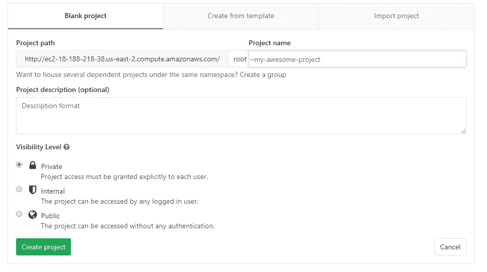
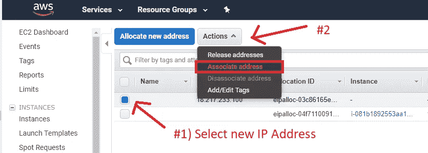
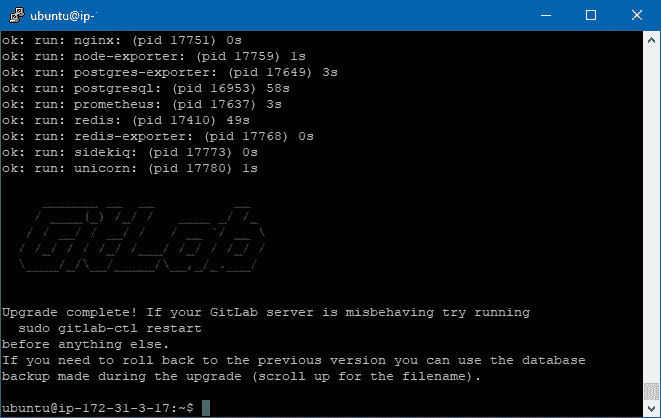

# [教程—指南]从零开始在 AWS EC2 上安装 GitLab、GitLab CI

> 原文：<https://medium.com/hackernoon/tutorial-guide-installing-gitlab-gitlab-ci-on-aws-ec2-from-zero-751927e5ae5>


How to setup GitLab on an Amazon EC2 Instance

在你用桌子砸自己，诅咒你周围的一切，从桥上跳下去之前…停下来！请原谅我。这将是一篇很长的文章，我希望这能为你节省无数的时间。这不是一条你需要遵循的神圣道路，这是我如何让它工作的。是的，你可能会在安装过程中遇到问题，因为没有两个相等的[计算](https://hackernoon.com/tagged/computing)系统。

**你将从本教程中获得什么:**

1.  在 AWS EC2 实例上有一个正常运行的 [GitLab](https://hackernoon.com/tagged/gitlab) 实例。
2.  为您的项目使用 GitLab CI，以及如何配置它。

**帖子:**

1.  【教程—指南】从零开始在 AWS EC2 上安装 GitLab、GitLab CI。(本指南)
2.  [使用 Docker](/@josjaviasilis/configuring-gitlab-ci-on-aws-ec2-using-docker-7c359d513a46) 在 AWS EC2 上配置 GitLab CI
3.  [正在配置。gitlab-ci.yml](/@josjaviasilis/configuring-gitlab-ci-yml-150a98e9765d)
4.  [git lab 和 GitLab CI 故障排除](/@josjaviasilis/troubleshooting-gitlab-and-gitlab-ci-79d3b71ad79f)

# #1 —安装

GitLab 是**免费**的，至少是它的社区版。**但是** **托管它不是，**除非你是开源的，打算直接在 [GitLab 的网站](https://about.gitlab.com/pricing/)上使用。我们将使用 GitLab CE(社区版)。

*注意，您可以选择手动安装 GitLab，而不是通过 AWS 进行配置。如果有，就按照 GitLab 网站* *的* [*这些步骤来。如果你正在这样做，跳到第二步。*](https://about.gitlab.com/installation/#ubuntu)

我假设您已经创建了一个 AWS 帐户。你想做的第一件事，就是前往[亚马逊的市场，并获得 GitLab 社区版](https://aws.amazon.com/marketplace/pp/B071RFCJZK)。


你要点击“继续订阅”


*有一点:我不打算在这里讨论如何生成密钥对或。ppk 文件。你可以跟随 bluehost* *的* [*这篇优秀教程。*](https://my.bluehost.com/hosting/help/putty#puttygen)

需要注意的几件事:

1.  它要安装的 GitLab 版本，已经过时了。
2.  预定义的 EC2 实例类型是 t2.medium
3.  运行该实例的潜在成本约为每月 33.41 美元。

我建议不要使用比 t2.medium 更小的东西，即使你是一个单独的开发者。GitLab 会**而不是**正确执行，如果它没有 [4 GB 的 RAM(相信我，它会使用它)它会抱怨。](https://docs.gitlab.com/ee/install/requirements.html#memory)你*可以*实现所谓的[内存交换，如果你选择一个 t2.micro](https://docs.gitlab.com/ee/install/requirements.html#memory) ，但是从个人经验来看**不要这么做。它会像垃圾一样跑。**

为了降低成本，我建议停止不使用的 GitLab 实例(如果你是一个超小型开发团队)。


Scroll down the page, and you’ll see the Security Group

这很重要，超出了本教程的范围。我总是建议根据你的需要来设置 IP。一开始，你可以“根据卖家设置新建”，然后调整。

点击“继续订阅”，您将看到下面的确认页面:


单击 EC2 控制台，它会将您从 EC2 实例转到主页。


如果您决定继续设置安全组，那么，一直向右滚动，直到您看到“安全组”，并从实例中选择一个。


Example of the Security Groups. Click the one corresponding to your GitLab isntance.

您要做的是“编辑入站规则”，然后为 SSH 分配您自己的 IP。对于 HTTP，您可以应用相同的限制来提高安全性，或者让它保持打开并从任何地方访问它。


# #2 —分配弹性 IP。

这是它自己的一部分，它可能感觉不合适(这显示了一个已经设置好的 GitLab 实例的插图),原因是我把这个搞砸了，我不得不深入 GitLab 来修复它。您可以看到，当您通过 IPV4 连接时，每次您停止和恢复实例时， **IP 地址都会发生变化**(在 AWS 上)

乍一看，这似乎没有什么不好，但是有一个大问题。GitLab **将当前 URL** 硬编码到项目中。



Screen when you’re creating a project


Pay attention to the Project Path. It becomes hardcoded. If you stop and bring back up the instance, there **will be** a mismatch of the URL and the repo, and this is **going to** cause issues.

这就带来了一个问题，当你试图从回购中推或拉时，它会出现错误，如未找到，或权限被拒绝。在你做任何事情之前建立一个弹性 IP(T18)会让你免于死亡。不是所有的东西都丢了，如果你搞砸了，有一个方法可以弥补。

转到顶部的“服务”,点击“EC2 ”,进入 EC2 主页。


点击“弹性 IPs”。


然后点击“分配新地址”


按“分配”，您将收到一条确认消息:


选择新的 IP 地址后，单击“操作”，然后单击“关联地址”。



然后，选择 GitLab 实例并分配私有 IP。


就是这样！那会让你省去很多头疼的事！

# **#3—连接到 GitLab 实例**

为此，你将需要 [PuTTy](https://www.chiark.greenend.org.uk/~sgtatham/putty/latest.html) 或者一个类似的可以给你 shell 访问权限(sh 访问)的程序。*我假设你将在本教程中使用 PuTTy。*

从您刚刚打开的 aws 页面(EC2 Instances 页面)，您将单击新创建的实例(它将显示为空白)。上图第二个)，你要找 IPv4 地址。


单击打开


单击“是”

在显示“登录身份:”的地方，输入“ubuntu”，如果你有密码(你应该有)，输入密码或者复制粘贴。*注意:它不会出现在终端*中。


# #4-更新 Ubuntu

当前安装的 Ubuntu 已经过时，需要更新。

[首先，创建一个备份映像(以防服务器不是新的)](https://gregrickaby.com/2013/05/safely-update-an-ubuntu-ec2-instance-on-amazon-aws/)

然后，从[这里开始](https://askubuntu.com/a/777177):

```
sudo apt updatesudo apt dist-upgradesudo do-release-upgrade -d
```

*注:这是* ***打算*** *花一段时间。*

如果这不起作用(您看不到任何事情发生)，尝试这样做:(注意我们省略了-d 标志)

```
sudo do-release-upgrade
```

请注意升级过程，因为它会要求您确认一系列的安装和升级。您可以用“-y”标志省略它。

这样的屏幕看起来像这样:


选择“是”


键入“Y”并按回车键。


“安装软件包维护者的版本”，并点击回车


键入“y”并按“Enter”键


最后一个窗口将重启服务器，并将其从控制台断开。您必须关闭并再次打开 PuTTY。

运行以下命令，检查是否安装了最新版本:

```
lsb_release -a
```

在撰写本文时，最新版本是 16.0.4.4:


# # 5-首次配置 GitLab

一旦你升级了 Ubuntu，那么你需要配置 GitLab:

```
sudo gitlab-ctl reconfigure
```

这个过程需要一段时间。


Once it has finished, you will see “gitlab Reconfigured!”

更新和升级软件包:

```
sudo apt-get updatesudo apt-get upgrade
```

之后，为了确保安全，重启 gitlab-ctl:

```
sudo gitlab-ctl restart
```


现在，从 AWS 的 IPv4 地址访问项目(与 PuTTY 使用的 URL 相同)。


Navigate with your browser to the same IPv4 URL Address

例如:导航到:http://ec2–20–156–206–47.us-east-2.compute.amazonaws.com/

**使用**访问默认帐户(如果它询问您)

```
Username: rootPassword: 5iveL!fe 
```


In this case, it didn’t ask us for the default credentials, but immediately prompted us with changing the password.


This is going to be the default page

加载主页后，通过在 URL 末尾添加“/admin”导航到管理区域。

这样做:(首先是你的 IP 地址，然后是/admin)

```
http://ec2–20–156–206–47.us-east-2.compute.amazonaws.com/admin
```


您可能已经注意到以下内容:


GitLab needs update.

这就是我们接下来要做的！

# #6 —更新 GitLab

让我们回到 PuTTY，运行一些命令:

```
sudo apt-get update && sudo apt-get install gitlab-ce
```

这将检查我们是否拥有最新的一切。

然后，我们需要在下面的 URL 中手动查找[上的 GitLab:](https://packages.gitlab.com/gitlab/gitlab-ce?filter)

[](https://packages.gitlab.com/gitlab/gitlab-ce?filter) [## gitlab/gitlab-ce -包 packages.gitlab.com

### GitLab 社区版包的 APT/YUM 存储库

packages.gitlab.com](https://packages.gitlab.com/gitlab/gitlab-ce?filter) 

您将会看到最新的版本，现在是:10.6.4。

请注意，您需要将其与所使用的 Linux 版本相匹配。在我们的例子中，它是 Ubuntu Xenial 版本。

在 Ubuntu 机器上了解它的一个方法是运行:

```
lsb_release -a
```


Running lsb_release -a will give us the Ubuntu version.


确定你的分布。在我们的例子中，我们使用的是 Ubuntu Xenial Release。我们点击并跟随链接。

我们将看到 GitLab 为我们提供了一些如何安装它的说明:


我们完全按照它说的去做；我们转到 PuTTY 并执行:

```
curl -s [https://packages.gitlab.com/install/repositories/gitlab/gitlab-ce/script.deb.sh](https://packages.gitlab.com/install/repositories/gitlab/gitlab-ce/script.deb.sh) | sudo bashsudo apt-get install gitlab-ce=10.6.4-ce.0
```

|意味着您获得了 curl 到 bash 的标准输出。


Let the beauty unfold! See how it installs!



You shall be greeted with this awesome message!

导航到您的新实例位置！


# # 7——战争还没有结束。—连接到 GitLab

每当您连接到 GitHub 时，它会自动创建一个我们称之为 SSH 的密钥(安全 Shell 密钥)。这是一种不需要密码就能直接与你的回购协议沟通的方式。GitLab 没有什么不同，只是我们需要**自己手动生成**，然后把它们粘贴到我们的 GitLab 账户中。如果做不到这一点，我们**将无法**在回购中进行任何操作。

为此，我们需要 Bash，我们可以从 Git 中使用它。如果没有，下载 [Git](https://git-scm.com/download/win) 安装。开放 Bash:


我们要做的是使用 Git Bash 为我们生成 SSH 密钥，并将其复制粘贴到 GitLab 中。

在 Bash 命令中，运行:

```
ssh-keygen -t rsa -C “your_name@your_email.com”
```

然后，它会询问您要将它保存在哪个文件中。你可以按回车键。


如果您有或者想要创建多个 RSA 密钥，那么您需要指定一个不同的名称。

注意，不幸的是，您需要将完整的路径附加到新名称中，所以它会将路径存储到该位置。否则，它将把它存储在。ssh 文件夹(没什么大不了的，记得移入就行。ssh)

在英语中，我的意思是:在文本框中，如果你想把它命名为 id_rsa_gitlab，你会这样写:

```
/c/Users/asili/.ssh/id_rsa_gitlab
```


Then, it’s going to ask you for some passphrase in case you want to protect it. After it finishes, it should show something like the image above.

将文件添加到 SSH:

```
ssh-add ~/.ssh/id_rsa
ssh-add ~/.ssh/id_rsa_any_other_file_I_could_have_created
```

完成后，您需要复制 id_rsa_gitlab.pub 或 id_rsa_ 的内容。pub(您指定的文件名)，并将它们粘贴到 GitLab 中。

您可以:

在 GitBash 命令中键入以下内容:

```
$ cat ~/.ssh/id_rsa.pub | clip
```

这将把内容复制到你的剪贴板。

或者:


找到文件，用文本编辑器打开它。*对不起发行商，你打不开*。


现在，转到您的 GitLab 实例(通过浏览器)，单击右上角的图标，并选择“设置”:


转到左侧的“SSH 密钥”，然后将密钥的内容粘贴到文本框中。**注意:您将为您连接的每台机器执行此操作。**每个用户都必须完成生成 SSH 密钥并将其粘贴到自己的配置文件中的过程。


点击“添加密钥”，你会得到这样的东西:


有了这个，你就可以从回购中拉和推(只要你在 GitLab 中有[权限)。](https://docs.gitlab.com/ee/user/permissions.html)

**如果你只打算使用一个 _rsa 密钥，你可以安全地跳到下一节。如果您使用多个，您需要添加额外的配置步骤。**

如果您有多个 RSA 密钥(SSH 密钥)，您必须创建一个配置文件:

回到。ssh 目录(在我的例子中是:C:\Users\asili\。ssh)，并创建一个空的**无扩展名的**配置文件。

您可以:

通过 Git Bash 来实现:

```
touch ~/.ssh/config
```

或者右键，新建= >文本文档，并删除"。txt "扩展名。

用任何文本编辑器打开文件。

在其中，复制并粘贴以下内容:

```
# Root account
Host ec2–12–211–32–14.us-east-2.compute.amazonaws.com
 HostName ec2–12–211–32–14.us-east-2.compute.amazonaws.com
 PreferredAuthentications publickey
 IdentityFile ~/.ssh/id_rsa# superjose account
Host ec2–18–211–14–41.us-east-2.compute.amazonaws.com
 HostName ec2–18–211–14–41.us-east-2.compute.amazonaws.com
 PreferredAuthentications publickey
 IdentityFile ~/.ssh/id_rsa_superjose

Host other_gitlab_repo.com
 Hostname other_gitlab_repo.com
 PreferredAuthentications publickey
 IdentityFile ~/.ssh/id_rsa_rat
```

在这里，您将替换您正在使用的 IPv4 地址的主机和主机名值。这个配置文件**是最重要的**。如果没有这个，您将无法与多个主机通信，因为它将只使用 id_rsa 文件。

**注意:您放置的是私钥(无扩展名文件)，而不是。酒吧一号。**

一些附加资源:

*   [https://coder wall . com/p/7 smjkq/multiple-ssh-keys-for-different-accounts-on-github-or-git lab](https://coderwall.com/p/7smjkq/multiple-ssh-keys-for-different-accounts-on-github-or-gitlab)
*   [https://docs.gitlab.com/ce/ssh/README.html](https://docs.gitlab.com/ce/ssh/README.html)

# 为 GitLab 配置现有 Repo

如果您从其他存储库迁移到 GitLab，您需要配置 [URL 端点以指向正确的位置](https://stackoverflow.com/a/2432799/1057052)。您可以通过以下方式做到这一点:

```
git remote set-url origin git@ec2-31-412-44-15.us-east-2.compute.amazonaws.com:project/my-project.git
```

或者，只需编辑配置文件:。git/config


# 如果回购网址和你实际网址不一样怎么办？

如果 repo 不同(您的 IP 地址发生了变化，或者您在设置 GitLab 后添加了一个域)，请转到以下链接，步骤#1:

[https://hacker noon . com/trouble shooting-git lab-and-git lab-ci-79 D3 b 71 ad 79 f # 374 e](https://hackernoon.com/troubleshooting-gitlab-and-gitlab-ci-79d3b71ad79f#374e)

# 终于！GitLab 已经启动并运行

但是…CI 呢？

# 💀💀💀💀💀💀💀💀💀💀💀💀💀💀💀

是的，我知道，你想死。想一想，人们要花多少时间进行研究才能实现这一目标。或者想想 GitLab 团队为了实现这一目标付出了多少努力？！(为他们这个神奇的工具喝彩😉)

让我们在另一篇文章中继续讨论 CI:

[使用 Docker](/@josjaviasilis/configuring-gitlab-ci-on-aws-ec2-using-docker-7c359d513a46) 在 AWS EC2 上配置 GitLab CI

**变更日志:**

2018 年 5 月 24 日:

*   添加了“如果回购 URL 与您的实际 URL 不同怎么办？”
*   修复了故事中的一个错别字。
*   添加了 GitLab 完成自身配置后导航到 URL 的说明。