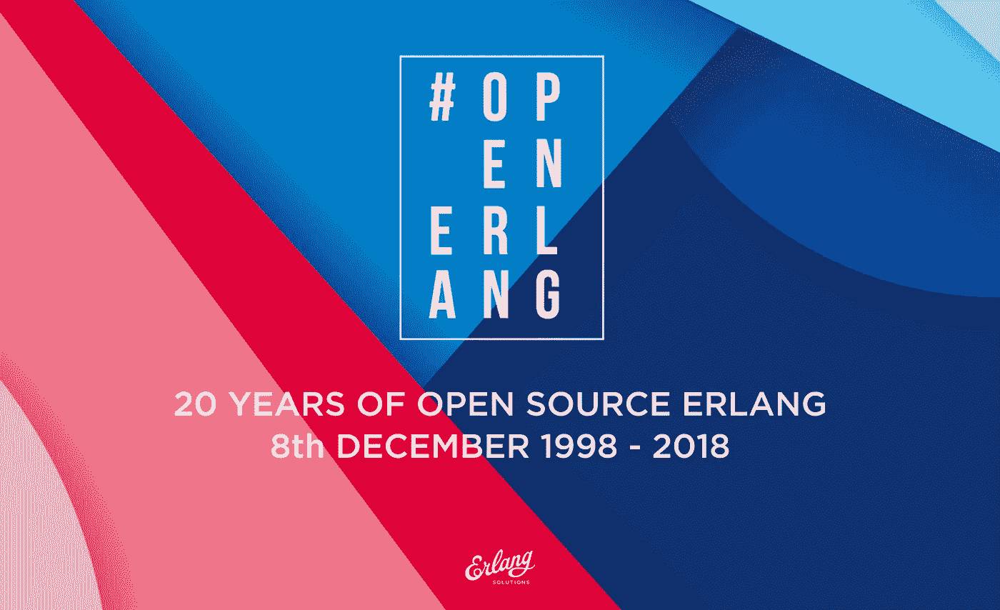
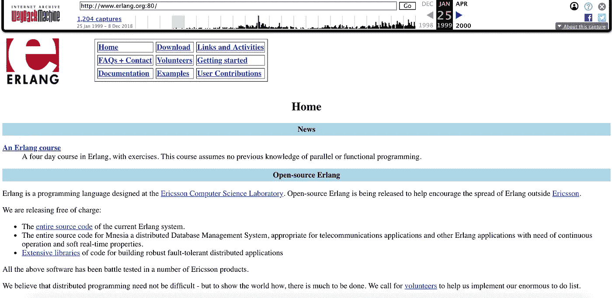

# 开源 Erlang 二十年

> 原文：<https://medium.com/hackernoon/twenty-years-of-open-source-erlang-erlang-solution-blog-b25751be4a5c>

## 弗朗切斯科·切萨里尼于 2018 年 12 月 8 日

Erlang 于 1998 年 12 月 8 日星期二作为开源软件发布。你记得那周你在哪里吗？我在达拉斯(德克萨斯州)；我的许多访问之一是帮助爱立信美国分公司建立一个使用 AXD301 交换机的 Erlang 团队。周二早上醒来，我得到了这个消息。

释放是平静的。这次发布没有公关，没有宣传或媒体报道。只是一个备用的[erlang.org 网站](https://web.archive.org/web/19990125095124/http://www.erlang.org:80/)(使用 vi 手工制作)。一封电子邮件被发送到了 [Erlang 邮件列表](https://groups.google.com/forum/#!topic/comp.lang.functional/sdiSrY6aVUs)，一篇帖子出现在了 [slasdot](https://tech.slashdot.org/story/98/12/08/156212/erlang-becomes-open-source) 的头版，旁边还有一篇关于 [comp.lang.functional](https://groups.google.com/forum/#!topic/comp.lang.functional/sdiSrY6aVUs) 的报道(乔尽职尽责地跟进了这篇报道)。没有其他营销活动宣传爱立信已经发布了一个巨大的开源项目。我那周的亮点不是 Erlang 的发布，而是去达拉斯市中心的一个酒吧看马奇·雷蒙和入侵者的演唱会。我不知道开源的 Erlang 会对科技行业、我的职业生涯以及我周围的许多人产生怎样的影响。

# 从爱立信那里得到它

是什么让这一切发生的？出于各种原因，我们中的许多人都希望 Erlang 作为开源软件发布。我的一些爱立信同事想离开他们目前的职位，但继续用他们认为是银弹的东西来制造产品。其他人希望通过为大众提供容错和可伸缩系统的高级工具，让世界变得更美好。对于爱立信管理层来说，更广泛地采用 Erlang 意味着可以招募更多的人才。

Jane Walerud 是我们中试图在爱立信之外出售 Erlang 的人，也是当时少数几个知道如何与管理层沟通的人之一；她明白销售编程语言的时代已经结束了。爱立信软件架构实验室的负责人 kan Millroth 建议尝试这个叫做“开源”的新事物。Jane 带着早期版本的《大教堂》和《市集报》说服爱立信管理层发布 Erlang VM、标准库和部分 OTP 的源代码。

在 Erlang 退出之前，许多人不相信它会发生。有人担心，在最后一刻，爱立信会放弃整个想法。开源，一个几个月前创造的术语，是一个奇怪的，可怕的新野兽，大公司不知道如何处理。爱立信对在未知领域航行的担忧有很多，这是理所当然的。为了减轻 Erlang 不被释放的风险，都市传说中我们的朋友理查德·奥基夫(Richard O'Keefe)前来救援，他当时在新西兰奥塔哥大学工作。东方的午夜来得更早，所以当新西兰的午夜钟声一响，erlang.org 的网站就上线了几分钟。只要有足够的时间让一个匿名用户下载第一个 Erlang 版本，就可以确保它的安全。当下载被确认后，该网站再次离线，仅在十二个小时后，瑞典时间午夜再次出现。我当时在达拉斯，睡得正香，所以我既不能确认也不能否认这一切是否真的发生过。但是就像每一个传说一样，我确信在它的背后有一点真实。

最初几年采用率很低。尽管如此，由 Kenneth Lundin 领导的检察官办公室小组仍在努力工作。1999 年 5 月，bjrn Gustav sson 对 BEAM VM(波格丹一世的 Erlang 抽象机)的重构成为 JAM(乔的抽象机)的官方替代品。乔在一年前离开了爱立信，而 BEAM 虽然速度更快，但需要时间做好生产准备。

我回想起每次我们发现一家使用 Erlang/OTP 的新公司时的兴奋。瑞典电话公司 Telia 正在开发一个呼叫中心解决方案。英国移动运营商 One2One 最初将它用于增值服务，并将其应用扩展到核心网络。巴黎的 IdealX 首次涉足消息和 XMPP。芝加哥的韦尔系统公司和多伦多的 Motivity 公司正在用它做自动拨号软件。当然，Bluetail 有许多产品帮助互联网服务提供商提高可伸缩性和弹性。

Erlang 在爱立信核心产品中的使用继续扩大。1999 年，我搬到了伦敦，在那里，我越来越多地发现爱立信内部需要 Erlang 专家。Erlang Solutions 诞生了。公司成立不到一年，我的客户就遍布瑞典、挪威、澳大利亚、爱尔兰、法国、美国，当然还有英国。2000 年，我们有了第一个非爱立信客户；巴黎 IdealX 的培训、指导和代码审查。

Alteon Web Systems 以 1 . 52 亿美元收购 Bluetail(几天后 Alteon 被北电收购)，这在 Erlang 社区掀起了第一波涟漪。爱立信的竞争对手正在开发 Erlang 产品！一代成功的企业家，他们有资金参与许多其他的创业；突触、Klarna 和 Tail-f 就是其中的一些。

在 Bluetail 成功之后不久，网络公司崩溃了，这个行业进入了生存模式，然后是复苏模式。然而，这次崩盘并没有影响到正在全速前进的学者们。2002 年，Chalmers 大学的约翰·休斯教授成功地使 Erlang Workshop 获得了 SIGPLAN 和 ACM 的认可。我们并不真正知道这一切意味着什么，但尽管如此，我们还是为此感到非常自豪。匹兹堡(宾夕法尼亚州)的 ACM SIGPLAN Erlang 研讨会是第一个被认可的研讨会。在这里，一位来自乌普萨拉大学的博士生理查德·卡尔森向世界展示了 Erlang 版本的试抓。

2004 年 9 月，来自乌普萨拉大学的 Kostis Sagonas 在雪鸟(犹他州)的 ACM SIGPLAN Erlang 研讨会上劫持了 lightning talks，并首次公开演示了透析器。他用南非 Teba 银行的代码库运行它。这是他和他的学生为生态系统贡献的众多神奇工具中的第一个。

很长一段时间以来，Erlang 一直被世界各地的许多大学用来教授计算机科学方面的内容。这反过来导致研究、硕士论文和博士项目。该研讨会为学术界提供了一个论坛，以发表他们的成果，并与工业合作伙伴进行验证。erlang.org 网站的下载量持续增长，收养率也是如此。

2003 年，哥德堡 IT 大学的项目经理 Thomas Arts 邀请我给他的本科生教授一门 Erlang 课程。尽管约翰·休斯教授已经了解 Erlang，但他还是想向在生产中使用过 Erlang 的人学习，所以他参加了这个课程。一天早上，他通宵熬夜，疲惫地出现在教室里。他开发了 Erlang QuickCheck 的第一个版本，并尽职尽责地用它来测试课程练习。这是 Quviq 和商业版 QuickCheck 的开始，后者是一个基于属性的测试工具，首屈一指。我在 IT 大学教了十年书，有 700 多名学生参加了这门课程。

# 了解信息

在网络崩溃期间，Alexey Shchepin 开始在一个名为 ejabberd 的基于 XMPP 的即时消息服务器上工作。在工作了三年之后，他于 2005 年 12 月 1 日发布了 1.0 版本。脸书聊天分叉，向 7000 万用户推出聊天服务。大约在同一时间，布莱恩·阿克顿和简·库姆创立了 WhatsApp，也是基于 Ejabberd 的一个分支。由于派生 Ejabberd 是一种大肆宣传，MongooseIM 也是如此，成为大规模消息传递解决方案的通用平台。

2006 年 5 月，RabbitMQ 诞生了，因为我们发现定义和实现一个叫做 AMQP 的新的发布/订阅消息标准的工作正在进行中。RabbitMQ 如今是成千上万个系统的支柱。到这个十年结束时，Erlang 已经成为许多消息传递解决方案的首选语言。

# 多核时代

在网络复苏期间，不仅仅是大学在创新。2005 年 5 月，OTP 团队发布了 BEAM VM 的多核版本，证明 Erlang 并发和编程模型是未来多核架构的理想选择。最令人兴奋的是 Erlang 邮件列表，因为没有多少人意识到免费午餐结束了。我们以 Ejabberd 为例，通过将其编译成 Erlang 的最新版本，在四核机器上运行时，吞吐量增加了 280%。

2007 年 5 月，1991 年的电影《二郎:T1》的原始卷从爱立信保险箱里的一盒 VHS 录像带中被匿名泄露，并被放在 erlang.org 网站上，最终被上传到 YouTube。仍然没有人公开对这一行动负责。然而，世界终于理解了那些仍在爱立信 NDA 手下的人感到的宽慰，电影中的计算机科学家没有一个放弃日常工作去从事表演。这部电影在 2013 年有了一个[续集](https://www.youtube.com/watch?v=rRbY3TMUcgQ)，一个时髦的人试图给 Erlang 一个酷的外观。这一次，释放它的柯普鲁特被确认为芝加哥居民[加勒特·史密斯](https://twitter.com/gar1t)。

2007 年，实用程序员出版社出版了乔·阿姆斯特朗的《编程 Erlang》。次年，2008 年 6 月，我手握*二郎编程*的第一份纸质副本；西蒙·汤普森和我花了 18 个月写的一本书。当时，O'Reilly 的书是新兴编程语言所需要的认可的标志，让位于许多其他各种语言的书籍。

该书的发布会与 2008 年 6 月在伦敦举行的第一次商业 Erlang 会议 Erlang eXchange 同时举行。这并不是第一次，因为爱立信计算机科学实验室的前负责人 Bjarne Dä cker 已经在斯德哥尔摩举办了近十年的 Erlang 用户年会。但是 11 月的瑞典很冷，征服世界的时候到了。2009 年 3 月，第一家 Erlang 工厂在帕洛阿尔托(加利福尼亚州)落成，Erlang eXchange 也随之诞生。更具异国情调，但同样美丽的位置。

欧洲 Erlang 社区第一次见到了他们的美国同行。正如你所能想象的，我们相处得非常融洽。在会议上，Tony Arcieri 展示了 Reia T1，一个运行在 BEAM 上的 Ruby 版本的 Erlang。谁说类似 Ruby 的语法是个坏主意？那一年的其他演讲者和与会者都有着出色的职业生涯，成为了科技领域的企业家和领导者。

当时美国的一位 Erlang 用户是 Tom Preston Werner。他用它来扩展一家名为 Github 的社交编码公司的 Ruby 前端。2009 年 11 月，当我在斯德哥尔摩参加 Erlang 用户大会时，我把他和斯科特·沙孔介绍给了 OTP 团队。他们一起度过了一个下午，促使 OTP 团队将 Erlang 的开发转移到 github，使其成为主要的存储库。

会议遍布世界各地。活动在阿姆斯特丹、班加罗尔、柏林、布宜诺斯艾利斯、布鲁塞尔、芝加哥、(很多地方我不能拼出来)中国、克拉科夫、洛杉矶、巴黎、莫斯科、墨西哥城、米兰、慕尼黑、纽约、罗马、旧金山、圣安德鲁斯、特拉维夫、温哥华、华盛顿、DC 和许多其他地方举行。

# 卡布奇诺时代

2010 年，我在牛津大学教我的第一个研究生班。Erlang 被选作面向并发的编程课程。也是在这一年，布鲁斯·泰特的《七周七种语言》出版了。正是通过这本书，Rails 的核心成员之一 José Valim 意识到，Erlang 在并发性竞赛中领先于所有人，因为它也解决了分发问题。

2011 年 1 月，Elixir repo 中的第一次提交发生了。结果于次年在克拉科夫 Erlang 工厂发布，并于 2014 年 9 月发布了 1.0 版。像所有成功的语言一样，他试图解决一个问题，即将 Erlang 的力量带给更广泛的社区，从 Web 开始。

时机成熟了。2012 年 1 月，WhatsApp 宣布，通过修改 FreeBSD 和 BEAM，他们在单个虚拟机和主机上实现了 200 万个 TCP/IP 连接。他们的目标是降低运营成本，在尽可能小的硬件占用空间上运行可扩展的服务。这些结果适用于许多垂直行业，网络就是其中之一。

就在 WhatsApp 发布的同一个月，一群公司汇集知识、时间和资源，创建了工业 Erlang 用户群。他们与爱立信合作，将 Erlang 从开源 Mozilla Public License 的衍生品转移到 Apache Licence，为 dirty scheduler 做出贡献，推出 bug 跟踪工具，资助一个新的 erlang.org 站点，推出 Erlang Central，并以建立一个基金会为目标进行合作。

# 长生不老药是成年的

2014 年 7 月，Jim Freeze 在奥斯汀(德克萨斯州)组织了第一次 Elixir 会议。有 106 名与会者，包括主旨发言人迪夫·托马斯的狗。克里斯·麦考德带来了凤凰涅槃。罗伯特·维尔丁和我是这个阵容的一部分，我清楚地记得我的信息:不要因为你了解鲁比，就相信他们告诉你学习长生不老药很容易。你的挑战是同时思考。

Elixir 背后的主要思想是并发性，知道如何处理它对项目的成功至关重要。一年后，2015 年 8 月，凤凰 1.0 发布。它和 Rails 对 Ruby 的影响一样，把人们引向了仙丹。现在，您不需要掌握并发性就可以获得它！不久之后，神经出现了，使得 Elixir 不再仅仅是一门网络语言。

在 Elixir Conf 上，我谈到了我与 Steve Vinoski 合著的书《用 Erlang/OTP 设计可伸缩性》。当时，它是一个测试版。我不知道我必须等到 2016 年 6 月才能拿到纸质副本。最后四章，本来应该是一本书，结果花了 1.5 年才写完。给其他人写书的主要教训是，如果你的伴侣告诉你“你将成为一名父亲”，你有 8 个月的时间来完成这本书。否则你会像我一样，在你第二个孩子出生前几天参加发布会。这本书是献给艾莉森、彼得和我们的宝宝的。Baby bump 诞生于 7 月初，这让 Erlang 的说法“直到有了第二个孩子，你才真正理解并发性”成为现实。

# 二郎生态系统

在整个 2016 年，灵药的采用持续增长。关于 Lisp 风格的 Erlang 和 Effene——BEAM 上的另外两种语言——的会议讨论显示，他们已经在生产中运行代码。新的实验港不断出现在我们的雷达上；一种语言的时代结束了。和一样。net，包括 C#、F#、Visual Basic 和其他语言，或者 JVM 生态系统，包括 Java、Scala、Clojure、Groovy 等等。Erlang 和 BEAM 也发生了同样的事情，这促使 Bruce Tate 创造了 Erlang 生态系统这个术语。

羊驼，Clojerl，Efene，Elixir，Elm-beam，，Erlog，Erlua，Fez，Joxa，Lisp Flavoured Erlang 和 Reia，这些语言与 Erlang 和 Elixir 一起，开启了一个跨语言互动与合作的时代。在一起，我们变得更强大，可以继续发展！

2018 年 12 月，提交了 Erlang 生态系统基金会的文件，成立了一个非营利组织，其目标是促进生态系统。随着我们改进互操作性、公共工具和库，我期待着 BEAM 上更多的语言越来越受欢迎。随着对可伸缩和容错系统需求的增加，Erlang 的结构和语义在生态系统内外的新语言中的影响也在增加。我希望这将为未来 20 年确定方向，因为新一代技术领袖和企业家正在展开他们的翅膀。

# 未来

2018 年，在 Code BEAM 斯德哥尔摩大会发现 Erlang 生态系统(之前称为 Erlang 用户大会)上，思科的 Johan Bevemyr 宣布他们每年出货 200 万台运行 Erlang 应用的设备。这让观众大吃一惊，因为这意味着 90%的互联网流量都要通过 Erlang 控制的路由器和交换机。Erlang 为爱立信的 GPRS、3、4G/LTE 以及 5G 网络提供支持，如果最近的招聘广告值得一提的话。MQTT 通过最受欢迎的 AMQP 经纪商 VerneMQ 和 eMQ 提供物联网基础设施。Erlang 不仅为互联网和移动数据网络提供动力，它还是成千上万个分布式容错系统的主干。每天通过其金融交换机交换数十亿美元，通过其消息传递解决方案交换更多的消息。你不能编造这些东西！

这些只是我过去 20 年来的一些个人亮点。总之，人们意识到我们还远远没有完成。1995 年，乔·阿姆斯特朗告诉我，Erlang 不会永远存在。他说，总有一天，会有更好的事情发生。快进到 2018 年 12 月，我仍在以开放的心态等待那个预言成真。不管是什么，毫无疑问 Erlang 将对它产生重大影响。

非常感谢乔、迈克和罗伯特打了第一个电话，感谢比约恩促成了这一切。向简欢呼吧，她把它从爱立信手中拿走，确保了它的生存。你们所有人都开创了一些事情，让我能够利用我们都热爱的技术，与了不起的有才华的人见面、工作和学习。它为我们提供了一个平台，使我们许多人能够在未来 20 年(至少)推动创新！

[阅读 Erlang Solutions 博客页面上的其他博客](https://www.erlang-solutions.com/blog.html)

*最初发表于*[T5【www.erlang-solutions.com】](https://www.erlang-solutions.com/blog/twenty-years-of-open-source-erlang.html)*。*