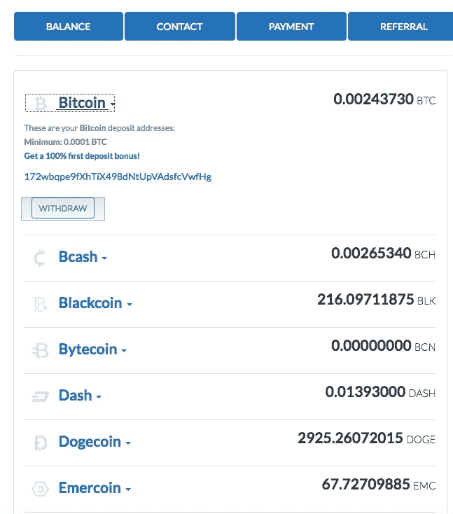
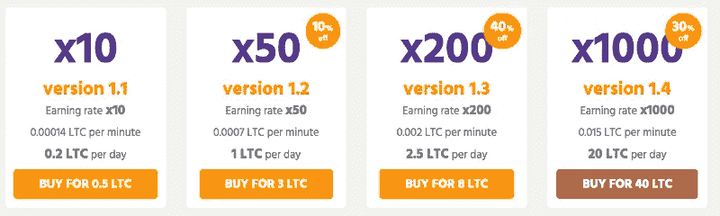

# 如何避免密码空间中最常见的两种骗局

> 原文：<https://medium.com/hackernoon/two-common-scams-i-have-seen-in-the-cryptospace-and-how-to-avoid-them-9a9e79d78ada>

Fake mining sites and fake faucet wallets are two scams I have seen repeatedly in the cryptospace.

## 不要责怪受害者

如果你在加密货币社区呆过，你就会知道那里有很多骗局。你可能也听过人们说只有“白痴”才会上当受骗，或者受害者因为“愚蠢”而活该失去他们的硬币。我认为这些态度是错误的。人们成为受害者的原因是他们缺乏经验。即使智力是一个因素，为什么它意味着某人“应该”被敲竹杠？这种态度在任何社会中都是反社会的，有害的。这也使得加密货币社区对新来者充满敌意。

与指责受害者相反，分享知识是保护彼此免受诈骗的最佳方式。汇集我们的集体知识将使加密货币社区成为一个对每个人都更安全的地方，并有助于吸引更多的新人。好了，现在我已经解释了我来自哪里，让我们来看看骗局。

## 假水龙头钱包

水龙头钱包是一个看起来既是在线[加密钱包](/swlh/best-cryptocurrency-wallets-for-2019-20eda6935cce)又是水龙头的网站。作为一个钱包，它通常会提供注册账户的机会，并接收比特币和各种替代硬币的地址。作为一个水龙头，它将每天向你的钱包中免费存入少量加密货币。然而，不像传统的水龙头，即使很小，实际上也会支付索赔，水龙头钱包是纯粹的骗局。重点是引诱你把自己的硬币存入网站。这是一个假水龙头钱包的截图，当时还在直播，上面写着:

The balances are supposedly from free daily deposits. In reality, there is nothing there

它看起来像是比特币和 altcoin 地址的一站式商店。请注意，它还提供“100%首次存款奖金”这是典型的水龙头钱包骗局。他们提出支付奖金让你存入硬币。一切看起来都很好，直到你要求撤回，什么也没发生，或者网站消失了。

在上面这个网站的例子中，一旦比特币余额超过了规定的最低取款限额，我就请求取款。我点击了“撤销”，出现了一条消息，说这是一个“成功”然而，我不为所动。我从未输入过我的 BTC 地址。该网站没有地方发送比特币。不用说，我从来没有收到提款。

假水龙头钱包通常还为签约推荐人提供额外的奖金。那些在社交媒体上发布推荐链接的人不知不觉地成为了骗局的帮凶。

## QoinPro 传奇

在过去的几年里，我看到了多个水龙头钱包网站来来去去。然而，有一种被证明特别顽强，存在了好几年，一直在骗人。QoinPro 自称是一款在线钱包，每天将比特币和各种 altcoins 存入用户的钱包。我很熟悉 QoinPro，因为我在 cryptospace 的早期遇到过它。当时我对骗局很天真，注册了一个账户。我以为我每天都有存款，甚至在社交媒体上分享网站。幸运的是，报名的只有家人，没有人存自己的硬币。

我完全忘记了 QoinPro，直到最近我看到一些社交媒体活动，人们声称他们从未收到他们通过该网站请求的取款。QoinPro 的 Twitter 上发布了一条消息，宣布该网站将进行升级，并将于 2018 年 5 月 25 日恢复。这一天来了又去，愤怒的用户的推文接踵而至。QoinPro 随后在推特上表示，重新上线的时间被推迟到了 7 月 23 日，这一天来了又去，没有新的网站出现。愤怒的用户继续发帖。

## QoinPro 的策略

我进一步挖掘，发现 QoinPro 已于 2014 年 2 月 6 日上线。一名用户在 Bitcointalk 上发帖宣布推出一种“多货币加密钱包”，每天存入免费硬币。几个星期以来，有用户发帖试图从推荐奖金中获利。他们提出通过个人链接向 QoinPro 发送少量代用币作为注册的交换。一些海报组织了促销活动，报名的人可以参加 BTC 抽奖。虽然几乎没有证据表明许多人对此类推广活动做出了回应(即，几乎没有人回复这些帖子)，但人们非常积极地推送他们的推荐链接。

我的研究进一步揭示了 QoinPro 在 2017 年比特币现金硬分叉临近时开始的新策略。账户持有人开始收到电子邮件，声称如果他们在叉子之前存入比特币，他们可以通过网站认领 BCH。一名用户在回复电子邮件时提到已向 QoinPro 存入 0.7 BTC。叉后他要求撤回，但从未实现。在向 QoinPro 发送了“数千”封电子邮件后，他仍未收到回复。

所有的在线证据都表明用户没有被提现，你可能会认为 QoinPro 不可能保持在线，但是，我最近发现该网站确实在一个不同的 URL 返回。

## 假矿池

假矿池是提供出售或出租 hash power 的网站。哈希能力是计算机用来运行和求解哈希算法的能力。这些算法用于生成新的加密货币，并允许它们之间的交易。这个过程也被称为采矿。一个假的矿池网站会让你免费注册，承诺你可以挖掘少量的密码而不必付费(提示:不劳而获永远是一个危险信号)。一旦你注册，你会发现免费的硬币数量非常低，但可以增加购买更多的哈希功率。下面是一个典型的例子:

*This image is from a fake Litecoin mining pool website offering to sell hash power*

当我刚接触密码空间时，我加入了其中一个网站。幸运的是，我没有购买任何出售的 hash power 包。相反，我等着看是否真的有可能免费开采莱特币。现场的最小提取量为 0.2 LTC。我在电脑上打开这个标签好几天，直到它显示账户余额为 0.2 LTC。我发起了撤资。它从未到来。我给支持频道发了几封电子邮件，但从未收到回复。网上的一些研究揭示了购买了 hash power 包的人抱怨收不到钱的故事。

## 识破骗局水龙头钱包

识别假水龙头钱包的最好方法是看看它是否提供免费硬币来换取存款。这是一面巨大的红旗。真正的加密钱包不会免费赠送硬币。他们试图设计最好的产品，让用户想用它。如果有疑问，请尝试使用“scam”一词搜索网站名称。如果这个网站已经存在了一段时间，你很可能会看到它欺骗人们的点击率。一个相关的选择是咨询社交媒体。查看 Twitter、Reddit 和 Bitcointalk 上对该网站的提及。通常被诈骗网站欺骗过的人会发布他们的故事来警告其他人

## 发现假矿池

与假水龙头钱包不同，假矿池更难识别。这是因为存在合法的矿池，人们在其中组合资源以受益于公共散列力量。[当比特币开采的难度增加到较慢的矿工可能需要几个世纪才能生成一个区块时，池中开采](https://www.buybitcoinworldwide.com/mining/pools/)开始了。对于这些矿工来说，[的解决方案](https://en.wikipedia.org/wiki/Mining_pool)是集中他们的资源，这样他们就可以更快地生产区块，并在持续的基础上获得一部分奖励，而不是每隔几年随机一次。

一个假的采矿网站会故意把自己描述成一个矿池来迷惑你。例如，上图中的骗局 Litecoin 采矿网站自称为“LTC 采矿池”，尽管它绝不是。骗局采矿网站和合法采矿池之间的关键区别是，后者是一群矿工，他们同意按照他们贡献的散列功率的比例分享块奖励(开采的硬币)。换句话说，他们是在向池中出售哈希功能。他们不是从池子里买哈希值。

如果一个网站向你出售 hash power，这是一个骗局。可以这样想:为什么有人会卖给你 hash 能力，给你一些挖掘的奖励，而他们自己可以使用 hash 能力，并保留所有的奖励？从商业角度来看，要做到理性，你所得到的价值必须低于你所付出的。

## 结论

假冒的采矿网站和假冒的水龙头钱包是加密空间中两种常见的骗局，新来者最容易成为受害者。一些好的经验法则是水龙头钱包总是骗局，所以避开他们。一个骗局采矿网站的迹象是，它提供出售或出租哈希权力。你不会从这样的安排中赚钱，所以还是避开为好。最后，当与任何向你出售密码的网站打交道时，一定要在网上做研究。如果你看到有人丢失资金的报告，请远离。

*订阅我的* [*中*](/@minadown) *和*[*Twitter*](https://twitter.com/minad21)*频道如果你喜欢我的文章，想了解更多关于区块链和加密货币项目的信息，

如果您对本文有任何疑问，请在下面的部分发表评论。
谢谢！*