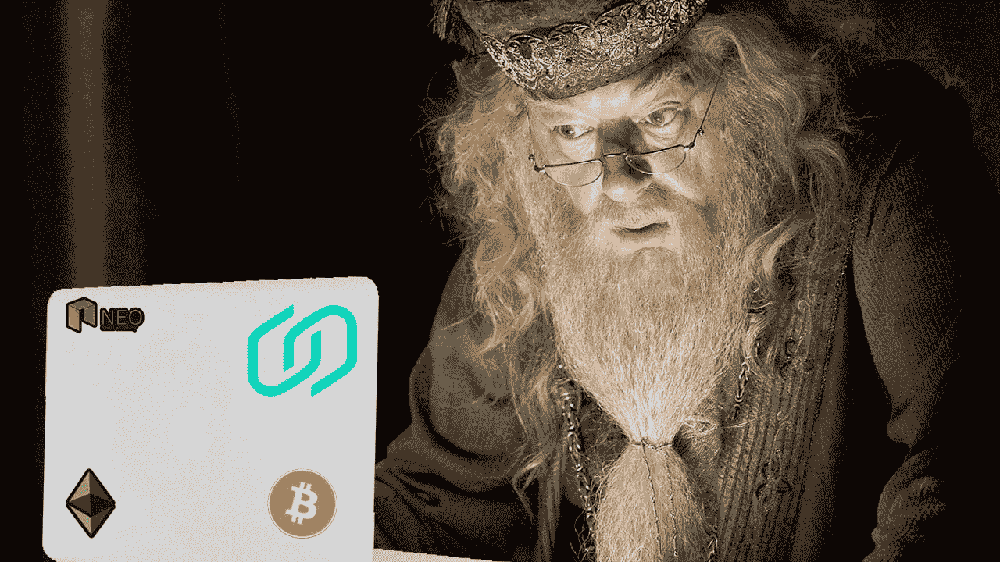
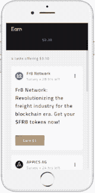
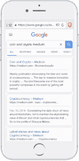

# 两种神奇的方法把你的业余时间变成密码。

> 原文：<https://medium.com/hackernoon/two-magical-ways-to-turn-your-spare-time-into-crypto-af03b78c81bb>

当大多数人想到在 crypto 中赚钱时，他们会想到两个常见的活动:投资和采矿。这两者都是既费钱又耗时的工作。但是增加你的加密货币储备并不一定是这两者之一。

有几个探索较少的途径来获得秘密收益。在本文中，我们将讨论:

> **1。您的硬币如何为您工作，并提供赌注证明**
> 
> **2。这个生态系统中的应用如何帮助您赚钱**

让我们开始吧。

> 更新:在你继续阅读之前，有些事情你应该知道。我们开发了一个工具，让交易者在止损的同时获利。如果那是你的事情，检查它！
> 
> 👉【https://signalgroups.com 

# 利害关系证明入门

股权证明是加密货币开采的替代方案，不需要硬件或大量的电力。相反，持有硬币的投资者会逐渐获得更多的硬币。

把它想象成银行账户中的利息，但使用加密货币。你所需要的只是一个风险证明加密货币和一台电脑

像 NEO，LISK 和 Stellar Lumens 这样的主要硬币都是建立在 stake 模型的基础上的。其他主要的硬币，如以太坊，已经宣布他们打算采用它。

## **如何使用 PoS 开始赚钱？**

现在，您只需一台笔记本电脑和一个稳定的互联网连接就可以使用 PoS。不过，你必须让它全天候运行，所以你可能想用一台旧笔记本电脑。

[**alpha crypto**](https://goo.gl/JiYdM8)**实际上很好地解释了 PoS 以及如何在你的电脑上安装可下注的钱包。**

**Alpha Crypto explanation on how to start Proof-of-Stake**

**如果你没有备用的笔记本电脑，你也可以在 15 分钟内将它设置在树莓派上。你可以点击查看一段[解说视频。](https://goo.gl/v6xBWi)**

**一旦都设置好了，你就可以离开了。当你的硬币到期后，它们会开始引起你的兴趣。**

**想不到，就这么简单！你选择什么硬币和购买多少硬币将决定你从中获得的潜在红利。**

## **我能期望看到什么回报？**

**每枚 PoS 硬币支付不同的利率，因此由您选择最有利可图的利率。**

**有很多网站可以比较这些硬币，但目前最赚钱和最受欢迎的是 NEO、Reddcoin 和 LISK。**

**NEO 支付天然气红利。你得到的气体量是你下注的 NEO 量的百分比**

**在写这篇文章的时候，如果你在一个赌注钱包里放了 100 尼欧，你可以期待看到大约 2.4-4.5%的天然气年回报率。然后你可以把这些汽油换成 BTC 或者菲亚特。**

**其他一些硬币，如 OKcash 和 Hawala，如今的回报率高达 15%——比银行支付给你的要高得多。**

# **对股权证明不感兴趣？深入了解加密货币应用生态系统。**

**这些天我们在手机上做任何事情。技术不断找到新的和创新的方法来使用你口袋里的那块玻璃——现在轮到 crypto 了。**

**自 2017 年以来，加密应用程序在左右两边涌现，其中许多都专注于奖励使用它们的人。**

****

**Earn.com IOS App**

## **[**Earn.com**](https://goo.gl/t7eANR)**

****Earn.com 自称是第一个基于令牌的社交平台。像大多数社交平台一样，你会得到一个 feed——尽管这不是 memes 和有趣的猫视频，而是一个充满任务的 feed。这些任务是由公司设定的，通常与你的职业或技能相匹配。例如，在注册过程中，选择你的职业为“设计师”将更有可能给你与设计相关的任务。完成每个任务将为你赢得 BTC。****

****通常任务完成后会奖励你 1 美元(在 BTC ),而有些会更高。有时候，一项任务可以简单到关注一个 twitter 页面或者在一个脸书群组发帖。****

********

****Vanywhere IOS App****

## ****[T5【Vanywhere】T6](https://goo.gl/LvgEsF)****

****Vanywhere 的任务是让您获得世界上最大的技能集合。他们平台上的人被称为“技能者”，他们按分钟付费分享他们的——你猜对了——技能。****

****Skillers 可以在平台上提供他们想要的任何东西。你可以给出设计建议，烹饪技巧，或者密码和区块链建议。它真的受限于你的想象力。你所需要做的就是提供一项别人有兴趣向你介绍的技能！这里有一个简单的例子[视频](https://goo.gl/D4Kmfg)。****

****Skillers 通过视频、语音或直接信息回复。当你成为一名熟练工时，你可以选择你想把时间设定在什么价位。人们通常会要价 1-10 美元，但实际上你的要价没有上限。****

****加密提供了如此多的赚钱机会。但是，与其赚钱，不如找个省钱的方法？****

********

****Brave Browser IOS App****

## ****[**勇敢** **浏览器**](https://goo.gl/YCrUKD)****

****由 Brendan Eich 开发，他是 Mozilla 项目的联合创始人和 Javascript 的创始人。Brave 显示出巨大的潜力，同时也看到其用户群以流星般的速度增长。****

****Brave 声称每月为用户节省 23 美元的互联网数据费用。****

****Brave 通过阻止所有通常堵塞你手机的广告和追踪器来保护你的数据。它仍然能够像其他浏览器一样运行，同时拥有更快的加载速度。****

****所有的特色应用程序都可以在 Google Play 商店和苹果应用商店中找到，如果你感兴趣的话就去看看吧！****

# ****结论****

****最终，当你想在 crypto 中赚钱时，可能性是无穷无尽的。这篇文章深入探讨了一些不太常被提及的机会。****

****现在就看你自己决定要不要参与了。有一个最喜欢的赌注硬币证明或一个分散的应用程序，使你赚钱？分享到评论里吧！****

********

## ****喜欢这篇文章吗？我们现在有电报信号组了！****

****我们发布**简单有效的交易信号**。所以你可以花更少的时间做技术分析，花更多的时间**得到结果。**
👉[https://t.me/coinandcrypto](http://telegram.coinandcrypto.com/medium)****

********