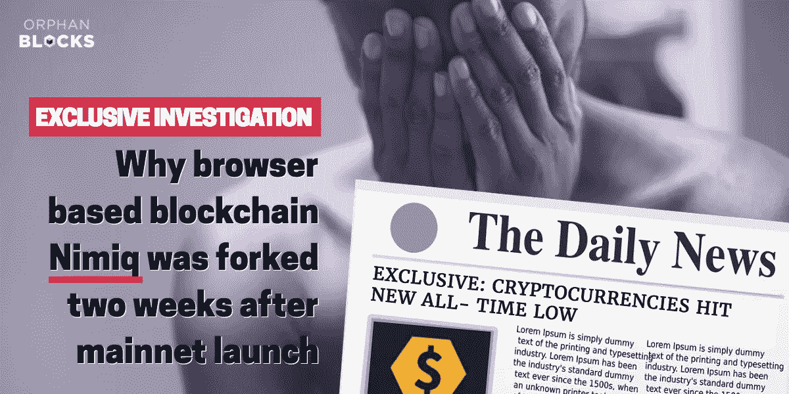

# 两周前的 mainnet 项目(Nimiq)即将分叉——这是加密货币的新低吗？

> 原文：<https://medium.com/hackernoon/two-week-old-mainnet-project-nimiq-about-to-be-forked-is-this-a-new-low-for-cryptocurrency-e3ee93d5c119>

这似乎是一个可怕的很久以前，但世界各地的加密货币爱好者在 2017 年 8 月 1 日集体握紧了他们的屁股，因为他们等待着导致比特币现金产生的有争议的硬分叉的结果。

当然，如今当又一个比特币问世时，我们甚至连眼睛都不会眨一下。自 8 月份以来，比特币黄金、钻石、私人和即将发布的 Prime 都有了 15 分钟的名气。

因此，当 Nimiq 社区的一些成员听到他们两周前的 mainnet 项目即将被分支的消息时，这让作者感到非常有趣，其中夹杂着困惑和愤怒。

忠实的 Nimiq 持有者确实有理由对这一发展感到困惑——没有其他加密货币项目在其生命周期的这一阶段看到分叉的特权。

孤儿街区的老读者会知道，我们在一月份制作了*精选之一。起初，我们对这个项目持怀疑态度，尤其是当他们得意洋洋地庆祝他们把捕鲸带进团队的消息时。*

*但正如我们在 1 月份的文章中所支持的那样，与加密货币领域的许多其他项目不同，Nimiq 是一项严肃的工程。这不是另一个建立在以太坊上的 dApp，有一个过于复杂的白皮书。事实上,[Nimiq](/nimiq-network/nimiq-a-peer-to-peer-payment-protocol-native-to-the-web-ffd324bb084)的白皮书只是一篇中等博客文章——但真正的卖点是 Nimiq Core 中 72，990 行架构精美的代码。*

*[Robin Linus](https://www.youtube.com/watch?v=nZMO7an07Qs) 尽管团队刚刚错过了在 2017 年底推出 mainnet 的重要里程碑，但他们一丝不苟的产品开发方法和基于区块链浏览器的前提足以在 1 月份赢得我们的认可。*

**

*The inventor of the Nimiq blockchain, Robin Linus introducing the project in a vlog.*

*然而，随着我们接近 2018 年第一季度末，社区的某些部分开始坐立不安。一直关注 Lightning Network 发展的读者都会熟悉 Nimiq 团队提倡的精神——“当它准备好了的时候，它就会准备好”。*

*对于社区中的许多人来说，这已经足够了。对其他人来说，缺乏清晰度开始变得令人不安。众所周知，Nimiq 在交流更新方面非常糟糕。他们经常发布可爱的 vlog，但是 vlog 经常忽略来自社区的实际投诉或查询，而是关注 Nimiq 想要交流的内容。*

*值得称赞的是，他们在社交媒体渠道上的集中讨论和投诉会导致团队的[最终回应，但总体而言，正在取得的进展和团队培育的精彩社区缓解了任何主要担忧，即使价格比我们首次推荐的项目下跌了 68.2%。](/nimiq-network/when-mainnet-richy-696d2e30eb2a)*

*然而，一个被反复提及的重要问题是 Nimiq 的营销方式。与区块链的其他项目形成鲜明对比的是(例如，Justin Sun 的 Tron——我们在今年早些时候曾在[更详细地报道过)，该团队总是将精力集中在他们的产品上，而不是大肆宣传和乏味的推广。](/@orphanblocks/five-cryptocurrency-projects-going-nowhere-f7dc4b6ed34f)*

*但是，在接受技术截止日期的延误的同时，人们开始向 Nimiq 团队询问他们的营销策略。*

**

*不屑一顾的 Nimiq 回应在这个帖子里是可以预见的:[https://www . Reddit . com/r/Nimiq/comments/83 w8ez/offmychest _ Nimiq _ maximum _ problem/](https://www.reddit.com/r/Nimiq/comments/83w8ez/offmychest_nimiq_biggest_problem/)*

*作为 Nimiq 项目的长期投资者(意识到我们也向我们的读者宣传了这个项目)，我们发现自己同意那些要求团队解释在 mainnet 发布后他们将如何促进项目的采用的人。令人担忧的是，似乎没有营销计划。*

*这是团队的功劳，他们一丝不苟，致力于发布高质量的产品，但这当然不意味着在此期间其他一切都要靠边站。*

***创业公司不以代码的质量而生死。这个世界上最大的社交网络在代码质量方面存在臭名昭著的问题，但这并没有阻止脸书统治他们的行业，同样，Nimiq 的轻蔑态度和按自己的节奏工作的倾向掩盖了他们所处的空间的性质。***

*可悲的现实是，他们正在争夺眼球，尽管他们在开发区块链方面付出了相当大的努力，但他们提供了一个未经测试的比特币 PoW 算法的 Javascript 端口，在推出的第一周，该端口由一个矿池主导。*

*这实际上是我们将要探索的 Nimiq 分叉的根本原因之一——但即使是那些不支持分叉的分裂社区的成员也在最近几天/几周内[提出了对营销的担忧](https://www.reddit.com/r/Nimiq/comments/8fnhjb/we_need_marketing/)。*

## *那么什么是 NimiqGold 呢？*

**

***NimiqGold** 是 2018 年 5 月 20 日举行的 Nimiq 的拟议分支。除了网站上已经删除的分叉背后的实际原理之外，很少细节(团队成员、白皮书等)被发布。这是档案中的一个片段:*

> *“……但我们已经加快了营销计划，并提高了硬币的使用率。我们将继续开发智能合约功能，并向每个以太坊持有者空投 NIMg”*

*Nimiq 社区的大多数人对此提议的分叉表示怀疑。一些人把这个项目称为骗局。其他人试图欺骗项目背后的成员。少数人支持这个项目。*

*当 nimiqnews.com“粉丝网站”的所有者发布了一个一对一的采访，解释了叉子背后的一些动机时，社区有机会听到更多关于叉子的信息:*

* [## 采访 Nimiq Gold

### Nimiq 的第一个公共分支 Nimiq Gold 本周在 Nimiq 社区中引起了一些波澜。想要得到更多一点…

nimiqnews.com](https://nimiqnews.com/home/2018/4/30/interview-with-nimiq-gold) 

接下来是一篇平衡的文章，解释了网站所有者不支持叉子的原因:[https://nimiknews . com/home/2018/4/30/marketing-is-not-a-product](https://nimiqnews.com/home/2018/4/30/marketing-is-not-a-product)

## 分叉提议的是什么？

虽然细节在这一点上有点单薄；以下内容已得到官方确认:

*   以 1:1 的比例免费空投给所有 Nimiq 和 NimG 以太坊的持有者。也就是说，你每拥有一枚镍币，你也将获得等值的镍币。这是一个类似于 ZCL/比特币合并的策略。
*   总计 100 万美元的孵化基金。欢迎团队向 NimiqGold 提出创业想法。被选中的推广 NimiqGold 应用的想法将赢得 20，000 美元，用于构建和发布他们的概念。
*   该项目负责人提到，为了上市新的镍币，已经开始与几家交易所进行谈判。尼米克戈尔德此前曾表示，交换是球队的优先事项。
*   越来越关注网络浏览器挖掘功能，该功能目前在 Nimiq 网络上没有产生高回报——尽管如何实现这一点没有详细说明。
*   尽管 NimG 的社区经理再次拒绝回答社区关于如何实现的问题，但智能合约功能也已得到承诺。

Snippet from the nimiqnews.com interview

正如上面的片段所示，这暗示了 NimiqGold 不会带来一大堆技术改进。相反，fork 的目的是简单地追求一种不同的策略，并把对核心 Nimiq 团队感到沮丧的社区成员带在身边。

可以理解的是，Nimiq 核心团队和一些更忠诚的社区成员可能会认为这是一种廉价的噱头，可以从已经投入到项目中的工作中获利。而那些支持 fork 项目的人将 NimiqGold 视为社区分裂时的标准区块链解决方案。

这确实引出了一个问题，即在项目开发的这个阶段进行分叉是否构成了廉价的金钱掠夺，或者正如 NimiqGold 团队成员之一所建议的那样，它是否在社区中引发了关于 Nimiq 项目采用什么策略的讨论？

我们不确定我们知道答案是什么，但有一点可以肯定的是，Nimiq 肯定已经将它的名字铭刻在加密货币记录簿上。

Nimiq 团队的官方回应是我们热切期待的，但现在看来，NimiqGold 已经沦为笑料。5 月 20 日这种情况是否依然存在，还有待观察。* 

*如果你喜欢孤儿街区，那么请加入我们的电报:[https://t.me/orphanblocks](https://t.me/orphanblocks)或关注我们的推特:[https://twitter.com/orphanblocks](https://twitter.com/orphanblocks)*

**

**免责声明:为了公开起见，Orphan Blocks 的一位作者与 NimiqGold fork 有联系。**