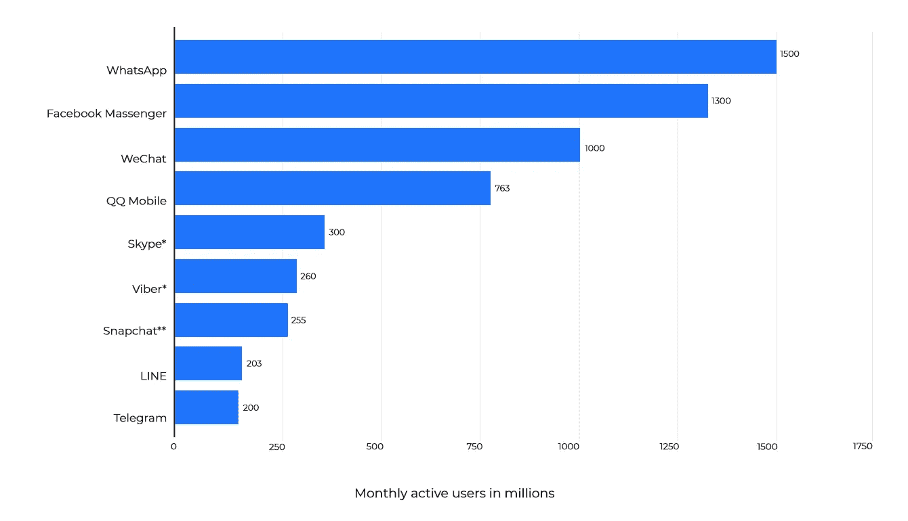
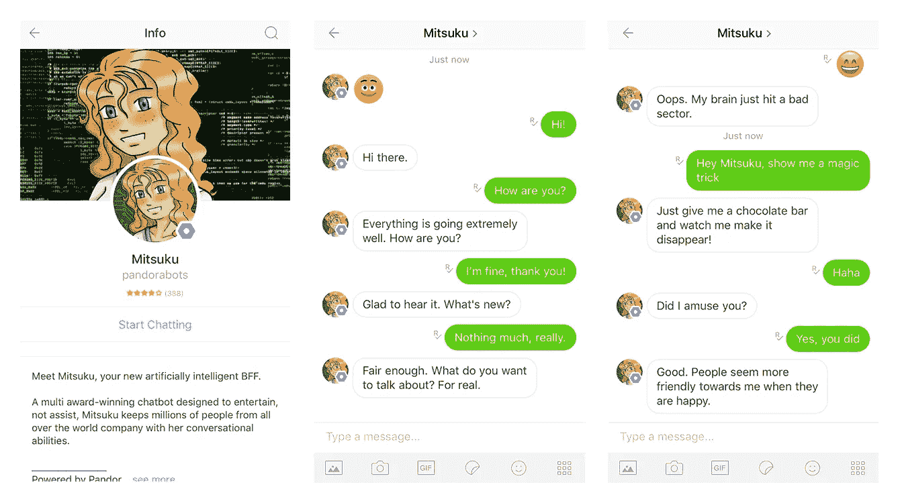
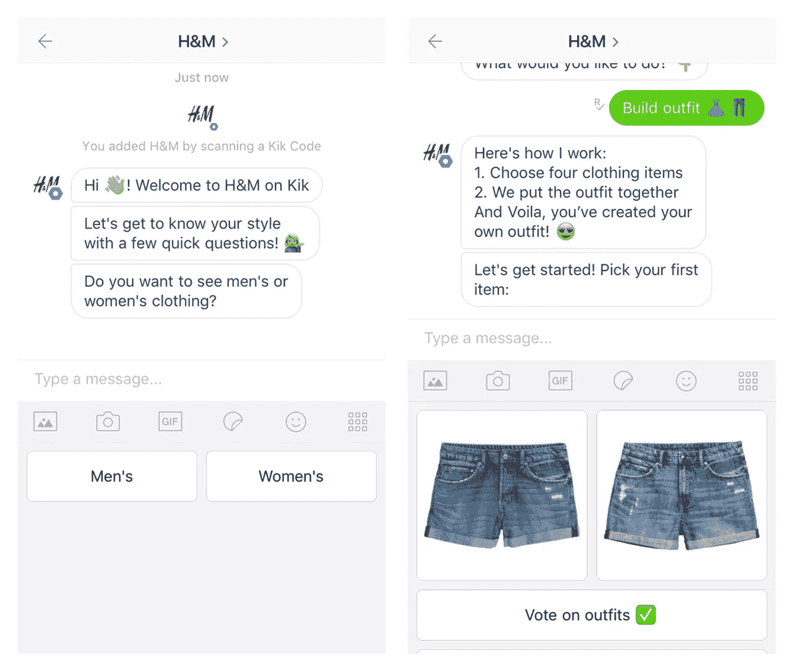
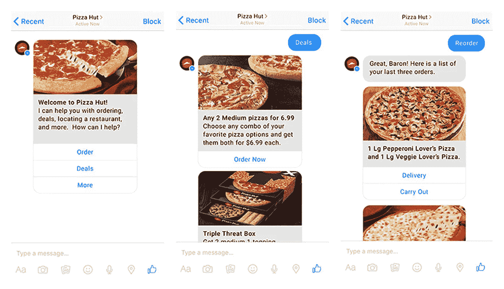

# 聊天机器人的类型以及它们如何帮助企业

> 原文：<https://medium.com/hackernoon/types-of-chatbots-and-how-they-help-businesses-113ceccd4ad0>

聊天机器人可以帮你和你的顾客交谈。这是因为他们有能力处理客户关系的各个方面，用一个机器人代替许多员工。

在这篇文章中，我们来看看聊天机器人的本质:它们是如何工作的，在哪里工作，哪些行业可以从中受益，以及它们已经在哪些方面取得了成功。

# 为您的聊天机器人寻找最佳平台

有两种聊天机器人——内置于信使的聊天机器人(Slack、Telegram、Discord、Kik 等)。)和独立应用程序。我们建议首先在 messenger 中构建一个聊天机器人，因为已经有很多人在使用它们了，这样你的服务才能得到应有的认可。看看这些 2018 年 4 月的统计数据就知道了，这些数据显示了每月 messenger 用户的[数量。](https://www.statista.com/statistics/258749/most-popular-global-mobile-messenger-apps/)

*Source: Statista.com*

位居前列的当然是 WhatsApp 和 Facebook Messenger，分别拥有 15 亿和 13 亿月活用户。排在第三位的是中国的微信，平均每月有 10 亿用户。QQ Mobile、Skype、Viber、Snapchat、LINE 和 Telegram 构成了名单的其余部分，每个公司的月用户都不到 10 亿，但仍然拥有大量用户。

为了给你的机器人选择一个完美的平台，研究一下你所在地区最受欢迎的信使。或者，你可以选择一个多平台聊天机器人，同时支持多个信使应用程序。

# 现在让我们了解一下聊天机器人是如何工作的

有两种主要的方法可以构建聊天机器人——有和没有机器学习。

# 学习的聊天机器人

使用机器学习的聊天机器人是可以学习并随着时间的推移变得更好的聊天机器人。这里的技术没有你想象的一半复杂，尽管乍一看确实很科幻。

机器学习驱动的聊天机器人的特别之处在于它们可以理解自然语言。与脚本机器人不同(我们稍后将讨论)，机器智能聊天机器人可以像真人表达问题和命令一样理解它们，而不是只理解一组预定义的命令。

如果你想提供类似人类的体验，这是有益的。

让我们以[三越](https://www.pandorabots.com/mitsuku/)为例:

*Source: Mitsuku on KiK*

Mitsuku 是三次罗布纳奖(相当于图灵测试的聊天机器人)的获得者。该机器人由人工智能标记语言(AIML)的史蒂夫·沃斯维克(Steve Worswick)创建，可在 Facebook Messenger、KiK、Telegram、Skype 和 Twitch 上使用，还具有原始网页版本和 Android 应用程序(目前处于测试阶段)。

Mitsuku 不是一个为了让你的生活更舒适而执行任务的助手。她是你的朋友，是你谈话的伙伴，也是你消磨时间的有趣方式。Mitsuku 可以讲笑话，问关于宗教和哲学的问题，并回答你可能对她提出的任何问题(如果他们不是“你能为我做这个吗？”).

# 不会学习的聊天机器人

脚本聊天机器人往往是企业的首选。他们擅长响应特定的命令和回答特定的问题。

脚本聊天机器人有一组问题，它可以用一组相应的答案来回应。这意味着每个会话只能遵循一些定义的路径。通常情况下，用户甚至不输入任何内容，而是从机器人理解的问题和命令列表中进行选择。

KiK 上的 T2 M 机器人是脚本聊天机器人的一个很好的例子。当你第一次登录时，它会问一系列问题来了解你的风格偏好。然后它提供了三个选项:

*   从 H&M 的目录中选择衣服和配饰来打造一套服装。然后，该机器人将该外观作为图像返回。
*   投票选出其他机器人用户创造的最佳服装。
*   按配饰或服装项目(如“黑衬衫”)搜索服装，查看包含它的用户生成的服装。

*Source: H&M bot on KiK*

聊天机器人在说什么和做什么方面受到限制。但如果你仔细想想，用户不会来 H&M 机器人寻求生活建议或讨论他们最喜欢的小说。他们想看看衣服，看看新的商品，组装一些服装，然后亲自去商店购买他们已经看过并喜欢的东西。

H&M 机器人做了它应该做的事情:它让人们参与到 H&M 品牌中，创造了一个互动交流的元素，并有效地追加销售客户。

# 聊天机器人的好处

根据你希望聊天机器人完成的任务，你会发现不同的结果。然而，聊天机器人可以给任何企业带来一些普遍的好处，不管它的主要目标是什么。

# 电子商务和在线营销

电子商务行业从聊天机器人技术中受益的方式有很多。当你的目标是销售产品和服务时，与客户直接沟通的能力至关重要。

我们已经提到了 H&M 聊天机器人，但你可能听说过丝芙兰、易贝、1–800-Flowers 和其他公司的其他例子。这些聊天机器人已经设法在短时间内大幅增加了公司收入。不仅如此，聊天机器人还可以通过许多其他方式帮助电子商务企业:

*   取代电子邮件——你可以简单地与你的客户进行聊天，而不是撰写数百封冷冰冰的电子邮件。
*   管理销售渠道——通过聊天，机器人可以确定哪些客户属于哪些销售渠道。这有助于您的企业选择转换它们的最佳方法。
*   增加互动性——就像 H&M 的例子一样，机器人可以为你销售的产品和服务提供互动元素。这可以帮助用户感觉他们已经知道你的选择，使他们更渴望购买他们已经看到和喜欢的东西。
*   在更私人的层面上建立客户关系——给聊天机器人添加一些个性是可能的。这可以把与他们聊天的过程变成一个真实的、几乎人性化的对话，有可能让客户更喜欢你的品牌。
*   解决废弃购物车的问题——客户经常将产品添加到购物车中，但最终却不会购买。在聊天机器人出现之前，营销人员会发送电子邮件提醒用户他们的购物车，但自从聊天机器人技术引入以来，这一过程已经发生了变化。现在，一个机器人给你的顾客发一条短信“嘿，你的车还在等着你呢！”作为友好的提醒。

# 旅行、接待和旅游

聊天机器人可以为旅行、接待和旅游行业做很多事情。他们提供 24/7 的数据访问，允许客户在旅途中即时预订行程和房间。使用聊天机器人对企业来说也更便宜！员工不需要接电话，一遍又一遍地重复同样的事情；顾客只需将他们的需求发送给聊天机器人。

聊天机器人已经在为万豪酒店、荷兰皇家航空公司、永利拉斯维加斯酒店和韦洛酒店工作。有了聊天机器人技术，公司可以在许多方面受益:

*   吸引观众——一旦客户向聊天机器人询问某件事，聊天机器人就可以分析他们写的内容，生成个性化内容。例如，在预订去洛杉矶的机票时，用户可以收到合作酒店的空房信息，了解附近最好的餐馆等等。有了一次学习这么多有用的东西的能力，客户可能会一次又一次地回到聊天机器人。
*   预测用户需求——在充分了解特定客户后，智能聊天机器人可以根据他们之前的请求提供服务。如果用户一年来每月去一次芝加哥，机器人可能会在他们通常的旅行日期前几天向他们提供房间可用性信息。
*   推荐附近的位置——让你的聊天机器人知道你的酒店或机场附近的咖啡馆和餐馆，用户会非常乐意问它在哪里喝咖啡或吃早午餐。对于机场，用户可以询问服务和设施。
*   提供自动化服务——酒店内的机器人可以让用户订餐或客房服务，而无需打电话给任何人。
*   24/7 客户服务——每当用户对酒店或交通有疑问或担心时，客服聊天机器人可以回答他们。如果这项技术不能提供相关信息，顾客可以被简单地重定向到一个真实的人。

案例分析:[分享您最喜爱的旅行体验的社交媒体平台](https://steelkiwi.com/projects/social-media-platform-for-sharing-your-favorite-travelling-experiences/)

# 卫生保健

说到医疗保健，没有什么能取代真正的专业人士。然而，在某些情况下，聊天机器人技术可以通过促进健康生活和帮助患者解决一些重要问题来真正拯救生命。聊天机器人可以指导用户度过紧急情况，给他们一步一步的 CPR 指导或解释如何帮助糖尿病患者，并执行许多其他任务:

*   支持自我护理和自我监控——聊天机器人不一定要回答问题和分享信息。它可以帮助患者跟踪他们的健康和健身情况。例如，患者可以测量他们的身体(血压、体重、脉搏、血糖水平等)。)，把它们交给一个聊天机器人，然后查看一段时间内对它们数据的综合分析。如果一些测量值相差甚远，聊天机器人可以表示关注，并提出安排医生的预约。
*   聊天机器人还可以设置服药、添加健康数据、锻炼、喝水等提醒。
*   提供可靠的医疗信息——谷歌搜索一种假想疾病的症状现在已经成了一个笑话。然而，如果聊天机器人连接到一些可靠的医疗数据库，它就能够给病人提供相关的医疗建议，并提供了解他们病情的方法。
*   从新病人那里获取重要信息——你知道每当你去一个新医生的办公室时需要填写的那些长长的问卷吗？如果有一个可以请求、记录并分析重要患者信息的聊天机器人，回答这些问题会简单很多倍。

更多阅读:[如何打造有效的医疗移动 App](https://steelkiwi.com/blog/how-to-build-medical-mobile-app/)

*   执行自动预约随访——在预约后的某个时间与患者联系是非常重要的。聊天机器人可以通过询问人们的感受并判断他们是否需要另一次约会来做到这一点。
*   这也适用于术后护理。然后，聊天机器人可以充当袖珍护士，提醒药物治疗，解释病人可能遇到的一些问题，并在必要时安排医生的预约。
*   展示电子医疗记录。这项功能更像是医院的内部工具，可以让医生通过简单地输入病人的 ID 号来快速接收病人的信息。

案例研究:[开发一款用于医患咨询的移动医疗应用](https://steelkiwi.com/projects/mobile-healthcare-app-for-doctor-patient-staff/)

# 按需服务

想象一下，用短信描述你的完美披萨，然后让它出现在你家门口。这正是聊天机器人可以为点播服务提供的那种功能。看看必胜客是如何通过他们的 Facebook Messenger 和 Twitter chatbot 做到这一点的。

*Source: Pizza Hut bot on Facebook Messenger*

必胜客的技术允许顾客用手指轻轻一点就能下单。它可以回答常见问题，并提供最新的促销信息。因为这个机器人非常容易访问，并且不需要单独安装，所以用户对它没有任何压力，这导致了更高的保留率和更容易的订购。

了解更多:[如何为餐厅搭建送餐 App](https://steelkiwi.com/blog/how-build-food-delivery-app-for-restaurant/)

# 银行和金融

许多全球银行已经将聊天机器人整合到他们的服务中:美国运通、PayPal、美国银行、万事达卡、Visa 等等。你自己可能也用过他们的一些财务助理——比如 Eno、HiCharlie 或者 Trim。金融机构可以通过聊天机器人实现的功能包括:

*   账户提醒和通知——聊天机器人可以让你知道你的账户上发生了什么异常活动，以确定是不是你。它还可以提醒费用，即将到来的收费，等等。
*   关于财务管理的提示和建议——聊天机器人可以帮助用户根据他们过去的支出找出最有效的花钱方式。例如，它可以监控订阅，然后指出他们不再使用的订阅，这样他们就可以停止付费。
*   客户服务——聊天机器人可以全天候回答客户迫切的问题，无论他们被问及什么或何时被问及，它们总是友好且提供信息。
*   帮助企业资源管理——聊天机器人还可以帮助自动化重复的银行内部流程。

阅读更多:[如何最大限度地成功实现业务流程自动化](https://steelkiwi.com/blog/how-to-maximize-success-of-business-process-automation/)

# 客户服务

最后但并非最不重要的是，我们来看看客户服务——聊天机器人可能在这方面做得最好。拥有一个可以根据需要尽可能详细地回答客户问题的数字助理实在是太方便了。基于聊天机器人的客户服务可以应用于任何行业，完成两个主要任务:

*   自动化常见问题解答—通常情况下，客户想要相同问题的答案，但不想阅读 FAQ 页面。然而，回答常见问题并不是员工消磨时间的有效方式，让聊天机器人回答这些问题可能是一个更好的解决方案。
*   区分聊天机器人可以回答的问题和应该提交给真人的问题——无论它们有多聪明，聊天机器人都不能完全代替真人。聊天机器人可以看着它被问到的问题，根据它的回答能力给它打分，然后把更复杂的问题交给人类助手。

# 用 SteelKiwi 开发聊天机器人

你是否被聊天机器人技术的众多好处所鼓舞？如果是这样，我们强烈建议您[联系我们的销售代表](https://steelkiwi.com/contacts/)，从今天开始讨论您的产品。

也欢迎您浏览我们的 [SteelKiwi 项目](https://steelkiwi.com/projects/)页面，了解我们迄今为止创造的令人惊叹的产品。