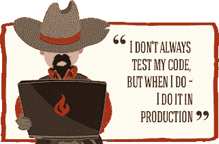

# 编写自动化测试要避免的典型参数…以及它们的反参数:)

> 原文：<https://medium.com/hackernoon/typical-arguments-to-avoid-to-write-automated-tests-and-their-counter-arguments-35bc180b38df>

作为一名测试爱好者，我经常不得不与一些对测试难以接受的人打交道，他们有很多刻板印象和偏见。以下是我遇到的拒绝中排名前 8 位的(没有优先顺序)。

# 1.编写测试会花费我太多时间

1.  当然，编写测试需要一些时间，但是你必须把这当成一项投资。**在**之后，你会赢得时间，因为不会有一次又一次的错误出现。
2.  当编写测试时，你学习不同的部分是如何一起工作的，因此，你会更好地了解你的系统，并且**在调试错误和问题时，你会更有效率**。

# 2.代码是不可测试的

1.  如果你的代码是不可测试的，它可能是不可重用的，也不容易配置，你会有更多的问题。你必须将你的代码分割成更小的部分，尽可能使用接口，学习如何进行一些依赖注入。
2.  顺便说一句，我从未见过任何根本不可测试的代码，(好吧，也许非常特殊的处理器的汇编代码在没有硬件的情况下很难测试…但即使在这种情况下，测试也可以通过测试平台来完成)

# 3.测试仍然存在缺陷

1.  是的，这是真的，这是代码和 bug 之间的直接关联，。自动化测试可能比避免新的错误更有效地防止回归错误，但是回归是任何开发人员和 IT 经理的噩梦。
2.  如果您在开发阶段编写测试，您肯定会发现 bug，就像您在进行手动测试一样，但是这些 bug 将会被永久地修复(一旦编写了测试，bug 将会被彻底埋葬)。

# 4.编写可测试代码太复杂了

1.  是的，这是真的，但是编写无 bug 代码更加复杂:)
2.  不要害怕，这对每个人来说都很难，就像你第一次写代码时一样，但是你写的测试和可测试的代码越多，你写测试就越轻松

# 5.测试代码会增加需要维护的代码数量，导致维护成本增加

1.  嗯，根据我的邮箱，每个人都需要扩大他的…哦，…不，这次不行，对不起…
2.  这是正确的，更多的测试意味着更多的代码行…但是，有一个补偿，有一个良好的测试覆盖率，重构你的代码是容易和无害的，所以你将能够减少代码量来维护= >双赢？
3.  您的基本代码可能会稍微大一点，但是更加模块化和更加孤立(这是编写测试的结果)，所以您将更容易替换/更改/分割您的基本代码为更小的部分，然后降低维护成本。

# 6.我们不需要测试，我们只需要写一些小补丁

1.  你修补的代码没有经过任何测试？如果你真的只是对现有代码创建一些补丁，这是开始学习如何进行一些功能测试(或系统测试)的好时机，你将不得不从更高的层次测试一个完整的功能。
2.  这是遵循童子军规则的良好起点:“**让你的代码比你发现的更好。**”。如果原代码没有任何测试，开始写一些:)。

# 7.我不需要测试，我做公关和代码审查

1.  代码审查(和拉请求)当然比什么都没有好，但是它检测 bug 的效率与同行的经验和暗示有太多的关系，你必须遵循一些规则来进行有效的 PR(小的 PR，孤立的修改……许多你在做测试时自然会做的事情)😇)
2.  不管怎么说，它不会保护你不回归，但是测试会:-)。

# 8.我们不知道如何写测试！

1.  这一条是**好论证**，但**没有什么是不可能的**；)开始阅读关于编写测试的好的在线资源，从阿尔贝托·赛唯雅的[测试方法](https://www.artima.com/weblogs/viewpost.jsp?thread=203994)开始，这是理解测试心情的一个好的开始。
2.  所以你不知道如何写测试，但是也许你的一些同事已经写了自动化测试？试着问他们做这件事的好方法(编写自动化测试的人通常非常乐意与其他开发人员分享他们的知识，不要害怕向他们寻求帮助，你会得到回报的)

如果你喜欢这篇文章，请鼓掌；)

欢迎反馈、评论、备注，随时评论/开始讨论:)

*原载于 2018 年 12 月 7 日*[*pythonic-stuff.blogspot.com*](https://pythonic-stuff.blogspot.com/2018/12/typical-arguments-to-avoid-to-write.html)*。*