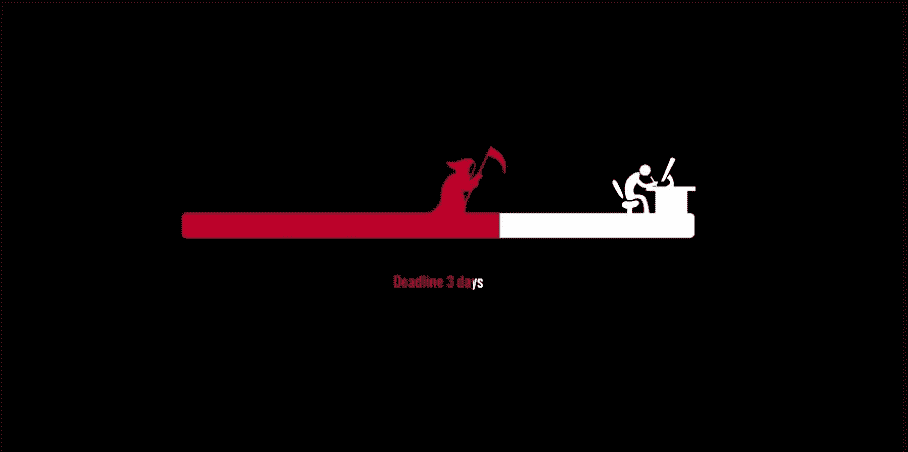
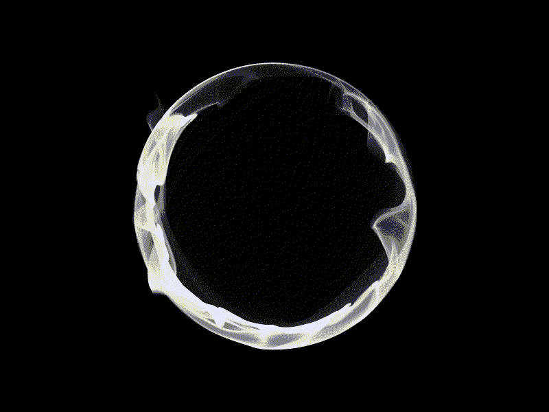
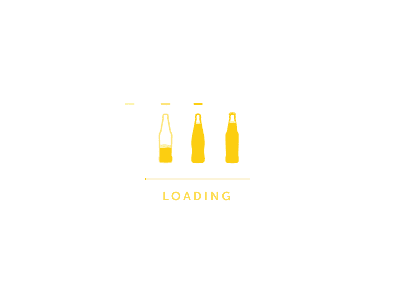
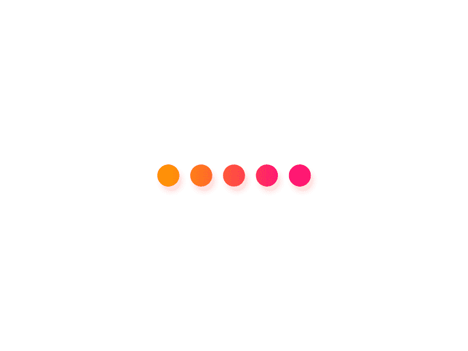
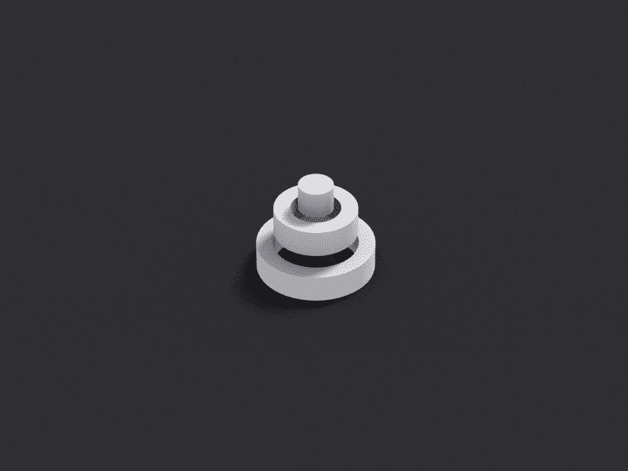
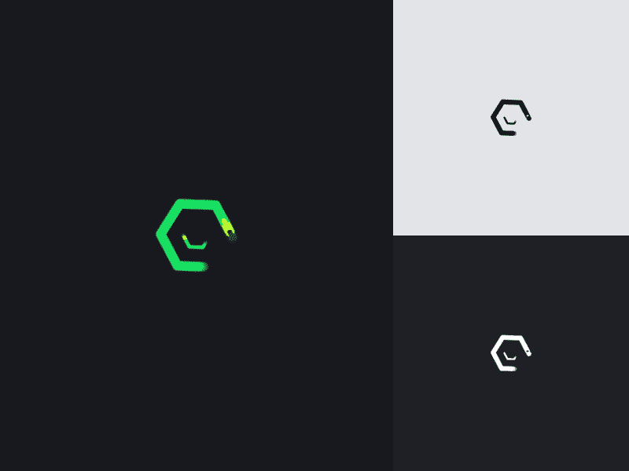
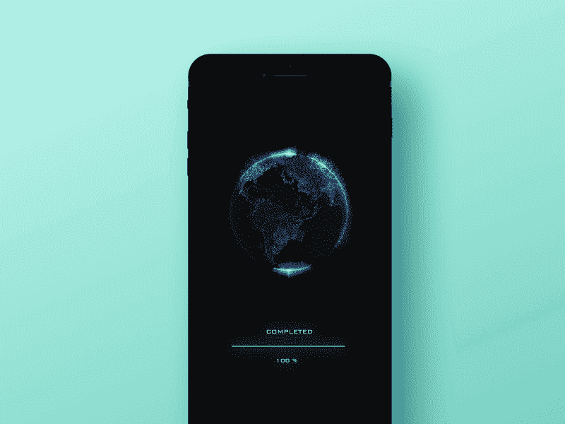
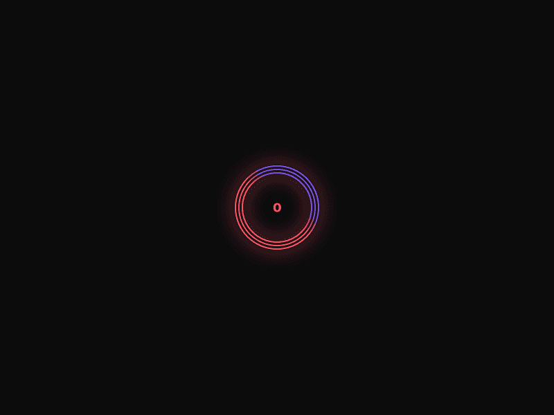
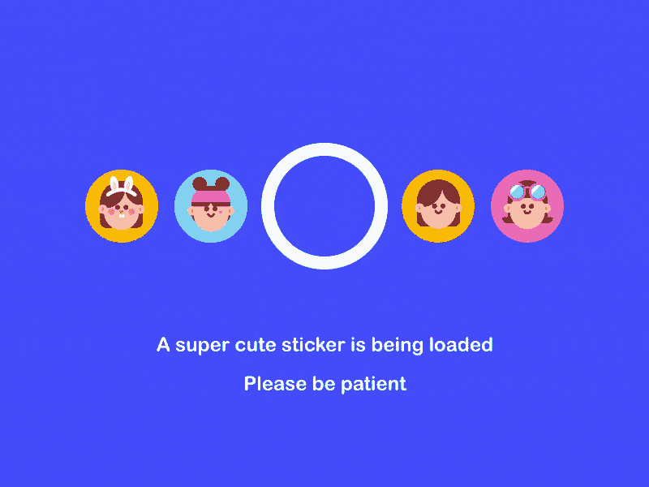
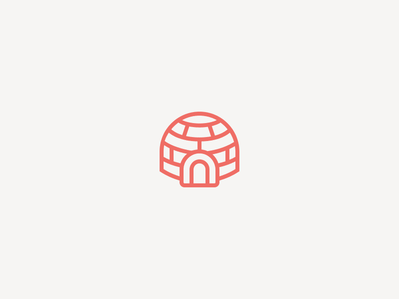

# 15 个最新最好的加载动画，让用户享受等待

> 原文：<https://medium.com/hackernoon/u15-latest-and-best-loading-animations-to-make-user-enjoy-waiting-9c7861ed5d47>

如今，由于[互联网](https://hackernoon.com/tagged/internet)速度已经大大提高，人们可以在几秒钟内顺利打开一个网站/应用程序，并快速获得他们想要的信息。然而，有时，让他们等待是不可避免的，因为有大量的数据/页面需要处理/加载/下载。

在这种情况下，你应该做些什么来让他们在网站/应用上呆得更久，而不是作为 UX/UI 设计师直接离开？在你的站点/app [设计](https://hackernoon.com/tagged/design)中使用[这种优秀的设计工具](https://goo.gl/otVypm)或者添加一个漂亮、有趣、吸引眼球的加载动画来留住访客怎么样？但是，不知道如何设计这样一个醒目的和用户友好的加载 gif，使用户享受等待？

以下是我们收集的 15 个最新最好的加载动画，供你获取灵感:

# 1.[球体动画 WIP](https://dribbble.com/shots/4175222-Orb-animation-WIP)

**设计师:阿列克谢·茨韦特科夫**

**亮点:神秘的烟雾特效**

进入这个页面后，你自然会被这个带有神秘烟雾效果的旋转圆圈所吸引，并忍不住多看一会儿？好吧！这已经完美地证明了这个加载动画是多么大。

**你能学到什么**:

在您的设计中，您还可以创建带有烟雾效果的旋转圆圈/圆柱，使它们与众不同。当然，如果可能的话，你最好也采用黑色背景来加强白烟效果。而这样的设计可以让你的加载动画变得异常神秘，引人注目。

# 2.[加载微动画](https://dribbble.com/shots/2887008-Loading-Micro-Animation)

**设计师:尼克·布特里什维利**

**亮点:很好的结合了网络产品的特点**

作为一部专门为某啤酒厂网站设计的加载动画，这部动画的设计者完美结合了 web 产品的特点，创作了一部呈现其啤酒厂产品生产过程的动画。

这不仅可以引起用户的兴趣，减少他们的挫折感(当他们不得不等待的时候)，还可以让用户更加生动直观地了解公司和产品。

**你能学到什么**:

在你的加载动画设计中，你也可以学会结合 web/app 产品、公司甚至品牌的特点来打动访客，改善用户体验，最终增加销量等。

例如，除了在你的设计中展示生产过程，你还可以动态展示热门产品、公司/员工/文化照片和更多有趣的事件等。

# 3.两代情 e indietro 装载机

**设计师:维塔利·西尔金**

**亮点:图形简单的位置变换和漂亮的颜色渐变**

这个加载动画试图通过按适当的顺序转移图形的位置来吸引用户的注意力。它简单、直观、有效。而且颜色渐变的使用让整个动画更加美观舒适。当然，在用户不得不等待的同时，丰富繁琐的时间也是一个很好的尝试。([点击了解如何在 app 设计中使用颜色渐变](https://www.mockplus.com/blog/post/gradient-color-app-design))

**你能学到什么**:

在你的设计中，你也可以用类似的位置变换把不同的图形按适当的顺序前后、左右以及上下变换。此外，为了让你的设计更吸引人和有趣，你还可以为这些动态图形添加一些发光和流动的效果。简而言之，一个干净简单的图形动画也能够变得有趣和吸引人。

# 4.[加载屏幕动画—沙漏](https://dribbble.com/shots/4275501-Loading-Screen-Animation-Hourglass)

**设计师:二宫牧人**

**亮点:栩栩如生的沙漏，动画和缩微拷贝的完美结合**

这个加载 gif 的设计对你来说无疑是一个动画和 microcopy 完美结合的绝佳范例。沙漏主题的动画非常有效地吸引了用户的注意力，拉近了他们之间的距离。而微副本说“感谢你的耐心”也是一种更深层次的尝试，以获得用户的理解，并与他们达成一种情感交流。

**你能学到什么**:

在你的加载动画设计中，最好也加入一些设计良好的文字，以获得用户的共鸣/理解，提高用户体验。

# 5.[“弹跳”——B&W 加载动画 9](https://dribbble.com/shots/4094897--bouncy-B-W-loading-animation-9)

设计师:莉莲·泰东

**亮点:形状、跳跃和旋转的完美结合**

尽管这个简单的装载动画仅仅是设计了一个跳跃和旋转的圆圈和方块，但这并不意味着它是糟糕和无聊的。相反，这种设计通过形状、跳跃和旋转的完美结合，非常可爱和吸引人。当然，让用户享受等待也是另一个好镜头。([点击查看更多类似 Lilian Tedone 的简单又吸引人的加载 gif 设计](https://dribbble.com/BeardDesign)

**你能学到什么**:

在您的设计中，您也可以模仿这种加载动画，并尝试使用不同的形状与跳跃，旋转和更多的动态效果或颜色和阴影变化等。，让你的设计更加可爱多变。这也有助于增强视觉效果，改善用户的设计体验。

# 6.[熔化装载机](https://dribbble.com/shots/4155980-Melting-loader)

设计师:维塔利·西尔金

**亮点:有趣的流体和发光效果**

首先，这种装载设计采用了出色的流体效果(对于向前移动的线)，这确实是一个很好的尝试，让人们自然地大喊“嘿，那条线正在融化”。很酷。而且，它的黑蓝配色也让这条“融”线在黑暗中发光，极其有趣独特。

[最佳免费 UI/UX 设计工具](https://goo.gl/otVypm)

另外，这种“发光”线的无限缓慢延伸也是安抚用户情绪，让他们等待长得多的时间的好策略。

**你能学到什么:**

所以，当你试图为一个网站/app 设计一个加载动画时，你也可以采用类似的流体、水滴、融化和发光效果，让你的设计更加突出和吸引眼球。

# 7.[装东西的人](https://dribbble.com/shots/3498589-Loader-of-things)

**设计师:UI8**

**亮点:出色的嵌套模式和 3D 效果**

本设计采用环形嵌套图案，简洁流畅。这些戒指的 3D 效果也使整个设计更加直观和时尚。而这些设计技巧真的很值得你在设计中去尝试。

**你能学到什么**:

因此，与您的设计一样，您也可以采用类似的嵌套模式，使您的动画更加多变和灵活。直观的 3D 技术也值得模仿，以增强你的 gif 设计的视觉效果和用户体验。

# 8.[预加载器动画](https://dribbble.com/shots/4109909-Preloadeer-Animation)

设计师:罗德迪约·普拉斯特

**亮点:可爱的插画风格和有趣的圣诞特色组合**

这部动画采用了可爱的插画风格，既好看又独特。而且还完美结合了圣诞节的特色，以一只可爱的驯鹿为主要部分。所以，这种加载动画对于一些针对儿童的在线课程(尤其是一些绘画课程)、在线购物以及更多为儿童制作的类似网站/应用程序来说，确实非常理想，可以制作一个有吸引力的圣诞专栏。

**你能学到什么**:

所以，你也可以选择一个节日主题，并适当添加一些节日元素，如节日习俗、故事、事件和典型人物，以创建一个更有趣和有特色的加载动画。

如果可能的话，还要结合网站/app 产品的特点，让整个设计更加独特和有用。总之，无论你最终会选择哪种技能，都是在用户不得不等待 web/app 数据处理/下载/加载时，抓住用户注意力，缓解用户焦虑的良好尝试。

# 9.[加载器动画](https://dribbble.com/shots/4165833-Loader-Animation)

设计师:布尔罕·卡瓦贾

**亮点:多屏显示模式、颜色渐变和旋转效果**

不同于一些常见的加载动画只有一个屏幕来显示所有的动态形状/插图/图形，这种设计采用了多屏显示模式，这使得它真的很酷，很吸引眼球。而且颜色渐变和旋转效果的运用也让这个设计更加华丽耀眼。

**你能学到什么**:

在为您的 app/网站制作加载动画的同时，您也可以采用这种多屏显示模式，结合颜色、动态效果和形状的变化来改进您的设计。

# 10.[加载应用程序的屏幕图像](https://dribbble.com/shots/4276258-Loading-screen-visual-for-app)

**设计师:Nguyen Tran**

**亮点:色彩对比营造出酷炫的科幻视觉效果**

作为一个专门为 android/iOS 移动应用/web 设计的加载动画，这个设计展示了一个浅蓝色的旋转地球仪和黑色背景中的前进进度条。而这样的色彩对比营造出科幻的视觉效果，又酷又时尚。

**你能学到什么**:

所以，你也可以使用类似的颜色对比，并添加一个直观的进度条，为你的 iOS/android 加载动画创建一个很酷的科幻视觉效果。([点击了解如何制作一个吸引人的进度条](http://doc.mockplus.com/?p=1878))

# 11.[加载动画](https://dribbble.com/shots/3089041-Loading-Animation)

**设计师:亚历克斯·赛勒**

**亮点:快速换号，用户体验更好**

用户在等待时最害怕遇到的事情是加载界面不提供任何信息，也从不改变。他们只是觉得迷失在无限的黑暗中，无法自拔。

幸运的是，这部动画的设计者意识到了用户的这一心理事实，并特别添加了快速旋转的彩条和快速变化的数字，以告诉用户这个 web/app 正在后台快速处理他们的问题。这确实是一个给用户提供更愉快体验的好机会。

**你能学到什么**:

在你的设计中，也可以模仿这个动画，加入一些变化的数字或者移动的进度条，来留住用户，提升用户体验。

# 12. [U3D 加载动画](https://dribbble.com/shots/4183817-U3D-loading-animation)

**设计师:亚历克斯·赛勒**

**亮点:直接显示加载内容**

这个加载动画最有创意的地方就是动态显示原 web/app 的加载内容。这真的是信息丰富，让用户忘记等待的无聊。而且，展示一些可爱的、色彩鲜艳的贴纸来吸引用户的注意力，也是非常有趣和有效的。颜色的变化也使整个设计更加多变和吸引人。

**你能学到什么**:

在你的动画设计中，还可以直接呈现有趣的加载内容，以引起用户的兴趣，让他们在网站/app 上停留的时间长得多。

例如，当您试图创建一个专门针对 UX/UI 设计作品集的加载动画时，您可以直接在加载动画中介绍作者或呈现 UX/UI 设计照片，如展示一些作者照片、界面设计照片等。(点击查看[让你的 UI 设计师作品出类拔萃的原则](https://www.mockplus.com/blog/post/ui-design-portfolios))

# 13.[旋转螺旋几何](https://dribbble.com/shots/4055276-Spinning-Spiral-Geometry)

设计师:丹尼·佩里

**亮点:彩条智能旋转**

色条的旋转已经很酷了，令人印象深刻。当您为这些颜色条添加更多的旋转图案时，整个加载动画可能会更具变化性和吸引力。

**你能学到什么**:

所以，你也可以使用颜色条，并为它们设计更多的旋转图案，让你的加载动画更令人印象深刻，更有特色。

# 14.[加载动画图标](https://dribbble.com/shots/1655310-Airbnb-Loading-Animation-Icons)

**设计师:扎克·罗斯柴斯基**

**亮点:不同图标的精彩组合**

这个加载动画动态呈现一些图标来吸引用户的注意。这个简单有趣。

**你能学到什么**:

当你不知道如何设计和改进你的加载动画时，你可以学习这个动画，并尝试在你的网站/应用程序中动态展示一系列常用/典型的图标，使其与众不同。而且，当你结合旋转图案、颜色和位置的变化来显示它们时，你的加载 gif 也能够是独特和优秀的。

# 15.[发光的装载立方体](https://dribbble.com/shots/4133861-glowing-loading-cube)

**设计师:Graig Mederios**

**亮点:公司/产品标志的使用和发光效果**

这个设计直接展示了如何创建一个 web/app 公司或产品的 3D 标志的过程。这是非常酷和直观的。而这种 3D logo 的发光效果也有效的抓住了不同用户的注意力。

**你能学到什么**:

在你的设计中，你也可以充分利用公司/产品标志。

简而言之，无论你是否正在尝试为一个 web/android/iOS 应用程序制作加载动画，希望这 15 个最新和最具创意的加载动画集能够对你有足够的启发。

# 包裹

加载动画，作为让一个 web/app 变得漂亮、有趣、出众的重要元素，对于提升用户体验，让他们在 web/app 上停留更长时间也有着至关重要的作用。所以，在实际设计中，你最好充分利用每一个加载的动画来突出你的 web/app。

总之，希望介绍的 15 个最新最有创意的装载动画能给你带来启发。而提到的原型制作工具 Mockplus 也可以如你所愿的帮助测试和改进你的加载动画。