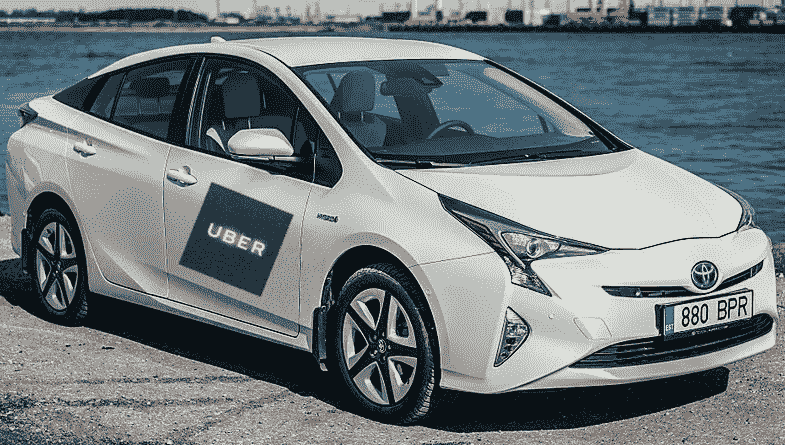
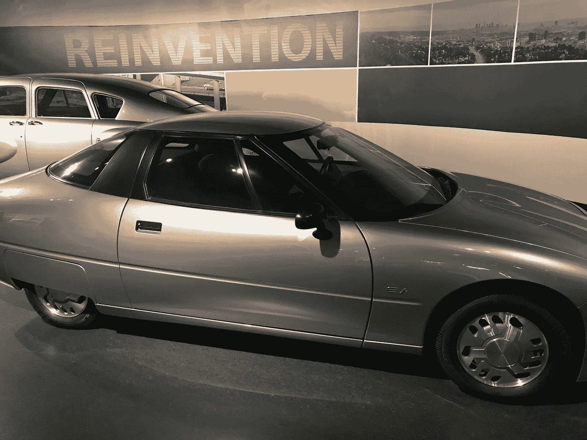

# 优步的自动驾驶汽车项目终于成长起来了

> 原文：<https://medium.com/hackernoon/ubers-autonomous-vehicle-program-finally-grows-up-55f1a7cfd596>

## 幸运的是，优步-丰田交易是一场对立的联姻。

Credit: [Kārlis Dambrāns](https://www.flickr.com/people/65265630@N03) (via WikiMedia Commons).

对于那些追随优步不断发展的公司战略的人来说，这是忙碌的几周。这家市值 700 亿美元的拼车公司最近发布了两项重大公告:一项是[向电动自行车和踏板车](https://www.theguardian.com/technology/2018/aug/27/uber-to-diversify-into-electric-bikes-and-scooters-to-drive-growth)的战略转移，重点是城市核心区的机动性(可能会以牺牲优步传统的以汽车为导向的业务为代价)，另一项是[由丰田](https://www.reuters.com/article/us-uber-toyota/toyota-to-invest-500-million-in-uber-for-self-driving-cars-idUSKCN1LC203)投资 5 亿美元，帮助支持优步开发[自动驾驶](https://hackernoon.com/tagged/autonomous)车辆。

虽然电动自行车和无人驾驶汽车似乎没有太大的关系，但这两个战略举措紧密相连。了解他们的联系揭示了优步首席执行官 Dara Khosrowshahi 对移动未来的思考方式。因此，优步的自动驾驶汽车发展计划终于成熟，成为值得认真对待的事情。

> 优步开发 AVs 的商业逻辑似乎是显而易见的:无人驾驶 Uber 可以利用现有的庞大拼车客户群，提供与人们熟悉的服务非常相似的出租车服务，同时通过取消司机工资来削减成本。

优步对自动驾驶汽车(AVs)的追求始于 2015 年在前首席执行官特拉维斯·卡兰尼克[的领导下。他为一个极具侵略性的战略定下了基调，](https://www.uber.com/blog/uber-and-cmu-announce-strategic-partnership-and-advanced-technologies-center/)[从卡耐基梅隆大学挖走了近 50 名机器人研究人员](https://www.theverge.com/transportation/2015/5/19/8622831/uber-self-driving-cars-carnegie-mellon-poached)，后来又在匹兹堡、凤凰城、多伦多和旧金山湾区进行 AV 测试。该计划因 [2016 年收购奥托](https://www.reuters.com/article/us-uber-tech-volvo-otto-idUSKCN10T1TR)而加速，奥托是由前谷歌员工安东尼·莱万多夫斯基创立的自动驾驶卡车初创公司。作为收购的一部分，莱万多夫斯基接管了优步的 AV 项目，并回应了卡兰尼克的紧迫感，认为“[这是一场比赛，我们需要赢得[……]第二名是第一个失败者](https://www.nbcnews.com/tech/tech-news/former-uber-ceo-steals-show-court-trade-secrets-bro-cabulary-n845541)”。

优步开发 AVs 的商业逻辑似乎是显而易见的:无人驾驶 Uber 可以利用现有的庞大拼车客户群，提供与人们熟悉的服务非常相似的出租车服务，同时通过取消司机工资来削减成本。优步在这一战略上下了很大的赌注，2017 年花费了 7 . 5 亿美元。

但是这一策略问题重重。2016 年，优步开始在没有加州 DMV 许可的情况下在三藩市测试 AVs，声称其车辆[在技术上不属于法律](https://www.theverge.com/2017/2/27/14698902/uber-self-driving-san-francisco-dmv-email-levandowski)的范围。州政府不同意，优步关闭了它的项目，搬到了亚利桑那州。(数十家其他公司[为许可证注册了](https://www.dmv.ca.gov/portal/dmv/detail/vr/autonomous/testing)，包括谷歌/Waymo、特斯拉、宝马和通用汽车 Cruise。)谷歌/Waymo 指控优步在收购奥托的过程中窃取了激光雷达(一个关键的 AV 传感器组件)计划的诉讼终于在二月份以 2 . 45 亿美元的价格在[达成和解](https://www.wired.com/story/uber-waymo-lawsuit-settlement/)。今年 3 月，一辆自动驾驶的优步测试车[在亚利桑那州坦佩市撞死了一名行人](https://readbackline.com/regulating-self-driving-cars/was-uber-responsible-for-the-fatal-self-driving-car-crash-in-tempe-nre0ppow/)，这是第一起已知的无人驾驶汽车导致行人死亡的事件。随之而来的后果是，优步在全国范围内关闭了反病毒测试。

> 最近的公告证实了这一点，并强调了 Khosrowshahi 关于影音市场的核心结论。它们与卡兰尼克的非常不同，幸运的是，它们都很好。

在卡兰尼克于 2017 年离职后，有人猜测新任首席执行官达拉·科斯罗萨西(Dara Khosrowshahi)可能不会分享相同的自动驾驶汽车战略愿景。最近的公告证实了这一点，并强调了 Khosrowshahi 关于影音市场的核心结论。它们与卡兰尼克的非常不同，幸运的是，它们都很好。

其中第一个也是最重要的是 **AVs 不会很快开发**。尽管在 AV 开发上投入了大量资金，但我们距离真正的 4/5 级(完全自动驾驶)车辆还有很长的路要走。对这需要多长时间的估计差异很大，但有一点是明确的:将需要大量的道路测试，可能在 10 亿到 100 亿英里的范围内。这很容易持续十年甚至更久，尤其是如果制造商[拒绝共享数据](https://www.newyorker.com/business/currency/will-driverless-car-makers-learn-to-share)。理解了这一点，就清楚了为什么没有必要以牺牲安全为代价紧急进行道路测试。

第二个结论是，AVs 不会成为赢家通吃的市场。第一家将真正的 4/5 级 AV 投入使用的公司不会自动淘汰其他公司。它甚至可能不会占据太多的市场份额。汽车市场和 IT 市场的历史都有助于证明这一点(有人记得通用汽车的 EV1 或 IBM 的 Simon 吗？).

GM’s EV1 on display at the Smithsonian National Museum of American History. Credit: Colin McCormick.

但更重要的是，AVs 几乎肯定只能在有限的环境中实现“有效”的 4/5 级性能(“[运营设计领域](https://hackernoon.com/was-tesla-responsible-for-the-2016-autopilot-crash-ed84ddd3324a)”)。这意味着它们将为不同的驾驶条件(城市、高速公路、郊区等)量身定制。)和不同的天气条件。他们也将在很大程度上被限制在已经被高细节地图化的区域。所有这些因素表明，影音市场将有许多利基市场，包括基于使用和基于位置的市场，许多公司将找到市场份额。理解了这一点，就清楚了为什么第二名并不是真正的“第一名失败者”。

第三个结论是**我们所知的汽车不会成为解决城市核心区短程交通的增长部分**。当然，自 2014 年以来，优步和其他拼车公司在纽约市取得了显著增长，但他们是以牺牲传统出租车为代价[实现这一增长的。虽然总乘坐次数(出租车加拼车)有所增加，但几乎所有的增长都发生在服务水平低下的外围区，而不是城市核心区。相反，更便宜、更轻便的选择，如电动自行车和踏板车，将越来越多地填补满足城市核心交通需求的缺口，至少在未来十年是如此。](http://toddwschneider.com/posts/analyzing-1-1-billion-nyc-taxi-and-uber-trips-with-a-vengeance/)

> 事实上，丰田现在愿意在优步的 AV 项目上投入大量资金，这只能意味着两家公司在 AV 发展的负责任的道路上看法一致。

那么丰田在哪里呢？直到最近，优步和丰田对 AVs 的看法基本上是截然相反的。与优步不惜一切代价赢得胜利的态度相反，丰田将谨慎和安全作为其核心原则。丰田 AV 项目负责人 Gill Pratt(前 DARPA)在 2017 年将此总结为“[我们的目标是创造一款永远不会对撞车负责的汽车，不管司机做了什么](https://www.autovistagroup.com/news-and-insights/toyota-taking-cautious-safety-based-approach-autonomous-driving)”。Pratt 还直言不讳地谈到开发 AVs 需要多长时间，提出了一个比最初激励优步努力的时间表更长的时间表。

事实上，丰田现在愿意在优步的 AV 项目上投入大量资金，这只能意味着两家公司在 AV 发展的负责任的道路上看法一致。这意味着我们可能会看到优步 AV 的努力从一个抄近路的争夺战走向成熟，成为一个将安全放在第一位的全面、系统的测试和开发项目。不再以牺牲安全为代价向市场冲刺。如果这意味着自主 Ubers 在最初计划的几年后才会部署呢？这没什么，因为优步将把城市核心区的流动性短期押注在电动自行车和踏板车上。

优步和丰田的股东可能会问，这一切是否是好事。最终，答案是响亮的“是”。优步在坦佩的撞车事故对美国的 AV 政治产生了戏剧性的影响，[冻结了国会立法的进展](https://readbackline.com/regulating-self-driving-cars/was-uber-responsible-for-the-fatal-self-driving-car-crash-in-tempe-nre0ppow/)，该立法将批准全国范围内的自动驾驶汽车，并导致[呼吁调查所有的 AV 项目](https://www.markey.senate.gov/news/press-releases/senators-markey-and-blumenthal-begin-investigation-into-safety-protocol-and-practices-for-driverless-car-testing-on-public-roads)。许多公司暂停了他们的测试项目，看看会有什么后果。又一次高调的反病毒崩溃可能会带来限制性监管和/或冷却投资者的热情。通过采用一种更接近丰田的方法，优步已经大大降低了这种情况发生的可能性。

> 我们都应该希望像优步这样的拼车公司能够成功开发和部署自动驾驶汽车，因为其他选择会更糟糕。

从更广泛的角度来看，优步自动驾驶汽车项目的成功非常重要。AVs 最终会给道路安全带来许多改善。但是一个大问题是[他们会在多大程度上影响能源消耗和温室气体排放。如果 AVs 主要作为个人拥有的车辆进入市场，那么我们可以看到车辆行驶里程的大幅增加，因为人们会派空车出差或延长他们的(免提)通勤时间。但是如果它们主要作为拼车进入市场，那么这可能就不是什么问题了。我们都应该希望像优步这样的拼车公司能够成功开发和部署自动驾驶汽车，因为其他选择会更糟糕。](https://www.eia.gov/outlooks/aeo/pdf/AV.pdf)

出于所有这些原因，优步的自动驾驶汽车项目终于成长起来了，这太好了。