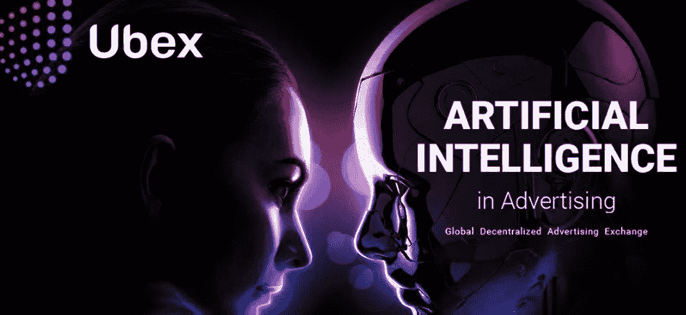

# 一天内达到 Ubex 项目代币销售软上限

> 原文：<https://medium.com/hackernoon/ubex-project-token-sale-soft-cap-reached-in-one-day-644fab7fd659>

全球广告交易平台的先驱——Ubex 项目，在不到一天的时间里启动了代币销售并提高了软限额。

Ubex 项目于 2018 年 5 月 21 日启动代币销售，将持续到 8 月 13 日。Ubex 代币销售在[区块链市场](https://hackernoon.com/how-blockchain-will-revolutionize-online-marketplaces-64fd6101bbf0)是独一无二的，因为它为所有参与者提供了平等的贡献机会和奖金。此外，Ubex 项目避免进行任何私人销售或预售，以确保所有参与者的平等条件，并排除任何投机或偏好因素。

在代币销售的第一天就达到了项目软上限，并且已经超过了 4000 ETH 标志。

Ubex 是一个全球性的分散式广告交易所，基于智能合约运营的神经网络、人工智能和区块链的融合。Ubex 的使命是创造一个高度信任和最大效率的全球广告生态系统，所有参与者都可以从先进的技术突破中受益，如果没有[区块链科技](https://hackernoon.com/the-blockchain-technology-of-2018-or-not-c375eab5d46a)的出现，这些技术突破永远不会在行业中得到应用。

Ubex 项目旨在让广告商和出版商能够利用[先进技术](https://gizmodo.com/10-ludicrously-advanced-technologies-we-can-expect-by-t-1788671727)来匹配报价和广告发布机会，从而最大限度地锁定受众。通过在区块链的基础上合并神经网络和人工智能，该过程完全自动化，以持续分析大量市场数据，并为 Ubex 生态系统内的所有运营和交易提供不变性和透明度。

Ubex 邀请所有人在代币销售期间利用该项目的奖金购买最高奖金为 20%的 [UBEX](https://www.ubex.com) 代币。