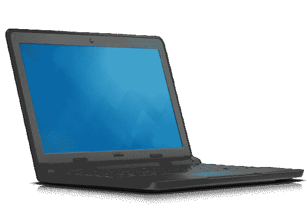

# 戴尔 Chromebook 13 (Lulu)的 Ubuntu 16 安装程序启动映像

> 原文：<https://medium.com/hackernoon/ubuntu-16-installer-boot-image-for-dell-chromebook-11-candy-4bdf281f55df>

戴尔 Chromebook 13 英寸 7310 (Lulu 型号)是一款不错的 Chromebook，我们要做的第一件事就是在上面安装 Ubuntu。



Don’t rush to Dell website: it’s out of production. Only student versions are available now

# 传统引导

在该设备上启动 Linux 时，不需要移除写保护开关。我将在此就我遵循的程序给出一些说明，以供参考。

第一步是将 chromebook 切换到开发者模式；你可以使用 Arch Linux 的文档来做这件事。应该遵循包括“启用 SeaBIOS”在内的所有步骤，但是不要重启机器。

# 闪出右边的海豚

为了在这个模型上安装 SeaBIOS，我使用了 John Lewis 提供的脚本，您可以在这里找到文档和说明*:

[https://John Lewis . ie/custom-chrome book-firmware/rom-download/](https://johnlewis.ie/custom-chromebook-firmware/rom-download/)

此处的矩阵表明，由于支持 RW_LEGACY 模式，因此无需移除写保护开关。

*=请向作者捐款以支持他的工作，否则我们不会在这里用这台设备享受 Ubuntu。

您可以下载并检查该脚本，看看它是做什么的；它将检测型号，然后下载正确的 ROM 文件，并为您提供将它安装在磁盘的 RW_LEGACY 插槽上的选项。

在上一步开始的 chromebook root shell 上运行该脚本(如果愿意，可以在阅读/修改后运行);一旦完成，恭喜你，你现在已经为你的设备解锁了一个工作的 SeaBIOS！

# gfxboot 问题

在将 Ubuntu 16 安装程序 ISO(桌面或服务器)刷新到 USB 设备并按 Ctrl+L 启动后，您将不幸地被可怕的 gfxboot 错误阻止:

```
graphics initialization failled
Error setting up gfxboot
boot: 
```

你可以在网上看到许多写*【帮助】*并进入下一阶段的绝望电话，但这在今天是没有帮助的。这个 bug 在[上游发射台问题这里](https://bugs.launchpad.net/ubuntu/+source/gfxboot-theme-ubuntu/+bug/1530530)有详细解释。

基本上这意味着引导装载程序阶段不能设置一个有效的视频模式，但是记住:这只是引导装载程序，而不是实际的安装程序。

# 胖靴(netboot)

最简单的解决方案是更改 isolinux.cfg 文件，这样它就可以选择第一个条目(安装程序)而不显示菜单，但是这被证明是一个死胡同，因为我没有成功地修改 ISO 并将其再次刷新为可引导。

我决定改变方法，尝试一个来自 USB 的胖启动盘，对于 Debian/Ubuntu 来说，它通常被称为*netboot*/*boot.img.gz*。

您可以从备用下载部分下载 Ubuntu netboot 镜像:

 [## /Ubuntu/dists/xenial-updates/main/installer-amd64/current/images/netboot 的索引

### 编辑描述

archive.ubuntu.com](http://archive.ubuntu.com/ubuntu/dists/xenial-updates/main/installer-amd64/current/images/netboot/) 

这个映像是一个普通的 FAT16 分区，有一个可引导的 MBR，所以没有分区表。它可能是用 *makeboot* 创建的(在网上找不到关于 Debian/Ubuntu 如何创建它的说明)，我也无法从头创建一个更大的(稍后你会明白为什么这很重要)。

您可以通过以下方式将映像闪存到正确的 USB 设备:

```
gunzip < boot.img.gz | dd of=/dev/sdX bs=16M
```

用实际的 USB 大容量存储设备替换/dev/sdX(尽量不要在这个过程中刷新你的主盘)。

# 英特尔无线网络

netboot 镜像将很好地启动，并允许我们到达文本安装程序，但是您将很快意识到无线网络接口无法识别。这似乎是由于缺少一个模块， *iwlmvm* 。

仅仅从 initrd 内部的 linux-image-extra 包中复制 iwlmvm.ko 是不行的，因为内核符号不匹配；此外，由于大小限制(boot.img 非常小),从 linux-image-extra 添加所有模块不是一个选项，因此我必须使用以下过程修补现有的 initrd:

1.  创建 initrd 中已经存在的所有模块文件的列表
2.  从[http://security . Ubuntu . com/Ubuntu/pool/main/l/linux/Linux-image-4 . 4 . 0-101-generic _ 4 . 4 . 0-101 . 124 _ amd64 . deb](http://security.ubuntu.com/ubuntu/pool/main/l/linux/linux-image-extra-4.4.0-101-generic_4.4.0-101.124_amd64.deb)中复制这样的模块和*boot/vmlinuz-4 . 4 . 0–101-generic*(简称为 Linux)
3.  从[http://security . Ubuntu . com/Ubuntu/pool/main/l/Linux/Linux-image-extra-4 . 4 . 0-101-generic _ 4 . 4 . 0-101.124 _ amd64 . deb](http://security.ubuntu.com/ubuntu/pool/main/l/linux/linux-image-extra-4.4.0-101-generic_4.4.0-101.124_amd64.deb)中复制缺失的 iwlmvm.ko
4.  将所有复制的文件(除了 linux 内核之外)放在 initrd.gz 中(我在这个过程中移除了其他未使用的模块以释放一些空间)
5.  将内核( */linux* )和更新后的 initrd.gz 复制到挂载的 boot.img 上

同时，我还修复了 *vga=* 行，以便为 chromebook 的显示屏使用正确的值，即 0x340。

# 成功

最终结果是安装程序几乎完美地启动了*程序，你会收到一个网络未检测到的错误，然后你必须返回到安装菜单并选择“执行一个 shell”。在提示符下，只需运行:*

```
# rmmod iwlwifi
# modprobe iwlwifi
# exit
```

并在最终能够配置无线网络后继续安装。

# 第一次开机

完成安装后，您将看不到 GRUB 启动菜单；重新使用引导镜像进入救援模式下的根分区(它会设置一个 chroot)，启用`/etc/default/grub`中的`GRUB_TERMINAL=console`行，然后运行`update-grub`。

此时，您可以将`/etc/network/interfaces`从安装环境复制到新的根文件系统中，这样在下次引导时，无线网络也将被配置。

# 引导映像

你可以自己重复上面的步骤来修复引导镜像或者下载我从[改过来的文件这个要诀](https://gist.github.com/gdm85/9756b8bdaadcd2af5e2caf9d8d12f1de):

最重要的文件是 *linux* 和*initrd.gz*；像平常一样挂载 USB 存储器(Ubuntu 将允许你这样做，即使从 GUI 也没有问题),并用 gist 中提供的文件覆盖其中的文件。