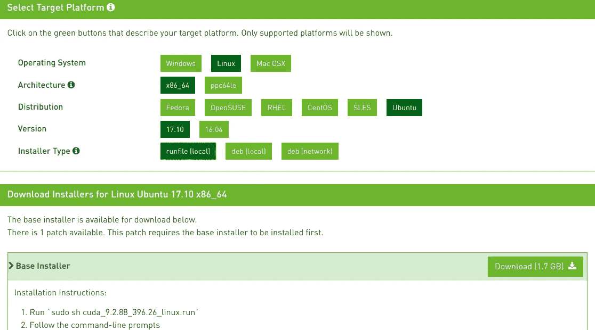

# Ubuntu 18.04 深度学习环境设置

> 原文：<https://medium.com/hackernoon/ubuntu-18-04-deep-learning-environment-setup-345ba0b11892>


Photo by [Jefferson Santos](https://unsplash.com/@jefflssantos?utm_source=medium&utm_medium=referral) on [Unsplash](https://unsplash.com?utm_source=medium&utm_medium=referral)

Ubuntu 18.04 上的深度学习没有得到官方支持，因为 CUDA 库还没有得到官方支持。

然而，如果你仍然想在 Ubuntu 上试用 DL，这里有一些设置:

> 注:我假设您已经准备好了所有的硬件。
> 已经安装了 Ubuntu。

# 更新和升级

```
$ sudo apt-get update
$ sudo apt-get upgrade
```

# 安装 Nvidia 驱动程序

*   最新的驱动程序应该工作正常。
*   添加英伟达 PPA

```
$ sudo add-apt-repository ppa:graphics-drivers/ppa
```

*   在 18.04 中，您不需要更新存储库。添加 PPA 后，这是自动完成的。
*   接下来，安装最新的驱动程序(396 ATM)

```
$ sudo apt install nvidia-driver-396
```

*   nvidia-settings 应该默认安装，以防你仍然需要手动安装

```
$ sudo apt install nvidia-settings
```

*   通过运行以下命令，重新启动并检查驱动程序是否安装正确:

```
nvidia-smi
```

*   如果你得到一个包含你的 GPU 细节的输出，那么一切都是[设置](https://hackernoon.com/tagged/setup)。

陷阱:

*   以防你的 Ubuntu 陷入“启动循环”:
    -按 Ctrl+Alt+F3(注意:在 16 上，它的 ctrl+alt+f1 得到 tty1)
    -清除驱动程序

```
sudo apt-get purge nvidia-*
```

*   重新启动

# 安装康达

*   为了安装最新版本的 Conda，我们将使用一个由 [Kaggle 大师 Mikel](https://twitter.com/mikb0b) 编写的便捷脚本

```
curl https://conda.ml | bash
```

# 安装 CUDA

*   诀窍是下载 Ubuntu 17.04 的 CUDA 版本
*   点击从[下载 CUDA。](https://developer.nvidia.com/cuda-downloads?target_os=Linux&target_arch=x86_64&target_distro=Ubuntu&target_version=1710&target_type=runfilelocal)
*   我正在设置 CUDA 9.0(既然是快 AI 推荐的。注意:目前最新版本是 9.2)
*   下载运行文件(本地)



*   打开终端并将目录更改为下载。
*   更改安装程序的可执行权限。
*   运行它。

```
$ cd Downloads
$ chmod +x ./cuda_9.0.176_384.81_linux.run
$ sudo ./cuda_9.0.176_384.81_linux.run
```

*   按空格键向下滚动并接受条款和条件
*   在提示“使用不支持的配置安装”时，键入`yes`
*   当提示“安装用于 Linux-x86_64 384.81 的 NVIDIA 加速图形驱动程序？”时，键入`no`。
*   保留默认值。
*   重新启动
*   重启后，检查 CUDA 版本

```
nvcc -V
```

这应该会提示已安装的 CUDA 版本

*   如果出现启动循环问题，请清除驱动程序并重试。

## 设置路径

```
export PATH="/home/User/anaconda3/bin:/usr/local/cuda/bin:$PATH"
export LD_LIBRARY_PATH="/usr/local/cuda/lib64:$LD_LIBRARY_PATH"
source ~/.bashrc
```

# 安装 Cudnn

*   从[这里](https://developer.nvidia.com/cudnn)下载你安装的 CUDA 版本支持的 Cudnn 版本(你需要一个 Nvidia 账号)
*   下载完成后，我们将解压归档文件，并将其内容移动到安装 CUDA 9.0 的目录中:

```
tar -zxvf cudnn-9.0-linux-x64-v7.tgz
sudo cp -P cuda/lib64/* /usr/local/cuda-9.0/lib64/
sudo cp  cuda/include/* /usr/local/cuda-9.0/include
sudo chmod a+r /usr/local/cuda-9.0/include/cudnn.h
```

# 设置 FastAI

*   建立快速人工智能环境。
*   Git 克隆他们的回购
*   康达环境更新
*   源激活

```
$ git clone [https://github.com/fastai/fastai](https://github.com/fastai/fastai)
$ cd fastai
$ conda env update
```

## 设置(其他/任何)环境

*   使用 requirements.txt 或 req.yml 文件进行 Pip 安装或 conda 安装。

```
pip install -r <Link>
```

# 快速试验

*   检查库内 CUDA 设备是否可用。
*   PyTorch 具有检查 CUDA 设备的功能

```
**torch.cuda.is_available****()**
```

这将返回一个 True。

就是这样。你完了！

*如果你觉得这篇文章有用并想保持联系，你可以在 Twitter 上找到我* [*这里*](http://twitter.com/bhutanisanyam1) *。*