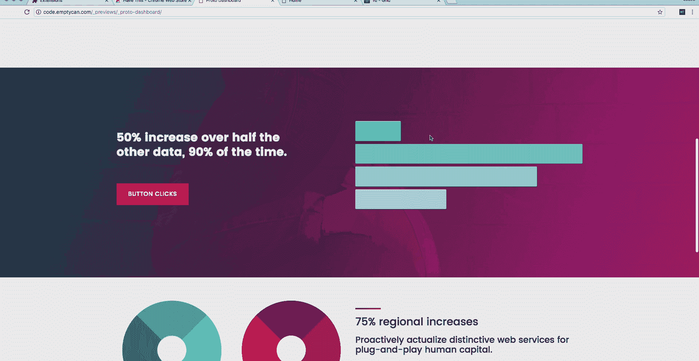
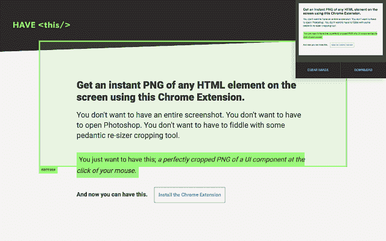

# 设计师工具箱:浏览器中任何 HTML 元素的即时 PNG

> 原文：<https://medium.com/hackernoon/ui-design-tool-an-instant-png-of-any-html-element-in-the-browser-2373d96acd71>

## 试试这个简单的 Chrome 扩展

Install Extension: [https://chrome.google.com/webstore/detail/have-this/cndkjfadkjnabmchlgmcecmgndpbedbn](https://chrome.google.com/webstore/detail/have-this/cndkjfadkjnabmchlgmcecmgndpbedbn)

作为一名主要在浏览器(“代码”)中工作的设计师，我长期以来不得不在屏幕截图迭代中摸索。尤其是在应用 UI 工作方面。

为了归档一个迭代或者一个想法的剪贴簿，截图是可以的，但是通常我只想要一样东西。一个 DOM 元素，比如卡片用户界面或工具栏。我经常不需要整屏。我不想通过一堆繁琐的东西来展示我需要在 30 秒的对话中展示的东西。

# **在我的工作流程中利用基于浏览器的设计资产的简单工具。**

Learn more: [http://iamhavingthis.com/](http://iamhavingthis.com/)

原型制作的工件通常都很平凡，寿命很短。此外，焦点通常集中在具有多个变体的单个组件上。从本质上来说，截取屏幕截图、裁剪以获得正确的部分，这些步骤可能需要多个步骤，非常耗时。这种努力足以转移人们对手头设计工作的注意力。

为了评估 UI 组件的所有状态，准备工作不应该比设计评审本身花费更长的时间。例如，快速发布一个 UI 组件的所有 5 个变体来进行短期练习，比如回顾组件状态来帮助 sprint 规划。

当市场营销需要一个新功能的演示时，它不应该是一个皮塔或*要求我做的事情。*

由于没有找到合适的工具来搔我的痒处，我自己做了一个。

这是我想要的。也许你希望它[有<这个/ >个](http://iamhavingthis.com/)来。

如果你一直在寻找类似的，我希望它有所帮助。让我知道你的想法，如果你也使用它。

—

*内置有 React 和 copy stack overflow*

Chrome 网络商店:[https://chrome . Google . com/Web Store/detail/have-this/cndkjfadkjnabmchlgmccegmndpbedbn](https://chrome.google.com/webstore/detail/have-this/cndkjfadkjnabmchlgmcecmgndpbedbn)

开源:[https://github.com/jessekorzan/have-this](https://github.com/jessekorzan/have-this)