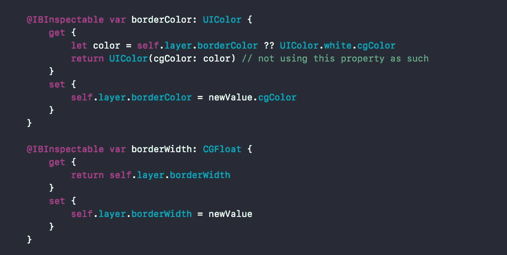
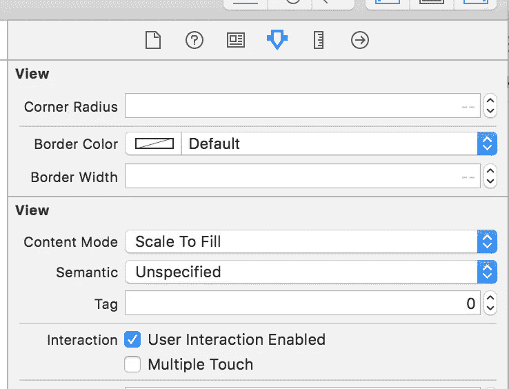
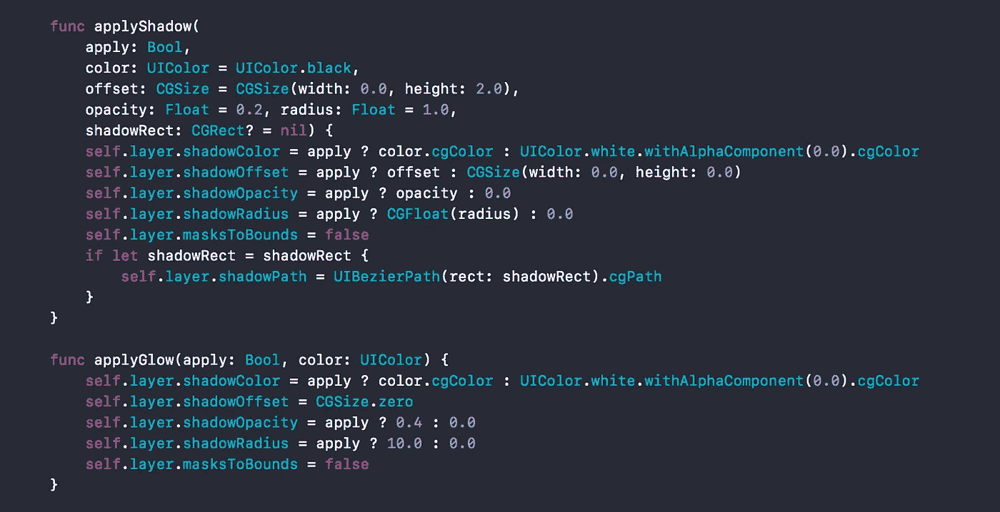
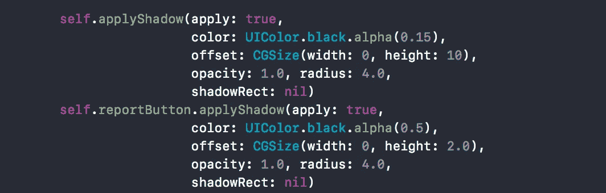
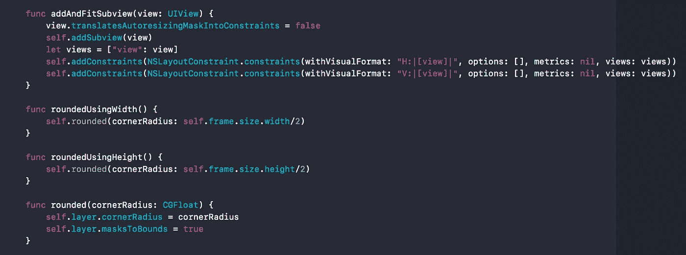
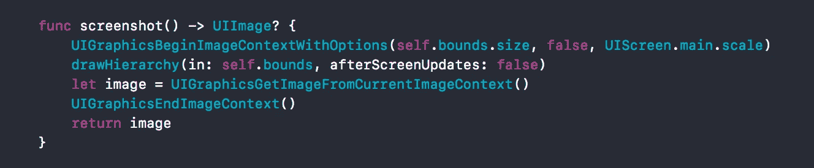
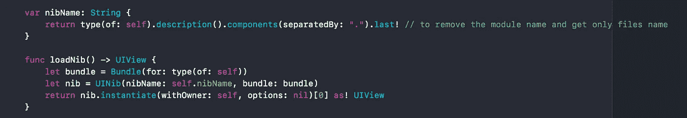
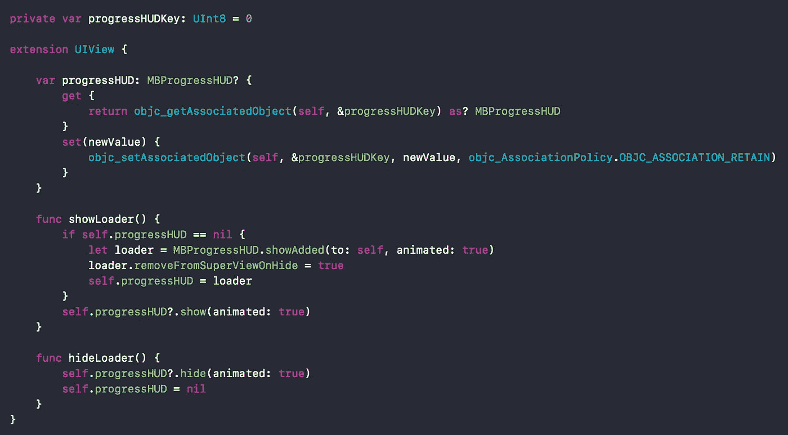

# UIView 扩展

> 原文：<https://medium.com/hackernoon/uiview-extension-c1d3bfe33ecf>

随着 swift 的进步及其为扩展提供强大功能所带来的变化。开发人员已经开始把更多的注意力放在扩展上，而不是在大多数情况下用[子类化](https://hackernoon.com/tagged/subclassing)。

本教程不是为了讨论什么时候使用扩展或子类，或者它们的优缺点。这个博客更侧重于 UIView 扩展，并展示它如何通过不同类型的用例帮助我们并使我们的生活变得简单。

## **1。添加 IBInspectable**

如果你不熟悉“IBInspectable ”,你可以浏览一下这个 WWDC 视频，它展示了这个关键词[https://developer.apple.com/videos/play/wwdc2015/407/](https://developer.apple.com/videos/play/wwdc2015/407/)的用法和威力

也就是说，现在我们知道了什么是 IBInspectable，以及如何使用它，但是我们不会将任何 [UIView](https://hackernoon.com/tagged/uiview) 子类化并在其中添加该属性，相反，我们将看到如何将它添加到扩展中，以便能够在任何 UIView 子类实例中使用，而无需任何额外的代码行。



正如你所看到的，这段代码显示了我们通过将视图的层属性包装在 IBInspectable 中对它们所做的更改。

将它添加到我们的 UIView 扩展之后，我们可以很容易地从 storyboard/Nib 本身将它们用于 UIView 的任何子类。



This is how it will look in your storyboard/nib files.

因此，简而言之，我们在一个地方将它添加到 UIView 扩展中，不再需要处理代码中的层交互。

## **2。可重复使用的用户界面参数**

几乎每个应用程序都有一些共同的用户界面风格，通过确保相同的主题，用户熟悉，可以在应用程序的大部分地方使用。
这些变化可以是圆角半径、应用阴影、应用边框以及所有这些的组合。
我有这种类型的需求，但不想复制/粘贴或创建任何子类来处理这种情况，这似乎也是一个很好的扩展用法。

接下来，你可以看到扩展中增加了一些方法，把所有的改变都打包在一起，同样，在代码中，我们不必处理层级别的改变，也不必一次又一次地添加 boiler plate 代码。



Applying shadow function to UIButton and UIView instance.

正如您在上面看到的，现在这可以以一种方便的方式轻松地用于任何 UIView 实例。(如果你的大多数视图都有相同的属性，你可以进一步将它包装在另一个帮助器方法中，这就是上面的`applyGlow`所做的。同样，这是根据使用案例)

**3。其他帮助方法**



## **4。通用实用方法**

除了更新/呈现视图元素的方法，扩展还可以处理如下实用方法:



## **5。无障碍方法**

拥有带有单独 xib 的定制视图的标准方法是为它们取相同的名字。这种耦合可以用来容易地提取视图。下面您可以看到添加了自定义方法来返回特定 UIView 子类的视图。



假设我们有一个名为`InputView`的 UIView 子类，它有一个单独的 xib，第一个视图的类是`InputView`。现在，如果我们在扩展中添加了上述方法，我们只需使用下面的代码来获得所需的视图。

```
let view = InputView().loadNib()
```

## **6。保存状态:**

让我们看看在扩展中保存一些状态如何帮助我们提供一些强大的功能。

有些人可能不同意这种实现，但只是添加它，以便您可以检查并向我提供您的反馈(它的工作很好，对我非常有用，直到现在)。以下代码可用于在 UIView 的任何子类上切换加载器的可见性。



正如你在上面看到的，MBProgressHUD 被用于通过应用程序显示加载器。这两个方法是在 UIView 扩展中添加的。这里需要注意的一点是，我们不能在扩展中保存属性，所以这里使用了“objc_getAssociatedObject”。

上述方法的好处是:

*   由于装载机处理只在一个地方完成，如果需要，装载机可以很容易地更新。
*   所有 UIView 子类中都有切换加载器的方法，无论它是 UIButton、UIView 还是 UILabel 等。

```
closeButton.showLoader()
closeButton.hideLoader()
```

正如在开始中提到的，这是为了展示 UIView 扩展的不同使用方式，并给出一些我使用的例子。您可以根据需要添加更多的方法。

以上代码的要点可以在[这里](https://gist.github.com/Ankit-Aggarwal/7010a822bb2df2a594110d85b8f1a500)找到。

如果您发现更多的用例，以及它如何帮助您定义 UIView 扩展，请告诉我:)

如果您有任何问题，或者想要对代码进行一些添加/修改，或者您有任何反馈，请在下面的评论中提出。

**感谢阅读！**