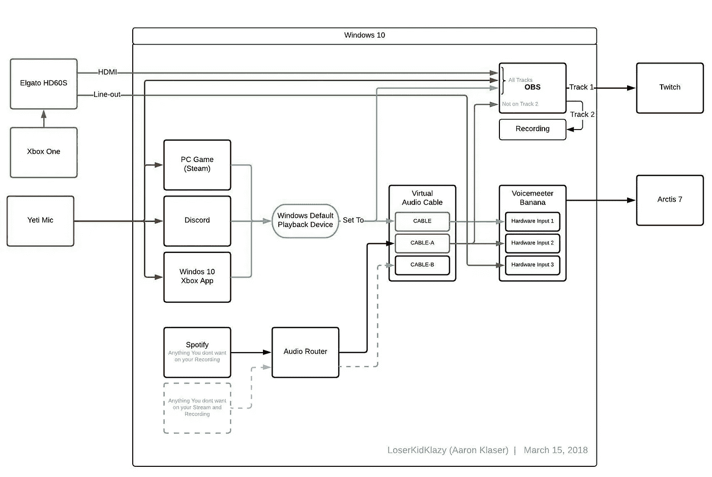
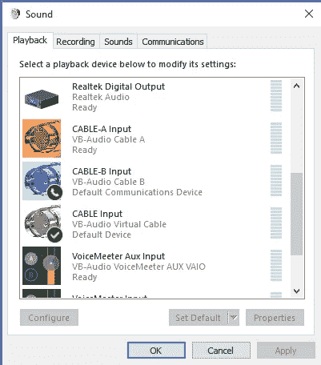
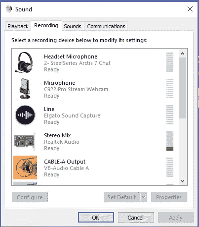
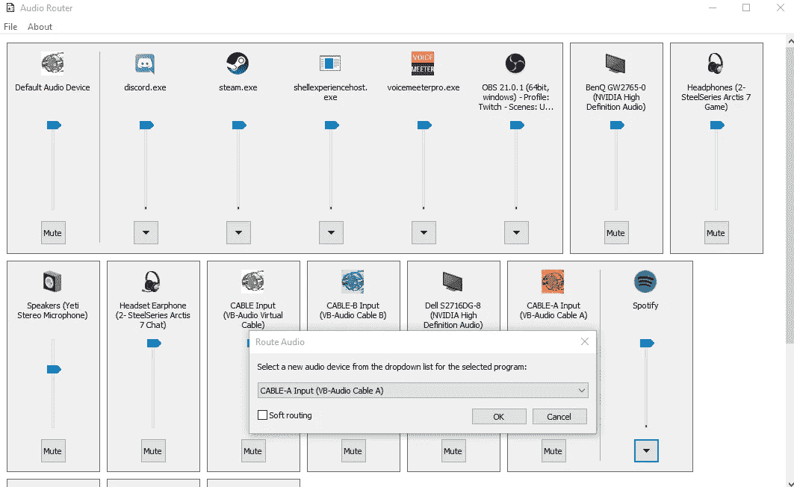
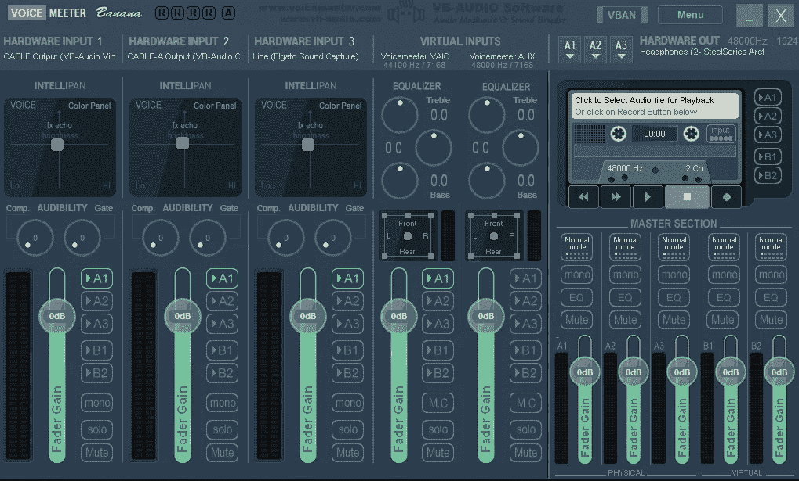

# 终极音频流设置

> 原文：<https://medium.com/hackernoon/ultimate-audio-streaming-setup-47340a0a157e>

## Xbox 和 PC 的 Twitch 流

## 在 Xbox One 上移除 Spotify，加入 Xbox 派对聊天，并使用无线 PC 耳机

我已经在 twitch 上流式播放了几个晚上，当谈到让 Spotify 这样的 auto 在后台播放时，我遇到了一些问题，特别是当我在周三晚上编写代码流时，因为我想录制视频以便稍后编辑，但 Spotify 这样的东西使得干净的编辑变得不可能。

另一个主要问题是，当一个流我的 Xbox 时，我需要连接到音频和聊天，这样我就可以在 Discord 或 Xbox Live 上说话，并听到我的电脑和我的 Xbox 音频。

经过许多小时的研究，我想出了一个相当不错的解决方案，我们需要购买一个昂贵的混音设备，它可以让我们用我的 Yeti 麦克风进行 Xbox 聊天。

# 你需要什么

## 五金器具

配备 Windows 10(外星人 R7)
Xbox One
麦克风的 PC(例如蓝色雪人)
Elgato HD60(S)
无线耳机(Arctis 7)

## 软件

OBS(或 SLOBS)
Voicemeeter Banana
虚拟音频电缆(带额外电缆 A & B — $5)
音频路由器
Spotify
Discord
Windows 10 Xbox 应用

# 图表

# 如何设置这一切

**步骤 1** :下载并总共安装所有应用
[OBS](https://obsproject.com/download)
[voice meeter Banana](https://www.vb-audio.com/Voicemeeter/banana.htm)
[虚拟音频线(带额外线缆 A&B—$ 5】](https://www.vb-audio.com/Cable/index.htm)
[音频路由器](https://github.com/audiorouterdev/audio-router)
[Spotify](https://www.spotify.com/us/download/other/)
[Discord](https://discordapp.com/download)

**第二步**:设置 Spotify、Discord 和 OBS。这个你可以自己处理。

**第三步**:安装所有三个虚拟线缆驱动。然后，重新启动您的计算机，这样所有 3 个驱动程序将工作。如果你打开你的播放设备(右键点击音量，然后点击播放)，你应该会看到，而不是直观地，播放现在有三个电缆输入和录音有三个电缆输出。

**第四步**:设置**线缆输入**(非 A 或 B)为**默认设备**和**默认通讯设备**的默认播放设备。右键单击电缆输入，将检查设置为默认设备并设置为默认通信设备。如果两者都设置了，则“禁用”下将没有选项。

**第五步**:安装(嗯…运行)**音频路由器**。在你的列表中找到 **Spotify** ，它将需要音频来显示在混音中，或者你点击**文件>切换视图**并从列表中选择它。然后选择路由…并选择**电缆-A 输入**

> **注意:**这个应用程序处于疯狂阿尔法模式，由于某种原因，现在你必须在每次打开音频路由器时做这一步。

**步骤 6:** 打开 **Voicemeeter Banana** 并设置以下映射，然后保存，以便您可以稍后再次加载。
硬件输入 1 = >电缆输出
硬件输入 1 = >电缆-A 输出
硬件输入 1 = >线路(Elgato 声音捕捉)或电缆-B 输出(如果您的控制台不是流式的)。
Hardware Out = >将 A1 设置为耳机(Arctis 7)

> **重要提示:**确保每个输入端的每个 A1 都被选中，否则声音不会从 A1 输出端传到你的耳机。
> **更重要的是:**在对Voicemeeter Banana 或音频路由器进行任何更改后，您几乎总是需要通过点击**菜单>重启音频引擎**来重启 Voicemeeter Banana 中的音频引擎

**步骤 7** :打开你的 OBS 场景:
添加新的视频采集设备，命名为 Elgato，选择设备为**游戏采集 hd60s
添加新的音频输入采集设备，命名为 mic，选择设备为**麦克风(蓝色 Yeti)** 添加新的音频输出采集设备，命名为 spotify，选择设备为 **CABLE-A Input****

然后，单击 Spotify 混音器>高级音频属性上的齿轮。对于 Spotify，请在“曲目”下取消选中除#1 之外的所有选项

**第 8 步(聚会聊天选项)**:使用 Windows Xbox 应用程序在 PC 上加入聚会聊天，而不是在 Xbox 上。它的工作方式完全一样。

给你。现在你可以用背景音乐直播，但不包括在你的录音中，这样你就可以编辑了。这也是版权友好的:)

## 你不能做什么

在 Xbox Live 游戏上的一般在线聊天中交谈，如使命召唤。但说实话，没有人想听你说话，尤其是当你在 Twitch 上表达内心独白的时候。如果有人想和你聊天，你可以使用 Xbox 应用程序上的聚会聊天，这样你就可以听到他们的观点，你也不会让那些愚蠢到不能在游戏中让你静音的人感到讨厌。

# 视频讲解

> **重要提示:**我本打算录下来，但不小心流了出来，所以你可以听到你不应该听到的音频，但我保证这很有效。我会在接下来的一周和每一次跑步直播做一个跟进视频！

别忘了跟随 https://www.twitch.tv/loserkidklazy[的和**看我直播**](https://www.twitch.tv/loserkidklazy)