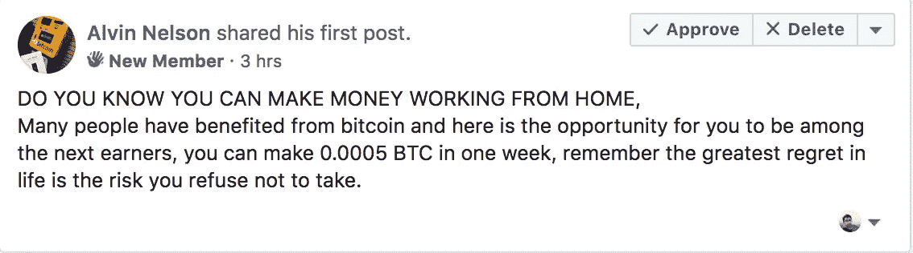

# 脸书密码骗局终极指南

> 原文：<https://medium.com/hackernoon/ultimate-guide-to-facebook-crypto-scams-552a8a6ddd26>

Admins of crypto Facebook groups need to play a very strong role in moderation of content, otherwise all that is left in the group are scammy posts.

作为一名脸书加密投资者组织的管理员，我工作中最重要的部分就是管理该组织的内容。这是推动社区所有参与的内容。我们对骗子采取零容忍政策，并立即删除任何此类帖子。

在过去的两周里，在做我们的工作时，我们决定找点乐子。我们截屏了 19 种人们在脸书试图欺骗你的可能方式。我们在下面分享了它们。*这些截图会给你一个公平的想法，告诉你应该避免什么样的人和谈话。*

我们没有刻意去模糊这些面孔，因为这些都是骗子账户，他们应该被知道和封锁。

读完这篇文章后，你应该记住几件事

1.  赚钱不容易。任何人声称这是在骗你。
2.  加密市场并非没有风险。从本质上来说，加密是一种风险更高的金融投资选择。任何声称不是这样的人都是在欺骗你。
3.  任何不写骗局，合法生意的人都是在骗你。
4.  加密没有最低投资。
5.  任何人发布关于第三方帮助他们赚钱并感谢他们的帖子都是在欺骗你。
6.  任何人要求你分享你的电子邮件 id，收件箱或 Whatsapp，或者提供任何细节都是在欺骗你。

这篇文章的目的是提高你的胡说八道仪表，对抗脸书流行的加密骗局。

如果我们成功实现了我们的目标，我们希望得到你们的掌声。如果你有类似这样的经历或截图，请在下面的评论中与我们分享。我们很乐意在这篇文章中包括最好的，并定期更新。