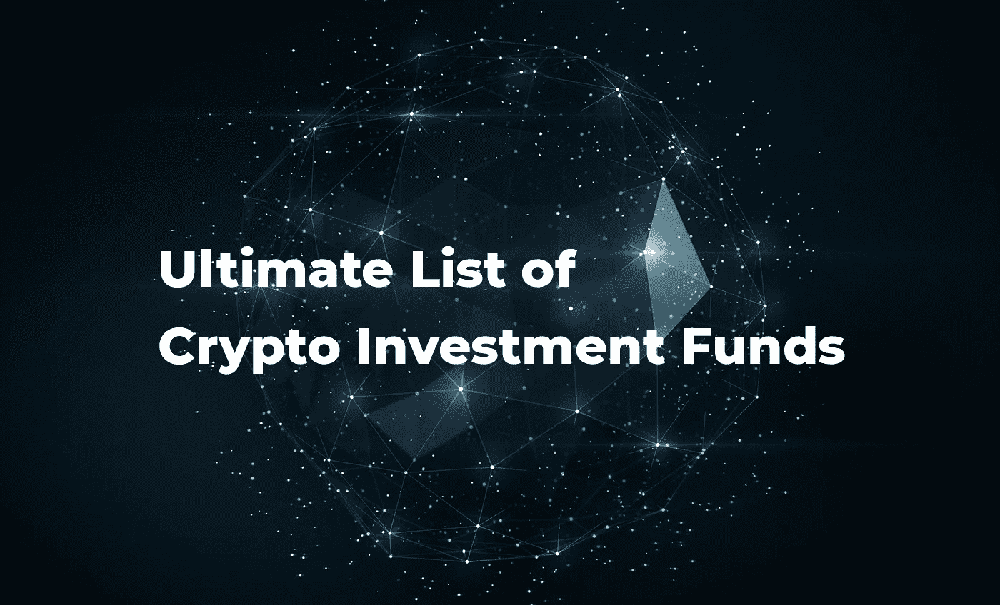

# 加密投资基金终极列表

> 原文：<https://medium.com/hackernoon/ultimate-list-of-crypto-investment-funds-3f422af0449b>

# 已经投资于加密初创公司的 230 多家风险基金名单。

你是一家[区块链](https://hackernoon.com/tagged/blockchain)的初创公司，希望为你的项目筹集资金，还是推出一个 [ICO](https://hackernoon.com/tagged/ico) 。为你的加密项目寻求初始资金的最佳策略之一是联系那些已经在寻找有前途的初创公司和优秀团队进行投资的风投。

接触风险投资公司甚至可能为你的整个项目开发带来足够的资金，让你不用为了额外的钱而启动一个实际的 ICO。

下面是一份考虑投资区块链初创公司的全球风投名单。

*该列表由*[*Crypto Gang*](http://cryptogang.agency/)*(http://Crypto Gang . agency/)提供，这是一家专注于区块链的品牌代理机构，为 Crypto 初创公司提供品牌服务，如徽标和品牌标识创建、ICO 和项目网站的设计和开发、白皮书、宣传资料、单页广告和其他视觉材料的设计。*

*关于 ico 和创业品牌的任何问题，请直接联系我，电话:*[*Anton @ cryptogang . agency*](mailto:anton@cryptogang.agency)

**风险加密投资基金一览**

[101 Venture LLC、美国](http://www.101venture.net)
[11–11 Ventures、美国](http://www.11-11ventures.com)
[2L 资本、美国](http://www.crunchfund.com)
[3.0 资本、美国](http://www.three0.com)
[6M 资本、美国](http://www.6m.capital)
[Acario Ventures、美国](http://www.tokyo-gas.co.jp)
[Accel、美国](http://www.accel.com/)
[Access Ventures、美国](http://www.accessventures.org)
[宁折不挠资本、美国](http://www.adamantresearch.com) 美国
[好事达战略投资公司、美国](http://www.allstate.com)
[Alphacap Berhad、马来西亚](https://alphacapberhad.com/)
[Altpoint 资本、美国](http://www.altpointcapital.com)
[Andre essen Horowitz、美国](https://a16z.com/)
[反英雄资本、澳大利亚](http://www.antiherocapital.com)
[阿波罗资本管理、澳大利亚](http://www.apollocap.io)
[AQR 资本管理、美国](http://www.aqr.com)
[阿斯顿资本管理 美国](http://www.astoncapital.net)
[Beach View、美国](https://venturenetwork.io/)
[Beachhead Venture、澳大利亚](http://www.beachhead.vc)
[Beanstalk Ventures、美国](http://www.beanstalk.vc)
[Bellegarde Capital、瑞士](http://www.bellegardecapital.com)
[Ben Franklin Technology Partners、美国宾夕法尼亚州东南部](https://www.sep.benfranklin.org/)
[Bessemer Venture Partners、美国](http://www.bvp.com)
[Beverly Capital Group、美国【T8 美国](http://www.beverlycapitalgroup.com)
[block chain Global、澳大利亚](https://www.blockchainglobal.com/)
[block chain Valley Ventures、瑞士](http://bvventures.ch/)
[block chain cap . io、美国](https://www.blockchaincap.io/)
[block seed Ventures Limited、日本](http://www.blockseed.vc)
[block tech Ventures、加拿大](http://www.block-tech.com)
[block tricity Capital、美国](http://www.blocktricitycapital.io)
[BlockVC、](https://www.blockvc.com/)

[BXE Capital , USA](https://www.bxecapital.com/)
[Capital One Ventures, USA](http://www.capitalone.com)
[Capital One, USA](http://www.capitalone.com)
[Ceiba Capital, USA](http://www.ceibacap.com)
[Cervin Ventures, USA](http://www.cervinventures.com)
[Chain Plus Capital, China](http://www.chaincap.com)
[CityBlock Capital, USA](http://www.edgewater-equity.com)
[CMCC, Hong Kong](https://www.cmcc.vc/)
[CME Ventures, USA](https://www.cmegroup.com/cme-ventures.html)
[Coefficient Ventures, USA](http://www.coefficientventures.com)
[Cohen & Company, USA](https://www.cohencpa.com/)
[Collinstar Capital, Australia](http://www.collinstar.com)
[Colony NorthStar, USA](https://www.clny.com/)
[ConsenSys, USA](https://new.consensys.net/)
[Core Innovation Capital, USA](http://www.corevc.com)
[Cosimo Ventures, USA](http://www.cosimoventures.com)
[Counterparty, Stoic Capital, USA](http://www.stoic.capital)
[Craft Ventures, USA](http://www.craftventures.com)
[Crypto Capital Investments, USA](http://www.cryptollc.capital)
[Cryptoindex Capital, USA](http://www.cryptoindexcapital.com)
[Crypton Capital, Australia](http://www.crypton.capital)
[Cypher Capital, USA](http://www.cyphercapital.net)
[Dalma Capital, UAE](http://www.dalmacapital.com)
[Davidson Kempner Capital Management, USA](http://www.dkpartners.com)
[DDC, USA](http://www.struckcapital.com/)
[Decentral Park Capital, USA](http://www.decentralpark.io)
[Deep Knowledge Ventures, Hong Kong](http://www.deepknowledgeventures.com)
[Dexterity Capital, USA](http://www.dexterity.capital)
[Digital Asset Capital Management, Australia](http://www.digitalassetfund.com)
[Digital Currency Group, USA](https://dcg.co/)
[Digital Currency Group, USA](https://dcg.co/)
[Digital Ventures, Thailand](http://www.dv.co.th)
[Draper Associates, USA](http://www.draper.vc/)
[e.ventures, USA](http://www.eventures.vc)
[East Rock Capital, USA](http://www.eastrockcap.com)
[Educapital, Brazil](http://www.educapital.com.br)
[Eight Capital, Canada](http://www.viiicapital.com)
[Element Capital Group, USA](http://www.elementgroup.com)
[ElliptiCurve Capital, USA](http://www.ellipticurvecapital.com)
[EMURGO Corporation, Japan](https://emurgo.io/)
[Enso Capital, Israel](http://www.enso.capital)
[Entoro Capital, USA](http://www.entoro.com)
[Ether Capital, USA](http://www.ethcap.co)
[Evangelist capital, USA](http://www.evangelistcapital.com)
[EverBlu Capital, Australia](http://www.everblucapital.com)
[Evolve VC, USA](http://evolve.vc/)
[fantail ventures, USA](http://www.fantailventures.com)
[First Coin Capital, Canada](http://www.firstcoin.com)
[First Digital Capital, Australia](http://www.firstdigitalcapital.com.au)
[Flybridge Capital Partners, USA](http://www.flybridge.com)
[Foundation Capital, USA](http://www.foundationcapital.com)
[Founders Fund, USA](https://foundersfund.com/)
[Frontier Ventures, USA](http://www.frontier.ru)
[FundersClub, USA](https://fundersclub.com/)
[Future/Perfect Ventures, USA](http://www.fpv.vc)
[G20 Ventures, USA](http://www.g20vc.com)
[G2H2 Capital, USA](http://www.g2h2.capital)
[Genpact Headstrong Capital Markets, USA](http://www.genpact.com)
[Ginkgo Capital, Hong Kong](http://www.moelis.com)
[Grit Capital, Canada](http://www.gritcapital.ca)
[Hard Yaka, USA](https://hardyaka.com/)
[Haystack, USA](http://www.haystackpartners.com/)
[Hex Capital, Canada](http://www.7gate.vc)
[Highland Capital Partners, USA](http://www.hcp.com)
[HODL Capital, USA](http://www.hodl.capital)
[Impact Capital Strategies, USA](http://www.impactcapitalstrategies.net)
[Indova Capital Management, USA](http://www.indova.com)
[Initialized Capital, USA](http://www.initialized.com)
[Innovating Capital, USA](http://www.innovating.capital)
[Innovent Capital Group, USA](http://www.innoventcapital.com)
[In-Q-Tel, USA](https://www.iqt.org/)
[Insight Venture Partners, USA](http://www.insightpartners.com)
[IronChain Capital, USA](http://www.ironchaincapital.com)
[Jabre Capital Partners, Switzerland](http://www.jabcap.com)
[JCH Capital Pty Ltd, Australia](http://www.energyaction.com.au)
[Jump Capital, USA](http://www.jumpcap.com)
[KAIST, Korea](http://kaist.ac.kr/)
[KENETIC CAPITAL, Hong Kong](http://www.kenetic.capital)
[Khosla Ventures, USA](https://www.khoslaventures.com/)
[Kilowatt Capital, USA](http://www.kilowattcapital.com)
[King Capital Corporation, USA](http://www.oakridgefinancial.com)
[Kosmos CApital, Australia](http://www.cryptiq.group)
[Kryptus Capital, USA](http://www.kryptuscapital.com)
[Lakeside Partners, Switzerland](http://lakeside.partners/)
[LAKESTAR, Switzerland](https://www.lakestar.com/)
[Lightspeed Venture Partners, USA](http://www.lsvp.com)
[LSVP, USA](https://lsvp.com/)
[Lunar Capital, USA](http://www.lunarcapital.io)
[Lydians Capital, USA](http://www.lydianscapital.com)
[Maco.la, USA](http://www.maco.la/)
[Magnet Capital, Australia](http://www.magnetcapital.com.au)
[Medici Ventures, USA](https://www.mediciventures.com/)
[Merces Capital Limited, USA](http://www.mercedcapital.com)
[Metaps+, Korea](http://www.metaps-plus.com/)
[MGT Crypto-Capital Strategies, USA](http://www.mgtci.com)
[Michael Yang Capital Management, USA](http://www.michaelyang.com)
[Moore Capital Management, USA](http://www.moorecap.com)
[MRTNZ Ventures, USA](http://www.mrtnz.com)
[Multicoin Capital, USA](http://www.multicoin.capital)
[Mutschler Ventures AG, Switzerland](http://www.mutschler-ventures.ch)
[Naspers Ventures, USA](http://www.naspers.com)
[Neva Capital, Thailand](http://www.neva.vc)
[Oak HC/FT, USA](http://oakhcft.com/)
[Obvious Ventures, USA](http://www.obvious.com)
[Octic Capital Management, USA](http://www.octiccapital.com)
[Old Mission Capital, USA](http://www.oldmissioncapital.com)
[OMERS Ventures, Canada](http://www.omersventures.com)
[Orrick, Herrington & Sutcliffe LLP, USA](https://www.orrick.com/)
[Otsana Capital, Australia](http://www.otsana.com)
[Outlier Ventures, Canada](http://www.outlierventures.io)
[Pantera Capital, USA](https://www.panteracapital.com/)
[Park Capital, USA](http://www.parkcapital.io)
[Passport Capital, USA](http://www.passportcapital.com)
[PEER Venture Partners, USA](http://www.peervp.com)
[Pelion Venture Partners, USA](http://www.pelionvp.com)
[Plug and Play Tech Center, USA](https://www.plugandplaytechcenter.com/)
[Polybius Capital, Australia](http://www.polybiuscapital.com)
[Pritzker Group Venture Capital, USA](http://www.pritzkergroup.com)
[Propel Venture Partners, USA](http://www.propel.vc)
[QCP Capital, Singapore](http://www.qcp.capital)
[QL Ventures, USA](http://www.coloradostartups.com)
[Raptor Group, USA](http://www.raptorgroup.com/)
[RBC Capital Markets, USA](http://www.rbccm.com)
[RChain Holdings, USA](https://pithia.com/)
[Reciprocal Ventures, USA](http://www.recvc.com)
[Redpoint Ventures, USA](http://www.redpoint.com)
[Reflective Venture Partners, USA](http://www.reflectiveventures.io)
[Ribbit Capital, USA](http://www.ribbitcap.com)
[Right Side Capital Management, USA](http://rightsidecapital.com/)
[Route 66 Ventures, USA](http://www.route66ventures.com)
[RRE Ventures, USA](http://www.rre.com/)
[RRE Ventures, USA](http://www.rre.com)
[Sandalphon Capital, USA](http://www.sandalphoncapital.com)
[Saudi Aramco Energy Ventures, USA](http://www.saev.com)
[Scalar Capital, USA](http://www.scalar.capital)
[Sequoia Capital, USA](http://www.sequoiacap.com)
[Shepherd Ventures, USA](http://www.shepherdventures.com)
[Singulariteam, Israel](http://www.singulariteam.com/)
[Sinovation Ventures, USA](http://www.sinovationventures.com)
[Skystar Capital, Indonesia](http://www.skystarcapital.com)
[Smart Block Capital, USA](http://www.smartblockcapital.io)
[Social Starts, USA](https://www.socialstarts.com/)
[Sozo Ventures, USA](http://www.sozo.ventures)
[SparkLabs Global Ventures, USA](http://www.sparklabsglobal.com)
[Steelhead Capital Management, USA](http://www.steelheadcm.com)
[StreetEdge Capital, USA](http://www.streetedgecap.com)
[Summit Partners, USA](https://www.summitpartners.com/)
[Sustany Capital, USA](http://www.sustany.co)
[SV Angel, USA](https://svangel.com/)
[Swarm Fund, USA](https://swarm.fund/)
[Taussig Capital, Switzerland](http://www.taussigcapital.com)
[Techstars, USA](https://www.techstars.com/)
[Tel Aviv Capital -TLVC, Israel](http://www.tlvc.co.il)
[TENX VENTURES INC, Canada](http://www.tenx.biz)
[Tetras Capital, USA](http://www.tetras.capital)
[Tetras, USA](http://tetras.capital/)
[The Hive, USA](http://hivedata.com/)
[The Whittemore Collection, USA](http://whittemorecollection.com/)
[Torque.vc, USA](https://www.torque.vc/)
[Totient Capital, USA](http://www.totient.capital)
[TransformationWorx | Capital Blockchain, Canada](http://www.redmobileco.com)
[Tristar Ventures Inc., Korea](http://www.tristar-ventures.com)
[Two Sigma Ventures, USA](http://www.twosigmaventures.com)
[Unchained Capital, USA](http://www.unchained-capital.com)
[Union Square Ventures, USA](https://www.usv.com/)
[Union Square Ventures, USA](http://www.usv.com)
[Urgent, USA](https://urgent.vc/)
[ValueNet Capital, China](http://www.valuebank.com)
[Venrock, USA](http://www.venrock.com/)
[Venture Aviator, USA](http://www.ventureaviator.com)
[Verizon Ventures, USA](http://www.verizonventures.com/)
[Version One Ventures, Canada](http://www.versionone.vc)
[Victoire Ventures, USA](http://www.victoireventures.com)
[Virgil Capital, Australia](http://www.virgilcap.com)
[Virtual Capital, USA](http://www.theadvancegrp.com)
[VTF Capital, USA](https://vtfcapital.com/)
[Vy Capital Advisors, USA](http://www.vycapital.com)
[Walden Bridge Capital, USA](http://www.waldenbridge.capital)
[WING, USA](http://wing.vc/)
[Working Lab Capital, USA](http://workinglabcapital.com/)
[XDL Capital, Canada](http://www.xdl.com)
[ZX Ventures, USA](http://www.zx-ventures.com)

*该列表由*[*Crypto Gang*](http://cryptogang.agency/)*(http://Crypto Gang . agency/)提供，这是一家专注于区块链的品牌代理机构，为 Crypto 初创公司提供品牌服务，如徽标和品牌标识创建、ICO 和项目网站的设计和开发、白皮书、宣传资料、单页广告和其他视觉材料的设计。*

*关于 ico 和创业品牌的任何问题，请直接联系我，电话:*[*Anton @ cryptogang . agency*](mailto:anton@cryptogang.agency)