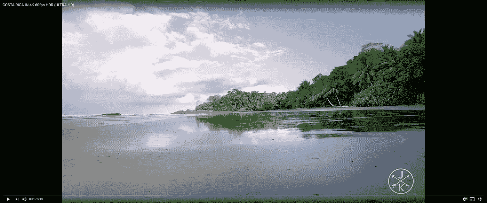

# UltraWideo:跨浏览器扩展，修复视频黑条

> 原文：<https://medium.com/hackernoon/ultrawide-screen-browser-extension-for-videos-e681c4602f3f>

在观看你最喜欢的节目时，水平和垂直的黑条会减少你的快乐。

你遇到过这个问题吗？

根据屏幕分辨率和视频宽高比，它们可以在所有边上。我发现它会分散注意力，而且有问题，这就是为什么我构建了这个跨浏览器扩展——UltraWideo。

Demonstration of Black-Bars on YouTube platform for the ultra-wide screen. Video by [Jacob + Katie Schwarz](https://www.youtube.com/channel/UCYq-iAOSZBvoUxvfzwKIZWA).

这个附加组件将在所有带有 Webkit、Blink 或 Gecko 引擎的浏览器中工作。它涵盖了除 Internet Explorer、Safari 和旧版 Edge 之外的所有浏览器。该扩展已在以下浏览器上经过全面测试，并被证明功能齐全:

*   [铬合金](https://www.google.com/chrome/)
*   [火狐](https://www.mozilla.org/en-US/firefox/new/)
*   [火狐安卓](https://play.google.com/store/apps/details?id=org.mozilla.firefox)
*   [边缘](https://www.microsoft.com/en-us/edge)
*   [歌剧](https://www.opera.com/download)
*   [勇敢](https://brave.com/download/)
*   [维瓦尔第](https://vivaldi.com/download/)
*   [鲸鱼](https://whale.naver.com/download)

# 浏览器扩展的救援！

这个插件解决了一个现实世界的问题！不仅适用于超宽屏幕，还适用于所有普通显示器。这个问题被称为黑条。通常，黑条只在垂直方向出现，当它被有意渲染成电影效果时。

然而，黑条也可能水平出现，这是当输出不适合视频播放的屏幕分辨率时。

# 如何安装 UltraWideo 插件？

根据您当前的浏览器及其引擎，请确保从相应的商店安装插件的最新版本。

如果你使用的是 Firefox，它使用 Gecko 引擎，你可以安装 UltraWideo 作为 Firefox 插件。

对于所有其他浏览器，它们要么是 Webkit，要么是 Blink，你可以从 [Chrome 网络商店](https://chrome.google.com/webstore/detail/ultrawideo/bfbnagnphiehemkdgmmficmjfddgfhpl)安装 UltraWideo。

有了这种超宽视频扩展，您可以摆脱黑条，以全屏方式欣赏视频。

# 它与其他选择相比如何？

UltraWideo 是市场上唯一一款适用于所有流媒体服务的扩展。不仅如此，你将能够从特定平台的每个视频中获得最佳效果，而且它也适用于任何网站上的所有嵌入式视频。

如果一个单独的网页上有许多直接或嵌入式视频播放器，这不是一个问题。该扩展足够智能，可以在不与其他玩家互动的情况下全屏播放视频。

我们的计划是让这个插件成为市场上唯一一个每个人都想放在浏览器工具箱里的插件。

还有许多其他替代方案，但没有一个适用于嵌入式视频。几乎所有的公司都致力于单一的或者很少的视频流媒体服务。

# 它提供了什么？

该扩展提供了直观而简单的用户界面/UX。这些选项分为三类。

**主:** 目前只有一台交换机可用，主交换机控制核心功能。

*   暂停——立即终止扩展内部使用的所有“昂贵”操作*(键盘事件监听器和 DOM 操作)*。一旦激活，您不能通过快捷方式将其禁用，只能通过单击手动禁用。

**模式:** 这一类有几个开关可用。

*   正常—将视频恢复到其原始状态。在 Firefox for Android 上，这种模式解决了一个浏览器 bug。
*   高档—将视频放大到所有黑条都不再可见的程度。
*   拉伸—类似于高档，但会扭曲视频。

根据显示器的分辨率，高比例裁剪部分内容，拉伸模式会使视频失真。根据你正在观看的视频材料，你需要做出取舍。

**快捷键:** 扩展附带预定义的快捷键，但可以轻松配置为所需的按键。

*   切换暂停
*   切换模式

请随意观看我录制的这个展示视频，尝试解释每个选项及其作用。

您可以在 [ProductHunt](https://www.producthunt.com/posts/ultrawideo-2-0) 上投票支持 UltraWideo 扩展。

如果你愿意投稿，看看源代码，或者下载当前开发版本，查看[官方资源库](https://github.com/dvlden/ultrawideo)。

另一方面，如果你发现任何问题或者你有一个功能建议，不要在 Chrome 或 Firefox 商店上报告。取而代之的是，继续前进到官方的存储库并[创建一个新的问题](https://github.com/dvlden/ultrawideo/issues)。

如果你有任何问题，请在下面留言。