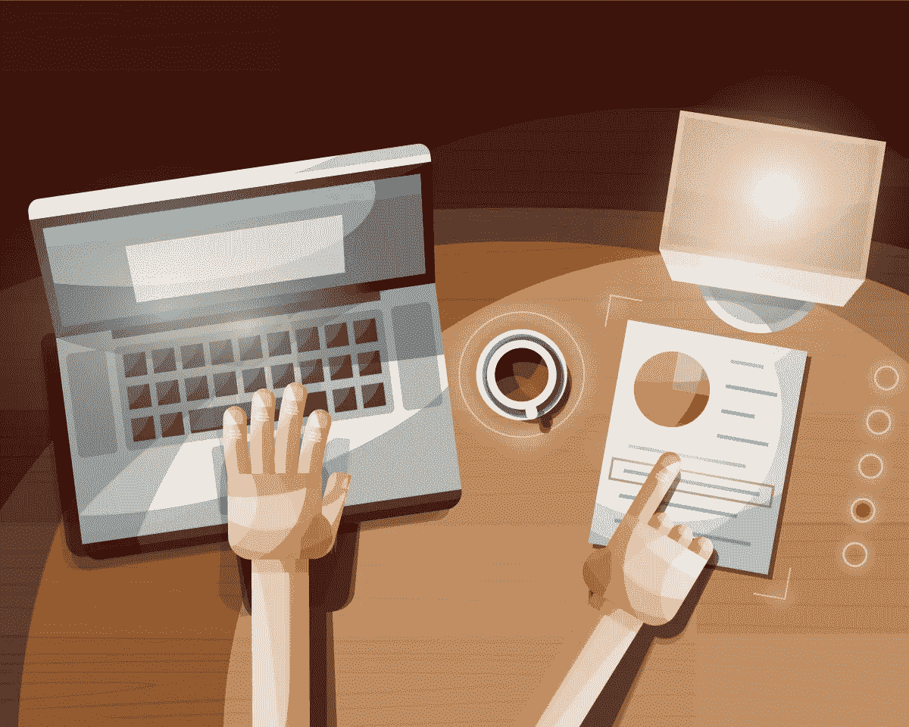
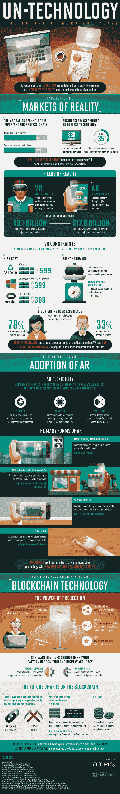

# 联合国技术:工作和娱乐的未来

> 原文：<https://medium.com/hackernoon/un-technology-the-future-of-work-and-play-644164752251>

## 我们今天如何能够拥有增强现实而不需要年复一年的等待。

虚拟现实已经存在几十年了，为什么它还没有被广泛采用呢？如果你是 20 世纪 80 年代的孩子，你可能还记得虚拟男孩——那个坐在桌面上戴着虚拟眼镜玩超级马里奥兄弟的游戏男孩版本。它超级酷，但也很笨重、昂贵，让一些人头疼。快进到今天的虚拟现实，并没有太大的变化。虚拟现实具有强大的娱乐功能，虚拟现实游戏也非常有趣，但头戴式耳机仍然很笨重，而且往往很贵，许多用户报告说会晕车。如今，消费者寻求的是他们的现实与他们想要使用的信息或应用程序之间的无缝体验。这就是增强现实的用武之地。

在增强现实应用中，世界变成了你的屏幕。有时，这可能意味着当你在商店时，用你的手机获取你实际周围的实时视频的地图覆盖，或者获得关于产品的额外信息。最近的技术将协作工具带到了桌面上，这意味着用户可以以比虚拟现实更少孤立的方式玩游戏或开展业务。

从这张信息图中了解更多关于增强现实技术的信息。

