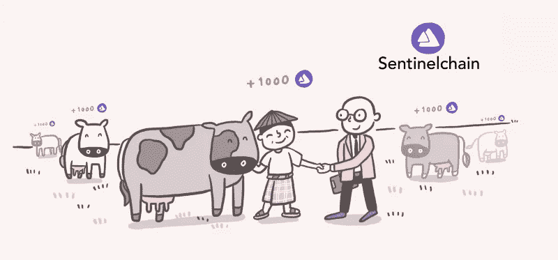
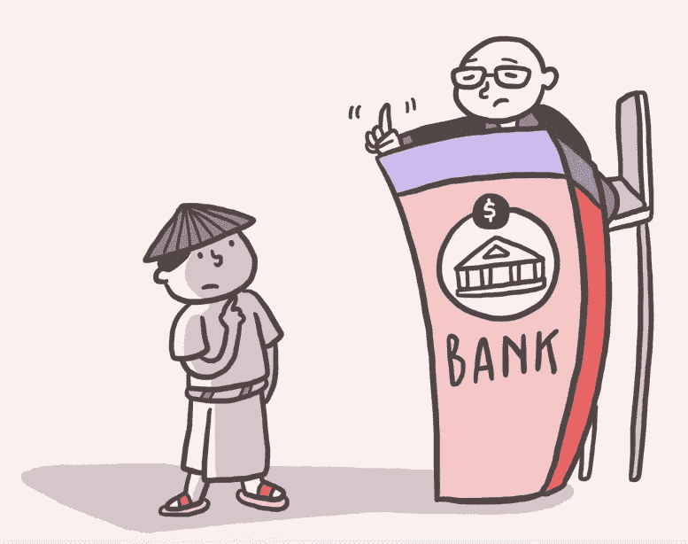
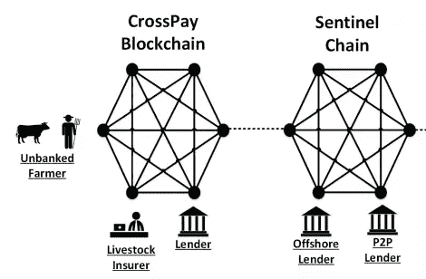
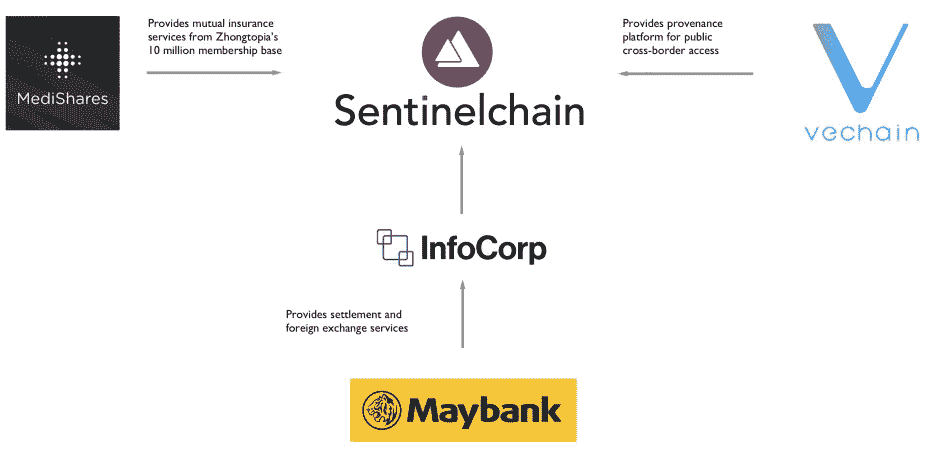

# 世界银行解禁:哨兵链

> 原文：<https://medium.com/hackernoon/unbanking-of-the-world-sentinel-chain-b3d57e85da48>

本文是我上一篇名为**“解除世界银行:比特币与区块链”**的文章的延续，在那篇文章中，我讨论了银行与区块链和比特币的关系，以及它们正在创造的故事。

在**“解除世界银行服务”**系列中，我将重点介绍区块链的一些项目，我认为这些项目有能力帮助世界上没有银行服务的人们。

[https://www.youtube.com/watch?v=uGWUtP_cl-4](https://www.youtube.com/watch?v=uGWUtP_cl-4)

**球场:**

“Sentinel Chain 是一个 B2B 市场，专门为没有银行账户的人提供负担得起的安全金融服务”

**视野:**

最近几个月，首次发行硬币一直是热门话题。投资者正涌向市场上最新、最热门的 ICO，试图在白名单填满或达到硬上限之前得到它们。ICO 的巨大增长使得人们很难识别出那些真正寻求为世界带来价值的项目，而不仅仅是基于炒作和投机行为。

**区块链的核心目标是实现金融普惠和全球平等。因此，看到 InfoCorps 的新区块链项目哨兵链进入市场真是赏心悦目。Sentinel chain 旨在通过创建世界上第一个能够接受使用牲畜(如牛)作为抵押品的平台，为世界上没有银行账户和银行服务不足的人群提供银行服务和融资。**

今天，由于缺乏抵押品，世界各地的农民都无法获得传统的贷款和融资服务。农民不像其他人，他们的大部分资本被锁定在牲畜上，而不是像可抵押的房子这样的资产上。

[https://www.youtube.com/watch?v=uGWUtP_cl-4](https://www.youtube.com/watch?v=uGWUtP_cl-4)

银行和金融服务机构不承认牲畜为抵押品，因为缺乏关于所有权的信息和能够将牲畜转化为具体价值的经核实的系统，导致没有法律认可的抵押品。

通过创建一个名为 Sentinel Chain 的区块链平台，牲畜将被转化为抵押品，并通过利用 RFID 标签，设计为防篡改和防盗，牲畜将能够被登记、量化和识别。此外，将使用简单的移动软件，以便让没有银行账户的人使用起来更加方便，同时打击银行和金融机构的繁琐做法。**最后，世界上银行服务不足和没有银行服务的农民将能够利用贷款和融资服务。**

**价值主张及其运作方式:**

具有先发优势的哨兵连锁如果成功，必将具有开创性。成功将意味着进入一个巨大的未开发市场(农民)的信贷渠道，以及贷款和融资服务传统管理和执行方式的改变。

区块链市场充斥着需要解决巨大问题的项目，通过创建一个区块链来统治所有能够扩展和增长的项目，以便在大规模采用该技术时处理他们想要的交易量。然而，**哨兵链对此事有不同的做法。**他们希望将各种区块链结合到一个生态系统中，以应对未来可能出现的可扩展性和处理问题。这个生态系统将一起工作，满足彼此的需求，而不是让一个区块链来处理所有的事情。生态系统的结构如下:

[https://sentinel-chain.org/Sentinel.Chain.Whitepaper.v0_31.1.pdf](https://sentinel-chain.org/Sentinel.Chain.Whitepaper.v0_31.1.pdf)

*   **交叉点区块链:**

对于 Sentinel Chain 锁定的每个国家，将创建一个**私人交叉区块链。**私人 Crosspay 区块链将被用作信息库，农民可以通过使用 Crosspay 移动应用程序私下访问他们的信息，包括贷款和其他信息。

防篡改 RFID 标签技术、交叉支付移动应用和区块链技术都将是交叉支付区块链的重要组成部分。他们将共同努力，释放牲畜“死资本”的价值。

区块链的 Crosspay 将使用名为**“本地 cross pay Token”**的本地加密货币令牌，该令牌将与该国本地货币的价值挂钩。

*   **Consoritum 区块链—哨兵链:**

区块链将在分散治理下运行，并连接到多个交叉区块链，从而**创建一个中心辐射式生态系统**，提供低成本的跨境金融基础设施，使流动性能够通过金融提供商网络流向农民和无银行服务的世界。Sentinel Chain 将成为主链，代币驻留于此，并提供众筹、抵押和贷款等服务。

*   **VeChain 区块链:**

Sentinel Chain 最近与 VeChain 合作，后者以其强大的公共来源区块链而闻名，可用于打击假冒奢侈品。韦钱的区块链将与区块链的哨兵链整合。牲畜的**年龄、体重、健康状况等信息将以不变且透明的方式**公开存储在区块链的车辆链上，同时在区块链的十字路口保持**农民隐私的完整性。**

*   **奖励链:**

[https://www.youtube.com/watch?v=uGWUtP_cl-4](https://www.youtube.com/watch?v=uGWUtP_cl-4)

为了进一步加强生态系统，Sentinel Chain 希望引入一个**【激励链】**。这个生态系统是通过平衡无银行账户者、保险公司和贷款机构之间的激励来维持的。它是生态系统中现有参与者的保留工具，也是新参与者加入的催化剂。对各方的激励措施:

**P2P 贷款池、银行和金融机构**将受到金融激励措施的激励。他们将能够进入**巨大的市场**进行小额融资。由于透明度和信任问题，这是一个以前无法利用的市场。

区块链的 Sentinel Chain s 生态系统将提供过去缺失的透明度和信任，贷方在发放贷款时将能够访问做出有效决策所需的所有信息。有关牲畜健康和真实性的信息，牲畜农民的所有权，以及牲畜是否已被抵押用于其他贷款。

**政府**将受到这个开放的巨大市场的激励，通过采用和监管来支持生态系统，因为农民能够获得融资将反过来增加产量和增长。

保险公司将有一个全新的市场展现在他们面前，就像贷款人一样，他们也将能够获得签发保险单所需的所有必要信息。

为了有资格获得保险和融资，农民必须对他们的牲畜和他们自己保持透明。**融资形式的经济激励大于在区块链购买保险和注册牲畜的成本。**

*   **哨兵链令牌(SENC):**

SENC 将主要用作当地社区令牌(LCT)的交换媒介，用于支付服务费用或参与项目。

**伙伴关系:**

作为他们与 InfoCorp 关系的一部分，Sentinel Chain 拥有一个令人印象深刻的现实世界合作伙伴名单，将参与将该项目带入生活。根据 Sentinel Chain 的白皮书，合作伙伴如下:

[https://sentinel-chain.org/Sentinel.Chain.Whitepaper.v0_31.1.pdf](https://sentinel-chain.org/Sentinel.Chain.Whitepaper.v0_31.1.pdf)

*   " **MediShares** :是世界上第一个全球互助市场，由中国最大的在线互助保险公司 ZhongTopia 提供支持，拥有 1000 万会员。MediShares 平台可以作为金融服务提供商整合到 Sentinel Chain，并为 Sentinel Chain 的无银行市场提供服务。”
*   Maybank 是马来西亚市值和总资产最大的银行。它也是东南亚最大的银行之一，总资产超过 1640 亿美元，2016 年净利润为 16.3 亿美元。作为领先的马来西亚银行集团，Maybank 在南亚和东南亚拥有强大的区域业务，是 InfoCorp 的主要结算和外汇服务提供商，为 Sentinel Chain 的运营提供便利。”
*   " **VeChain** 因创建了一个强大的公共原产地区块链而闻名，可用于打击假冒奢侈品。由于牲畜所有权和所有者的数据保留在标记链上，牲畜、牲畜的出处可以驻留在集成到标记链的公共出处平台上，例如 VeChain。这在需要原产地证明的跨境牲畜贸易和食品供应链中可能是有用的。"

VeChain 的首席执行官 Sunny Lu 和 Sentinel Chain 的首席执行官 Roy Lai 就他们的合作关系发表了以下看法:

> “VeChain 与 Sentinel Chain 的合作开启了普惠金融的新篇章。我们的解决方案将在东盟建立积极的社会成果——通过使用区块链和物联网来奠定坚实的基础数字基础设施，这将支持新的以数据为中心的商业模式。”**ve chain 首席执行官卢阳光。**
> 
> “Sentinel Chain 与 VeChain 的合作将维护每个人的权利，特别是农村无银行账户和服务不足的人，充分获得优质金融服务，如牲畜保险和小额信贷。” **Roy Lai，Sentinel 连锁店首席执行官。**

除了上面提到的合作伙伴，Sentinel Chain 还与 **Cloudwell** 达成了合作关系。CloudWell 是一家金融科技公司，总部设在孟加拉国，为牛奶供应提供即时支付服务，并接触到超过 30 万农民。CloudWell 还通过合作社或村庄牛奶收集中心的代理银行网点，为孟加拉国的奶农、牧民和牛奶工提供金融解决方案。**与 Sentinel-Chain 的合作将使 Cloudwell 能够以更优惠的价格为客户提供金融服务。**

最后，Sentinel Chain 建立了一个由全球有影响力的人组成的大使网络，以推广 Sentinel 的愿景。到目前为止，两位令人印象深刻的大使加入了他们的网络，他们是 Cetalin Ivan 和 Bernardo Corti。

[https://www.judgify.me/inbia-ga](https://www.judgify.me/inbia-ga)

> Sentinel Chain 大使的崇高角色意味着他或她承担着支持金融普惠使命的承诺，并通过 Sentinel Chain 的技术(Sentinel Chain 的代表)贡献自己的专业知识来改善无银行账户者的生活。

Cetalin Ivan 是罗马尼亚的欧洲议会成员，Bernardo Corti 是 Cryptologic 的联合创始人和 BitSign 的首席执行官。他们都将协助在欧洲和拉丁美洲地区推广哨兵项目，同时建立稳固的网络。

**团队:**

[http://www.jencoinc.com/whats-it-mean-to-be-a-team/](http://www.jencoinc.com/whats-it-mean-to-be-a-team/)

总共由 9 人组成的哨兵链。这是一个拥有丰富经验和知识的团队。值得注意的小组成员有:

*   **罗伊·赖**是 Sentinel Chain 的首席执行官和创始人。他在银行业拥有丰富的经验，并创建了支付解决方案和小额融资基础设施。罗伊实施了 **FAST** ，这是一个连接新加坡 14 家银行的全国性实时网络。他还在新加坡社会科学大学教授区块链编程和智能合约。
*   Zann Kwan 是基金会成员，自 2013 年以来一直是比特币和区块链技术领域的金融科技企业家。她是新加坡加密货币和区块链生态系统的先驱之一，并在新加坡和亚洲市场率先实施和推出了第一台比特币 ATM 机。

除了优秀的团队，Sentinel Chain 还拥有令人印象深刻的顾问委员会:

*   **博深**是 Fenbushi Capital(与 **Vitalik Buterin** )和 BlockAsset 的创始合伙人。Fenbushi Capital 因其对加密领域的参与和资助而闻名，并试图通过支持尽可能多的公司来加速区块链经济不可避免的未来。Fenbushi Capital 在传统金融和区块链领域都有经验丰富的合作伙伴。
*   **李尚义**拥有亚洲金融科技公司和区块链空间公司以及硅谷的工作经验。他是 BlockAsset 的联合创始人。他之前投资过区块链的项目，如 Zcash、OmiseGo、Qtum 和 TenX。

**对于所有团队成员和顾问委员会，请访问 Sentinel Chain s 网站。**

**展望:**

Sentinel Chain 是一个令人耳目一新的稳健项目，它向世界上每个人的金融包容性迈出了第一步，这正是比特币和区块链诞生的原因。我本人相信这个项目，并期待着有一天我能成为 Sentinel Chain 生态系统的一部分，并了解地球另一端可能需要资金的没有银行账户和银行服务不足的农民。

**不幸的是，Sentinel Chain 的白名单已被填满，ICO 将于 3 月 8 日结束。然而，Sentinel Chain 的代币将在 2018 年 Q2 期间登陆各种交易所。敬请期待！**

免责声明:

这不是财务建议，请不要投资超过你能承受的损失。

更多关于加密货币和区块链的文章，请在 Medium 上关注我，如果你对这篇文章有任何疑问，可以通过[https://twitter.com/7793Sajwal](https://twitter.com/7793Sajwal)联系我。

来源:

*   [https://medium . com/sentinel chain/sentinel-chain-welcomes-its-next-ambassador-Bernardo-Corti-94e 14b 4386 c 9](/sentinelchain/sentinel-chain-welcomes-its-next-ambassador-bernardo-corti-94e14b4386c9)
*   [https://medium . com/@ biigpongsatorn/sentinel-chain-ico-review-44586673031 a](/@biigpongsatorn/sentinel-chain-ico-review-44586673031a)
*   [https://sentinel-chain.org/Sentinel.chain . white paper . v 0 _ 31.1 . pdf](https://sentinel-chain.org/Sentinel.Chain.Whitepaper.v0_31.1.pdf)
*   [https://medium . com/sentinel chain/sentinel-chain-empowers-rural-farmers-in-Bangladesh-through-partnership-with-cloud well-and-green-2 cf 4 ffab 3344](/sentinelchain/sentinel-chain-empowers-rural-farmers-in-bangladesh-through-partnership-with-cloudwell-and-green-2cf4ffab3344)
*   [http://www . money sense . gov . SG/understanding-financial-products/banking-and-cash/types-of-products-and-services/fast . aspx](http://www.moneysense.gov.sg/understanding-financial-products/banking-and-cash/types-of-products-and-services/fast.aspx)
*   [https://sentinel-chain.org/](https://sentinel-chain.org/)
*   [https://medium . com/sentinel chain/redefining-financial-inclusion-in-todays-world-4be 2566 c 7727](/sentinelchain/redefining-financial-inclusion-in-todays-world-4be2566c7727)
*   [https://www.youtube.com/watch?v=97TIwlGdLIQ&t = 782s](https://www.youtube.com/watch?v=97TIwlGdLIQ&t=782s)