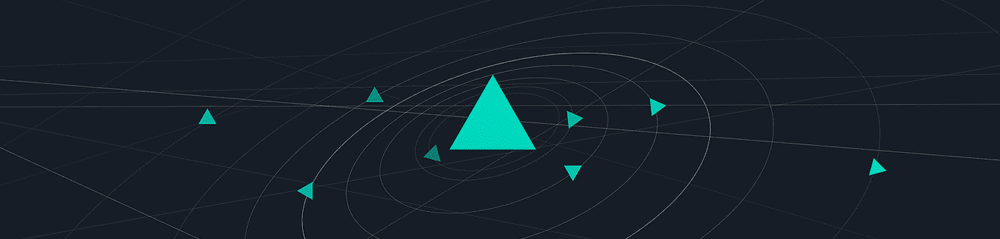
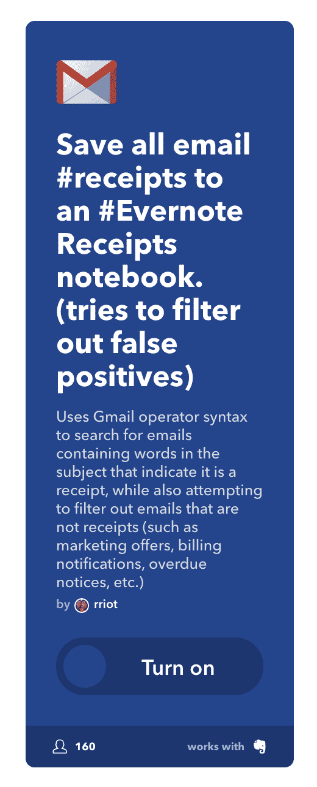
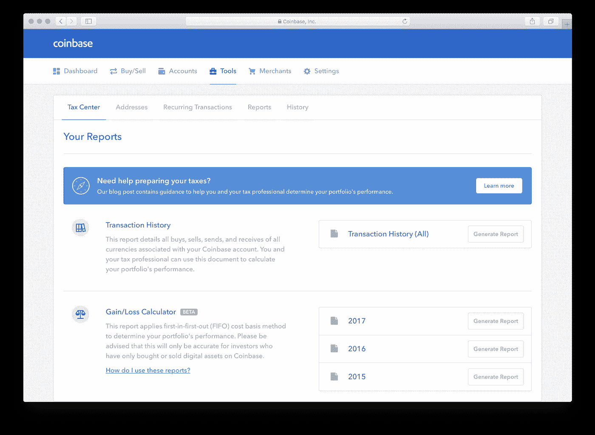

# 山姆大叔想分享你的加密收益

> 原文：<https://medium.com/hackernoon/uncle-sam-wants-in-on-your-crypto-gains-11ec2f964c72>

***免责声明:*** *以下文章不代表 IoTeX 观点。本文表达的观点和意见是作者的观点和意见，不一定反映美国政府任何机构的官方政策或立场。作者不是专业会计师、财务顾问或注册会计师。这篇文章不是法律、金融或税务方面的建议。*

# **加密货币有 3 个属性，因此很难分类。**

1.商品:人们像交易黄金和白银一样交易它。
2。**财产**:有时候会有人用加密货币把钱转到国外。在这个意义上，加密货币被视为货币或也被称为财产。
3。**资产/证券**:交易所和 ICO(相当于加密领域的 IPO)都归入“投资产品”类别。

加密货币的众多属性让立法者绞尽脑汁想如何对加密货币进行分类和监管。对这样一个模棱两可的东西制定法规并不简单，但加密的模棱两可和独特的属性使其对投资者、霍德尔和爱好者如此具有吸引力。

# 对国税局来说，加密货币=财产

在国税局看来，它们被视为财产(https://www . IRS . gov/pub/IRS-drop/n-14-21 . pdf)。在《A-1》的第 2 页，他们指出“适用于财产交易的一般税收原则也适用于使用虚拟货币的交易”。这到底是什么意思？

> “如果外币是作为商业交易的一部分收到的，它被视为普通收入，必须在收到时作为美元价值报告。如果在外币实际兑换成美元之前，货币已经升值，那么这种升值将被视为资本利得，需要缴纳资本利得税。如果纳税人是个人而不是企业，并持有外币进行投资，当货币转换成美元时的收益被视为资本收益。然而，如果一个人持有的外汇不是作为业务或投资的一部分——这在国外旅行中经常发生——那么最多 200 美元的升值是免税的，任何额外的金额都是资本利得。”—[2018 年联合经济报告№115–596](https://www.scribd.com/document/374033035/2018-Joint-Economic-Report?irgwc=1&content=10079&campaign=Skimbit%2C%20Ltd.&ad_group=100652X1574425X593e441fc639dd32ce03d289d3b5dfa5&keyword=ft750noi&source=impactradius&medium=affiliate#from_embed)

# 密码像外币一样被征税。

1.如果你收到你的商品和服务的加密，你把它作为你的普通收入，并报告你的美元收入。
2。一旦你把你的密码换成美元,“你为你的商品和服务收取的金额”的增值被报告为资本收益。

> “然而，适用于个人外币交易的 200 美元免税似乎不适用于虚拟货币。”-[2018 年联合经济报告№115–596](https://www.scribd.com/document/374033035/2018-Joint-Economic-Report?irgwc=1&content=10079&campaign=Skimbit%2C%20Ltd.&ad_group=100652X1574425X593e441fc639dd32ce03d289d3b5dfa5&keyword=ft750noi&source=impactradius&medium=affiliate#from_embed)

例如，我是一个独立的店主，我通过出售我的艺术品赚了 1 英镑。凌晨 2 点(我收到付款的时候)，1 美元兑 1 乙醚的汇率是 587.86 美元，所以这被记为你的普通收入。我决定在同一天下午 6 点用 1 乙醚= 622 美元的汇率将我的 1 乙醚兑换成菲亚特。现在，622 美元和 587.86 美元之间的差额被报告为资本收益。

对于非常小的交易来说，这是一个非常令人头疼的问题，比如买一个比萨饼或者一杯加了乙醚的咖啡。想象一下，由于加密的“安全”性质，你必须跟踪每笔咖啡交易的基础和公平市场价值，以确定你的得失。

# 矿工也要交税。美国国税局希望采矿收益在年度总收入下报告。

政府正在采取措施解决不必要的多报问题。谁想审计成千上万的加密咖啡收据？我们猜测会计师不会很快失业。**2017 年加密货币税收公平法案**免除 600.467 美元以下的购买报告(他们真的很精确！)，但是这个法案还没有成为法律。

# 保留收据的几种方法

1.保存收据的白痴方法。启动一个 excel 表。老派。
2。编写一个程序来为你保存收据。
3。用一个平台来追踪(例如:alt pocket/yax returns/比特币。Tracker/ CoinTracker)。垮台的事实是，这些服务将看到你所有的资本收益从加密的过去一个纳税年度。如果平台不安全，那么这些信息就会泄露出去。
4。如今，大多数商品和服务都应该生成某种形式的电子邮件收据。使用 IFTTT 将所有电子邮件回执自动存入 Evernote 笔记本？从未尝试过，但看起来很有希望，所以如果你已经尝试过，让我们知道。至少用这个方法，就赢了一半。现在你只需要查看这些交易的市场价值。

或者你可以通过比特币基地进行所有的交易。他们本周刚刚推出了他们的税收计算器。这个计算器不是给那些钱包里有很多硬币的人用的！

没有为 YaxReturns 做广告，但他们有一篇关于加密税的写得很好的博客:加密税的十诫。

# 不交税的后果(来源:[美国消费者新闻与商业频道](https://www.cnbc.com/2017/04/17/heres-what-happens-if-you-dont-pay-your-taxes.html)

1.  **未申报罚款**:每晚一个月，罚款金额是你未缴税款的百分之五，最高可达百分之二十五。除此之外，如果你迟交 60 天以上，你将支付最少 135 美元或 100%的税款(以较少者为准)。
2.  未付罚金:罚金是你每个月未付税款的 0.5%，最高可达 25%。另外，你还会欠未付金额的利息。

如果你继续忽视你的税收，你可能有更多的费用要处理。国税局可以:

*   提交联邦税收留置权的通知(对你的财产的要求)
*   没收你的财产
*   让你没收你的退款
*   起诉逃税
*   吊销你的护照

## 所以不要惹山姆大叔。

阅读我们之前关于 2018 年 2 月[虚拟货币参议院听证会](/iotex/highlights-from-todays-virtual-currencies-senate-hearing-74bc5233513)的帖子，以及 [SEC 关于潜在非法数字资产交易在线平台的声明解读](https://hackernoon.com/regulation-update-how-to-interpret-the-statement-on-potentially-unlawful-online-platforms-for-f769a2af5670)。

# 关于 IoTeX

IoTeX 致力于打造下一代面向物联网的区块链平台。尖端的区块链区块链架构将解决与物联网 DApps 和生态系统增长相关的可扩展性、隐私性、隔离性和可开发性问题。通过将象征性激励与我们充满活力的全球社区相结合，我们相信我们可以众包顶级行业和社区人才，以推动区块链 3.0 的发展。

*电报:*[*https://iotex.io/telegram*](https://iotex.io/telegram)

*推特:*[【https://twitter.com/iotex_io】T21](https://twitter.com/iotex_io)