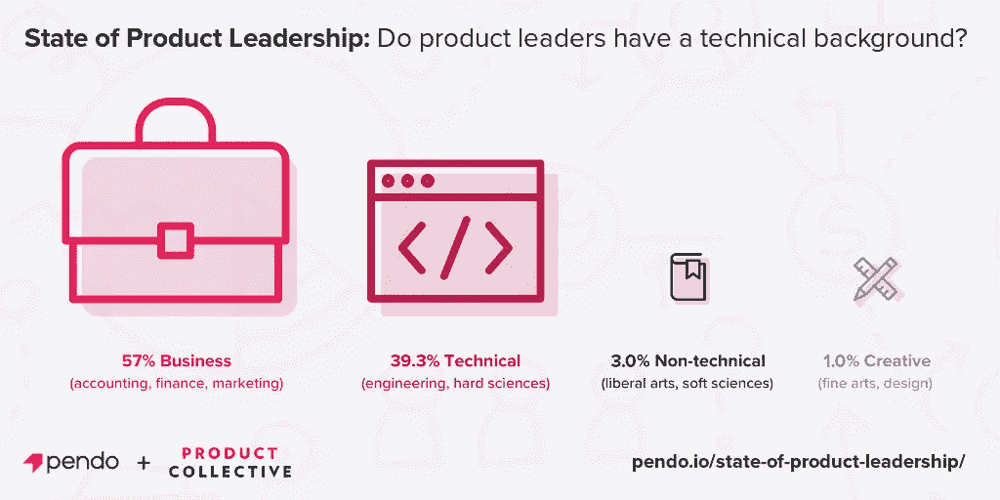
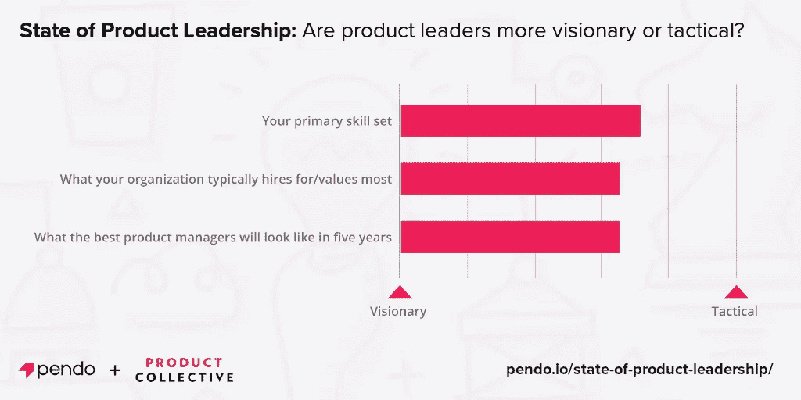
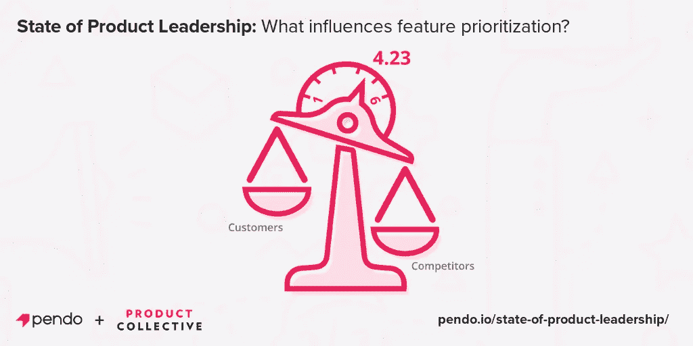
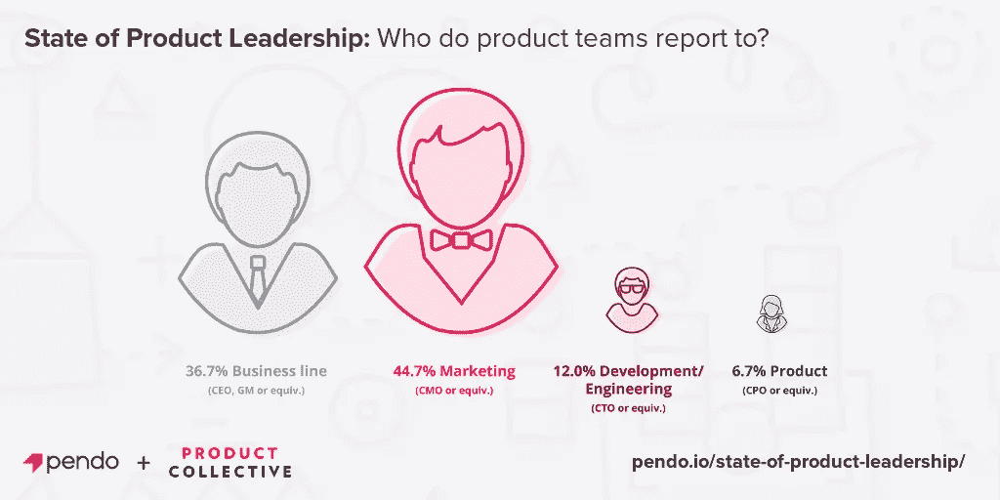

# 揭开产品领先的状态

> 原文：<https://medium.com/hackernoon/uncovering-the-state-of-product-leadership-38982fcc0095>

*我们对 300 名技术产品负责人进行了调查，得到了一些意想不到的发现*

在每个领域都有许多共同持有的信念——没有争议的东西，因此很大程度上没有被检验。这就是为什么做新的初级研究总是有益的。你总会发现一些令人惊讶的东西。最近，我有机会和[产品集体](http://www.productcollective.com)的人一起研究 [300 名技术产品负责人](https://www.pendo.io/state-of-product-leadership/)。我们想深入了解他们的背景、责任、效率和职业满意度。

上周，我们公布了调查结果，正如预期的那样，我们看到了一些有趣的结果，挑战了关于当今产品团队的传统智慧。

**惊喜#1:产品负责人没有技术背景**

人们普遍认为，要取得成功，[软件](https://hackernoon.com/tagged/software)产品经理必须具备或者应该具备技术背景，并且在开发方面花了一些时间。职位描述通常要求产品管理职位具有[工程](https://hackernoon.com/tagged/engineering)学位或同等学历。然而，事实证明，大多数产品负责人要么有商业背景，要么有文科背景，要么有创意背景。

**惊喜 2:产品领导者不认为自己有远见(或重视远见卓识)**

我们认为史蒂夫·乔布斯是伟大的产品领导者的典型——不断提出革命性的、通常是反向的想法，这些想法导致了我们离不开的产品。人们可能会认为所有的产品领导都渴望这样，但事实并非如此。事实上，大多数产品领导认为他们的角色主要是战术性的。更重要的是，他们觉得战术技能对他们的成功更重要。

**惊喜 3:产品负责人在决策过程中很大程度上是被动的**

这可能伴随着战术上的一致，但我们通常认为技术产品团队与客户紧密一致——定期与他们交谈，并塑造产品体验以使他们的生活更轻松。然而，大多数产品团队表示，他们的路线图决策更多地受到竞争压力的影响，而不是客户需求的影响。

**惊喜 4:大多数产品团队向 CMO 汇报**

我们认为技术产品团队与工程紧密结合，并且经常是工程组织的一部分，但是项目经理作为荣耀的工程项目经理的日子似乎结束了。如今，产品团队比首席技术官更有可能向 CMO 或业务线领导汇报。

诚然，并非我们在调查中发现的一切都令人震惊或惊讶。然而，当你仔细想想，有些“惊喜”是相当令人震惊的。产品体验比其他任何东西都更能让公司在市场上脱颖而出，然而大多数负责这些体验的产品团队认为自己是乏味的战术家，只关注他们的竞争对手做的最后一件事。如果你领导一个产品团队，可能是时候进行端到端的路线图审查了。

但是首先，请访问 pendo.io/state-of-product-leadership/，阅读完整的研究报告。