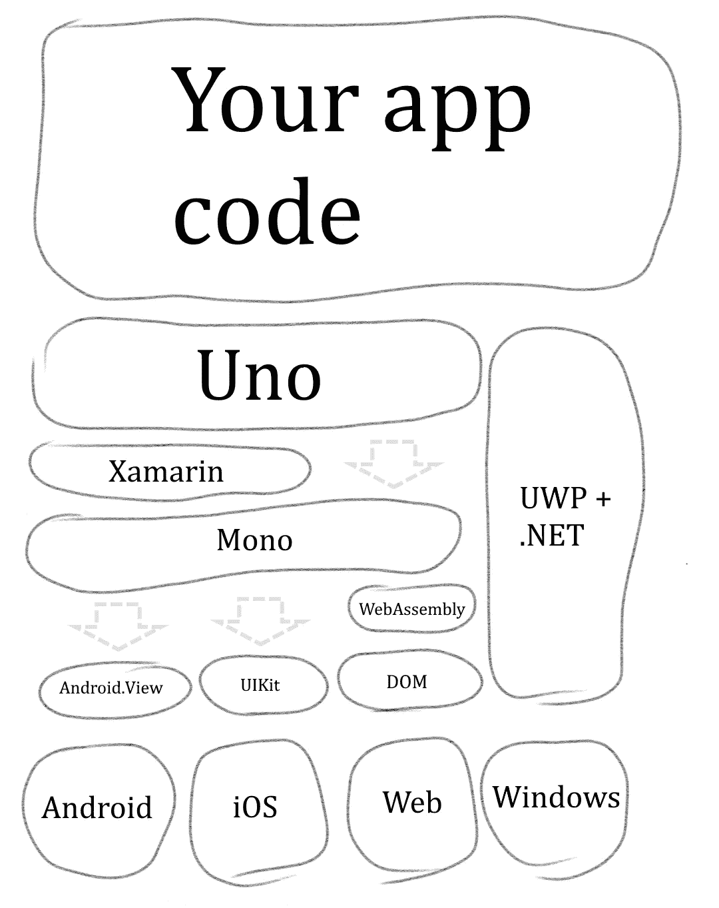

# 引擎盖下:Uno 平台简介

> 原文：<https://medium.com/hackernoon/under-the-hood-an-introduction-to-uno-platform-6064a765d6a>

到目前为止，您可能已经听说了 [Uno](https://github.com/nventive/Uno) 。在这个帖子系列中，我想展示一下 Uno 的技术天赋。我们将查看为平台提供动力的关键代码，并绘制构建 UI 平台的起伏图。

首先，让我们了解一下情况。

## **Uno Stack**

Uno 是一个跨平台的用户界面框架。你用 C#和 UWP 风格的 XAML 标记编写一个应用程序。它运行在视窗系统上，因为它是一个 UWP 应用程序。有了 Uno，它可以在 Android、iOS 上运行，也可以通过网络组装在浏览器中运行。

我画了一张技术堆栈的草图。

在 iOS 和 Android 上，Uno 使用 [Xamarin](https://visualstudio.microsoft.com/xamarin/) 来访问平台的本地框架。在 web 版本中，它直接运行在 [Mono](https://github.com/mono/mono) 之上，Mono 又运行在 [WebAssembly](https://webassembly.org/) 之上。

## **那 Uno 在做什么？**

要让您的应用程序运行，需要做几件事:

-在编译时，Uno 将 XAML 文件解析成 C#代码，创建构建应用程序视觉树所需的信息；

-它实现了一个完整的[数据绑定](https://docs.microsoft.com/en-us/windows/uwp/xaml-platform/dependency-properties-overview)引擎，尽可能针对静态类型检查进行了优化；

-它实现了 [UWP 框架](https://docs.microsoft.com/en-us/windows/uwp/design/controls-and-patterns/controls-by-function)中的视图和控件，以每个平台的本地用户界面框架为基础。

每一个项目都有它自己的帖子，所以我会在陷入困境之前继续前进。

## **无极之道**

在我结束这篇介绍性的文章之前，我想简单介绍一下 Uno 的理念，在我们构建这个东西的时候，它指导了我们主要的架构决策。

**1。利用现有工具** 我们站在巨人的肩膀上。使用微软的工具是一种享受:[编辑并继续](https://docs.microsoft.com/en-us/visualstudio/debugger/edit-and-continue)，[实时视觉树](https://docs.microsoft.com/en-us/visualstudio/debugger/inspect-xaml-properties-while-debugging)，不胜枚举。Uno 的承诺是用这些工具构建你的应用，然后部署到 iOS、Android，最终部署到网络。

**2。创建丰富的、反应灵敏的 ui** 如今平淡无奇的应用程序已经不够用了。对动画、模板和自定义视觉效果的强大支持是必须的。当各种尺寸的手机出现，制造商在屏幕上挖洞的时候，你的应用程序的布局最好是有反应的。

**3。让视图做视图** 模型、视图和表示的分离使你的代码松散耦合，易于维护。像数据绑定和附加属性这样的特性可以让你编写干净、优雅的 MVVM 风格的代码。

**4。本机互兼容性/转义** 100%的代码重用是理想的，但也应该易于访问特定于单个平台的功能，或者集成本机第三方库。

**5。性能是特色** 慢羚羊被吃掉，慢 app 获得 1 星评级。我们已经在现实世界用例的基础上做了很多优化，我们将继续这样做。

我认为这是一个停下来的好地方。在下一篇文章中，我将讲述我最喜欢的 UI 控件的故事:[列表视图](https://docs.microsoft.com/en-us/windows/uwp/design/controls-and-patterns/listview-and-gridview)。

