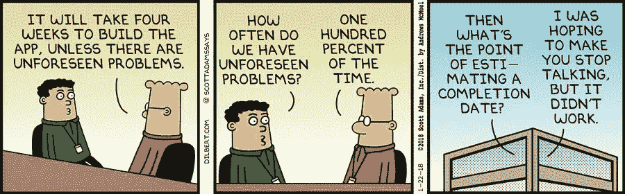
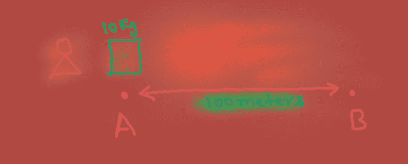
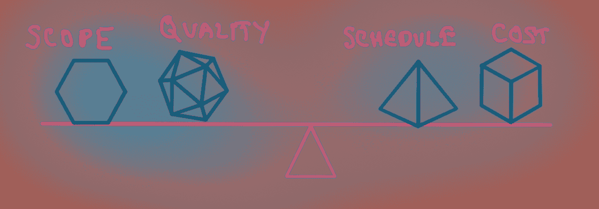
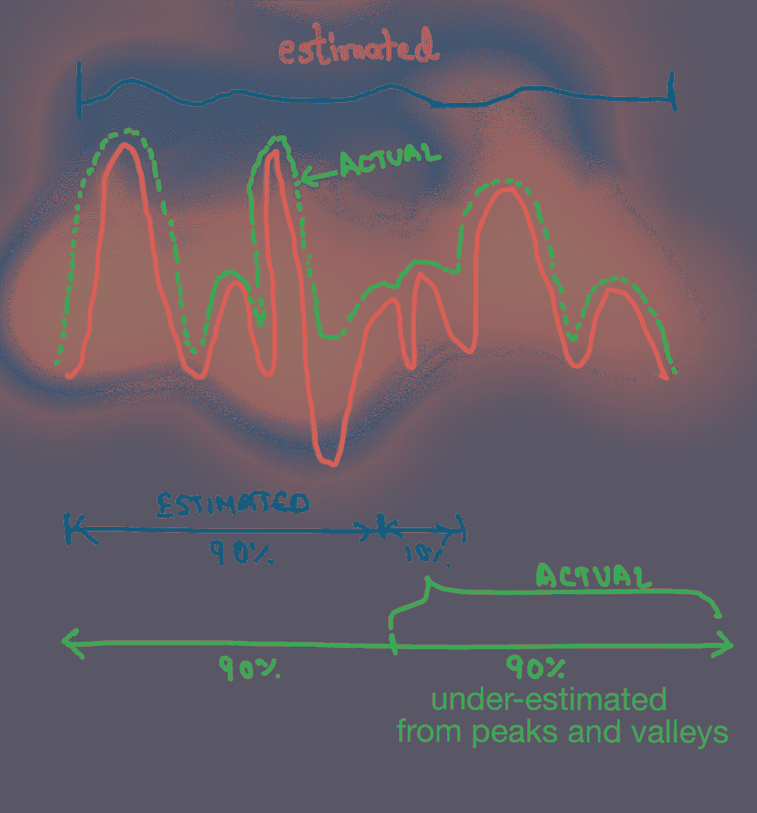
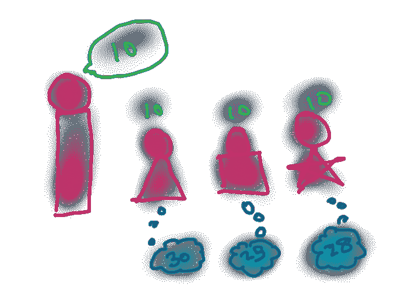
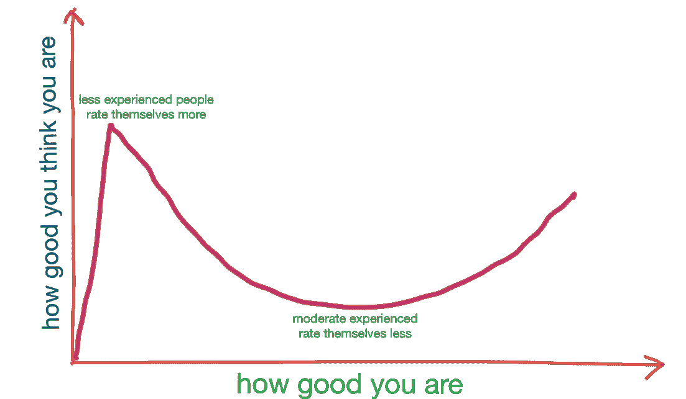
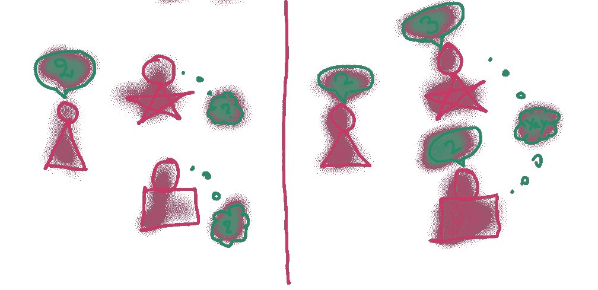
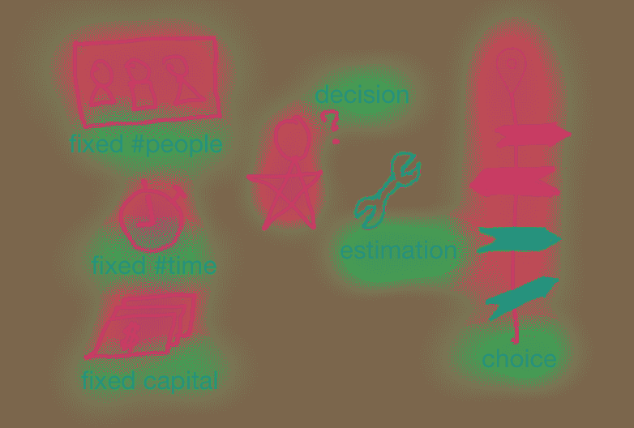

# 低估估计

> 原文：<https://medium.com/hackernoon/underestimating-estimation-d2e52372f303>

## 使用评估来做决策，而不是客户承诺。

[http://dilbert.com/strip/2018-01-22](http://dilbert.com/strip/2018-01-22)

**想象一下**

如下图所示，将一个箱子从 A 地运到 B 地需要多长时间？

八个人的团队，在[喜马拉雅](https://en.wikipedia.org/wiki/Himalayas)搬运一个大箱子需要多少时间？

下面是最后一个要估算的问题，“你是哥伦布，你有一个十二人的团队。你需要找一个新的岛。你在探索和寻找岛屿方面有些经验。*和团队分布。*“这听起来更接近软件项目评估。变化是不断的——技术、人员、需求、业务。任何超过两周的估计都是相当不确定的。

Sydney Opera House — 10 years delayed, 1,457% over budget

一篇 HBR [文章](https://hbr.org/2011/09/why-your-it-project-may-be-riskier-than-you-think)显示，*‘六分之一的 IT 项目成本超支 200%’*。这是一个很大的估计失误。那我们为什么要估计？

## 为什么要估计？

> 这个过程叫做估计，而不是精确的估计。—菲利普·阿穆尔

对于给定的范围理解，预期结果是*时间和*成本。就像旅行估算有助于旅行计划一样，估算也是决策和计划的有用工具。决策和计划必然会改变。最终，它会设定一个方向，并购买承诺。

这也有助于计划协调。如果项目 B 依赖于项目 A，它会给出等待时间的概述。

> 据说拿破仑说过，没有一场成功的战斗是按照它的计划进行的。然而拿破仑也计划了他的每一场战斗，比任何一位早期的将军都要细致得多。

## 平衡四个约束

铁三角定义了评估的四个主要约束——成本、进度、范围和质量。我想用天平来代表它。

The four constraints of estimation

如果你想扩大范围，你要么提高进度，要么增加成本，要么降低质量。这种平衡有一些实际限制。

> 如果 100 个人能在 100 天内建起一座桥，那么 10000 个人能在 1 天内建起同样的桥吗？

成本和进度很容易衡量。质量相对较难，范围最难衡量。项目应该促进变化，但管理范围。在一个被高估的项目中，如果必须在缩小范围和降低质量之间做出选择，最好选择前者。此外，可以根据客户价值来决定范围。

**因素低估估计**

*   **当你完成 90%的时候，你完成了多少？**

> **九十法则:**代码的前百分之九十占了开发时间的前百分之九十。剩下的 10%的代码占了开发时间的 90%。—汤姆·卡吉尔，贝尔实验室

90%的工作已经完成，剩下的 10%是细化需求、误读细节、小的 UI-UX 调整、阻塞、代码审查评论、构建失败等等。这 10%被严重低估了，而且耗费了大量时间。

**Ninety-ninety rule**

*   **我们都在用同样的尺度吗？**

我们通过确定任务的大小或相对大小或一个人花费的时间等来进行估算。理解所有这些都有一定的规模假设是很重要的。例如，不同的人对一个人的能力有不同的解释。

Assumption of a persons capacity

*   **估价令人满意吗？**

> **一厢情愿的想法**是信念的形成，并根据可能令人愉快的想象做出决定，而不是诉诸证据、理性或现实。它是解决信仰与欲望冲突的产物。— [维基百科](https://en.wikipedia.org/wiki/Wishful_thinking)

*   你是想在群体中显得友善吗？

**群体思维**是通过压制正确意见或不评估备选方案来避免冲突的群体决策。类似地，**两极分化**是个性更强的人主导估计值的影响。

Avoiding conflicts by suppressing true opinions

*   **团队中的专业知识分布如何？**

**邓宁·克鲁格效应:**如下图所示，不同专业水平的人对自己的能力有不同的自我认知。

**Dunning Krugger effect**

经验不足的人不知道自己的知识，对自己的评价更高。经验中等的人会意识到自己不知道的事情，对自己的排名会比较低。他们更看重别人。它会影响评估。

*   **规划谬误？**

> 计划谬误是个人倾向于低估完成大多数任务所需的时间。— [来源](https://www.sicotests.com/psyarticle.asp?id=385)。

*   **第一次评估会影响小组评估吗？**

锚定是人类通过调整导致最终结果的初始值来做出决策的倾向。

Anchoring influencing estimation

[规划扑克](https://en.wikipedia.org/wiki/Planning_poker#The_reason)是避免这种情况的好方法。

*   **杂项**

你只考虑开发时间吗？你假设每天八小时吗？你在增加浪费和返工吗？还有很多。

## 总结想法

估计有制造错误期望的名声。我们讨论了它不准确的许多原因。

> 错误的估计可能不是项目延期的原因。把它作为客户承诺可能是个问题。

随着开发的进展，客户价值变得更加明显。评估不应该限制敏捷性。

有了可用的人员、时间和资金，评估就成了选择方向的工具。

estimation as a decision making tool

> 决策遵循评估。