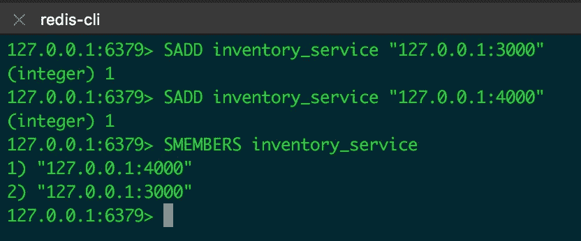
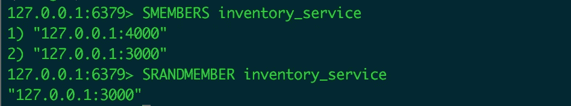
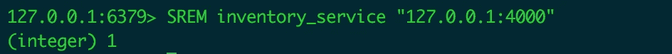

# 微服务架构中的服务发现

> 原文：<https://medium.com/hackernoon/understand-service-discovery-in-microservice-c323e78f47fd>

很多年前，和朋友失去联系最简单的方法就是在不通知他们的情况下更换电话号码。

这同样适用于微服务架构系统中的服务。两个服务可能正在愉快地互相交谈，直到其中一个移动到另一个 ip 地址。

## 什么是服务发现

服务发现是关于找到服务提供商的网络位置。

## 我们为什么需要它

如果一个团队正在维护物理服务器，那么一个配置文件将最能满足需要。

但是，如果您使用云，由于重启、故障和扩展，您的服务可能会有动态网络位置。手动维护配置文件是不可行的。

## 有哪些组件

服务发现涉及三方:服务提供者、服务消费者和服务注册中心。

1.  服务提供商在进入系统时向服务注册中心注册自己，在离开系统时注销自己
2.  服务消费者从注册中心获取提供者的位置，然后与提供者对话
3.  服务注册维护提供者的最新位置

有许多现有的服务发现工具可供使用。但是如果我们想要建立自己的呢？

## 设计服务发现

由于 service registry 基本上维护键-值对`(provider name, provider locations)`，redis 可能是一个不错的选择。让我们用 redis 作为注册中心来模拟服务发现过程。

当服务提供商`inventory_service`在注册表中注册自己时，我们使用`SADD`将其位置添加到`set`:

当服务消费者查询`inventory_service`的位置时，我们可以使用`SMEMBERS`获取所有位置，也可以使用`SRANDMEMBER`随机选取一个位置:

当`inventory_service`取消自己的注册时，我们使用`SREM`将其从集合中删除:

但是要处理的事情很复杂:

1.  **该服务可能不会在消失后自行注销**。则注册中心向消费者提供无效地址。为了解决这个问题，服务提供商需要周期性地发送其 ***心跳*** (可能每 5 秒一次)。如果提供者在一段时间内没有发送任何心跳，注册表将假定提供者死亡，并注销它。
2.  **每次调用提供者前查询注册表？**它给注册表带来了过多的负载，并对性能产生了不必要的影响。最好在消费者本身保留一份副本。
3.  **如果保存在消费者处，如何通知消费者供应商的变更？**有两种方法可以做到。1)消费者使用 ***轮询*** 获取最新版本。因为位置通常不会经常改变，所以这仍然有效。缺点是轮询之间可能会停机。2) ***pubsub*** 模式。它提供了更即时的位置更新，但它会占用消费者的额外线程。
4.  **发送回提供商的所有数据可能不是必需的。**我们可以保留提供者的 ***全局版本*** ，消费者只需要在版本增加时更新其本地副本。
5.  **单点故障**。如果服务注册中心(例如我们在这里使用的 redis 实例)关闭，所有的消费者和提供者都会受到影响。为了缓解这一点，我们可以使用一个 ***分布式数据库*** 作为服务注册中心，比如`zookeeper/etcd/consul`。

## 客户端发现或服务器端发现

1.  客户端发现:服务消费者保留提供者的所有位置，并跨位置对请求进行负载平衡。优点:注册表是唯一的一个组件。缺点:需要为系统中使用的不同语言/框架实现服务发现客户端。
2.  服务器端发现:消费者向负载均衡器发送请求，负载均衡器从注册表中查询并决定将请求发送给哪个位置的提供者。优点:语言/框架不可知。缺点:现在您需要管理另一个移动部件——负载平衡器。

## 结论

本文解释了服务发现如何在微服务架构系统中工作。当读者使用像[网飞尤里卡](https://github.com/Netflix/eureka)这样的开源工具时，它可以帮助他们理解或调试。

参考推荐阅读:

1.  [https://github . com/网飞/尤里卡/维基/理解-尤里卡-客户端-服务器-通信](https://github.com/Netflix/eureka/wiki/Understanding-eureka-client-server-communication)
2.  [https://www . nginx . com/blog/service-discovery-in-a-micro services-architecture/](https://www.nginx.com/blog/service-discovery-in-a-microservices-architecture/)