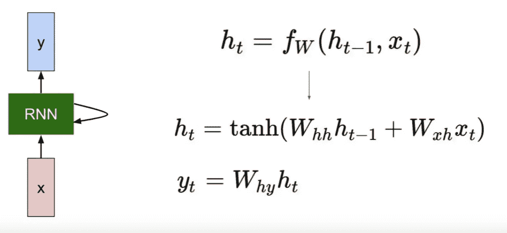
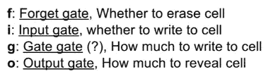

# 用代码从零开始理解 LSTM 细胞的结构。

> 原文：<https://medium.com/hackernoon/understanding-architecture-of-lstm-cell-from-scratch-with-code-8da40f0b71f4>

source:Google

在数据序列很重要的情况下，普通的神经网络表现不佳。例如:语言翻译、情感分析、时间序列等等。为了克服这个缺点，发明了 rnn。RNN 代表“循环神经网络”。一个 RNN 细胞不仅考虑它的当前输入，而且考虑它之前的 RNN 细胞的输出，因为它的当前输出。

香草 RNN 现在的状态的简单形式可以表示为:

**Representation of simple RNN cell**,source: stanford

RNNs 在顺序数据上表现很好，在顺序很重要的任务上表现也很好。

# 但是存在许多**问题** **与** **普通** **RNNs**

> **消失渐变问题:**

**Vanishing Gradient problem 1.tanh 2.derivative of tanh**

双曲正切(tanh)在 RNNs 中主要用作激活函数，激活函数位于[-1，1]，tanh 的导数位于[0，1]。在反向传播期间，由于梯度是通过链规则计算的，它具有将这些小数字**n**(rnn 架构中使用的 tanh 的次数)**乘以**的效果，这将最终梯度挤压到几乎为零，因此从权重中减去梯度不会对它们做出任何改变，从而停止模型的训练。

> **爆炸渐变问题:**

与消失梯度问题相反，当遵循链式法则时，我们也在每一步与权重矩阵(转置的 W)相乘，并且如果值大于 1，则将一个大的数与其自身相乘多次会导致一个非常大的数，从而导致梯度的爆炸。

**exploding and vanishing gradients,** source: CS231N stanford

> **长期依赖问题**

**Long-term dependency problem, each node represents an rnn cell.**source:Google

rnn 在处理顺序数据方面表现良好，但当上下文距离较远时，它们会遇到问题。例:我住在法国，我知道 ____。答案肯定是这里的“**法语**”，但是如果在“**我住在法国**”&“**我知道 ____ 【T27”)之间有更多的词。RNNs 很难预测“法语”。**这就是长期依赖的问题。因此我们来到了 LSTMs。****

# **长短期记忆网络**

LSTMs 是一种特殊的 rnn，具有处理长期依赖关系的能力。LSTMs 还提供了消失/爆炸梯度问题解决方案。我们将在本文后面讨论。

一个简单的 **LSTM** 细胞看起来像这样:

**RNN vs LSTM cell representation,** source: stanford

首先，我们需要初始化权重矩阵和偏差项，如下所示。

> **一些关于 LSTM 细胞的信息**

一个简单的 LSTM 单元由 4 个门组成:

**3 LSTM cells connected to each other.** source:Google

**LSTM cell visual representation,** source: Google

**handy information about gates,** source: Stanford CS231N

> **我们来讨论一下盖茨:**

**【遗忘门】 :在得到**前一状态**、 **h(t-1)** 的输出后，遗忘门帮助我们决定什么必须从 h(t-1)状态中删除，从而只保留相关的内容。它被一个 sigmoid 函数包围，该函数有助于粉碎[0，1]之间的输入。它表示为:**

****

****Forget Gate**, src: Google**

**我们将遗忘门与前一个单元状态相乘，以遗忘前一个状态中不再需要的不必要的内容，如下所示:**

****code for Forget gate.****

****·输入门:**在输入门中，我们决定将当前输入的新内容添加到我们当前的单元状态中，并根据我们希望添加的数量进行缩放。**

****

****Input Gate+Gate_gate**,photo credits: Christopher Olah**

**在上面的照片中， **sigmoid 层决定更新哪些值**而 **tanh 层为要添加到当前单元格状态**的新候选项创建一个向量。代码如下所示。**

**Inputgate, Gate_gate**

**为了计算当前单元状态，我们将((input_gate*gate_gate)和 forget gate)的输出相加，如下所示。**

****

**Code for input_gate + gate_gate**

****输出门:**最后我们将决定从我们的细胞状态输出什么，这将由我们的 sigmoid 函数来完成。**

**我们将输入与 tanh 相乘以压缩(-1，1)之间的值，然后将其与 sigmoid 函数的输出相乘，以便我们只输出我们想要的。**

****

****output Gate,** source:Google**

**Output gate and present ‘h’ state**

**对我们所做的事情的总体看法。**

**overall calculation of different gates.**

**LSTM 对消失和爆炸梯度问题的反应如下。与普通 RNNs 相比，LSTM 的后向投影要干净得多**

****

****Gradient flows smoothly during Backprop,**source: CS231N stanford**

**首先，在反向投影期间没有与矩阵 W 相乘。它是与 f(忘记门)的元素式乘法。所以它的时间复杂度较小。**

*   **其次，在通过每个 LSTM 像元进行反向投影的过程中，它会乘以不同的“忘记命运”值，这使得它不太容易出现消失/爆炸渐变。虽然，如果所有遗忘门的值都小于 1，它可能遭受消失梯度，但是在实践中，人们倾向于用某个正数初始化偏置项，所以在训练的开始，f(遗忘门)非常接近 1，并且久而久之模型可以学习这些偏置项。**

**derivative w.r.t input vectors**

*   **尽管如此，该模型可能遭受消失梯度问题，但机会非常少。**

****本文仅限于 LSTM 单元的架构，但**你可以在这里** **看到完整的代码** [**。**代码还实现了一个使用 LSTMs 从随机输入生成简单序列的例子。](https://github.com/Manik9/LSTMs)****

****我使用深度学习工作室尝试了这个程序:****

****深度学习工作室自带内置 jupyter 笔记本和预装深度学习框架，如 Tensorflow、Caffe 等..所以你只需要点击**笔记本(在左窗格)**在深度学习工作室打开一个 jupyter 笔记本就可以了！****

****************

****特别感谢**克里斯托弗·奥拉**、**斯坦福 CS231n** 团队。****

****如果你喜欢这篇文章，请分享并鼓掌😄。更多关于深度学习的文章请关注我的 [**Medium**](/@maniksoni653) 和 [**LinkedIn**](https://www.linkedin.com/in/maniksoni/) 。****

****感谢阅读。****

****圣诞快乐。****

****— — — — — — — — — — — — — — — — — — — — — — — — — — — — — — —****

****更多学习资料和参考资料:****

 ****[## 了解 LSTM 网络——colah 的博客

### 这些循环使得循环神经网络看起来有点神秘。然而，如果你想得更多一点，事实证明…

colah.github.io](http://colah.github.io/posts/2015-08-Understanding-LSTMs/)****