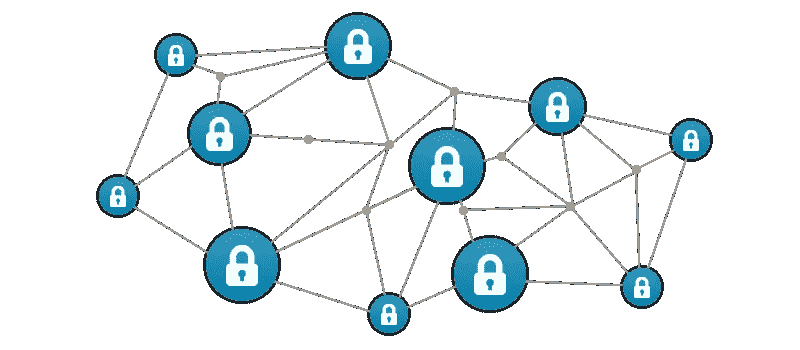

# 理解区块链:经理和其他受影响方

> 原文：<https://medium.com/hackernoon/understanding-blockchains-for-managers-and-other-affected-parties-e1cf0863f061>

Courtesy: ForexNewsNow

所以你也听到了所有的炒作。区块链将改变世界，结束贫困和饥饿，拯救民主，保护猩猩，结束全球变暖。好吧，诸如此类！不管怎样，如果你和大多数阅读这篇文章的人一样，你也听过这些。你可能会试着去理解这是怎么回事。如果您搜索它，有两种页面可供选择:

*   **假人区块链**:这些告诉你，区块链将改变世界，结束贫困，等等你已经知道的！！
*   **书呆子区块链**:哈希算法、前导零、SHA-256、矿池、激励系统、SegWit、硬分叉、股权证明……咿咿呀呀！！！！

我被困在这里有一段时间了。所以，这里是我尝试分享我所理解的。

# 区块链是做什么的？

你已经知道区块链改变了世界，结束了贫困和饥饿，等等。但是贯穿这些明显不同的结果的共同线索是什么呢？这是:

> **区块链帮助不信任的对等体在没有中介的情况下以安全和分散的方式就一条信息达成一致**

那将需要被分解成更小的块来咀嚼、吞咽和消化！

*   **同辈**:地位相同的当事人。例如，当你付给我卢比。100 在市场我卖给你蔬菜，是同行之间的交易。一个人对另一个人。这不同于你的公司任命你为雇员，或者政府准备你所在州的公民名单，或者客户向公司投诉。公司和员工不是同行，公民和政府也不是，顾客和公司也不是。这并不是说，人类是同伴，而组织不是。美国和中国对等谈判进口关税。母亲和孩子不是同龄人。当我在 Flipkart 上订购一本书时，这是两个在法律面前地位相似的法律实体之间的对等交易。
*   信任:在我们的生活中，我们常常意识不到我们有多么需要信任他人。当你走上拥挤的街道时，你相信那些人不会拿刀扑向你。如果没有这种信任，我们可能会在外套口袋里带着匕首、手枪或胡椒喷雾四处走动，那将是一个多么丑陋的世界。当你接受 Rs 的时候。一个陌生人给你 100 块钱买蔬菜，你其实是信任你的政府。政府正在严密监视，以确保其他人不会随心所欲地印刷这些钞票，政府本身也不会鲁莽行事。当你在网上付款购物时，你相信银行只会转账所需的金额。
*   **共识(“就一条信息达成一致”)**:现在是中世纪。一支拜占庭军队占领了一座奥斯曼城堡。十个营，每个营由一位将军率领，驻扎在要塞周围，等待进攻的最佳时机。现在，把你们自己放在一个将军的位置上。你需要决定什么时候进攻。不仅如此，你还要和所有其他的将军(你的**同辈**)达成协议！)关于攻击时机。如果你攻击而其他人不攻击，你就会死！如果你不攻击，而其他人攻击，你会被贴上叛徒的标签，基本上你会死！此外，有传言说其他的一两个将军并不真正喜欢你，你必须格外小心(**不信任的同僚**！)关于您收到的关于攻击应该何时开始的消息。请记住，这是在无线电通信或加密卫星电话出现之前。你必须根据偶尔骑马来的信使告诉你的话来做决定。信使们自己可能已经被敌人收买或威胁。还要记住，你不是在等待接受上级指挥官的指示，你是与你的同事一起平等参与决策的人。再加上真实战场中不断变化的情形，我希望你开始欣赏数学家们正式描述的“拜占庭一般问题”，即不信任的同伴需要就一条信息达成共识。在中世纪的战场之外，像我们这样的真实的人需要就哪些信息达成一致？它实际上可以是任何东西，这取决于应用。我卖给你一公斤上好的棕色大米，卢比。50.四楼的 4C 号公寓是我的，不属于任何人。我工厂的卡车载着钢筋于 2018 年 6 月 24 日凌晨 4:03 经过高知。你借给我的钱。2000，我已同意在 2018 年 8 月 31 日或之前偿还您。你甚至可以存储自动执行的指令(小程序，称为“智能合同”)。例如，如果我的比萨饼没有在承诺的 10 分钟内送到，就自动将退款转到我的账户上，或者在你死后将你家的所有权转让给你的儿子。
*   中介和去中心化:我们现在开始了解区块链最激动人心的部分。我们前面提到了拜占庭一般问题，但没有提到如何解决。嗯，这是一个很难解决的问题。事实上，数学家已经证明这个问题的简单形式是不可解的。那这个世界是怎么存在的？到目前为止，我们已经知道了解决这个问题的两种方法。一种是简单地信任你的同龄人。**我希望我们人类意识到，相互信任仍然是我们在地球上和平共处的最美丽、最廉价和最简单的方式！**第二种方法是非信任对等体使用信任中介(非对等体)。有关示例，请参见前面关于信任的部分。这些中介需要相当大、集中和强大，才能赢得大量人的信任。此外，许多人的信任以及他们对这种信任的依赖，往往会使这些中介机构变得更大、更集中、更强大。想想政府、银行、谷歌等。这导致了我们在当今世界看到的许多问题。就像我们之前讨论的，在没有可信的、集中的中介的情况下，促进不信任的对等体之间的交互的问题是非常难以解决的，甚至被认为是无法解决的。区块链是一种以实用方式解决这一问题的技术，能够在不使用大型集中式中介的情况下实现大量点对点互动。它可以让你从市场上购买蔬菜，而不必相信政府签发的那张纸。它允许你与另一家公司签订合同，合同条款会自动生效，而无需将对方拖入法庭。公民可以在选举中投票，而不必信任当前可能腐败的政府。等等。等等。等等…
*   安全:区块链被大肆宣传，因为他们是拜占庭容错的 T2。注意术语“宽容”。从理论上讲，侵入或篡改区块链或存储在其中的信息是可能的，但这非常非常非常困难。不变性(一旦记录就不能更改)是区块链安全性的基本方面。这是通过将每条新信息(一个信息块)与前面的信息以数学方式连接起来，从而形成一个链来实现的。为了改变先前记录的一个块，你必须重新创建链中的所有后续链接，这是非常困难的。你还需要让你所有的同事都同意这些改变，因为每个人都可以看到其他人在做什么，并且可以投票否决你的改变，因此需要达成共识。参与者的数量越多(系统越分散)，篡改就越困难。除了不变性之外，安全性的其他方面取决于预期的应用程序。在选举中，你想确保人们不会投两次票，但你不想让别人知道你投了谁的票。如果你写了一首诗，你想让全世界都读它，但也想告诉全世界是你写的。或者，如果你是个害羞的诗人，你不想让任何人知道是你写的，但也不想让别人声称是他们写的。如果你在你的工厂实施节能方法并申请碳信用，你可能想留下一个审计线索，该线索不能被改变并可以被第三方核实。如果你担心执政党改变历史教科书来推进他们的议程，你可以在区块链上公布事实，这样将来就没人能改变它了。当你用一枚[比特币](https://hackernoon.com/tagged/bitcoin)给你海外的黑帮朋友，换取一包鼻烟时(如果你不知道，所有的技术都有好有坏的用途！)，你会想知道他的余额中是否真的有那一个比特币，并且还没有把它发给别人。但是你也不想让其他任何人知道谁在寄钱或者谁在收钱。根据您的应用，您可以使用具有不变性、不可否认性、存在证明、匿名性、透明性等属性的区块链。使用称为哈希、加密等密码技术的各种组合。

把它们重新组合在一起，

> 区块链帮助不信任的对等体在没有中介的情况下以安全和分散的方式就一条信息达成一致

# 一句警告

在撰写本文时，上面提到的几乎所有事情都只是可能。区块链仍处于非常早期的阶段。这项技术的许多方面(实际上是各种技术的结合)仍然需要解决，这个领域正在迅速发展，每隔一天就会有新的想法出现。在这个现代版的淘金潮中，除了大量的赌徒、开发者、权力追求者和其他角色之外，还没有为这项技术开发出一个经过验证并得到广泛信任的应用。

没有哪个环节比最薄弱的环节更强。区块链本身可能(几乎)无法破解，但你会读到很多这样的故事:一些人在他们的电子邮件中存储了秘密代码，并以他们的狗的名字作为密码，这些密码可以从他们的脸书页面获得！

我试图解释区块链是怎么做的，除了这里或那里的一点提示之外，不去探究它是如何实现的技术细节。

你觉得这是一个有用的介绍吗？

有没有不太清楚的部分，或者你觉得应该详细阐述或改进？

请分享您的评论:)