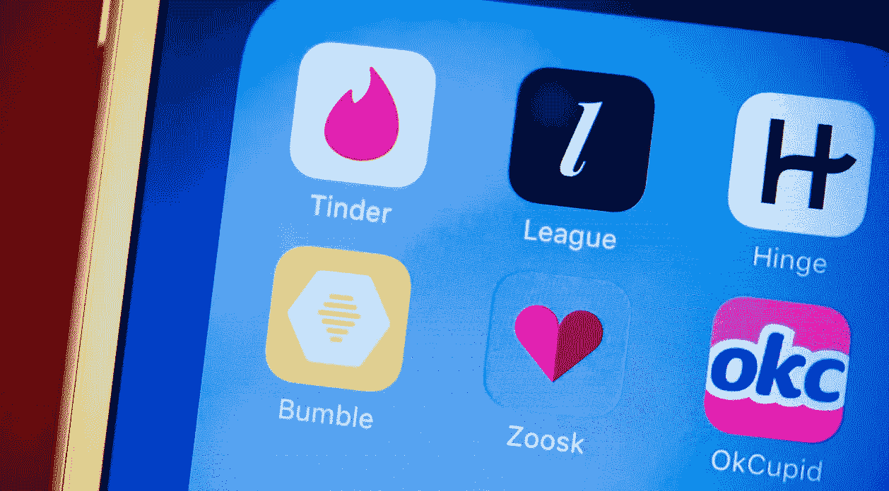

# 约会应用程序令人着迷

> 原文：<https://medium.com/hackernoon/understanding-dating-apps-and-obsession-ae4f7303afb7>

CNET

我交谈过的许多人似乎发现约会应用程序占用了大量的精神空间。

原因可能是:随机奖励和数字性瘾

**随机奖励**

让约会应用上瘾的主要原因是随机奖励。随机奖励让其他东西——短信、电子邮件和社交媒体——也在精神上令人兴奋。对于随机奖励，我们不知道什么时候会得到，我们可能会冲动地检查它们。在数字媒体的情况下，回报是一条消息或通知——以及消息或通知带来的因感到重要而产生的兴奋。

我们不仅会因为这些奖励在不可预知的时间到来而痴迷地检查它们，我们还会因为想要更多奖励而做任何导致奖励的事情。我们可能会发送文本和电子邮件，并在社交媒体上上传内容，因为我们知道这些可能会导致人们向我们发送消息或赞，并作为回应通知我们。

我们可能会不断查看短信、电子邮件和社交媒体通知，寻找数字奖励，因为这也让我们能够对数字互动做出回应——而不会看起来像是你忽略了某人。我们可能会不断发送短信和电子邮件，并在社交媒体上上传图片，以融入数字互动和多巴胺的流动。

交友 app 有随机奖励。可能无法预测何时会收到消息，也无法预测何时会找到匹配。很难预测这些比赛的质量。此外，很难预测积极或消极的反应。所以，我们不仅不知道什么时候能收到比赛或信息，也不知道它的质量。这种情况发生在文本和社交媒体之间，但性环境可能会使这种不确定性更加刺激。除此之外，滑动时轮廓质量也会随机变化。

**数字性瘾**

色情和随意使用脸书和 Instagram 可能会对我们产生性刺激，我们可能会上瘾。约会应用只是从个人资料和图片中获得数字性刺激的另一种方式。

约会应用可能会产生性刺激，但没有直接的渠道。通过评估性刺激图片，我们可能创造出未释放的性刺激。色情似乎是释放这种情绪的一个很好的方式，通过创造它的同样的数字界面。

**结局**

随机奖励和数字性瘾可能会让约会应用看起来上瘾。

你，根据你的情况，并充分理解正在发生的事情，决定多少使用这些东西对你有好处。

我写了一本关于数字成瘾的书。现在购买从 [*巴诺*](https://www.barnesandnoble.com/w/trapped-in-the-web-an-turner/1129986845) *或*[*indie bound*](https://www.indiebound.org/book/9781732182196)*。*