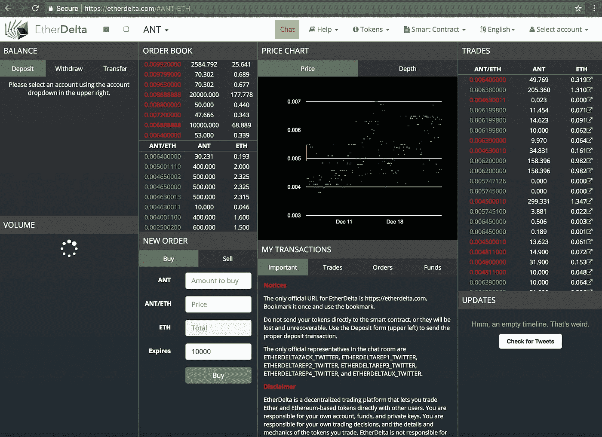
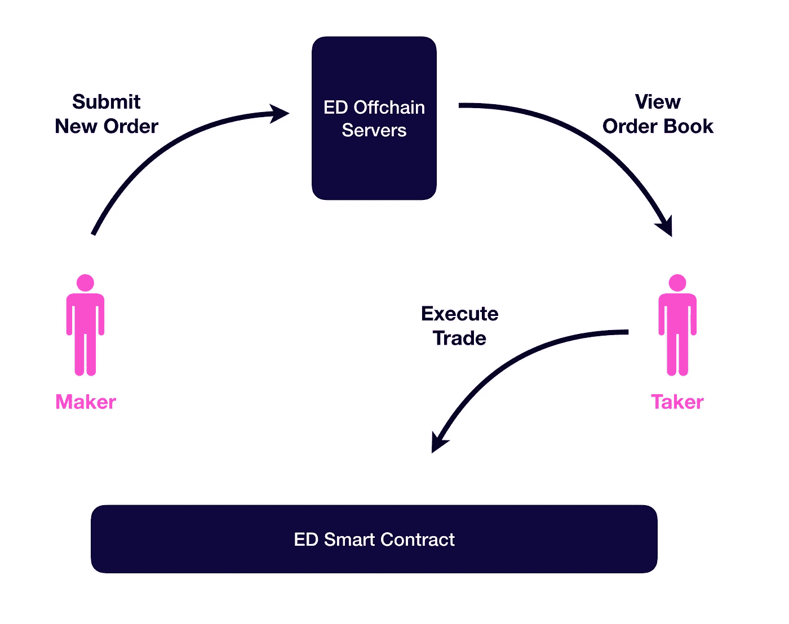

# 了解分散式交换

> 原文：<https://medium.com/hackernoon/understanding-decentralized-exchanges-51b70ed3fe67>

Photo by [Scott Rodgerson](https://unsplash.com/@scottrodgerson?utm_source=medium&utm_medium=referral) on [Unsplash](https://unsplash.com?utm_source=medium&utm_medium=referral)

世界上大部分加密货币交易都是通过[比特币基地/GDax](http://coinbase.com/) 、[币安](http://binance.com/)、 [Bittrex](http://bittrex.com/) 等集中交易所完成的。这些交易所管理一个人的资本(和私人钥匙)并促进交易。在过去的[周](http://fortune.com/2018/01/31/coincheck-hack-how/)和[年](https://bravenewcoin.com/news/mtgox-btc-e-and-the-missing-coins-a-living-timeline-of-the-greatest-cyber-crime-ever/)中，发生了一些高调的黑客攻击，大量资金被盗。这个问题不太可能很快得到解决，我认为这个问题只会变得更糟。软件和硬件复杂性的增加将导致更严重的安全漏洞，如最近英特尔 CPU 固件中的 [Meltdown 和 Spectre exploit](/@mattklein123/meltdown-spectre-explained-6bc8634cc0c2)。

分散式交易所(也称为 DEX)是一种新技术，有助于在分布式账本上进行加密货币交易。这些交易所将资金和交易的控制权交还给用户，消除了单点故障。第二个影响是，政府征税或资金没收可能变得几乎不可能。这可能会对宏观经济和地缘政治格局产生深远的长期影响。

然而，DEX 技术仍然是年轻的，仍然有相当多的缺点，包括某些攻击媒介。在本帖中，我们将研究分散式交换的内部工作方式。

**以太增量和 0x**

有一个流行的项目叫做 [0x (Zero X)](http://0xproject.com) 。这个项目的目标是在以太坊之上为分散式交换提供一个开放的协议。他们还象征性地出售了价值$ZRX 的股票，目前市值为$ 5 . 42 亿美元。(披露:我拥有一些)。令牌的目的是在中为智能合约和协议提供治理机制。

0x 有一些很棒的想法，开源代码实现和文档。然而，我不确定 0x 计划如何将分散式交易所货币化，以及 5.42 亿美元的市值如何维持。

当你阅读 0x 白皮书时，它基本上是对 EtherDelta 分散交换的生动描述。EtherDelta 是第一批已经获得一定影响力的分散式交易所之一。它主要在以太坊上运行，在其智能合约的最新版本中有大约[14 亿美元。考虑到用户界面的状态，这是相当惊人的，即使是最懂技术的用户也很难使用。](https://etherscan.io/address/0x8d12a197cb00d4747a1fe03395095ce2a5cc6819)

The EtherDelta UI

理解 EtherDelta 交换如何工作将使我们对分散交换的当前状态以及 0x 将如何工作有一个透彻的了解。0x 的本质是具有更好的代码和附加功能的 EtherDelta。

**以太网智能合约**

以太坊智能合约是可以在以太坊[区块链](https://hackernoon.com/tagged/blockchain)上以分布式和不可变的方式执行的代码片段。以太三角洲和基于以太坊的交易所的核心逻辑存在于这些智能合约中。与常规编程相比，实现这些智能合约就像发射火箭一样。它们需要非常安全和健壮，因为任何错误都可能导致巨大的金钱损失。

智能合约——通常用一种叫做 Solidity 的人类可读语言编写——被编译成以太坊虚拟机指令。这些 [EVM 指令](http://solidity.readthedocs.io/en/develop/assembly.html)实际上是人类无法阅读的。一些项目选择永远不共享智能合约的可靠性代码，试图通过晦涩来创造安全性。比如 [Crypto Kitties 遗传多样性智能合约](/@montedong/towards-cracking-crypto-kitties-genetic-code-629fcd37b09b)就是“闭源”。也就是说，从理论上讲，人们总是可以[拼凑](/@montedong/towards-cracking-crypto-kitties-genetic-code-629fcd37b09b)智能合约的原始工作方式，因此总是对封闭源代码的智能合约感到厌倦。

这里的 Etherscan 上免费提供 [EtherDelta 合同的实码。我们将分析合同中最重要的两个方面:资金管理&交易逻辑。](https://etherscan.io/address/0x8d12a197cb00d4747a1fe03395095ce2a5cc6819)

**资金管理**

EtherDelta 将资金的控制权完全交给了用户。也就是说，为了使用 EtherDelta，需要将资金转移到智能合约中。在智能合约中，资金本质上是集中在一起的，但这一切都是在分布式账本上完成的。我知道很困惑。底线是，在任何时间点，用户都可以在没有任何第三方干预的情况下提取或存入资金。

EtherDelta Fund Management Solidity Code

正如您在上面的代码片段中看到的，有两种转移资金的机制。一个是为了移动以太币——以太坊的原生货币。另一个用于移动 [ERC20 代币](https://etherscan.io/tokens)。如今大多数 ico 和可交易代币实际上都是以太坊区块链的 ERC20 代币。以太坊提供了处理这些标准化令牌的特定机制。

在上面的代码中，你可能会注意到只有一个方法被标记为*应付款*。这是一种可靠安全机制，明确允许为给定呼叫发送 ETH 资金。depositToken 要求为任何客户端实施额外的步骤来授权 ERC20 令牌的移动。

**交易逻辑**

在 EtherDelta 中，新的市场订单可以存储在“链上”或“链下”。链上意味着它们存储在智能合同中，链下意味着第三方，如中央服务器。在实践中，由于成本和速度的影响，没有订单存储在 EtherDelta 的链上。相反，使用下面的机制。

一个人可以提交一个给定的 ERC20 代币的公开买入或卖出订单——在交易所术语中，这个人是*庄家*。另一个交易者可以浏览这些订单并选择执行——这被称为*接受者*。

现在，让非连锁订单工作的特殊调料来自区块链的心脏——一种[椭圆曲线数字签名算法](https://en.wikipedia.org/wiki/Elliptic_Curve_Digital_Signature_Algorithm)——简称 ECDSA。这是非对称加密的一个特殊变体，允许公钥和私钥加密以及签名验证，所有这些都以计算友好的方式进行。

概括地说，它在 EtherDelta 中是这样工作的:

1.  Maker 创建一个新订单: [ERC20 token](https://etherscan.io/tokens) ，金额，返回的 ETH 金额以及它是买入还是卖出订单。
2.  Maker 创建该顺序的加密哈希(使用 SHA3)
3.  然后，制造商使用他们的以太坊私钥签署订单散列(使用 ECDSA，特别是 Secp256k1 实现，它也用于[比特币](https://hackernoon.com/tagged/bitcoin)
4.  制造商将订单和签名一起发送到链外(在 EtherDelta 中，这是通过一组服务器完成的，所有服务器都通过 WebSockets 传递 JSON 消息)
5.  当接受者想要针对订单进行交易时，签名和订单信息被发送到智能合约的交易功能。
6.  智能合约验证签名来自制造商
7.  智能合约确保订单不会过期或未履行。
8.  资金被转移，费用被收取。

第 5 步到第 7 步都发生在契约代码的以下关键部分:

在上面代码的第 5 行，为特定的订单金额、价格、到期时间和一个名为 nonce 的一次性随机数生成一个散列。这个散列——一个 32 字节的序列——代表一个独特的市场订单。

第 7 行首先检查链上订单簿(未使用)，然后如果没有链上订单，则对签名进行验证。

这种签名验证接受由制作者签名的订单散列，并验证它是否来自制作者的帐户地址。如果对订单参数进行了任何更改，哈希将需要不同的签名。

验证完成后，tradeBalances 功能会处理资金并收取费用:

应该注意的是，这是以这样的方式完成的，即首先从(主动的)接受者处取钱，并且仅在最后才记入接受者的贷方。我认为这对合同的安全性至关重要，因为有可能发送(并验证)格式错误的用户地址。如果试图这样做，只会导致接受者赔钱。这表明保护这样的软件是多么棘手和具有挑战性。

**结论**

我们现在已经完成了以太坊索引的基本内容。0x 项目对此有很多补充，比如链外订单管理的开放标准、经过良好测试和记录的智能合同、更多类型的交易机制等等。但是在 DEX 的核心，使用了相同的基本流程和加密原理。

在接下来的文章中，我将深入探讨一些与 DEX 和以太坊智能合约相关的话题。敬请期待！