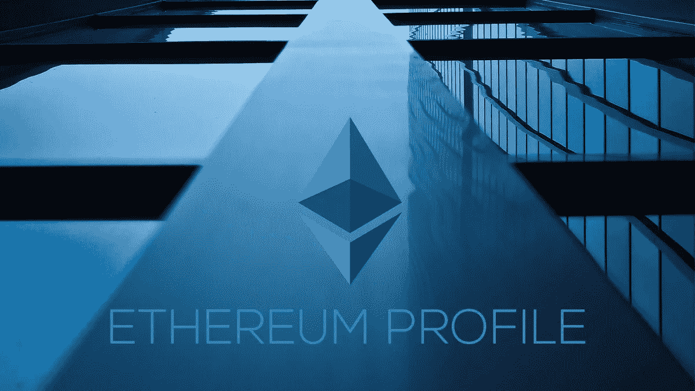
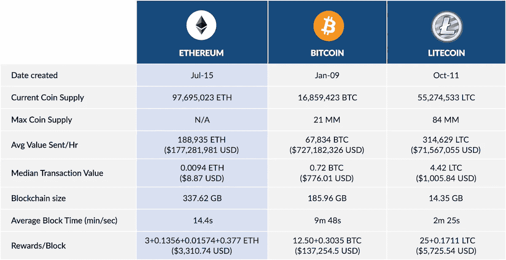
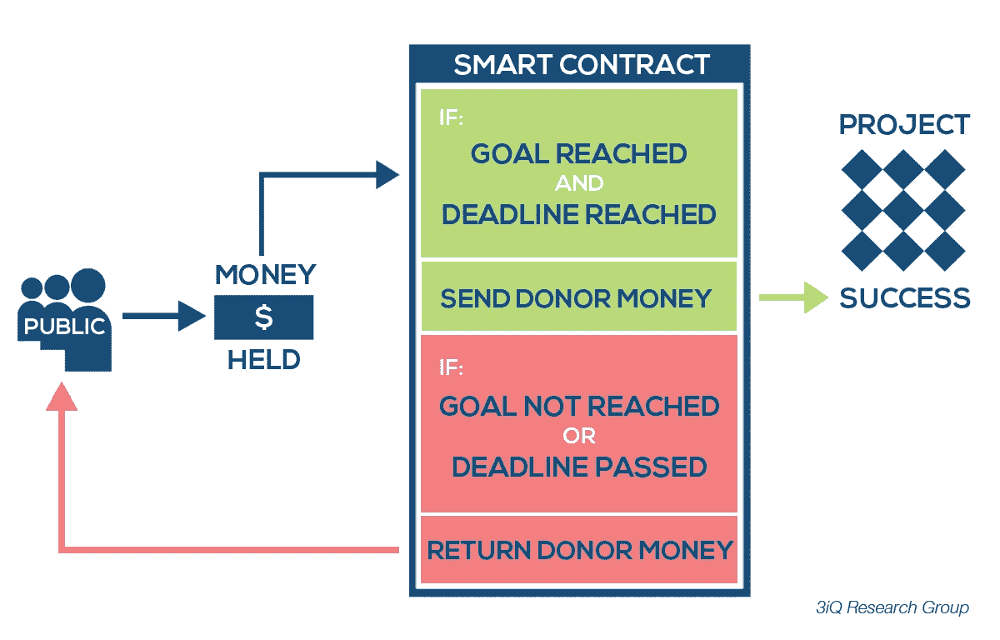

# 了解以太坊

> 原文：<https://medium.com/hackernoon/understanding-ethereum-980d17d1abe3>

以太坊已经确立了自己作为加密资产市场第二大玩家的地位，仅次于比特币。简而言之，以太坊意在成为一台“世界计算机”，提供用遍布全球的成千上万个节点(个人计算机)取代中央服务器的能力。

一个常见的误解是，以太坊和比特币是同一个意义上的货币。以太坊不是一种货币，它是一个基于区块链的开源平台，任何人都可以在这个平台上开发分散式应用程序(Dapps)。在以太坊平台中有一种叫做以太的本地货币，它被用来为构建在该平台上的应用程序提供燃料。

*Data as at February 18, 2018\. Retrieved from:* [*bitinfocharts.com*](https://bitinfocharts.com/)

# 起源

[区块链技术](https://3iq.ca/3iq-research-group/blockchain-basics-2/)最初由比特币推出，作为一种通过共享账本以防篡改的方式跟踪数字现金所有权的方式。许多人很快意识到[区块链](https://hackernoon.com/tagged/blockchain)技术不局限于点对点数字现金系统，它可以用来存储任何有价值的信息。这让区块链科技在数字货币之外有了更多的使用案例。人们开始开发各种各样的分散式应用程序，然而，这需要大量的资源以及高级编码和密码学方面的经验。

2013 年，Vitalik Buterin 提出以太坊是一个开源平台，将大大降低程序员开发自己的去中心化应用程序的门槛。该平台的开发于 2014 年夏天通过众筹获得资金，以太坊于 2015 年 7 月 30 日上线。

# 智能合同

类似于互联网协议 HTTP(超文本传输协议)如何促进计算机网络上的通信，比特币和以太坊被认为是协议层，因为它们促进了区块链上的行动。在协议层之上，第三方开发者可以在所谓的应用层上开发他们自己的程序。比特币和以太坊的一个主要区别是在应用层开发的容易程度。与在比特币平台上开发相比，以太坊的主要编程语言 Solidity 限制较少，尤其允许开发人员编写智能合约。智能合同是一种计算机代码，可以促进任何有价值信息(如金钱或财产所有权)的交换。智能合约之所以被称为“智能”，是因为当满足特定条件时，它们可以自我操作，这使得中间商被排除在交易之外。这些智能合约在区块链运行的事实很有吸引力，因为它们可以以透明和无冲突的方式运作，没有欺诈、审查或干涉的风险。

智能合约的一个真实例子是在众筹中。现任众筹平台如 Kickstarter、Indiegogo 等在众筹交易中充当中间人的角色。他们从公众支持者那里收集资金，如果在截止日期前达到了筹资目标，就把钱支付给项目。这些组织是有用的，但是他们收取很高的服务费，并且存在人为错误的内在风险。以太坊允许这些类型的平台被自主智能合约所取代。整个众筹交易可以写入智能合同，就像这里演示的那样。这使得中间商及其高额费用被剔除，同时也大大降低了出错的风险，因为智能合同可供公众审查。

# 醚

正如简介中所提到的，以太坊是平台，以太是为平台上的应用提供动力的燃料。虽然以太现在通常被用作对等交易中的数字货币，但它旨在成为一种数字商品。就像汽车需要汽油来驱动引擎一样，构建在以太坊平台上的应用需要以太来获得计算能力。以太坊矿工为这些 DApps 提供处理能力，作为回报，以太作为补偿。

# ico 和以太坊代币

建立在以太坊上的应用程序使用以太来运行，但是它们也能够使用以太坊令牌标准发布自己的加密令牌。发布自己的令牌的应用程序可能会要求用户在能够访问其应用程序或与其交互之前获取这些令牌。

初始硬币发行(ICOs)是一种通过发行代币进行众筹的形式，在 2017 年大受欢迎。这在很大程度上是由于以太坊令牌标准使得开发人员可以创建自己的令牌，而不必从头开始编写自己的区块链。此外，在以太坊平台上构建的开发者不需要获得他们自己的矿工，他们能够依赖已经在以太坊区块链上处理交易的数千个矿工。由于如此多的代币是使用以太坊代币标准构建的，以太坊区块链现在处理所有区块链平台上近一半的美元价值，远远超过比特币。

# **以太坊经典与道黑客**

DAO(去中心化自治组织)是一个建立在以太坊基础上的 DApp，支持基于大众的风险投资。这是当时以太坊上最受欢迎的项目，因为它建立在区块链以太坊上，所以代码是公开可见的。一名黑客(或多名)注意到 DAO 代码中的一个缺陷，并能够将 330 万以太路由到他们控制的一个帐户中。由于这大约是当时所有循环以太的 15%,以太坊团队决定进行一次硬分叉。他们实际上创造了一个新的官方区块链，一个从未发生过黑客攻击的地方。然而，最初的区块链，也就是发生黑客攻击的那个，仍然存在，许多人选择继续支持它。为了减少混淆，原来的区块链现在被称为以太坊经典，而新的和官方认可的区块链被简称为以太坊。

**参考文献:**
以太坊基金会。(2018).*以太坊*。检索自:[https://www.ethereum.org/](https://www.ethereum.org/)
以太坊基金会。(2018).*乙醚。*检索自:[https://www.ethereum.org/ether](https://www.ethereum.org/ether)
*下一代智能合同和分散应用平台*。2018 年 2 月 11 日检索自:[https://github.com/ethereum/wiki/wiki/White-Paper](https://github.com/ethereum/wiki/wiki/White-Paper)etherchain.org。以太坊合同。检索自:[https://www . ether chain . org/account/0x 304 a 554 a 310 c 7 e 546 dfe 434669 c 62820 b7d 83490](https://www.etherchain.org/account/0x304a554a310c7e546dfe434669c62820b7d83490)